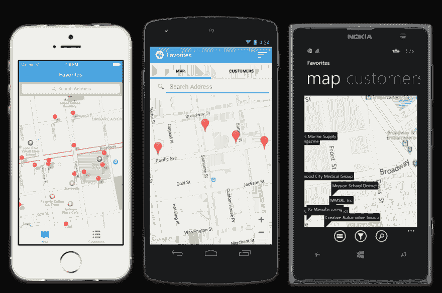
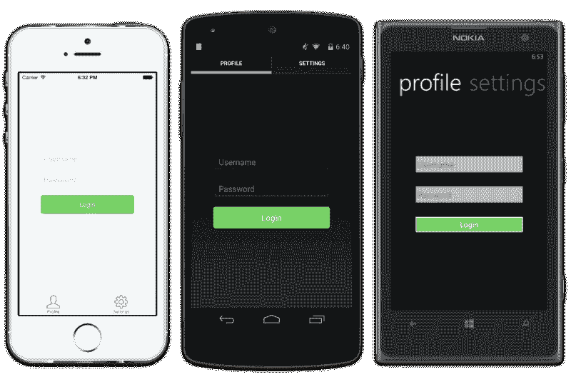

# Xamarin 3 对移动开发的未来意味着什么

> 原文：<https://dev.to/claudiosanchez/what-xamarin-3-means-to-the-future-of-mobile-development-13p9>

[T2】](https://res.cloudinary.com/practicaldev/image/fetch/s--xNdB69yr--/c_limit%2Cf_auto%2Cfl_progressive%2Cq_auto%2Cw_880/https://cdn-images-1.medium.com/max/920/0%2ArwWK2k2t0XuIcmHr.png)

就在几个小时前， [Xamarin](http://xamarin.com/) 发布了 [Xamarin 3。](http://blog.xamarin.com/announcing-xamarin-3/)通过这次发布，他们再次革新了我们编写跨平台移动应用的方式。公告首先强调了 iOS 的设计者，这很棒，但我想向前迈出一步，转而谈谈我认为的 Xamarin。表单将有助于您未来的移动开发工作。

### **一些背景**

在过去的几个月里[,我的公司](http://megsoftconsulting.com/)开发了一个内部的 MVVM 框架，提供诸如导航、绑定、松耦合消息传递、移动优化依赖注入、轻松显示数据的列表控件等服务。在我们的项目中使用，因为我们相信这些是真正的应用程序需要的东西，而当时可用的东西不符合我们的 MVVM 开发风格，所以我们推出了自己的产品。我们正在推出对 Windows Phone 的支持，当我们为所有 3 个平台创建应用程序时，我们对这个新创建的框架能够完成的事情感到非常兴奋。

### 未来会怎样

虽然你可能认为今天的公告会很烦人，或者对我们来说是苦乐参半，但事实恰恰相反。我们不再需要维护和发展我们的框架，相反，我们可以专注于应用我们在创建这个尚未命名的框架时学到的所有知识，并扩展(如果需要)Xamarin 刚刚推出的内容。

[T2】](https://res.cloudinary.com/practicaldev/image/fetch/s--OttDDLfU--/c_limit%2Cf_auto%2Cfl_progressive%2Cq_auto%2Cw_880/https://cdn-images-1.medium.com/max/800/0%2Ap8whiBUWd1uuTDYo.png)

所有 3 个平台上的用户界面示例。Xamarin 的直接优势之一。Forms 优于其他框架(包括我们自己的)的地方在于，这些服务不仅可以在两个平台(iOS 和 Android)上工作，还可以在三个移动平台(Windows Phone)上工作，并且它承诺能够实现典型的 100%代码共享。

“这不是什么新鲜事”——你可能会说；我不得不同意你的观点。MVVMCross(Xamarin 生态系统中最著名的 mvvm 框架)就是这样做的。但是 Xamarin。Forms 的无与伦比之处在于，它试图(在我看来是成功的)让 XAML 更接近所有移动平台([微软最近才开始做的事情](http://channel9.msdn.com/Events/Build/2014/3-591))。

对于经验丰富的 iOS 和 Android 开发者来说，XAML 本身听起来可能不是一个大胜利，但想想数百万已经熟悉微软技术和 WPF、Silverlight 和 WP8 用户界面创作的开发者。这些人已经熟悉了诸如基于页面的 ui、导航服务、双向绑定、数据模板等构造。

我邀请你不仅相信我，而且亲自去尝试一下。该框架已经可用[今天](http://xamarin.com/download)让我知道它有多棒！！

*原载于 2014 年 5 月 28 日 claudioasanchez.blogspot.com***。**