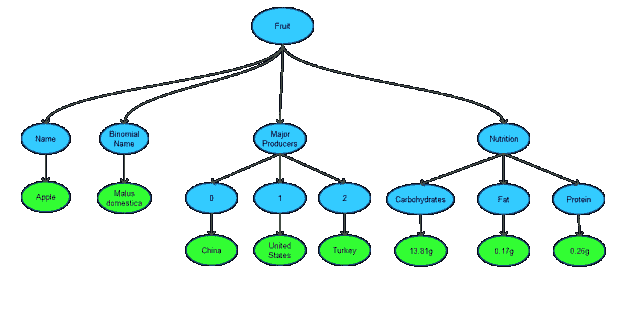

# 将嵌套 JSON 转换为 CSV

> 原文：<https://dev.to/vinay20045/converting-nested-json-to-csv>

第一次碰到 [JSON](http://json.org/) ，真的很开心。这是一个非常简单的纯文本对象表示。美妙之处在于没有新的或额外的规格；列表、对象、字符串、数字等现有概念。以自己干净的方式组合在一起。当我使用 API 时，我广泛使用 JSON。在我的剧本中，它仅次于单词/数字回复。

除了成为客户机和服务器调用之间的数据交换标准之外，JSON 还成为数据的中间表示和存储的流行工具。这在使用报告工具和框架时非常明显。为什么我说中间是因为，来源可能是一些 XML 或来自一些数据库的数据，而实际的消费格式可能是一些图表、图形或 CSV 数据。

JSON 允许通过嵌套对象和数组来表达层次化的、格式良好的和结构化的数据，嵌套层次最多可达多个。通常，在基于行/列的数据结构(如 CSV)中，这种表示不太容易或几乎不可能表达。然而，当您谈到报告和制作仪表板时，几乎总是需要将这种结构化数据转换为更扁平的键/值数据，以便进行解释和导出。这种解释允许数据分析师将数据导入到 excel 等工具中并使用它。

在这里，我将讨论如何将包含或不包含类似元素的多个嵌套 JSON 转换为 CSV 格式，以便与 excel 或 open office calc 等工具一起使用。脚本是用 Python2.7 写的。

让我们使用一个有效的多级 JSON 开始吧...

```
{
 "fruit":[
  {
   "name":"Apple",
   "binomial name":"Malus domestica",
   "major_producers":[
    "China", 
    "United States", 
    "Turkey"
   ],
   "nutrition":{
    "carbohydrates":"13.81g",
    "fat":"0.17g",
    "protein":"0.26g"
   }
  },
  {
   "name":"Orange",
   "binomial name":"Citrus x sinensis",
   "major_producers":[
    "Brazil", 
    "United States", 
    "India"
   ],
   "nutrition":{
    "carbohydrates":"11.75g",
    "fat":"0.12g",
    "protein":"0.94g"
   }
  },
  {
   "name":"Mango",
   "binomial name":"Mangifera indica",
   "major_producers":[
    “India", 
    "China", 
    "Thailand"
   ],
   "nutrition":{
    "carbohydrates":"15g",
    "fat":"0.38g",
    "protein":"0.82g"
   }
  }
 ]
} 
```

Enter fullscreen mode Exit fullscreen mode

这是 3 个水果对象的有效 JSON。每个 fruit 对象都嵌套了多个有效的数据结构。

每个对象都必须被单独解析并简化成一个更扁平的结构，然后再把它放回一起并写成 CSV 格式。这对于确定标题也是必不可少的。这样做的几个关键因素是...

**推导每个对象的键/值对**
我已经把这个结构想象成一棵树，然后键和值决定如下...
**值**:这是叶节点。
**Key** :这是所有父节点名称的串联，以“_”作为分隔符。对于数组，值的直接父代是索引。

以苹果对象为例，树可以被可视化为...
[T3】](https://res.cloudinary.com/practicaldev/image/fetch/s--n11AJakm--/c_limit%2Cf_auto%2Cfl_progressive%2Cq_auto%2Cw_880/https://askvinay.com/uploads/converting-json-to-csv-1.png)

因此，键/值对变成了...
水果 _ 名称- >苹果
水果 _ 主要生产国 _0 - >中国
等等。对所有水果对象都做同样的事情。这里忽略了数组索引。否则，它将是水果 _ 0 _ 名称- >苹果，而不是水果 _ 名称- >苹果

在这个练习之后，我们将会得到一组更简单的必需的键/值对，这些键/值对是从原始的 JSON 对象中派生出来的。必须对原始数据中的所有对象做同样的事情，以获得简化的数据。

**确定标题**
通过将所有对象的所有关键字相加并删除其中的重复项来确定标题。这将确保覆盖对象间的所有关键点。此外，标题是按字母顺序排序的，这样所有相似的关键字都紧挨着，这样就更容易阅读 CSV 文件。然而，这也意味着 JSON 的原始顺序没有得到维护。这是一个目前的限制，我正在努力解决这个问题，当我解决这个问题时会更新。

一个对象中存在的某些键/值对可能不存在于另一个对象中。在这种情况下，如果键不存在，该值将为空。

我也在编写多行的、漂亮的、不带“_”的标题。如果做到了，这可以使阅读和使用这个 CSV 更加容易。这也将允许使用 excel 的合并和居中功能，并允许更容易的过滤器/公式应用。

**编写 CSV**
最后，在如上所述将所有原始对象简化为平面对象后，每个对象作为一行被写入标题。csv。DictWriter 用于编写 CSV，这将确保按照标题和相同的顺序写入行。

所有代码都可以在 [Github](https://github.com/vinay20045/json-to-csv) 获得。我还没有设置一个在线演示，你可以上传一个 JSON 文件，并获得一个 CSV 下载。将在此上线后更新。

如果您有任何建议或遇到代码中的任何错误，请给我发邮件。

*这篇文章最初发表在我的[博客](https://askvinay.com/post/converting-nested-json-to-csv-8-december-2013.html)T3 上*