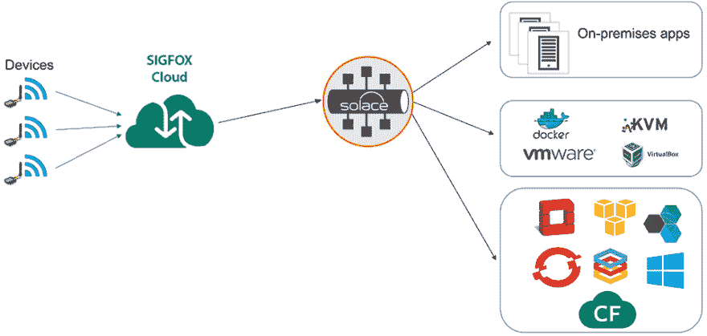
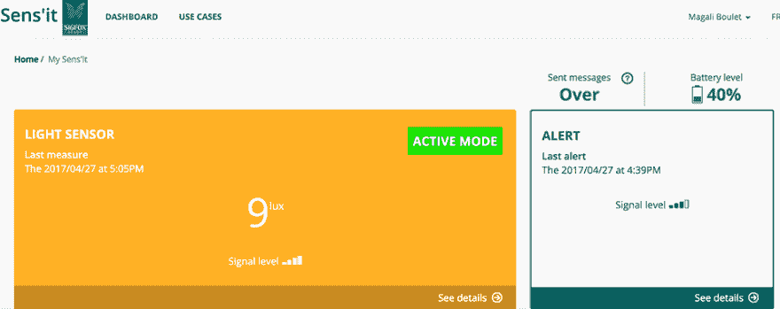
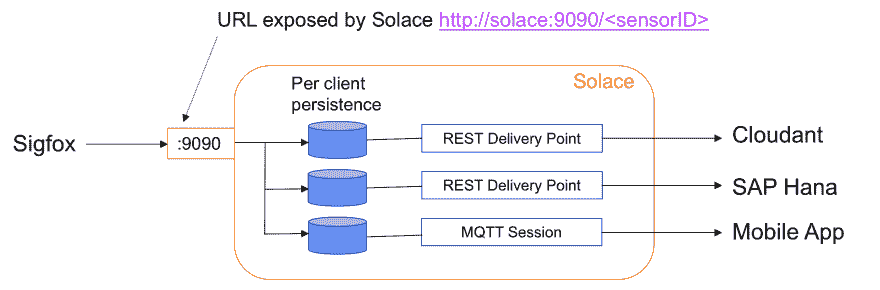
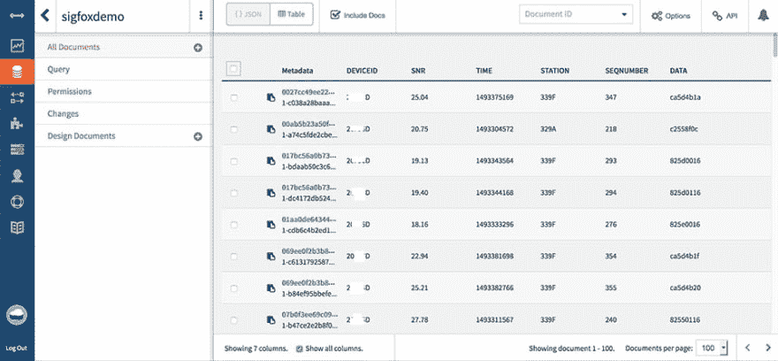
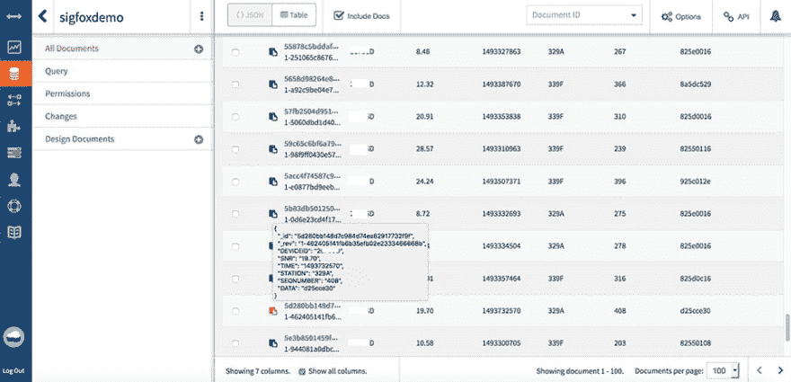
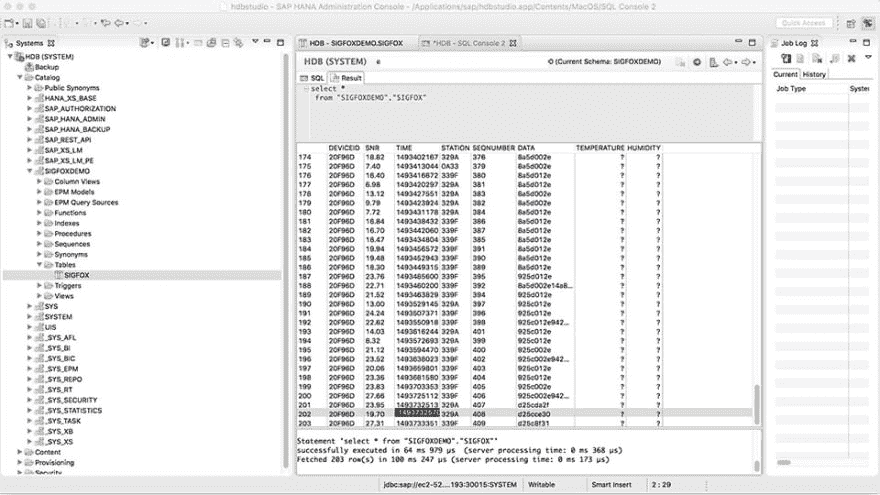
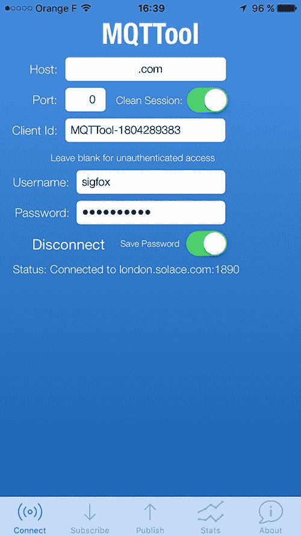
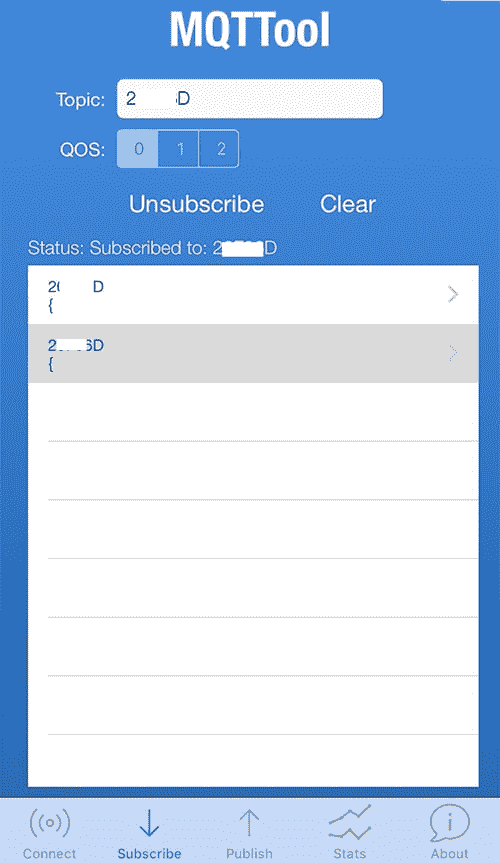
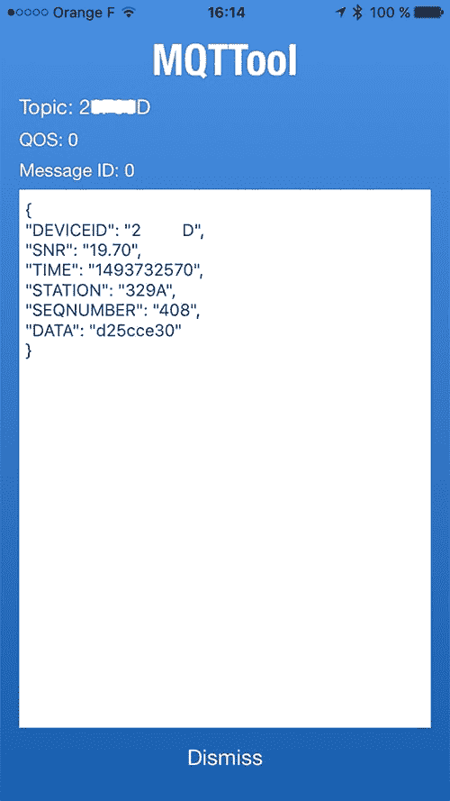

# 在 SigFox 网络上集成物联网设备和数据中心资源

> 原文：<https://dev.to/solacedevs/integrating-iot-devices-with-datacenter-resources-on-the-sigfox-network-499i>

[T2】](https://res.cloudinary.com/practicaldev/image/fetch/s--Q4ZvfL11--/c_limit%2Cf_auto%2Cfl_progressive%2Cq_auto%2Cw_880/https://solace.com/wp-content/uploads/2018/12/sigfox-blog-featured-image.jpg)

我们最近与一家名为 Sigfox 的法国公司进行了一些合作，该公司在实现物联网方面有一些雄心勃勃的目标。他们没有使用基于 IP 的通用蜂窝网络，后者需要大量的电力和硅来实现基本连接，而是开发了一种专门构建的网络，旨在满足数百万甚至数十亿低功耗物联网设备的需求。他们相信，他们可以降低电力需求，使许多设备可以在没有电池(例如太阳能电池)的情况下运行，只需要通过其他无线网络连接所需的一小部分通信芯片。令人兴奋的东西！

在 Solace，我们采取了类似的方法来应对数据移动的挑战，为正确的工作使用正确的工具。后台办公室中复杂的消息传递和流传输、针对高效云同步的广域网优化以及面向物联网设备的轻量级协议和 API。

正是这一共同愿景将我们两家公司带到了一起，并促使我努力构建一个概念验证应用程序，展示我们组合解决方案的能力。Sigfox 为传感器和设备带来了同类最佳的连接，Solace 提供了一种灵活的方式来将这些数据交付给企业应用程序。

[T2】](https://res.cloudinary.com/practicaldev/image/fetch/s--t8b4m0d3--/c_limit%2Cf_auto%2Cfl_progressive%2Cq_auto%2Cw_880/https://solace.com/wp-content/uploads/2017/05/sigfox-blog_1.png)

在 PoC 中，Sigfox 设备数据被分发到两个数据库(SAP Hana 和 Cloudant)，以及一个使用 MQTT 的移动应用程序。我已经在两个不同的公共云中部署了这两个数据库:AWS 中的 SAP Hana 和 Buemix 中的 Cloudant，如下所示:

[T2】](https://res.cloudinary.com/practicaldev/image/fetch/s--MFa9FpOp--/c_limit%2Cf_auto%2Cfl_progressive%2Cq_auto%2Cw_880/https://solace.com/wp-content/uploads/2017/05/sigfox-blog_2.png)

该 PoC 具有 Solace 开放数据移动和 SigFox 物联网网络功能:

*   将低功耗设备与企业应用连接起来
*   消息协议转换
*   动态消息和流路由
*   从许多设备扇入
*   扇出到许多企业应用程序
*   简单的配置
*   将消费者与生产者分离
*   可扩展的弹性架构
*   公共云的选择

我曾与 Sigfox 合作，将测试设备连接到部署在我们伦敦办公室的 Solace 设备上。设备发送的消息被发布到 SAP Hana 和 Cloudant 中订阅者的主题。

[T2】](https://res.cloudinary.com/practicaldev/image/fetch/s--Q4BN5r0F--/c_limit%2Cf_auto%2Cfl_progressive%2Cq_auto%2Cw_880/https://solace.com/wp-content/uploads/2017/05/sigfox-blog_3.jpg)

这里是传感器数据采集门户管理站点: [https://www.sensit.io](https://www.sensit.io)

[T2】](https://res.cloudinary.com/practicaldev/image/fetch/s--tntiW0Hn--/c_limit%2Cf_auto%2Cfl_progressive%2Cq_auto%2Cw_880/https://solace.com/wp-content/uploads/2017/05/sigfox-blog_4.png)

## **安慰配置**

Solace 中运行该演示的配置包括:

*   激活 REST 和 MQTT 服务端口
*   配置向 Hana 和 Cloudant 发送消息的 HTTP(S)目标。不需要编码。

注意:不需要为 MQTT 移动连接配置任何东西:默认情况下，Solace 收到的任何消息都可以用于任何支持的协议(如果安全机制允许的话)。因此，MQTT 客户机可以很容易地订阅 Sigfox 发布的消息。

已经决定在 URI 中包含传感器 ID:SIG fox 将传感器信息发送到类似于 [http://solace:port/](http://solace:port/) 的 URL

使用绑定到 *REST 消费者*和队列绑定的 *REST 交付点*对象来完成 HTTP 目标的配置，以通过 HTTP(或 HTTPS)发送 POST 消息:

*   REST 消费者对象定义了通过 HTTP(S)发送消息的目标
*   *队列绑定*用于吸引 REST 消费者发送的消息(基于主题名称空间)。

下面的模式总结了 Solace 配置:

[T2】](https://res.cloudinary.com/practicaldev/image/fetch/s--qj11UZYf--/c_limit%2Cf_auto%2Cfl_progressive%2Cq_auto%2Cw_880/https://solace.com/wp-content/uploads/2017/05/sigfox-blog_5-1.png)

Hana 也完成了同样的配置。

### **让我们看看运行演示时会发生什么。**

传感器被配置为每小时发送光信息。这可以配置一个或多或少的更新周期-每个滑动小时最多 8 条消息，这是 Sigfox network 的限制。此外，您可以通过按一个按钮来强制传感器发送信息，这对于演示来说很方便。

每次更新时，传感器数据由 Sigfox 发送到 Solace，然后分发到 Hana、Cloudant 和安装在我 iPhone 上的移动 MQTT 客户端。

在 Cloudant 中，有一个非常简单和直观的用户界面显示所有数据库文档:

*   DeviceID 显示传感器的标识符，其余各列代表 Sigfox 传感器发送的信息。
*   让我们来看看序号为#408: 的传感器信息
*   现在让我们开始使用 Studio for Hana 浏览 Hana，并搜索这个相同的序列号。以下屏幕截图上的选定行对应于相同的序列号#408，并包含相同的传感器信息。

最后，我们来看看 iPhone 的移动 MQTT 应用程序:

*   首先，您需要填写 Solace 代理的连接信息:
*   然后，使用 Subscribe 菜单，输入传感器 id: 
*   最后接收到序列号为#408 的消息:

## 结论

将 Solace 的开放数据移动功能与 Sigfox 针对传感器和设备的创新连接解决方案结合起来，具有很大的潜力。我期待看到我们的客户如何利用这一组合将物联网设备与企业应用和业务流程联系起来。

在 SigFox 网络上整合物联网设备和数据中心资源的帖子[首先出现在](https://solace.com/blog/integrating-iot-with-datacenter-sigfox-network/) [Solace](https://solace.com) 上。