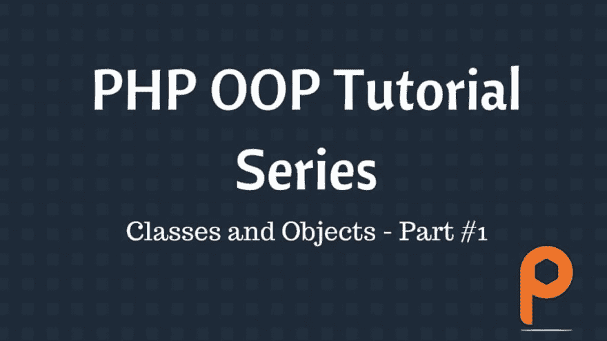
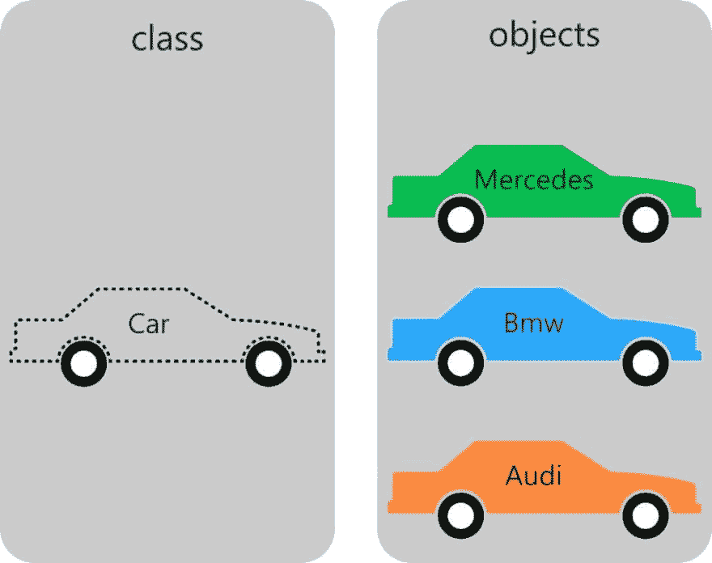

# 初级 PHP 面向对象编程系列

> 原文：<https://dev.to/parthp1808/object-oriented-programming-in-php-for-beginner-series-2m47>

面向对象编程是 php 语言中相对复杂的话题。因此，如果没有太多的编程经验，新手程序员很难理解 php oop。

面向对象编程是从 PHP 4 引入的，但它(php oops)在 PHP 5 版本中获得了发展势头。在第 5 个<sup>到第 1 个</sup>版本中，php 的对象模型被重写，允许更多的特性和更好的性能，并为 PHP 类引入了完整的对象模型。

[T2】](https://res.cloudinary.com/practicaldev/image/fetch/s--3GVo0YsF--/c_limit%2Cf_auto%2Cfl_progressive%2Cq_auto%2Cw_880/https://www.parthpatel.net/wp-content/uploads/2017/05/php-oop-tutorial-1024x576.jpg)

通过本系列教程，您将获得足够的 PHP OOPs 或 PHP 中面向对象编程的知识。

如果你想学习 php 框架，你可以查看我们的指南。

## 什么是面向对象编程？

面向对象编程是一种基于对象概念的编程风格。它通过防止*重新发明轮子*来帮助开发者，并使代码易于维护和扩展。

面向对象的编程初看起来令人困惑，但当你深入了解时，你会意识到它是为了简化编程。

## 为什么要使用面向对象编程？

与 PHP 中的过程化编程相比，使用 PHP OOP 有多种优势，比如:

*   **代码的可重用性和可回收性**:假设你想创建奔驰汽车对象，而你的朋友想创建奥迪汽车对象。你构建了你的对象，但是你发现这两个对象在奔驰和奥迪汽车之间有很多相似之处，比如轮胎的数量。事实是两者实际上都是汽车。因此，如果您有一个具有通用属性和方法的 car 类，而不是从头开始分别创建这两个对象，那么您可以通过重用和回收代码来节省大量重复工作。
*   模块化:如果你正在为不同的实体创建多个独立的类，你正在使它模块化，就好像你想修复某个东西，你只需要编辑那个特定的类，而不需要编辑其他的。这种模块化证明有助于故障排除。
*   可伸缩性:面向对象的程序比结构化程序更具可伸缩性。对象的接口提供了替换对象所需的所有信息，因此很容易替换旧代码或在将来添加新代码。
*   **维护**:程序需要定期改进，有很多变化。面向对象的程序比非面向对象的程序更容易修改和维护。

## 理解类和对象:

### PHP OOP 中的类和对象是什么？

在我们深入面向对象编程世界之前，让我们了解一下 php 类和对象，它们是 PHP OOP 范例的支柱。

类是程序员定义的数据类型，它包含不同类型的数据和不同的函数。

对象是一个类的实例。对象获得类中所有数据和函数的副本，因此它作为独立的实体。

让我们用一个例子来理解类和对象。

[T2】](https://res.cloudinary.com/practicaldev/image/fetch/s--wV14H4hY--/c_limit%2Cf_auto%2Cfl_progressive%2Cq_auto%2Cw_880/https://www.parthpatel.net/wp-content/uploads/2017/05/class-and-objects-php.jpg)

上图的左侧显示了汽车蓝图，右侧显示了使用该蓝图制造的汽车，如奔驰、宝马、奥迪等。

因此，在这里，Car 是一个 php 类，它的行为就像一个蓝图，它包含数据属性，如轮胎数量，汽车类型，汽车颜色等。

和奔驰，奥迪都是我们用“汽车”类创建的对象。

所有的对象都是从同一个类中创建的，因此它们具有相同的功能和属性，但是它们可能具有不同的属性值。例如，在上图中，所有汽车的颜色属性都有不同的值——奔驰是绿色的；宝马是蓝色的；奥迪是橙色的。

### 什么是方法和属性？

类中的属性是可以存储不同数据类型的数据的变量。方法是在类内部定义的函数。

从该类实例化的所有对象都获得了该属性变量的副本和所有成员函数(也称为方法)的副本。

### 如何创建类和对象？

在课堂上，我们将对处理特定主题的代码进行分组。因此，为了给类命名，我们应该使用单数名词，比如 Car，它将处理关于汽车的逻辑。

创建类的语法非常简单明了。你必须使用 ***class*** 关键字来声明一个类，后跟类名。

```
<?php

class Car
{
       // Class properties and methods
}

?> 
```

**备注:**

*   使用关键字**声明类*类*类**
*   使用单数名词，首字母大写
*   如果类名包含不止一个单词，那么使用**大写字母**命名约定来大写每个单词。例如: ***日本车，美国车***
*   类的实例是从现有类创建的对象。
*   **new** 关键字用于从类中创建一个对象。

现在，你可以使用 ***新的*** 关键字非常容易地从类中创建一个对象。

**$宝马=新车；**

因此把所有这些放在一起:

```
<?php

class Car
{
               // Class properties and methods
}

$bmw = new Car;

?> 
```

### 如何在类中定义属性？

为了向类中添加和存储数据，需要使用属性或成员变量。属性可以存储数据类型的值——字符串、整数和小数、布尔值等。这些变量与常规变量完全一样，但它们被绑定到实例化的对象，因此您只能使用对象来访问变量。

让我们给汽车类添加一些属性。

```
<?php

class Car
{
               public $color = ‘red’;
               public $numberOfTires = 4;
}

$bmw = new Car;

?> 
```

**注意事项**:

*   我们在类属性前使用 ***public*** 关键字来确定属性的可见性，我们将在后面讨论。
*   类属性可以有默认值。您也可以跳过默认值。

在这里你可以看到我们添加了一些对每个汽车对象都是必要的属性。显然，汽车类需要更多的属性，但是对于教程来说，这已经足够了。

现在要读取任何属性，请使用 object 访问该属性。例如:

```
echo $bmw->color; 
```

箭头(->)是一个 OOP 结构，用于访问给定对象的属性和方法。

### 如何在类中定义方法？

在一个类中定义的 PHP 函数被称为方法。PHP OOP 中的方法与普通的 PHP 函数完全相似。

让我们为我们的 **Car** 类创建一些方法。

```
<?php

class Car
{
              public $color = ‘red’;
              public $numberOfTires = 4;

              public function setColor($val)
              {
                              $this->color = $val;
              }

              public function getColor()
              {
                              return $this->color;
              }
}

$bmw = new Car;

?> 
```

这里我们创建了两个方法 1)set Color——它将给定的参数赋给对象的 color 属性，2)getColor——它将返回对象的 color 属性的值。

**注意:**$这个用来引用当前对象。您可以使用$this 关键字从类内部访问类属性和方法。

现在，要使用这些方法，使用箭头“->”调用这些方法。您需要引用相应的对象，因为每个实例化的对象都有这些属性和方法的副本。

让我们使用这些新创建的方法。

```
<?php

class Car
{
    public $color = ‘red’;
        public $numberOfTires = 4;

        public function setColor($val)
    {
        $this->color = $val;
    }

    public function getColor()
    {
        return $this->color;
    }
}

$bmw = new Car;
$bmw->setColor(“black”);
echo $bmw->getColor();

?> 
```

**备注:**

*   该方法的代码用一对花括号括起来。
*   你需要使用关键字 **public、protected** 或 **private** 中的一个来创建一个类方法或属性。这些是可见性关键字。稍后你会读到更多相关内容。
*   如果你没有使用过其中一个关键字——public、protected 或 private，那么默认为 **public** 。
*   还可以使用$this 关键字- $this->color 来访问当前实例或对象的属性和方法。

## 构造函数和析构函数

在 php 中，有一些方法被称为魔术方法。其中，两个最重要的魔法方法是 __construct 和 __destruct。这两个是为类创建构造函数和析构函数的方法。记住，神奇的方法总是以两个下划线开始。

**什么是构造函数和析构函数？**

__construct 方法是在创建对象时由类调用的方法。它用于准备要使用的新对象。构造函数可用于将参数值赋给对象属性。

__destruct 方法是一个在对象被销毁时由类调用的函数。它通常用于在对象被销毁时清理内存。

我们将创建一个构造函数来设置颜色属性的值。

```
<?php

class Car
{   
    public $color = ‘red’;    
    public $numberOfTires = 4;

    public function __construct($color)
    {        
        $this->color = $color;        
    }

    public function setColor($val)
    {       
        $this->color = $val;   
    }

    public function getColor()
    {        
        return $this->color;    
    }  
}

$bmw = new Car(“white”);

echo $bmw->getColor(); //this will print “white” because our constructor assigned value “white” to color property

$bmw->setColor(“black”); // this will overwrite color property to black

echo $bmw->getColor();

?> 
```

在上面的例子中，我们创建了一个构造函数，它接受一个颜色参数并将其设置为颜色属性。我们还更改了对象创建代码，并传递了一个设置为 color property 的值。

记住，当我们创建一个构造函数来覆盖默认的 php 构造函数时，我们需要向构造函数传递一个参数。

如果你尝试- **$bmw =新车()；它会给出错误，因为我们的构造函数需要一个参数。**

现在我们将创建一个析构函数，它将在对象被销毁时打印消息

```
<?php
class Car
{
    public $color = ‘red’;
    public $numberOfTires = 4;
    public function __construct($color)
    {
        $this->color = $color;
    }
    Public function __destruct()
    {
        echo "Object is being destroyed";
    }
    public function setColor($val)
    {
        $this->color = $val;
    }
    public function getColor()
    {
        return $this->color;
    }
}
$bmw = new Car(“white”);
echo $bmw->getColor(); //this will print “white” because our constructor assigned value “white” to color property
$bmw->setColor(“black”); // this will overwrite color property to black
echo $bmw->getColor();
?> 
```

**备注:**

*   构造函数方法是 PHP 5 中引入的一种特殊的神奇方法，它允许在对象实例化时初始化对象属性或执行一些操作。
*   析构函数方法是一种特殊的魔法方法，它允许在对象被销毁时执行一些操作。
*   当一个对象被实例化或创建时，具有构造函数方法的类会自动执行该方法。
*   有析构函数方法的类，当一个对象被销毁时会自动执行这个方法。
*   构造函数和析构函数不是必需的。每个 php 类都有一个默认的构造函数和析构函数。如果你创建一个构造函数或者析构函数，默认的会被自动忽略。
*   PHP 只执行一个构造函数和一个析构函数。
*   “__construct”和“__destruct”方法以两个下划线开头。

## 在 PHP 中分配可见性

之前我们讨论过在定义属性或方法时使用其中一个关键字——public、private 和 protected。公共、受保护和私有是 PHP 中控制属性、变量或方法访问的三种可见性。

*   **Public:** 公共方法或变量随处可访问。
*   如果属性变量或方法是私有的，那么它只能从类内部访问。例如:如果类 Car 的颜色属性是 private，那么您就不能在类之外访问它，比如-***echo $ BMW->color；*** 但是像 ***getColor*** 这样的方法可以访问它，因为它在类内部。
*   **Protected:** 如果属性变量或方法是受保护的，那么它可以从类内部或者从从这个类继承的任何类内部访问。

为什么我们不应该一直使用公共可见性？

因为把一切都公开一点也不安全。为了保证安全性，PHP OOP 引入了这些不同的可见性。

让我们讨论一个例子，展示 PHP OOP 中私有或受保护可见性的重要性:

对我们的汽车分类代码进行如下所示的更改:

```
<?php
class Car
{
    private $color = ‘red’;
    private $numberOfTires = 4;
    public function __construct($color)
    {
        $this->color = $color;
    }
    public function __destruct()
    {
        echo "Object is being destroyed";
    }
    public function setColor($val)
    {
        $this->color = $val;
    }
    public function getColor()
    {
        return $this->color;
    }
}
$bmw = new Car(“white”);
echo $bmw->color; //this will give error because color property is private
echo $bmw->getColor(); //this will print “white” because our constructor assigned value “white” to color property
$bmw->setColor(“black”); // this will overwrite color property to black
echo $bmw->getColor();
?> 
```

如上面的代码所示，我们将属性设为私有，使它们对外界不可见。所以，如果有人试图使用 ***$bmw- > color*** 访问 color 属性，就会给出错误。

这就是为什么我们创建了两个方法 **getColor** 和 **setColor** ，它们也被称为 getter 和 setter 方法，因为它们充当外部世界和私有变量之间的中介。

所以如果你想得到颜色的值，使用***$ BMW->getColor()***如果你想设置颜色的值，使用***$ BMW->set color(" white ")***。这就是所谓的封装。

## 静态方法和属性

不需要实例化对象就可以访问静态方法或属性。只需使用类名、范围解析操作符和属性或方法名。

我们已经学习了三个修饰符——私有、受保护和公共。Static 是 PHP OOP 中的第四个访问修饰符，它允许访问属性和方法，而不需要从类中创建对象。

### 如何创建静态方法和属性

要将方法和属性定义为静态的，需要使用保留的 **static** 关键字。

让我们来看看我们的例子:

```
<?php
Class Car
{
    private $color = ‘red’;
    private $numberOfTires = 4;
    public static $country = “Canada”;
    public function __construct($color)
    {
        $this->color = $color;
    }
    Public function __destruct()
    {
        echo "Object is being destroyed";
    }
    public function setColor($val)
    {
        $this->color = $val;
    }
    Public function getColor()
    {
        return $this->color;
    }
}
$bmw = new Car(“white”);
echo $bmw->color; //this will give error because color property is private
echo $bmw->getColor(); //this will print “white” because our constructor assigned value “white” to color property
$bmw->setColor(“black”); // this will overwrite color property to black
echo $bmw->getColor();
echo Car::$country;
?> 
```

这里我定义了一个常量名 country，值为 Canada。现在我不需要一个对象来访问这个常量。

**注:**

*   要在类内使用静态方法和属性，使用 **self**

## 结论

与过程化编程相比，PHP OOP 带来了很多优势，它提供了更简单的方法来构建复杂的 web 应用程序，并且具有更容易的可伸缩性。

现在，你应该熟悉面向对象的编程风格，并且应该对 PHP OOP 的基本概念有很好的理解，即面向对象编程。

在接下来的部分中，我们将学习 PHP OOP 的高级概念，这有助于创建高度模块化和复杂的应用程序。

希望你喜欢这篇关于 PHP 中 OOP 的教程。你有任何问题或困惑吗？下面评论。

帖子[初级 PHP 面向对象编程系列](https://www.parthpatel.net/php-oop-classes-objects/)最早出现在[网站开发者 Parth Patel](https://www.parthpatel.net)上。