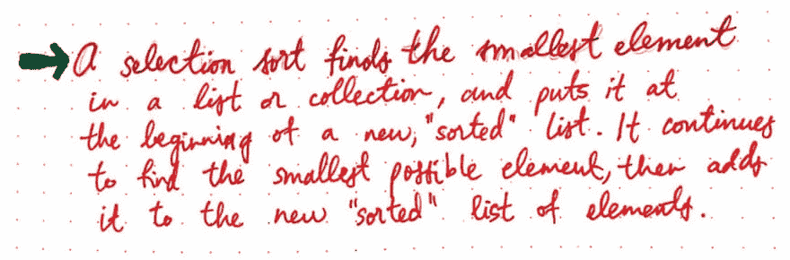
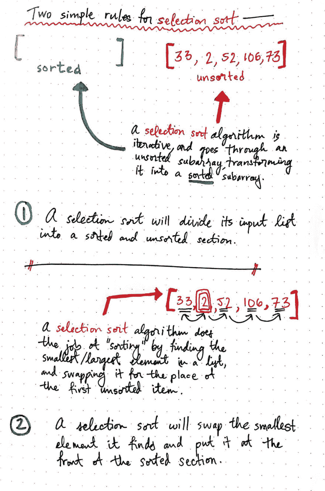
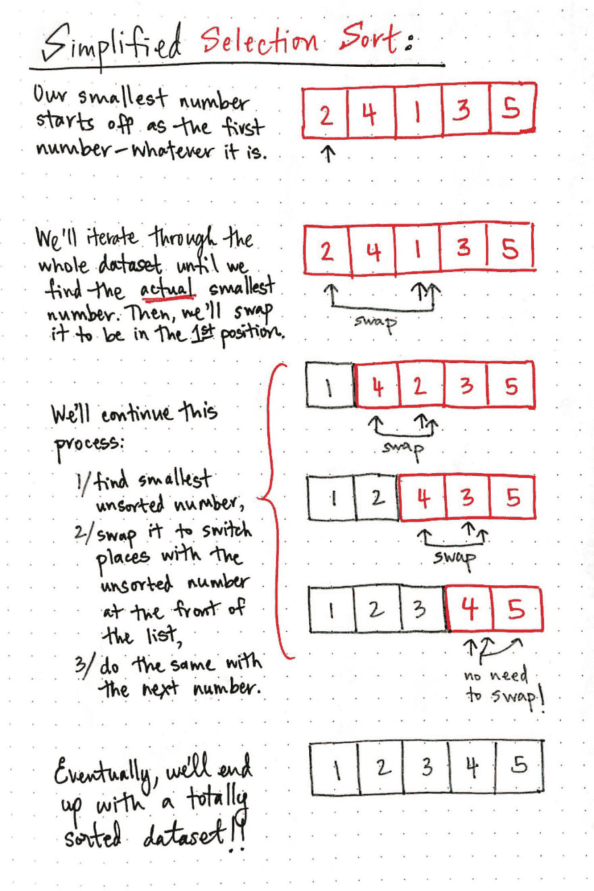
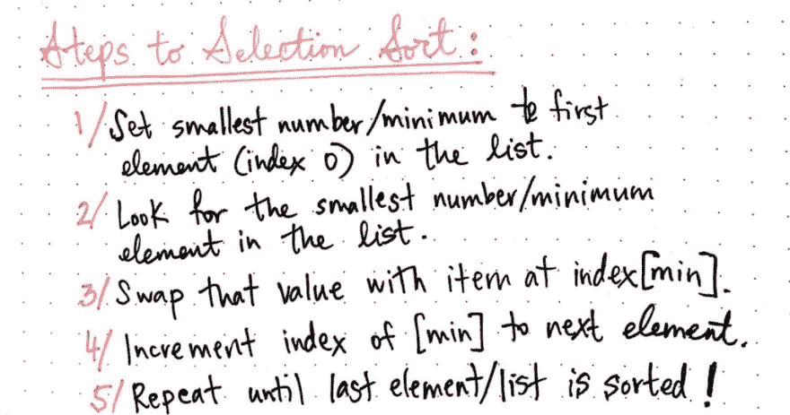
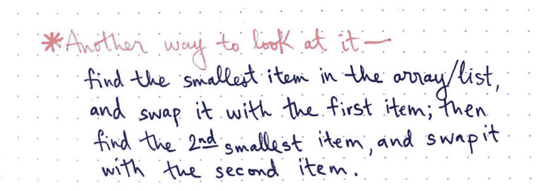
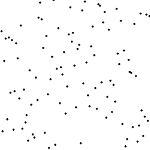
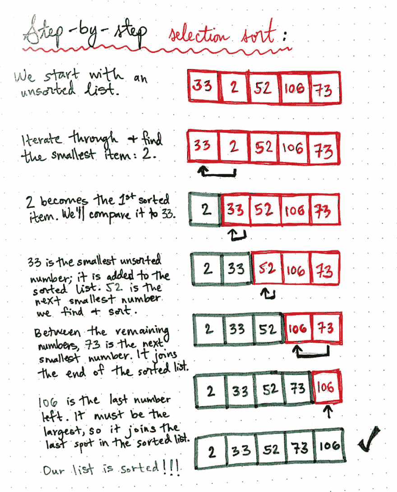
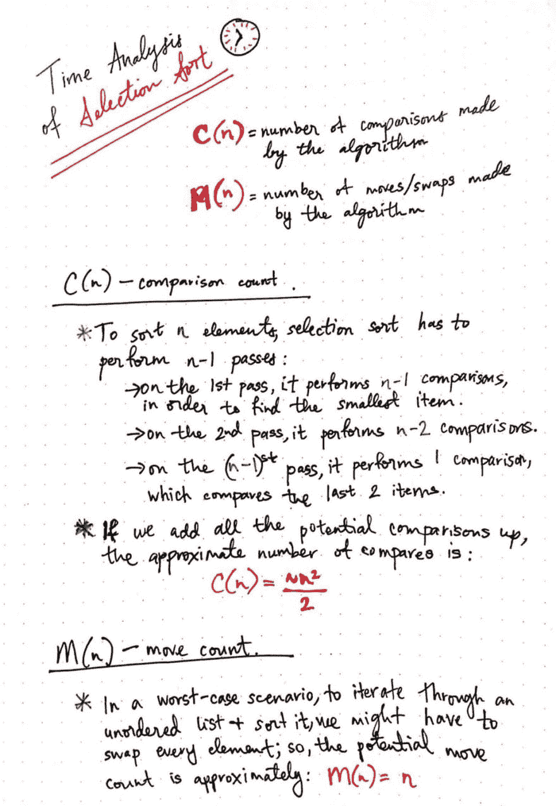
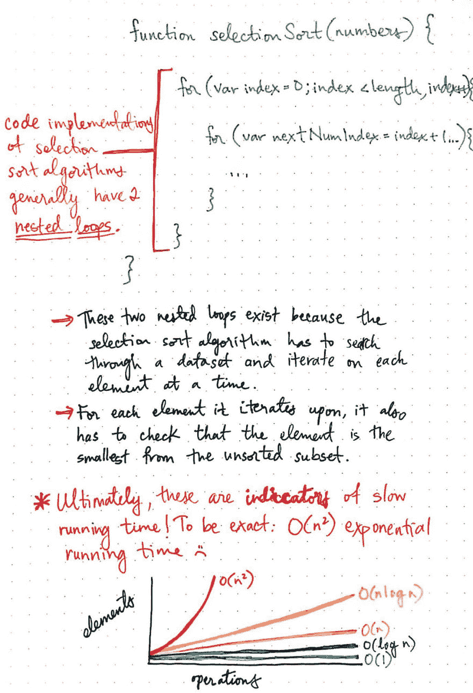
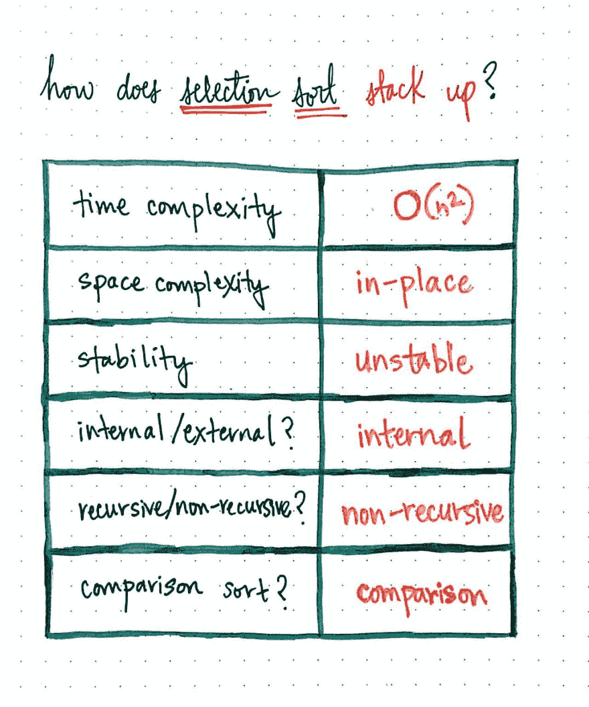

# 指数简单选择排序

> 原文:[https://dev . to/vaidehijoshi/指数级轻松选择排序](https://dev.to/vaidehijoshi/exponentially-easy-selection-sort)

还记得上周我们第一次开始探索排序算法的时候吗，以及我们是如何了解一个算法如何工作的多种分解和分类方法的？嗯，我们从简单开始真的是一件好事，因为我们上周在高层次上讨论的那些特征今天又回来了。他们为什么又回来了？因为今天，我们将深入我们的第一个算法——这次是真正的*！*

当我在阅读最常见的选择算法时，我有点难以决定如何将它们分成更小的部分，以及如何将它们分组为概念。事实证明，有时开始的最佳方式是你结束时的第一个话题；换句话说，第一个对你真正有意义的话题。我们今天看到的算法——专门探索排序算法的系列文章中的第一个算法——有时被称为“初级”或“简单”。让我告诉你，在这个“简单”的算法背后，真的很容易迷失在所有的研究和写作中，这将使它看起来…嗯，一点也不容易！

但是，我们会一起熬过来的。你知道他们怎么说:*第一个算法最难*。好吧，好吧——也许他们不会这么说，但他们应该这么说！你会问，这个神秘的算法到底是什么？为什么，是一种叫做 ***选择排序*** 的排序算法！

### 做出我们最初的选择

上周，[我们了解到](https://medium.com/basecs/sorting-out-the-basics-behind-sorting-algorithms-b0a032873add)一个 ***算法*** ，其核心无非是一组指令，告诉你采取什么行动，或者*如何*做某事。算法不只是为计算机或程序而存在——人类也可以使用它们。事实上，当您在生活中必须对一堆未排序的项目进行排序时，您很有可能使用了选择排序的变体。

那么什么是选择排序呢？我们知道这是一种算法。但是它与其他算法的区别在于它的“指令集”；换句话说，这是算法如何指导你进行排序，使它不同于其他排序算法。

一个 ***选择排序*** 算法通过遍历一个元素列表，找到最小的一个，并把它放到一个排序列表中，从而对一个项目列表进行排序。它继续通过查找最小的未排序元素进行排序，并将其添加到排序列表中。

<figure>[](https://res.cloudinary.com/practicaldev/image/fetch/s--xJsxx2Os--/c_limit%2Cf_auto%2Cfl_progressive%2Cq_auto%2Cw_880/https://cdn-images-1.medium.com/max/1024/1%2AO6OmnV8MZ7Pdyvt1-xBTxw.jpeg) 

<figcaption>选择排序:一个定义</figcaption>

</figure>

等等——当我们说算法创建了一个“新的排序列表”时，我们指的是什么？想象一下，整理一堆有编号的文件，或者按字母顺序排列书架上的一些书。我们希望有一条清晰的分界线，区分哪些书或论文被分类，哪些没有。我们可能会在房间的一边把分类好的书放在一个盒子里或堆在一起，而在另一边把未分类的书堆在一起。

这个比喻也类似于选择排序算法的内部工作方式。它会跟踪哪些内容已排序，哪些内容未排序，并且会继续排序，直到未排序的“列表”完全为空。

<figure>[](https://res.cloudinary.com/practicaldev/image/fetch/s--LsB6r2Lv--/c_limit%2Cf_auto%2Cfl_progressive%2Cq_auto%2Cw_880/https://cdn-images-1.medium.com/max/1024/1%2APCWPy55bEEZon1uNXunELw.jpeg) 

<figcaption>两个简单的选择排序规则</figcaption>

</figure>

在所示的示例中，我们有一个包含五个未排序数字的列表。当选择排序算法得到这个未排序的数组时，它将创建一个排序的数组，该数组最初将为空。这是选择排序的第一条重要规则:

> 选择排序算法会将其输入列表分为排序部分和未排序部分。

接下来，它将通过遍历所有的元素，找到列表中最小或最大(取决于我们是按升序还是降序排序)的元素，并将其交换为第一个元素，来实际完成“排序”工作。每当该算法将它找到的最小项目替换为列表前面的任何元素时，它就向列表的排序部分添加一个元素。这突出了选择排序的第二条规则:

> 选择排序算法将交换它在每次迭代中找到的最小元素，并将其添加到元素的排序部分。

如果这会儿你觉得有点困惑，不要担心。事实上，我认为选择排序的定义和规则本身并没有太大的意义。只有当我们有一个例子来补充时，它们才真正变得清晰。

我们将用一个超级简单的例子来开始。在下图中，我们有一组五个数字:2、4、1、3 和 5。我们想把它们按升序排列，从最小的数字开始。让我们看看如何使用选择排序来实现这一点:

<figure>[](https://res.cloudinary.com/practicaldev/image/fetch/s--nidmDQcm--/c_limit%2Cf_auto%2Cfl_progressive%2Cq_auto%2Cw_880/https://cdn-images-1.medium.com/max/1024/1%2AMJ1hJLG58QS8REhXkuo_Hg.jpeg) 

<figcaption>一个简化的选择排序，in-action！</figcaption>

</figure>

好的，酷——我们最终得到了一个排序的数据集！但是刚刚发生了什么？嗯，我们做了几件事！我们知道必须选择最小的数字。问题是，首先，我们不知道列表中最小的数字是多少。

> 然而，请记住，尽管我们作为人类可以看到这个列表并立即知道 1 是最小的数字:计算机做不到这一点！他们必须在整个数据集中迭代，以找出哪个数字是最小的或最大的。

所以，我们的伪代码算法从假设第一项是列表中最小的数字，或者数字 2 开始。然后，我们进行迭代，找到了*实际的*最小的数字，不是 2 而是数字 1。因为我们知道 1 是最小的，所以我们也可以确定它会在排序列表的前面。所以，我们交换了 1 和 2。当我们交换这两个数字时，我们有效地创建了两个桶:排序的数字和未排序的数字。

然后，我们只需要搜索和排序四个元素。接下来，我们查看下一个连续的未排序元素——这次是数字 2。我们将数字 2 与未排序列表前面的数字交换，这意味着我们的排序列表看起来像这样:[1，2]，而我们的未排序列表看起来像这样:[4，3，5]。

我们继续这样做，直到最后一个数字，瞧，我们有了一个排序列表！

虽然这是一个很好的开始，但它还不是一个真正的算法。为了把这个例子变成一个算法，我们需要把它抽象成我们可以为*任何*大小的数据集复制的步骤。

<figure>[](https://res.cloudinary.com/practicaldev/image/fetch/s--O_ad5B4W--/c_limit%2Cf_auto%2Cfl_progressive%2Cq_auto%2Cw_880/https://cdn-images-1.medium.com/max/1024/1%2A83UCEHjzNkvAtcRnydls-A.jpeg) 

<figcaption>选择排序步骤</figcaption>

</figure>

这是我们刚刚做的算法版本，假设升序排序:

1.  将最小的数字设置为列表中的第一个元素。
2.  浏览整个列表，找到实际最小的数字。
3.  将该值与最小数字索引处的项目交换。
4.  继续查看列表中的下一个未排序项目，重复步骤 2 + 3。
5.  继续这样做，直到我们到达列表中的最后一个元素。

这个算法最令人困惑的地方似乎是“交换”这一步。不同的课程、书籍和资源以不同的方式描述了这一步。

<figure>[](https://res.cloudinary.com/practicaldev/image/fetch/s--7zM79OTB--/c_limit%2Cf_auto%2Cfl_progressive%2Cq_auto%2Cw_880/https://cdn-images-1.medium.com/max/1024/1%2Aqjtwp7rpsUZBPVAIsrVMVw.jpeg) 

<figcaption>另一种理解选择排序</figcaption>

</figure>

观察交换时实际发生了什么的另一种方式是这样的:我们在数组/列表/数据集/集合中找到最小的项，然后与列表中的第一个无序项交换。然后，我们找到第二小的项目，并与列表中第二个未排序的项目交换。然后，找到第三小的项目，并与第三个未订购的项目交换。这个过程一直持续到我们看到的最后一项是列表中的最后一项，并且没有排序可做！

<figure>[](https://res.cloudinary.com/practicaldev/image/fetch/s--z3VcddWX--/c_limit%2Cf_auto%2Cfl_progressive%2Cq_66%2Cw_880/https://cdn-images-1.medium.com/max/250/1%2ASV4ejb55ZqkEmFxBhqKV3g.gif) 

<figcaption>选择排序可视化，[维基共享](https://upload.wikimedia.org/wikipedia/commons/thumb/b/b0/Selection_sort_animation.gif/250px-Selection_sort_animation.gif)</figcaption>

</figure>

这也是选择排序的名字来源:我们一次根据大小选择一个项目，并将其移动到正确的“排序”位置。左侧的动画更好地展示了大型数据集的实际情况。

很漂亮，对吧？

### 选择步骤进行选择排序

在伪代码中看到算法是令人敬畏的，但是在代码中看到它们的实现是非常强大的(更不用说实用性了)。这正是我们马上要做的！

首先，让我们来看一个示例数据集，包含五个未排序的数字:33、2、52、106 和 73。我们将在编码算法中使用完全相同的一组数字。但是，在写入代码之前，我们应该确保理解选择排序算法如何处理这种排序。

<figure>[](https://res.cloudinary.com/practicaldev/image/fetch/s--SW4YBCtn--/c_limit%2Cf_auto%2Cfl_progressive%2Cq_auto%2Cw_880/https://cdn-images-1.medium.com/max/1024/1%2AS-wdMkkaX3Gr4bQrbqu_1Q.jpeg) 

<figcaption>分步选择排序</figcaption>

</figure>

在这里显示的例子中，我们从一个无序列表开始，并将数字 33 设置为我们的“最小”数。我们将遍历列表，找到*实际的*最小的数字，也就是 2。

接下来，我们将把 2 换成 33，并把它放在列表的前面，使它成为第一个排序的条目。

我们将对数字 33 再次这样做，它已经在正确的位置，因为它是未排序部分中最小的数字。所以，我们不需要用它来交换任何东西，我们只需要把它添加到无序列表中。你会注意到数字 52 又发生了这种情况，它也在正确的位置。

最后一次交换发生在 73 是最小的未排序数的时候；它在未排序列表的末尾，我们需要将它移到前面。所以，我们把它换成 106。一旦我们在未排序的列表中只剩下最后一个数字 106，我们就可以假设(并确定)106 一定是数据集中最大的数字，我们可以将它添加到“已排序”部分。

咻。太多了。但这是值得的，因为我们一直在等待的时刻终于到来了:是时候将这一步一步的算法转化为实际的代码实现了！我将用 JavaScript 实现选择排序，基于 Rosetta Stone 的 [JS 实现](https://rosettacode.org/wiki/Sorting_algorithms/Selection_sort#JavaScript)；但是，如果方便的话，您可以在他们的网站上查看更多不同语言的实现。

下面是我们的 selectionSort 算法在 JavaScript 中的样子:

```
function selectionSort(numbers) {
  var length = numbers.length;

  // Traverse through all the elements in the number array.
  for(var index = 0; index < length; index++) {

// Set the current item to be the smallest/minimum.
  var smallestNumIndex = index;

// Find the minimum element in remaining unsorted array.
  for(var nextNumIndex = index + 1; nextNumIndex < length; nextNumIndex++) {

console.log('comparing ' + numbers[smallestNumIndex] + ' and ' + numbers[nextNumIndex])

// If the next number is smaller than the current number, reassign our reference to the the index of the smallest number
    if(numbers[nextNumIndex] < numbers[smallestNumIndex]) {
      smallestNumIndex = nextNumIndex;
    } 
  }

    if(smallestNumIndex != index) {
      var currentNumber = numbers[index];

// If the number we're looking at is the smallest in size, swap it with the first element.

console.log('swapping the number ' + numbers[smallestNumIndex] + ' for the number ' + numbers[index]);

      numbers[index] = numbers[smallestNumIndex];
      numbers[smallestNumIndex] = currentNumber;
    }

console.log('numbers currently looks like: ' + numbers);
  }

return numbers;
} 
```

你会注意到我在那里添加了一些 console.log 我保证，它们很快就会派上用场。

即使这段代码的所有步骤都不完全有意义，希望有一些步骤你能认出来。我们仍然在做我们一直在做的事情:

1.  我们遍历数字数组中的所有元素。
2.  我们将当前项目设置为最小/最小值。
3.  如果下一个数字小于当前数字，我们将引用重新分配给最小数字的索引。
4.  如果我们看到的数字是最小的，我们就把它和第一个元素交换。

那么，它真的有用吗？好吧，只有一个办法可以知道！我们将使用我们在视觉示例中使用的完全相同的数字来尝试:

```
selectionSort([33,2,52,106,73]); 
```

感谢所有这些 console.log，当我们运行 selectionSort 算法时，我们可以确切地看到发生了什么:

```
> comparing 33 and 2
> comparing 2 and 52
> comparing 2 and 106
> comparing 2 and 73
> swapping the number 2 for the number 33
> numbers currently looks like: 2,33,52,106,73
> comparing 33 and 52
> comparing 33 and 106
> comparing 33 and 73
> numbers currently looks like: 2,33,52,106,73
> comparing 52 and 106
> comparing 52 and 73
> numbers currently looks like: 2,33,52,106,73
> comparing 106 and 73
> swapping the number 73 for the number 106
> numbers currently looks like: 2,33,52,73,106

>> (5) [2, 33, 52, 73, 106] 
```

有意思！我们可以看到算法是如何交换它找到的最小数字，并对无序数据进行排序的，一次一个循环，就像我们手工绘制一样。太棒了。

然而，让我印象深刻的是这个算法进行了大量的比较。好吧，现在它看起来不像一吨，但我有一种感觉，这将变得非常混乱，非常快。有五个数字；在第一遍中，我们进行 4 次比较。在第二遍中，我们进行 3 次比较。换句话说，我们可以抽象出来说，我们进行(n-1)次比较，每次我们迭代通过未排序的数据。

假设我们传入了[33，2，52，106，73，300，19，12，1，60]十个数字，而不是五个。第一遍我们就做了 9 次比较！然后我们在第二次通过时得到 8 分，第三次通过时得到 7 分。似乎很糟糕。或者至少，它看起来效率很低，对吗？

这给我们带来了选择排序最重要的特征:它的时间复杂性。

### 对我们的时代有选择性

选择排序的时间复杂性有两个重要方面:算法将进行多少次比较，以及在排序过程中它必须移动或交换元素多少次。我们经常把这两个因素分别称为***【C(n)***和 ***M(n)*** 。

<figure>[](https://res.cloudinary.com/practicaldev/image/fetch/s--Yz3HrKq0--/c_limit%2Cf_auto%2Cfl_progressive%2Cq_auto%2Cw_880/https://cdn-images-1.medium.com/max/1024/1%2AY8eSHNfdSX_05Gjb566wuQ.jpeg) 

<figcaption>时间分析选择排序</figcaption>

</figure>

#### 比较-C(n)

我们已经知道，如果选择排序算法通过 *n* 个元素排序，它必须执行 *n-1* 遍。显然，元素的数量 *n* ，将根据数据集的大小而变化。如果你要做一些核心的加法代数——我今天就不说了——你会看到选择排序进行比较的大概次数是*~ n/2*。

#### 移动-M(n)

在今天的探索中，我们还没有遇到过这样的例子，但是在某些场景中，列表中的每一项都必须重新排序和移动。这意味着，在最坏的情况下，在重新排序的过程中，选择排序必须移动(或交换)元素的潜在次数直接对应于数据集中的元素数量。换句话说，该算法的潜在移动计数最终为 *n* ，其中 *n* 是数据集中要排序的元素总数。

希望当您看到 selectionSort 的代码实现时，您会痛苦地退缩。为什么？因为有两个嵌套循环！

<figure>[](https://res.cloudinary.com/practicaldev/image/fetch/s--7wk8Rr9d--/c_limit%2Cf_auto%2Cfl_progressive%2Cq_auto%2Cw_880/https://cdn-images-1.medium.com/max/1024/1%2AKBU6FT3Qme5v-cL8LYEKMA.jpeg) 

<figcaption>选择排序的运行时间为 O(n )!</figcaption>

</figure>

在我们的 JavaScript 版本的 selectionSort 中，我们需要两个嵌套循环，因为算法需要遍历数据集，并且一次只遍历一个元素。这意味着我们有两个 for 循环，一个在另一个里面。

嵌套循环通常是二次复杂度的指标。我们已经在大 O 符号的上下文中讨论过这一点，但这是我们第一次在野外看到二次算法！

我们也可以把选择排序的二次运行时间称为***O(n \)***，也就是说随着元素 *n* 数量的增加，运行时间二次增加。这意味着如果 *n* 翻倍，我们知道排序时间将**翻两番 _。_**

我们还可以通过使用上周我们学习的中的术语[进行分类，来看看选择排序与其他算法相比如何。](https://dev.to/vaidehijoshi/sorting-out-the-basics-behind-sorting-algorithms)

<figure>[](https://res.cloudinary.com/practicaldev/image/fetch/s--ASWsdJeF--/c_limit%2Cf_auto%2Cfl_progressive%2Cq_auto%2Cw_880/https://cdn-images-1.medium.com/max/1024/1%2AxwSWDgKHKvq05_oe4s5M1Q.jpeg) 

<figcaption>选择如何排序堆叠？</figcaption>

</figure>

我们知道选择排序的时间复杂度是 O(n)。它也是一种就地算法，或者说是一种直接对输入数据进行操作的算法(而不是复制它)。这也是一个不稳定的算法，因为它交换不相邻的元素。例如，如果我们有两个数字 8 的实例，第一个“8”将被交换到第二个“8”的右边，这意味着元素的顺序永远不会被保留。选择排序还可以维护其所有数据的主存，使其成为一种内部排序算法。因为我们迭代了我们的元素(两次！)，我们知道它不是递归的，而是，迭代的。最后，因为我们使用一个操作符(在我们的 JS 代码实现中是< or >)来比较两个数字，所以我们知道这个算法是一个比较排序。

很多人避免使用选择排序算法，只是因为它被归类为*O(n \)*。然而，选择排序并不全是坏事！如果我们试图对一个非常小的数据集进行排序，这可能是一个有效的算法(尽管这在计算世界中非常罕见)。无论如何，知道它的存在，它是如何工作的，以及什么时候你可能想要使用它是很好的。知识就是力量！或者在这种情况下，*算法*知识就是力量！

### 资源

尽管人们通常称选择排序为更简单、更“初级”的排序，但有许多不同的方法和途径来教授和解释这种算法。事实证明，上面也有很多资源。这里有几个让你开始——一定要查看最后一个链接，以获得乐趣，以及嗯… *音乐剧*的惊喜！

1.  [数据结构和算法选择排序](https://www.tutorialspoint.com/data_structures_algorithms/selection_sort_algorithm.htm)，教程点
2.  [排序算法/选择排序](https://rosettacode.org/wiki/Sorting_algorithms/Selection_sort)，Rosetta 代码
3.  [选择排序伪代码](https://www.khanacademy.org/computing/computer-science/algorithms/sorting-algorithms/a/selection-sort-pseudocode)，可汗学院
4.  [排序与算法分析](http://www.fas.harvard.edu/~cscie119/lectures/sorting.pdf)，大卫·g·沙利文教授，
5.  [选择排序](http://interactivepython.org/runestone/static/pythonds/SortSearch/TheSelectionSort.html)，互动 Python
6.  [选择-分类与吉普赛民间舞](https://www.youtube.com/watch?v=Ns4TPTC8whw)，算法

* * *

*本帖最初发表于[medium.com](https://medium.com/basecs/exponentially-easy-selection-sort-d7a34292b049)T3】*