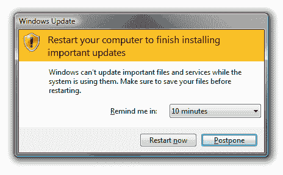

# windows Update–不要关闭它！

> 原文:[https://dev . to/funky si1701/windows-update-don-t-turn-it-off-5 ago](https://dev.to/funkysi1701/windows-update-dont-turn-it-off-5ago)

本周没有博客文章。然而，为什么不看看 Troy Hunts 关于 Windows Update 的博客文章呢？

[T2】](https://res.cloudinary.com/practicaldev/image/fetch/s--tIOjEn6q--/c_limit%2Cf_auto%2Cfl_progressive%2Cq_auto%2Cw_880/https://storageaccountblog9f5d.blob.core.windows.net/blazor/wp-content/uploads/2017/05/ximage7.png.pagespeed.gpjpjwpjwsjsrjrprwricpmd.ic_.OmA4sQpZUA.png%3Fw%3D464%26ssl%3D1)

我可能是相当独特的，因为我喜欢安装更新，无论是在我的手机，我的电脑或我最喜欢的程序之一。我以前担任 sysadmin 角色时的任务之一是确保所有服务器和客户机上都安装了所有 windows 更新。这是一个永无止境的任务，一旦你完成了几乎所有的更新，周二就会更新，一组新的更新将会发布。

我记得有几次安装的更新导致了问题，需要回滚。然而，我无法衡量它修复问题或提高操作系统或其他软件安全性的频率。如果你将等待更新安装的烦恼与电脑(或者更糟的是服务器)被黑客攻击或以其他方式被入侵进行比较，我认为你需要做什么是相当清楚的。

作为一名从事 IT 工作的人，我觉得我有责任分享让您的设备保持更新的重要性。不要关闭或禁用自动更新。它可以帮助您并确保您的计算机安全无虞。