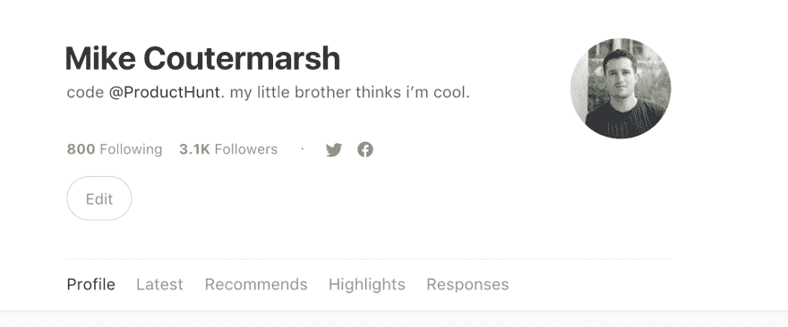

# 重构技巧:使用 Rails 中的视图对象模式构建用户配置文件页面

> 原文:[https://dev . to/MSC CCC/using-the-view-object-pattern-in-rails-for-modeling-medium-user-profile-page](https://dev.to/mscccc/using-the-view-object-pattern-in-rails-for-modeling-mediums-user-profile-page)

Medium.com 的用户资料显示了所有用户的**帖子**，他们的**关注者**以及他们的**突出显示的内容**。

[T2】](https://res.cloudinary.com/practicaldev/image/fetch/s--6Psu9m-h--/c_limit%2Cf_auto%2Cfl_progressive%2Cq_auto%2Cw_880/https://thepracticaldev.s3.amazonaws.com/i/ecp5079h5hche6bm2of4.png)

我可以想象他们的数据模型是这样工作的。他们有一个**用户**模型，一个**帖子**模型，一个**关注者关联模型**和一个**亮点**模型。

对于他们的个人资料页面，他们从几个不同的来源引入数据。

当在你的应用程序中建立一个用户资料页面时，为它创建一个全新的模型可能会很有诱惑力。但是我通常对为如此不具体的东西创建模型非常谨慎。它可以很快成为一个通用的“把一切都扔在这里”的模型。

## 使用查看对象模式

我发现在 Rails 中最好的方法是使用视图对象模式(也就是 Presenter 对象)。你可以在这里了解更多:[重构 Fat ActiveRecord 模型的 7 种模式](http://blog.codeclimate.com/blog/2012/10/17/7-ways-to-decompose-fat-activerecord-models/)(搜索视图对象)。

首先，您需要创建一个类，它封装了您希望在个人资料页面上显示的所有数据。

**类似这样的:**

```
class UserProfile
  attr_reader :user

  def initialize(user)
    @user = user
  end

  def tagline
    # example of some html conversion
    @tagline ||= ConvertTagsToLinks.run(user.tagline)
  end

  def posts
    @posts ||= user.posts.order_by_featured_date
  end

  def followers
    @follows ||= user.followers.ordered_by_popularity
  end

  ## ect...
end 
```

<svg width="20px" height="20px" viewBox="0 0 24 24" class="highlight-action crayons-icon highlight-action--fullscreen-on"><title>Enter fullscreen mode</title></svg> <svg width="20px" height="20px" viewBox="0 0 24 24" class="highlight-action crayons-icon highlight-action--fullscreen-off"><title>Exit fullscreen mode</title></svg>

(这个例子有点牵强，但希望您能理解)

这使得在控制器和视图中访问一个干净的对象变得非常容易。

```
# some controller
def show
  @user = User.find(params[:id)
  @user_profile = UserProfile.new(@user)

  # render a view...
end 
```

<svg width="20px" height="20px" viewBox="0 0 24 24" class="highlight-action crayons-icon highlight-action--fullscreen-on"><title>Enter fullscreen mode</title></svg> <svg width="20px" height="20px" viewBox="0 0 24 24" class="highlight-action crayons-icon highlight-action--fullscreen-off"><title>Exit fullscreen mode</title></svg>

然后，在您的视图中，您能够轻松地访问您的视图对象。

```
<p class="tagline"><%= @user_profile.tagline %></p> 
```

<svg width="20px" height="20px" viewBox="0 0 24 24" class="highlight-action crayons-icon highlight-action--fullscreen-on"><title>Enter fullscreen mode</title></svg> <svg width="20px" height="20px" viewBox="0 0 24 24" class="highlight-action crayons-icon highlight-action--fullscreen-off"><title>Exit fullscreen mode</title></svg>

使用这种模式可以让你的抽象非常清晰。这种模式易于编写测试，有助于将用户配置文件代码排除在模型之外。

试试看，让我知道它对你有什么效果。