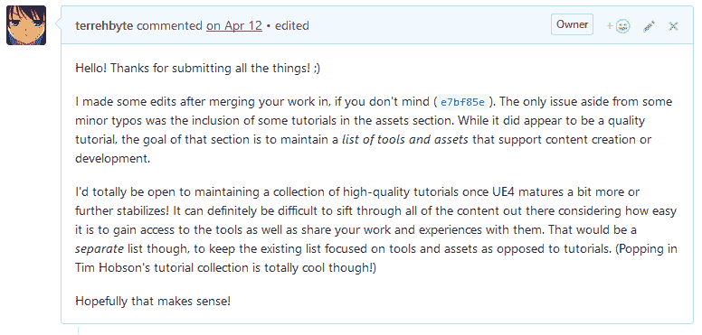

# 我的拉请求礼仪

> 原文：<https://dev.to/terrehbyte/my-pull-request-etiquette>

*交叉发布自我的[博客](https://terrehbyte.com/my-pull-request-etiquette/)T3】*

我非常热衷于这样一个想法，即积累观点和经验是创造更好的知情意见或作品的过程的一部分。看起来，除了 UI/UX 设计，自由/开源软件社区从中受益匪浅。

其中一部分是免费的，因为从客观的角度来看，这种文化更有利于解决更容易解决的问题，尽管如果一开始没有建立一种适当的社区文化，这很容易出错。我第一次尝试创建这样的东西是当我决定尝试为 UE4 创建我自己的[“令人敬畏的列表”时，因为我还没有找到一个像样的列表。](https://github.com/terrehbyte/awesome-ue4)

开始很简单，因为@sindresorhus 已经花了相当多的精力为一个令人敬畏的列表建立[指南和建议，但是我还没有计划好如何处理投稿。](https://github.com/sindresorhus/awesome)

第一个是来自 [@trentpolack](https://github.com/trentpolack) 的，他[“在令人敬畏的列表中添加了一堆可爱的东西”](https://github.com/terrehbyte/awesome-ue4/pull/1)，从教程到插件。一开始我真的很兴奋；有人不仅看了我的清单，还建议对它进行修改！但是，看了之后，还是有一些问题:

1.  正文中错误的`\`字符
2.  严格列出资产/插件的教程
3.  一个格式不正确的链接，链接到一个重要的资源
4.  同一类别或子标题内的未标字母的条目

考虑到所有的问题都需要短期修复，这并没有什么特别令人震惊的，但有一个问题仍然存在:我应该回应并要求他们修复它，还是我应该自己修复它？

一方面，让他们这么做真的很快，这样我就可以代表我毫不费力地将他们的拉请求合并到存储库中。然而，因为一些相对不重要的事情而拒绝他们也有点残忍，因为我已经确定了他们，我自己就可以很容易地解决这些问题。它也只是降价，所以技术上仍然有效，只是看起来不吸引人。

[T2】](https://res.cloudinary.com/practicaldev/image/fetch/s--1h1OwZeR--/c_limit%2Cf_auto%2Cfl_progressive%2Cq_auto%2Cw_880/https://thepracticaldev.s3.amazonaws.com/i/0no6vm6cfzur0d3wmkhn.PNG)

虽然我内心的清教徒想让他们重做，但我最终还是倾向于接受并自己解决它。将打字错误放在一边，我在添加了一个注释，陈述了我后来对内容所做的一些更改之后，合并并关闭了 pull 请求。

也许我比他们更重视这件事，但我想确保他们理解我的改变背后的基本原理，并且我感谢他们的时间。对于如此简单的事情，我不想为贡献设置过高的[障碍。](http://sealedabstract.com/rants/conduct-unbecoming-of-a-hacker/)

也许对于有更多流量的存储库来说，这是一种不可持续的做法，但是考虑到项目缺乏活动和相对“新”的情况，我觉得这是合适的。我急切地期待着有一天，在提交给[牛逼列表](https://github.com/sindresorhus/awesome)之前，我最终对它进行最后的润色。

展望未来，我想在形成和审查未来拉动式需求时，我会应用以下想法:

1.  提交的内容是否表明提交者已经阅读了投稿指南(如果有)？
2.  提交者有兴趣帮助开发一个更好的项目吗？
3.  拉请求中的变化是否反映了给定请求的适当工作量？
4.  它真的符合社区贡献的标准吗？

我们都是会犯错的人！我们中的一些人也是开发人员，在这种情况下，我们可能也很忙，当我们试图帮助某人或某事时，可能会错过一两件事。希望这能为将来的提交者或审阅者带来更好的体验！

编辑:修正了一些错别字并做了一些澄清