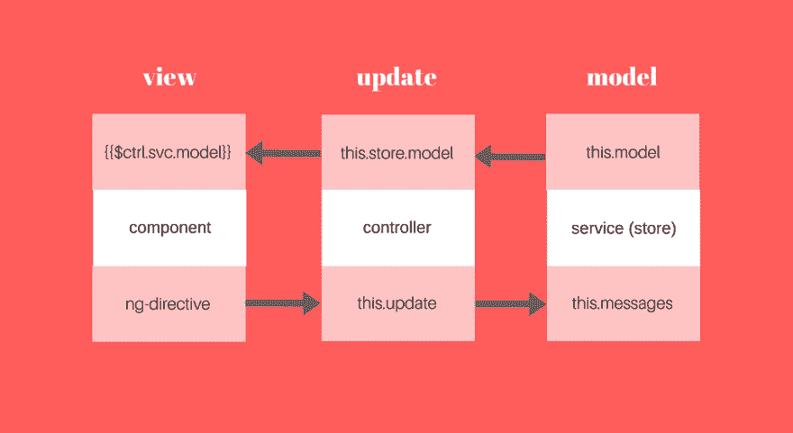
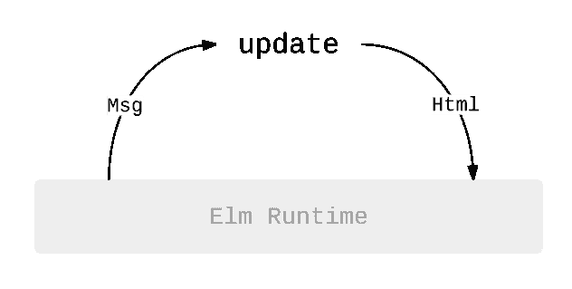

# 沿着榆树的路写作

> 原文:[https://dev.to/pancy/writing-angularjs-the-elms-way](https://dev.to/pancy/writing-angularjs-the-elms-way)

[T2】](https://res.cloudinary.com/practicaldev/image/fetch/s--J7YGerhf--/c_limit%2Cf_auto%2Cfl_progressive%2Cq_auto%2Cw_880/https://cdn-images-1.medium.com/max/1200/1%2AYVNo5RQmyHKRDlmhoZG0gg.png)

> 这是一种用于编写合理且可预测的 Angularjs 代码的模式，来自一个在 JavaScript 和 Angularjs 方面有过困难的人。

最近，在加入 [Headspin](//headspin.io) 后，我有机会专门从事 Javascript 和 AngularJS 的工作，这两方面我都没有什么经验。在 Headspin，我们试图解决应用程序开发人员的一个独特问题——实时调试全球网络上的移动应用程序。web 用户界面和数据仪表板是我们工作中非常重要的一部分。

然而，作为学习 JavaScript 和 Angularjs 的一部分，我花了比我想的更长的时间来思考 Angular 应用程序的所有作用域和状态，它们散布在代码的每个地方，几乎可以从任何地方变异。我最终写出了丑陋的 JavaScript，我并不引以为豪，读起来也没什么乐趣。随着我越陷越深，这种恶性循环对我来说就像它的对应物一样，一直在黑洞里盘旋。

**最后，我觉得是时候停下手头的事了，免得自己坠入更深的深渊，反思哪里出了问题。**

我首先指出了一些阻碍我学习和理解框架以及 JavaScript 语言本身的事情。我想出了一个粗略的清单:

*   无限制可变性表面
*   双向数据流
*   控制器和服务之间缺乏清晰的界限

## 论复杂性

人类为了理解而简化是很自然的。我们通常不擅长处理复杂的事情，更不用说多任务处理了。

当一个人面对复杂性时，正确的做法是将他被迫与手边事物接触的“表面区域”最小化。例如，在电影 *300* 中，列奥尼达国王巧妙地带领他的三百名战士进入悬崖之间的狭窄缝隙，并成功阻止了数百万(？)的波斯士兵。不管这是事实还是虚构的，这种最小化攻击面的策略在面对复杂性，或者在我们的例子中，代码中的许多移动部分试图改变应用程序的状态时，是一种出色但显而易见的策略。

Javascript 作为一种随意的函数式语言，在限制突变方面做得并不好。这个结果是在 Angularjs 或任何 Javascript 代码中经常可以看到的:

```
 class FooService {
  constructor() {
    this.state = "foo";
  }
  addBaz() {
    this.state = this.state + " baz";
  }
  addBar() {
    this.state = this.state + " bar";
  }
  _addBaz() {
    this.addBaz();
  }
  // this goes on ...
}

angular.module("Foo").service("FooService", FooService); 
```

<svg width="20px" height="20px" viewBox="0 0 24 24" class="highlight-action crayons-icon highlight-action--fullscreen-on"><title>Enter fullscreen mode</title></svg> <svg width="20px" height="20px" viewBox="0 0 24 24" class="highlight-action crayons-icon highlight-action--fullscreen-off"><title>Exit fullscreen mode</title></svg>

显然，这非常麻烦，但不知羞耻的是，我经常这样做只是为了完成事情，并梦想以后进行重构，因为添加另一个“快捷”方法来实现我想要的东西是如此容易。

当您将一个服务注入到一个控制器中，并将自己置于一个尴尬的境地，不得不决定哪个负责管理应用程序状态时，事情会变得更糟。

```
 function FooController ($scope, FooService) {
  $scope.FooService = FooService;
  $scope.addBaz = () => {
    FooService.addBaz();

    // or you can do this
    // $scope.FooService.addBaz();

  }
}

angular.module("Foo").controller("FooController", FooController); 
```

<svg width="20px" height="20px" viewBox="0 0 24 24" class="highlight-action crayons-icon highlight-action--fullscreen-on"><title>Enter fullscreen mode</title></svg> <svg width="20px" height="20px" viewBox="0 0 24 24" class="highlight-action crayons-icon highlight-action--fullscreen-off"><title>Exit fullscreen mode</title></svg>

我后来了解到，控制器应该充当“调度程序”，而服务可以被视为一个持久层。然而，这在 AngularJS 中没有得到足够的反映或鼓励。创建一个执行控制器工作的胖服务并将其注入一个仅充当傀儡的控制器是非常容易的。

例如，控制器和服务之间的界限在哪里？什么时候适合将服务注入控制器，并使用控制器的函数作为 API，什么时候适合直接使用附加到控制器范围的服务实例来调用它自己的内部方法？换句话说，是什么阻止我们去做:

```
 <div ng-controller="FooController">

  <!-- Using controller's service instance as API to state -->
  <button ng-click="FooService.addBaz()">Add Baz from Svc</button>

  <!-- INSTEAD OF-->

  <!-- Using controller's method as API to state -->
  <button ng-click="addBaz()">Add Baz from Ctrl</button>

</div> 
```

<svg width="20px" height="20px" viewBox="0 0 24 24" class="highlight-action crayons-icon highlight-action--fullscreen-on"><title>Enter fullscreen mode</title></svg> <svg width="20px" height="20px" viewBox="0 0 24 24" class="highlight-action crayons-icon highlight-action--fullscreen-off"><title>Exit fullscreen mode</title></svg>

还是这个:

```
 <div ng-controller="FooController">

  <!-- Using controller as a state container -->
  <p>{{state}}</p>

  <!-- INSTEAD OF -->

  <!-- Using the controller's service instance as container -->
  <p>{{FooService.state}}</p>

</div> 
```

<svg width="20px" height="20px" viewBox="0 0 24 24" class="highlight-action crayons-icon highlight-action--fullscreen-on"><title>Enter fullscreen mode</title></svg> <svg width="20px" height="20px" viewBox="0 0 24 24" class="highlight-action crayons-icon highlight-action--fullscreen-off"><title>Exit fullscreen mode</title></svg>

## 现在开始使用组件

从 Angularjs 1.5 开始，框架引入了[组件，并鼓励它们使用指令](https://docs.angularjs.org/guide/component)。组件的功能较少，设计时使用了隔离的作用域，并鼓励单向数据绑定。组件的作用域总是与外界隔离，“入口”只通过绑定来控制:

```
 function FreeChildController () {
  this.inTheMood = false;
}
let FreeChildComponent = {
  controller: FreeChildController,
  bindings: {
   inlet: "<"
  },
  template: "<h1>{{$ctrl.inTheMood ? $ctrl.inlet : 'nanana'}}</h1>"
} 
```

<svg width="20px" height="20px" viewBox="0 0 24 24" class="highlight-action crayons-icon highlight-action--fullscreen-on"><title>Enter fullscreen mode</title></svg> <svg width="20px" height="20px" viewBox="0 0 24 24" class="highlight-action crayons-icon highlight-action--fullscreen-off"><title>Exit fullscreen mode</title></svg>

这样，`ParentController`的封闭范围只能通过`FreeChildComponent`的绑定属性`inlet`进行单向交互，而组件不能干涉外部范围。

```
 <div ng-controller="ParentController as parent">
  <free-child inlet="parent.complaint"></free-child>  
</div> 
```

<svg width="20px" height="20px" viewBox="0 0 24 24" class="highlight-action crayons-icon highlight-action--fullscreen-on"><title>Enter fullscreen mode</title></svg> <svg width="20px" height="20px" viewBox="0 0 24 24" class="highlight-action crayons-icon highlight-action--fullscreen-off"><title>Exit fullscreen mode</title></svg>

## 榆树之道

正如我提到的，在我进入 AngularJS 之前，我有机会用 Elm 编写代码，这是一种类似 ML 的反应式语言，可以编译成 Javascript。最值得注意的是它的架构，它促进单向数据流和非常健全的状态循环。这个架构本身启发了 Redux，这是 React 社区中众所周知的一个状态容器插件。

[T2】](https://res.cloudinary.com/practicaldev/image/fetch/s--y7obxAKL--/c_limit%2Cf_auto%2Cfl_progressive%2Cq_auto%2Cw_880/https://cdn-images-1.medium.com/max/800/1%2AU42YOkN8Tx4TVAacbwQ15A.png)

Elm 体系结构由三部分组成——模型、更新和视图。

### 型号

模型是现有应用程序的真实或状态的单一来源。在 Elm 中，模型通常被定义为一个[记录](http://elm-lang.org/docs/records)实例(类似于 Javascript 中的一个对象)。因为 Elm 是一种纯粹的函数式语言，所以这个模型永远不会原地变异。对模型的每次更新都会返回一个修改后的模型的新实例，并将其传递给 Elm 运行时(类似于 AngularJS 的摘要循环)。

### 更新

更新可能是 Elm 应用程序中最有趣的部分。它是一个单一的函数，接受一个`Msg`类型和模型作为参数，将接收到的消息与那些在`Msg`联合类型中预定义的进行模式匹配，并返回一个修改后的模型。这是模型状态被修改的唯一部分。

### 视图

在 Elm 中，你不用写 HTML 标记。Elm 的视图也是纯粹的函数，它接受模型并返回一个`Html`和`Msg`的实例，由运行时渲染成 HTML DOM。下面是 Elm 中一个简单计数器应用程序的基本片段。

```
 main =
  beginnerProgram { model = 0, view = view, update = update }

view model =
  div []
    [ button [ onClick Decrement ] [ text “-” ]
    , div [] [ text (toString model) ]
    , button [ onClick Increment ] [ text “+” ]
    ]

type Msg = Increment | Decrement
update msg model =
  case msg of
    Increment -> model + 1
    Decrement -> model – 1 
```

<svg width="20px" height="20px" viewBox="0 0 24 24" class="highlight-action crayons-icon highlight-action--fullscreen-on"><title>Enter fullscreen mode</title></svg> <svg width="20px" height="20px" viewBox="0 0 24 24" class="highlight-action crayons-icon highlight-action--fullscreen-off"><title>Exit fullscreen mode</title></svg>

没有任何 Elm 知识的人也几乎可以读懂。在 JavaScript 中还有其他方法可以实现类似的行为，但是由于语言本身的设计，Elm 取得了最大的成功。

## 重组棱角

在我继续之前，我想澄清一下，这是一种固执己见的模式。这个模式并不意味着是一个框架、模块，甚至是一个规则。对于 Javascript 和 Angular 程序员来说，这可能显得不合常规，但是作为一个像我这样的新人，我除了想改善我和 Angular 之间的关系之外别无选择。

话虽如此，以下是我与 AngularJS 一起前进时会做的几件事:

### 型号

*   服务应该充当一个非常薄的存储或状态容器，并且应该被注入到一个控制器中，该控制器作为存储管理器向状态提供 API。
*   服务应该返回存储区构造函数的闭包，而不是在中隐式设置其内部状态，以便可以从控制器或单元测试中注入起始状态和消息选项。
*   服务的状态只能通过控制器中的一个`update`函数来更新，该函数发送一个在服务的 messages 对象中匹配的消息字符串，并触发适当的 pure 函数。这意味着存储控制器只包含一个函数。
*   模型应该是一个单一的对象——一个真实的来源——将所有属性组合在一起，并作为一个整体进行更新和返回。

```
 // ES6 class
class StoreSvc {
  constructor () {
    return (initState, messageOpts) => {
      this.model = initState;
      this.messages = MessageOpts;
      return this;
    }
  }
}

app.module("myModule").service("StoreSvc", MyStore); 
```

<svg width="20px" height="20px" viewBox="0 0 24 24" class="highlight-action crayons-icon highlight-action--fullscreen-on"><title>Enter fullscreen mode</title></svg> <svg width="20px" height="20px" viewBox="0 0 24 24" class="highlight-action crayons-icon highlight-action--fullscreen-off"><title>Exit fullscreen mode</title></svg>

除了更容易测试服务之外，我还发现这种方法鼓励将启动状态的任务委托给其他实体。需要注意的最重要的一点是，这种模式使得服务成为一个非常通用的持久状态层，具有零功能性 T2。定义每个服务的是实例化期间传入的消息对象，这是由控制服务的控制器决定的。这意味着应用程序如何与状态交互取决于提供描述性`messages`图的控制器。因此，这成为应用程序模型的 API，由服务持有并由控制器控制。

这是一个控制器“附加”到商店服务并向模型提供 API 的例子:

```
 function StoreController (StoreSvc) {

  // provide a starting model state 
  let model = { 
    name: "", 
    age: 0 
  };

  // provide a messages object aka API to the model
  let messages = {
    SetName : ((model, name) => Object.assign(model, {name: name})),
    SetAge  : ((model, age) => Object.assign(model, {age: age}))
  };

  // initiate a store
  this.store = StoreSvc(model, messages);
} 
```

<svg width="20px" height="20px" viewBox="0 0 24 24" class="highlight-action crayons-icon highlight-action--fullscreen-on"><title>Enter fullscreen mode</title></svg> <svg width="20px" height="20px" viewBox="0 0 24 24" class="highlight-action crayons-icon highlight-action--fullscreen-off"><title>Exit fullscreen mode</title></svg>

在`messages`对象中，键被故意大写以区别于其他对象键。这里的`Object.assign`用于将现有模型与包含需要更新的属性的对象合并，并返回克隆体，这是一种相对于模型传统变异的功能性方法。

### 更新

*   控制器只包含一个函数，即`update`(可以是任何名称)，它发送适当的消息来触发`messageOpts`中的一个纯函数，一个将消息键映射到函数的对象。**`update`功能是应用程序中唯一改变服务模式**的地方。

*   控制器通过将起始模型状态和消息注入服务的构造函数来启动它们的映射(或者使用另一个服务来获取数据，可能通过`$http`)。

*   理想情况下，商店控制器应该只负责更新商店服务，而不应该担心管理 DOM/组件。这应该是组件控制器的工作。

下面是一个基本的`update`函数的样子:

```
 this.update = (message, model, ...args) => {
  if (message in this.store.messages) {
    this.store.model = this.store.messages[message](model, ...args);
  }
} 
```

<svg width="20px" height="20px" viewBox="0 0 24 24" class="highlight-action crayons-icon highlight-action--fullscreen-on"><title>Enter fullscreen mode</title></svg> <svg width="20px" height="20px" viewBox="0 0 24 24" class="highlight-action crayons-icon highlight-action--fullscreen-off"><title>Exit fullscreen mode</title></svg>

### 视图

*   组件比指令更受青睐。
*   在一个组件中，UI 驱动的动作应该总是使用正确的消息和参数调用绑定到商店控制器的更新函数的适当函数。
*   组件可以从存储控制器的绑定中插入模型中的数据。
*   仅使用单向绑定(`<`)从封闭存储控制器的范围传入数据。一个组件不能改变它自身之外的任何东西。
*   应该谨慎使用双向绑定，如`ngModel`。在示例代码中，它被放弃，取而代之的是一组`ngKeydown`、`ngKeyup`和`$event.key`。

下面是一个组件可能的样子:

```
 let storeDashboard = {
  controller: myStoreController,
  bindings: {
    title: "<"
  },
  template: `
    <h4>{{$ctrl.title}}</h4>
    <ul>
      <li>
        {{$ctrl.store.model.name}}
        <input ng-model="$ctrl.store.model.name">
      </li>
      <li>
        {{$ctrl.store.model.age}}
        <button ng-click="$ctrl.update('SetAge', $ctrl.store.model, 0)">Reset</button>
      </li>
    </ul>
  `
} 
```

<svg width="20px" height="20px" viewBox="0 0 24 24" class="highlight-action crayons-icon highlight-action--fullscreen-on"><title>Enter fullscreen mode</title></svg> <svg width="20px" height="20px" viewBox="0 0 24 24" class="highlight-action crayons-icon highlight-action--fullscreen-off"><title>Exit fullscreen mode</title></svg>

重构`update`函数以返回控制器的实例也很有用。

```
 this.update = (msg, model, ...args) => {
  if (msg in this.store.messages) {
      let newModel = this.store.messages[msg](model, ...args);

      // model mutation happens here
      this.store.model = newModel;
    }
    return this;
  }
} 
```

<svg width="20px" height="20px" viewBox="0 0 24 24" class="highlight-action crayons-icon highlight-action--fullscreen-on"><title>Enter fullscreen mode</title></svg> <svg width="20px" height="20px" viewBox="0 0 24 24" class="highlight-action crayons-icon highlight-action--fullscreen-off"><title>Exit fullscreen mode</title></svg>

现在可以在 DOM:
中的一个指令调用中链接更新操作

```
 <button type="button" 
        ng-click="$ctrl
                    .update('Decrement', $ctrl.store.model)
                    .update('Attach', $ctrl.store.model)">
  -
</button> 
```

<svg width="20px" height="20px" viewBox="0 0 24 24" class="highlight-action crayons-icon highlight-action--fullscreen-on"><title>Enter fullscreen mode</title></svg> <svg width="20px" height="20px" viewBox="0 0 24 24" class="highlight-action crayons-icon highlight-action--fullscreen-off"><title>Exit fullscreen mode</title></svg>

## 简化代码=可预测状态

有了这个模式，追踪模型作为一组状态是如何变异的就容易多了。控制器变得非常精简，因为所有的本地函数都被重构并作为纯函数分组到 messages 对象中，并让 update 作为一个单一的不变性表面，因此调试起来非常简单。应用程序的核心被压缩成`messages`对象，一个消息字符串的映射，以及返回新模型对象的小型、独立的纯函数。

简言之，下面是一个简单的柜台应用程序，它将这三个部分描述为 Model-View-Update。对于其他关键事件，我一直避免使用`ngModel`，这种做法比较落后，但我觉得我已经明白了避免双向绑定的意思)。

[柜台 App](https://jsfiddle.net/jchasinga/5pvdtzj7/)

这一部分演示了一个完整的 store 服务模式，其中一个控制器提供 API，该 API 封装了组件控制器的范围，并通过组件的输入绑定发送受限的值和函数。

[用户面板](https://jsfiddle.net/jchasinga/wxm8f0L7/)

## 结论

值得再次说明的是，这种模式只是我个人的探索，是我自己在使用 JavaScript 和 Angularjs 时的注意事项，也是我试图克服它的一种尝试。

你可以从 [github repo](https://github.com/jochasinga/ng-elemental) 中抓取代码(虽然还没有完成)。

* * *

*原文发表[此处](https://medium.com/@jochasinga/writing-angular-app-the-elms-way-6e98ad305570)。*