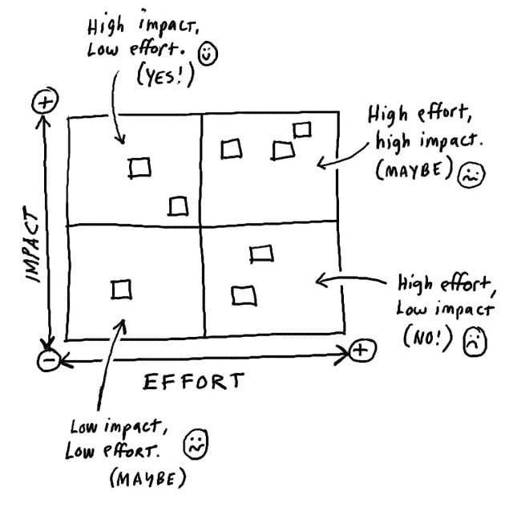

# 如何为你的团队设定技术方向

> 原文:[https://dev . to/jlhcoder/how-to-set-the-technical-direction for your team](https://dev.to/jlhcoder/how-to-set-the-technical-direction-for-your-team)

*这篇文章最初发表在[我的博客](http://jlhood.com/how-to-set-team-technical-direction/)T3 上*

我发现一个高效快乐的开发团队的关键之一是当团队的每个成员都理解(1)团队的技术方向，以及(2)他们当前所做的工作如何有助于那个方向。正因为如此，作为一名高级开发人员，我的主要职责之一就是帮助团队建立一个清晰的技术方向，以及如何实现这个方向的计划。

在亚马逊工作几年后，有一件事一直让我印象深刻，那就是亚马逊的[领导原则](https://www.amazon.jobs/en/principles)的天才之处。在我工作过的其他一些大公司，他们版本的领导原则或企业价值观只是印在海报上挂在办公室某个地方的一套模糊的声明或流行语。大多数人无视他们，继续他们的日常工作。然而，在亚马逊，我们生活和呼吸着领导原则，并在日常对话中经常提到它们。总的来说，他们建立了一个思维框架，推动每个在那里工作的人成为快速行动、创新的领导者。

当涉及到为一个团队建立技术方向时，两个领导原则开始发挥作用:想得大和偏向于行动。

Think Big 鼓励你“创造并传达一个激励结果的大胆方向”，而 Bias for Action 则推动你快速行动，不迷失在可怕的[分析瘫痪](https://en.wikipedia.org/wiki/Analysis_paralysis)中。一个好的技术方向包含了这两个原则。因此，我指导他们必须建立的团队，既有长期的、方向性的愿景，也有短期的、增量的里程碑，这些里程碑引领着长期愿景的方向。

## 长远眼光

长期技术愿景是“思考大领导”原则发挥作用的地方。把业务问题放在一边，把时间和资源等烦人的约束放在脑后，试着想出一个理想化的架构。在你的框图中自由地使用独角兽和彩虹。😉

不过说真的，长期愿景是很棘手的。他们必须足够清晰，这样他们才是可信的，团队中的每个人都可以理解并认同他们。它们必须长期保持相对稳定。最后，它们还必须足够抽象，让个人觉得有能力打造实现目标的创造性路径。这是一个艰巨的任务，也是有效领导的一个关键挑战。

以下是一些有助于我提出长期技术愿景的技巧:

1.  一张图抵得上 1000 个字。架构框图可以增加关键组件及其相互关系的清晰度。
2.  不要试图将你的全部视野放入一张图片中。使用不同抽象层次的多张图片来提供清晰性。我喜欢西蒙·布朗的概念，他认为架构图是你的代码库的地图。
3.  保持抽象。避免选择特定的技术。相反，坚持定义组件，保持数据库、队列、流等概念的通用性，而不是命名一个特定的解决方案。
4.  浏览关键业务用例，展示组件如何交互。
5.  列举该体系结构的关键业务和技术优势。
6.  这都是关于界限的。定义架构的关键子系统和组件及其职责非常重要。巩固对职责的理解的一个很好的方法是在遍历用例时关注边界。明确指出每一方负责(和不负责)什么。
7.  不要试图设计到最后一个细节。你不需要深入到组件层次，也就是说，没有类图。请记住，对于长期愿景来说，重要的是定义关键组件及其职责。

## 短期增量里程碑

长期愿景是重要的，但如果你真的在练习“大思考”，你最终会得到一个需要几年时间才能建立起来的系统的轮廓。如果你只是转身从头开始建立整个系统，你可能会在启动前就耗尽资金。更糟糕的是，你可能会在到达终点时意识到你所构建的实际上并不是正确的解决方案。业务变化很快，你需要能够适应这种变化。这就是行动领导原则发挥作用的地方，以平衡“大思考”。

一旦你建立了长期愿景，是时候回到现实世界，制定一个渐进的计划来实现它。该计划需要包括快速向客户推出一些真实的东西，这样你就可以在需要以敏捷和精益创业精神[修正路线的情况下快速获得反馈。](https://www.amazon.com/Lean-Startup-Entrepreneurs-Continuous-Innovation/dp/0307887898)

我喜欢用影响与努力矩阵来思考这个问题:

[T2】](https://res.cloudinary.com/practicaldev/image/fetch/s--ElVdAOAn--/c_limit%2Cf_auto%2Cfl_progressive%2Cq_auto%2Cw_880/http://jlhood.cimg/impact-vs-effort.jpg)

从零开始建立你的长期愿景应该坚定地处于高努力、高影响象限。然而，开始时，在低努力、中高影响领域寻找符合你长期愿景的任务。例如，您的长期愿景可能是为您的企业构建一个复杂、功能丰富的实时业务分析平台。然而，这个方向上的一个短期里程碑是建立一个 Kafka 集群，将一个连接器附加到一些数据库的副本上，并将更新推送到 ElasticSearch 集群中。然后使用 Kibana 创建一些仪表板。这项工作可以在几个月内完成，并将向您提供客户反馈，帮助您确定后续步骤。它还可以给你数据点，帮助你确定你是否朝着正确的长期方向前进，或者你的长期愿景是否需要调整。

当我想出短期的、渐进的计划时，这里有一些帮助我的建议:

1.  寻找在 3-6 个月(或更短，取决于项目的规模和范围)的时间框架内可以实现的里程碑。理想情况下，里程碑是面向客户的，但是不要仅仅为了面向客户而将里程碑延长到一年或两年。如果它们太大，可能会有一个更好的解决方案，给你你需要的反馈。
2.  具体点。与你的长期愿景不同，短期解决方案应该是明确的。选择具体的技术并证明你的选择。
3.  列举每个里程碑的关键业务和/或技术胜利。这确保你知道你为什么要做每一件事。
4.  用长远的眼光作为你的路标。你的里程碑应该与最终目标一致，尽管如果有充分的理由，它们可能会偏离轨道一点。然而，避免横向或向后移动。
5.  不要试图定义通向最终目标的每一个里程碑。长期愿景是有方向性的，随着你从每个里程碑中学到更多，它可能(将会)改变和发展。试图在一开始就定义每一步是困难的，而且浪费时间。

我怎么强调最后一点都不为过。我曾经和一些试图推动跨越多年的详细计划的人一起工作过，结果只是让团队不知所措，士气低落。问题是，如果你从低强度的工作开始，并获得一些快速的胜利，它会建立动力和信心。我还发现，随着你取得进展，高努力/高影响象限中的里程碑开始左移。换句话说，你在前一个里程碑中建立或学到的东西会突然让另一个里程碑变得更容易实现。它们可以成为您路线图上的下一个里程碑，进一步增强信心和动力。我更喜欢这种模式，因为它是自适应的和分散的，这赋予了团队力量。

## 结论

拥有明确的长期和短期技术方向对于软件开发的领导力至关重要。希望这有助于你了解如何设定技术方向，以及亚马逊的领导原则如何帮助你。如果你有兴趣了解更多关于领导原则的知识，我推荐你阅读《亚马逊之路》。