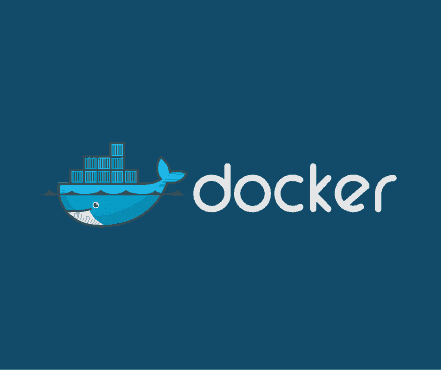

# 向 Docker 服务添加代理

> 原文:[https://dev . to/zorexalvo/adding-proxy-to-your-docker-service](https://dev.to/zorexsalvo/adding-proxy-to-your-docker-service)

*这只是我在 office network proxy 中 docker 服务配置的个人注释。*

[T2】](https://res.cloudinary.com/practicaldev/image/fetch/s--FhcHFY1a--/c_limit%2Cf_auto%2Cfl_progressive%2Cq_auto%2Cw_880/https://www.docker.com/sites/default/files/social/docker-facebook-share.png)

你是否经历过即使你的机器在网络代理上，docker 构建也很慢？

我吗？一直都是。

然后这个想法来自于我们的一个实习生。首先，他所做的是在 Dockerfile 文件中添加环境变量。

似乎是个好主意，是吧？但这真的不是一个好的形象，因为他的形象只有在我们的办公室网络中才能建立。

出现了一个问题，他不知道他在 docker hub 上的构建出了什么问题，因为“它运行在本地机器上”。问题是 docker hub 无法解决 http_proxy。

这与 Docker 的“在任何地方构建、发布和运行任何应用程序”的口号正好相反。它甚至没有通过构建部分。

然后另一个想法出现了，如果我们在 docker 上添加代理，这样我们就不必为 docker 文件指定环境变量`HTTP_PROXY`了。这是个好主意！

下面是如何做到这一点:

首先，在目录
中创建一个 systemd drop

```
mkdir /etc/systemd/system/docker.service.d/ 
```

<svg width="20px" height="20px" viewBox="0 0 24 24" class="highlight-action crayons-icon highlight-action--fullscreen-on"><title>Enter fullscreen mode</title></svg> <svg width="20px" height="20px" viewBox="0 0 24 24" class="highlight-action crayons-icon highlight-action--fullscreen-off"><title>Exit fullscreen mode</title></svg>

然后，创建 http-proxy.conf

```
touch /etc/systemd/system/docker.service.d/http-proxy.conf

## http-proxy.conf
[Service]
Environment="HTTP_PROXY=ip.of.your.proxy:port"
Environment="NO_PROXY=localhost,127.0.0.0/8" 
```

<svg width="20px" height="20px" viewBox="0 0 24 24" class="highlight-action crayons-icon highlight-action--fullscreen-on"><title>Enter fullscreen mode</title></svg> <svg width="20px" height="20px" viewBox="0 0 24 24" class="highlight-action crayons-icon highlight-action--fullscreen-off"><title>Exit fullscreen mode</title></svg>

然后，通过执行以下操作刷新更改:

```
sudo systemctl daemon-reload 
```

<svg width="20px" height="20px" viewBox="0 0 24 24" class="highlight-action crayons-icon highlight-action--fullscreen-on"><title>Enter fullscreen mode</title></svg> <svg width="20px" height="20px" viewBox="0 0 24 24" class="highlight-action crayons-icon highlight-action--fullscreen-off"><title>Exit fullscreen mode</title></svg>

最后，重启 Docker

```
sudo systemctl restart docker 
```

<svg width="20px" height="20px" viewBox="0 0 24 24" class="highlight-action crayons-icon highlight-action--fullscreen-on"><title>Enter fullscreen mode</title></svg> <svg width="20px" height="20px" viewBox="0 0 24 24" class="highlight-action crayons-icon highlight-action--fullscreen-off"><title>Exit fullscreen mode</title></svg>

要检查环境变量是否真的添加到了 docker 服务中，请执行`docker info`。

还有 pooof，注意你 docker 建造中速度的变化！