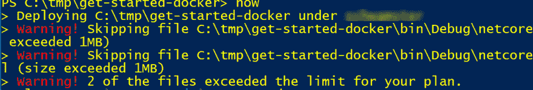
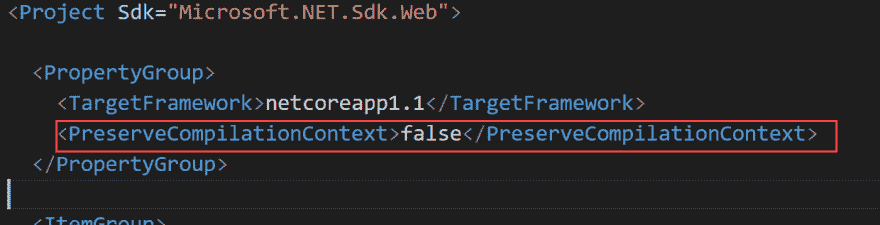
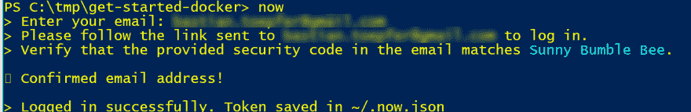
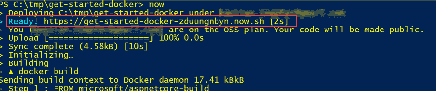

# 使用 Zeit“now”部署 ASP.NET 核心容器

> 原文：<https://dev.to/schwamster/deploying-a-aspnet-core-container-with-zeit-now>

我刚刚听了 Zeit 关于“现在”的播客。承诺是，你可以用 node.js 应用程序、静态网站或任何可以用 docker 打包的应用程序创建新文件夹。然后，您只需在 shell 中键入“now ”,您的应用程序就会被部署。

你可以在这个[回购](https://github.com/schwamster/aspnetcore-docker-now)里找到相关代码。如果你想了解更多关于 Asp.Net 核心和 docker 检查这个[教程](https://dev.to/schwamster/docker-tutorial-with-for-aspnet-core)。

这听起来不错。所以我试了一下。这是我所做的一个简短的记录。

## 你将需要什么

*   [点网核心 cli](https://www.microsoft.com/net/core)
*   [node.js](https://nodejs.org)

## 创建项目

在您选择的命令行中运行以下命令:

```
mkdir aspnetcore-now
cd ./aspnetcore-now
dotnet new webapi
dotnet restore 
```

我们现在有了一个样本 web api。我们可以通过运行以下命令来测试本地是否一切正常:

```
dotnet run 
```

现在，将浏览器指向[http://localhost:5000/API/values](http://localhost:5000/api/values),您应该会看到如下示例响应:

```
["value1","value2"] 
```

## 添加一个 Dockerfile

```
FROM microsoft/aspnetcore-build
ENV ASPNETCORE_URLS=http://+:80
EXPOSE 80
COPY . /opt/app
WORKDIR /opt/app
RUN dotnet restore
CMD dotnet run 
```

还要在项目中添加一个. dockerignore 文件，这样 bin 和 obj 就不是构建上下文的一部分:

```
bin
obj 
```

这是一个非常简单的文档。我们将源代码复制到容器中，公开端口 80，运行 dotnet restore 来获取依赖项，最后将默认命令设置为 dotnet run 来执行我们的应用程序。是的，我们使用 aspnetcore-build 作为映像，而不是优化的运行时映像。部署将花费更长的时间，但是首先它对于本文的目的来说更容易，其次它有助于绕过现在的自由 OSS 计划的一些限制。我希望每个人都能尝试一下，而不必使用他们的信用卡。但是坦白地说，我并不真正理解的一个限制是，如果您在自由计划中运行，作为您的容器构建上下文的一部分的单个文件(在这种情况下只有非常小的源文件)不能大于 1 MB。如果您在本地机器上构建/发布您的 dotnet 核心项目，或者您使用构建映像来编译您的应用程序，您将会看到输出中的某些文件大于 1 MB。因此，将编译后的应用程序复制到运行时映像(microsoft/aspnetcore)将不起作用，因为现在会报错如下:

[T2】](https://res.cloudinary.com/practicaldev/image/fetch/s--JB5HYVE3--/c_limit%2Cf_auto%2Cfl_progressive%2Cq_auto%2Cw_880/https://thepracticaldev.s3.amazonaws.com/i/ln0uxvo4u6ei4dj83d51.png)

有 3 种方法可以解决这个问题(可能更多):

### 使用构建图像

使用构建图像，就像我们在文章中做的那样。这是创造了一个更大的形象。我真的看不出 Zeit 强迫我这么做有什么好处。在我看来，最大总图像大小或最大总构建上下文更有意义。每个技术堆栈都是不同的，在一些堆栈中，较大的文件较少，而在另一些堆栈中，非常小的文件数量惊人。Zeit 不应该赶走他们没有注意到的堆栈开发者...当然，我也可能误解了一些东西，这个限制是完全有意义的。

### 删除大文件

违规文件(refs/Microsoft。CodeAnalysis*)在这个项目的运行时实际上是不需要的

[T2】](https://res.cloudinary.com/practicaldev/image/fetch/s--dKxwn9Lk--/c_limit%2Cf_auto%2Cfl_progressive%2Cq_auto%2Cw_880/https://thepracticaldev.s3.amazonaws.com/i/slefly8fj56xpl54r4yy.png)

### 使用注册表

另一种解决方法是按照您喜欢的方式构建图像，将其推送到 hub.docker.com，然后“现在”创建一个简化的 docker 文件:

```
FROM myusername/myapp
ENV ASPNETCORE_URLS=http://+:80
EXPOSE 80
CMD ["dotnet", "myapp.dll"] 
```

这很好，但它有点带走了乐趣。我真正喜欢“现在”的一点是，我不必担心构建管道。

回到原来的计划。我们只使用构建映像，它包括上面第一个 dockerfile 文件中提到的运行时和 sdk。

## 立即安装

现在有不同的安装方式，如[https://zeit.co/docs/getting-started/installing-now](here)所述。

以下是使用 npm 的方法:

```
npm install -g now 
```

## 部署

我们现在准备部署我们的应用程序。你需要做的就是跑:

```
now 
```

按照说明操作。如果这是你第一次跑步，你必须用你的邮箱地址注册。

[T2】](https://res.cloudinary.com/practicaldev/image/fetch/s--XffWQXuX--/c_limit%2Cf_auto%2Cfl_progressive%2Cq_auto%2Cw_880/https://thepracticaldev.s3.amazonaws.com/i/41hpuiydiiifwmopy393.png)

在输出的开头，您会发现现在为您创建了一个 url。在浏览器中打开该地址并添加/api/values。结果应该和在本地运行它一样。

[T2】](https://res.cloudinary.com/practicaldev/image/fetch/s--saKLQfVQ--/c_limit%2Cf_auto%2Cfl_progressive%2Cq_auto%2Cw_880/https://thepracticaldev.s3.amazonaws.com/i/2qe9gozyapw0xad8cqqh.png)

## 创建别名

现在每次运行时，我们将使用新的 url 创建一个新的部署。真正有帮助的是用更容易记住和持久的 URL 甚至自定义域来创建别名。这样，新版本总是可以与旧版本并排部署。对结果满意后，您可以将别名指向新的部署。查看[文档](https://zeit.co/docs)了解更多信息。

## 接下来是什么？

查看 cli，了解更多关于 now 的优秀特性。规模、日志、别名、DNS、域、证书...

## 总结

除了文件大小的限制，我强烈推荐“现在”。这只是第一印象。我将在我最喜欢的项目中尝试一下，看看效果如何。我特别感兴趣的是找出整个“我们只提供 web 应用程序前端的 cpu”限制将如何阻碍我，因为我有点习惯于将应用程序的某些部分隐藏在云提供商生态系统内，在私有子网内，受策略保护...