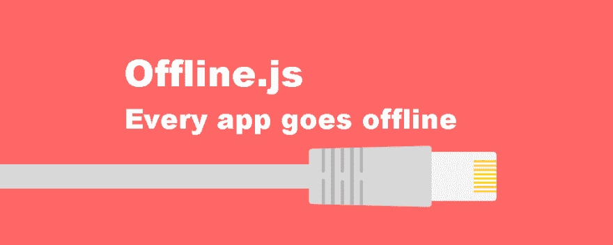

# 用 Javascript 保持离线工作

> 原文：<https://dev.to/arojunior/keep-working-offline-with-javascript-1n33>

[T2】](https://res.cloudinary.com/practicaldev/image/fetch/s--17cpuoI0--/c_limit%2Cf_auto%2Cfl_progressive%2Cq_auto%2Cw_880/https://cdn-images-1.medium.com/max/1000/1%2AUk_l410QQJjs_JH1gUwikw.png)

*注:原文是葡萄牙语，由谷歌翻译*

让我们以一个消息交换系统为例，在这个系统中，你发送的每一条消息都存储在一个数据库中，以便以后向某人显示。可能是聊天。

现在，让我们想象一下，你正在手机上使用这个系统，由于与运营商的连接不良，你的连接正在遭受振荡…在这种情况下，你的一些信息可能无法送达。

最近我知道了 [Offline-js](https://github.com/hubspot/offline) lib，它监视你的连接状态，在掉线的情况下发出警报，当它返回时发出警报，还监视 ajax 请求，并在连接返回时尝试重新发送它们。

它还承诺以一种“自动的”方式做一切事情，你只需要导入库就行了。起初我认为它很漂亮，这正是我解决应用程序中的问题所需要的。

但它并不完美。当我开始用这个库测试时，错误开始出现…我去搜索问题，有更多的人有类似的问题，但是没有人回答问题！也有许多带有修复的拉请求，但没有人接受。

所以我决定把它作为一些特性的依赖，自己实现:

 ***   承诺支持(axios)
*   使用*本地存储*来保存请求
*   保存所有失败的请求，而不仅仅是最后一个
*   即使用户在脱机状态下尝试刷新页面，请求也会保存
*   连接恢复后立即发送所有请求
*   不需要配置

使用案例:**