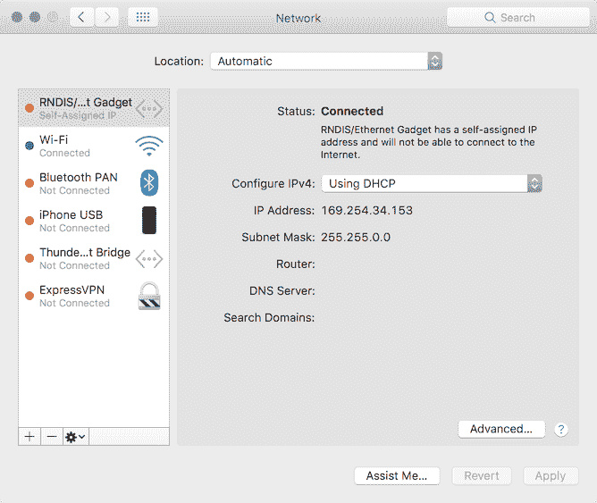
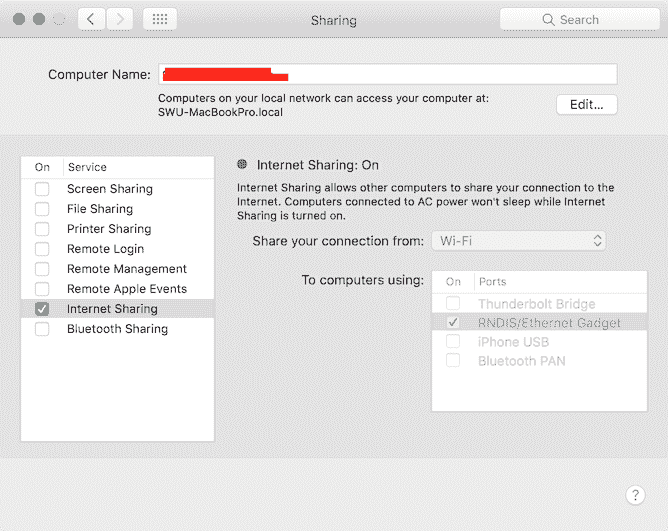

# macOS 上的 Raspberry Pi Zero W 无头设置

> 原文：<https://dev.to/brandonb927/raspberry-pi-zero-w-headless-setup-on-macos-3kb7>

最近我买了一台 RaspberryPi Zero W，几年前我后悔在 2013 年卖掉了我的 RaspberryPi B 板。下面是我为了把它连上互联网所经历的考验和磨难的记录。

这种设置不需要显示器或外部键盘，甚至不需要我买的 OTG USB 线，因为我认为我需要它。

## 先决条件

如果你正在阅读这篇文章，你可能是来学习如何让 rPi Zero W 运行 Raspbian 并无线连接到互联网。要做到这一点，你需要几样东西:

1.  一份[拉斯扁杰西建兴的图像](https://www.raspberrypi.org/downloads/raspbian/)
2.  一张 8GB+的 MicroSD 卡(以及将它插入你的计算机以便将图像存入其中的某种方法)
3.  微型 USB 电缆(将 rPi 临时插入电脑)
4.  一个 2.4Ghz 的 wifi 接入点(rPi Zero W 不支持 5Ghz，这是我费了好大劲才知道的😞)

如果你拥有所有这些东西，那太好了！如果没有，请在 BuyAPi 上快速订购所有零件，并继续操作，就像手头有这些零件一样。

## 准备 SD 卡

我已经在 macOS 上运行了这些命令，所以在 Windows/Linux 上的运行情况可能会有所不同。将 SD 卡插入你的电脑，一旦安装好，你会想从终端卸载它来刷新它。

要卸载驱动器并准备写入映像，请运行以下命令:

```
sudo df -h # Use the output of this to determine <diskname> in the next command
sudo diskutil unmount /dev/<diskname> 
```

Enter fullscreen mode Exit fullscreen mode

如果前面的命令完成了，您就有了一个可以将 Raspbian 映像复制到其中的驱动器！

## 将图像写入 SD 卡

运行以下命令，开始将图像写入 SD 卡:

```
sudo dd bs=1m if=/path/to/raspbian-jessie-lite.img of=/dev/rdisk2
# Where disk2 is the number of the disk from earlier 
```

Enter fullscreen mode Exit fullscreen mode

根据 SD 卡的大小，上面的命令应该只需要几分钟。完成后，你需要做一些事情。

首先打开您的终端并运行`touch /Volumes/boot/ssh`。当我们用 USB 电缆连接驱动器时，驱动器根目录中的这个空文件将在第一次引导时启用 SSH。

接下来，在新的一行中将`dtoverlay=dwc2`追加到`/Volumes/boot/config.txt`文件的末尾。

最后，打开`/Volumes/boot/cmdline.txt`并在`rootwait`条目后插入`modules-load=dwc2,g_ether`，遵循与文件其余部分相同的空格分隔模式。

完成上述步骤后，再次从终端卸载驱动器，将其插入 rPi，并将 USB 电源线连接到主板。

## 第一次引导进入 OS

给 rPi 大约 60 秒的时间来启动，然后将另一根 USB 电缆从 OTG 端口连接到您的计算机。

连接后，打开`System Preferences -> Network`，您会注意到列表中添加了一个新的`RNDIS/Ethernet Gadget`网络适配器。它可能会显示一个`169...` IP 地址，所以你现在需要前往`System Preferences -> Sharing`为`RNDIS/Ethernet Gadget`适配器启用“互联网共享”。

确保选中正确的复选框，如下图所示:

<source>
[](https://res.cloudinary.com/practicaldev/image/fetch/s--N6TWFSYM--/c_limit%2Cf_auto%2Cfl_progressive%2Cq_auto%2Cw_880/https://dc1r9kxqg42ml.cloudfront.net/brandonb.ca/posts/raspberry-pi-zero-w-headless-macos/network-adapters.png)

<source>
[](https://res.cloudinary.com/practicaldev/image/fetch/s--nxXVEDob--/c_limit%2Cf_auto%2Cfl_progressive%2Cq_auto%2Cw_880/https://dc1r9kxqg42ml.cloudfront.net/brandonb.ca/posts/raspberry-pi-zero-w-headless-macos/network-configuration.png)

一旦您可以通过本地网络访问 rPi，您就可以通过 ssh 使用:

```
ssh pi@raspberrypi.local 
```

Enter fullscreen mode Exit fullscreen mode

## 宋承宪进入 RaspberryPi

一旦你通过 ssh 进入 rPi，你就可以设置 wifi，这样就不再需要通过 USB 连接了。

为了获得正确的 wifi 配置，使用您的 SSID 运行`wpa_passphrase`实用程序，它会询问您的密码:

```
wpa_passphrase "SSID HERE"
# You will be prompted to enter your password.
# The utility should generate something like:
# network={
# ssid="SSID"
# #psk="PASSWORD"
# psk=...
# } 
```

Enter fullscreen mode Exit fullscreen mode

**注意**:如果你的定制 wifi 设置不是 WPA2-PSK/TKIP 加密网络，你将需要对`wpa_supplicant`的[配置值](https://linux.die.net/man/5/wpa_supplicant.conf)做一些研究！

将上述命令的输出复制到`/etc/wpa_supplicant/wpa_supplicant.conf`文件中，并覆盖`network={...}`部分中的内容。

```
sudo nano /etc/wpa_supplicant/wpa_supplicant.conf 
```

Enter fullscreen mode Exit fullscreen mode

粘贴输出后，保存并退出文件。`wpa_supplicant`应该会发现文件的更改并自动连接到 wifi。

您可以通过在 SSH 会话中运行 rPi 上的`sudo ifconfig wlan0`来确认您的 rPi 已连接到您的 wifi。在输出中，查找应该显示 ip 地址的`inet addr:...`。如果这看起来是正确的，那么您的 rPi 连接到您的 DHCP 服务器/路由器。

另一种方法是在浏览器中检查路由器本身的 GUI，查看路由器是否向 rPi 发出了 IP 地址。

## 更新系统

一旦你连接到 wifi，你应该做的第一件事就是更新`apt-get`和升级 Raspbian，因为在创建图像和你把它安装到你的 rPi 之间无疑有一些安全包。

```
sudo apt-get update -y
sudo apt-get upgrade -y
sudo apt-get dist-upgrade -y 
```

Enter fullscreen mode Exit fullscreen mode

* * *

一旦你完成了上面的步骤，你现在应该有一个功能正常的 RaspberryPi Zero W 连接到互联网和 ssh'able！

### 设置后可选要做的事情

*   [设置 MOTD](https://github.com/gagle/raspberrypi-motd)
*   安装[我的天啊](https://github.com/robbyrussell/oh-my-zsh)
*   安装〔t0〕nodejs〔t1〕

### 资源

*   [http://blog.gbaman.info/?p=791](http://blog.gbaman.info/?p=791)
*   [https://www . raspberrypi . org/documentation/configuration/wireless/wireless-CLI . MD](https://www.raspberrypi.org/documentation/configuration/wireless/wireless-cli.md)
*   [http://blog . rem melt . com/2017/03/20/easy-headless-setup-for-raspberry-pi-zero-w-on-OS x/](http://blog.remmelt.com/2017/03/20/easy-headless-setup-for-raspberry-pi-zero-w-on-osx/)