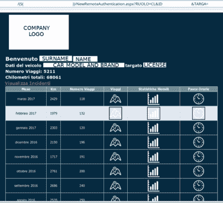
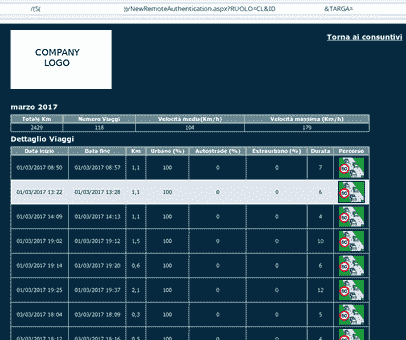
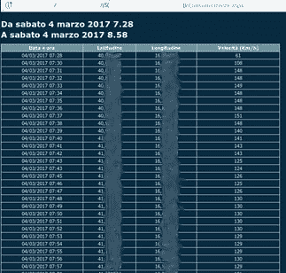
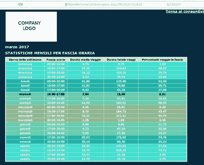

# 我的汽车保险如何暴露了我的位置

> 原文：<https://dev.to/ilpianista/how-my-car-insurance-exposed-my-position-16ko>

正如许多汽车保险公司所做的那样，我的汽车保险公司提供了一种卫星设备，可以放在你的车内，随时随地提供它的位置。

通过在你的车上安装这种设备，汽车保险当然可以记录你的行为，但如果你的车被盗，它也可以帮助警察找到你的车，你可能会得到保险价格的优惠(甚至高达 40%！).长话短说:我有一个。

通常这类公司还会为智能手机提供一个“应用程序”，以便在你不在的时候轻松跟踪你的汽车，或者监控你的伴侣……我的(公司！)有。

然后我下载了我公司的 Android 应用程序，但不幸的是，它需要 Google Play 服务才能运行。我是一个 FLOSS 的传播者，因此，我尽量只使用 FLOSS 应用程序，不使用 gapps。

幸运的是，我也是一名开发人员，因此，我尝试开发我最需要的应用程序；使用 [mitmproxy](https://mitmproxy.org/) ，我开始分析 App 用来编写自己客户端的 API。

## 认证

一旦应用程序启动，你需要验证自己，以启用按钮，让你跟踪你的汽车。很公平。

认证表单首先要求您的纳税人代码；我把我的放在引擎盖下，它执行以下请求:

```
curl -X POST -d 'BLUCS§<taxpayers_code>§-1' http://<domain>/BICServices/BICService.svc/restpostcheckpicf<company> 
```

Enter fullscreen mode Exit fullscreen mode

Web 服务回复一个手机号码(WTF？):

```
2§<international_calling_code>§<cell_phone_number>§-1 
```

Enter fullscreen mode Exit fullscreen mode

等等。我们在这里已经看到了什么？是的，除了有史以来最丑陋的格式和请求使用普通 HTTP 的事实之外，只需要 3 个参数就可以得到一个手机号码？你猜怎么着？第一个和第二个是两个常数。事实上，如果我们放入一个不存在的纳税人代码，通过保持相同的值，我们得到:

```
-1§<international_calling_code>§§-100% 
```

Enter fullscreen mode Exit fullscreen mode

…否则**我们将获得给定纳税人代码的手机号码**！

我撞了头，我继续认证流程。

之后，该应用程序要求我确认它获得的手机号码仍然有效，但它还想要我在订阅车险时通过邮件获得的密码；好，我们继续:

```
curl -X POST -d 'BLUCS§<taxpayers_code>§<device_imei>§<android_id>§<device_brand>-<device_model>_unknown-<api_platform>-<os_version>-<device_code>§<cell_phone_number>§2§<password>§§-1' http://<domain>/BICServices/BICService.svc/restpostsmartphoneactivation<company> 
```

Enter fullscreen mode Exit fullscreen mode

Web 服务的响应是:

```
0§<some_code>§<my_full_name> 
```

Enter fullscreen mode Exit fullscreen mode

*some_code* 参数每次都会改变，所以它看起来像是一个“注册 id ”,但在这一步之后，应用程序会解锁按钮来跟踪我的汽车。

在这一点上我已经很惊讶了:认证是如何工作的？reach request 需要这个 *some_code* 结合我的密码吗？或者也许它会问我的纳税人代码？

## 汽车追踪

我开始实现汽车跟踪功能，这允许检索您汽车的最后 20 个位置，所以让我们分析应用程序发出的请求:

```
curl -X POST -d 'ASS_NEW§<car_license>§2§-1' http://<domain>/BICServices/BICService.svc/restpostlastnpositions<company> 
```

Enter fullscreen mode Exit fullscreen mode

Web 服务的响应是:

```
0§20§<another_code>§DD/MM/YYYY HH:mm:SS#<latitude>#<longitude>#0#1#1#1-<country>-<state>-<city>-<street>§DD/MM/YYYY HH:mm:SS#<latitude>#<longitude>#0#1#1#1-<country>-<state>-<city>-<street>§DD/MM/YYYY HH:mm:SS#<latitude>#<longitude>#0#1#1#1-<country>-<state>-<city>-<street>§DD/MM/YYYY HH:mm:SS#<latitude>#<longitude>#0#1#1#1-<country>-<state>-<city>-<street>§DD/MM/YYYY HH:mm:SS#<latitude>#<longitude>#0#1#1#1-<country>-<state>-<city>-<street>§DD/MM/YYYY HH:mm:SS#<latitude>#<longitude>#0#1#1#1-<country>-<state>-<city>-<street>§DD/MM/YYYY HH:mm:SS#<latitude>#<longitude>#0#1#1#1-<country>-<state>-<city>-<street>§DD/MM/YYYY HH:mm:SS#<latitude>#<longitude>#0#1#1#1-<country>-<state>-<city>-<street>§DD/MM/YYYY HH:mm:SS#<latitude>#<longitude>#0#1#1#1-<country>-<state>-<city>-<street>§DD/MM/YYYY HH:mm:SS#<latitude>#<longitude>#0#1#1#1-<country>-<state>-<city>-<street>§DD/MM/YYYY HH:mm:SS#<latitude>#<longitude>#0#1#1#1-<country>-<state>-<city>-<street>§DD/MM/YYYY HH:mm:SS#<latitude>#<longitude>#0#1#1#1-<country>-<state>-<city>-<street>§DD/MM/YYYY HH:mm:SS#<latitude>#<longitude>#0#1#1#1-<country>-<state>-<city>-<street>§DD/MM/YYYY HH:mm:SS#<latitude>#<longitude>#0#1#1#1-<country>-<state>-<city>-<street>§DD/MM/YYYY HH:mm:SS#<latitude>#<longitude>#0#1#1#1-<country>-<state>-<city>-<street>§DD/MM/YYYY HH:mm:SS#<latitude>#<longitude>#0#1#1#1-<country>-<state>-<city>-<street>§DD/MM/YYYY HH:mm:SS#<latitude>#<longitude>#0#1#1#1-<country>-<state>-<city>-<street>§DD/MM/YYYY HH:mm:SS#<latitude>#<longitude>#0#1#1#1-<country>-<state>-<city>-<street>§DD/MM/YYYY HH:mm:SS#<latitude>#<longitude>#0#1#1#1-<country>-<state>-<city>-<street>§DD/MM/YYYY HH:mm:SS#<latitude>#<longitude>#0#1#1#1-<country>-<state>-<city>-<street> 
```

Enter fullscreen mode Exit fullscreen mode

WTH？！？没有标题？！？没有饼干吗？！？没有认证参数？！？

是的，你的假设是正确的:**你只需要一张汽车牌照，你就可以得到它的最后 20 个位置**。还有那个*又是什么 _ 代号*？我只是暂时把它写下来。

这不可能是真的，我首先想到(希望)他们把我的 IP 地址存储在某个地方，所以我现在被授权获取这些数据，所以让我们从 VPN 尝试一下…哦，该死，成功了。

然后我用一张不存在的汽车执照试了试，我得到了:

```
-2§TARGA NON ASSOCIATA% 
```

Enter fullscreen mode Exit fullscreen mode

也就是说:“那辆车的牌照不在我们的数据库里”。

那么在 T2 嘎吱嘎吱声的帮助下，我们能得到什么呢？很简单:**该公司覆盖的汽车牌照列表**和**每个牌照最后 20 个位置**。

我现在不能停下来。

## Web 客户端

这家汽车保险公司还提供了一个允许更多操作的 Web 客户端，因此我登录并分析了它的请求，虽然它托管在不同的域上，而且它还对几乎所有请求使用 cookie，但它只对我以前使用的域执行一个请求。哪一个没有被认证并引起了我的注意:

```
curl http://<domain>/<company>/(S(<uuid>))/NewRemoteAuthentication.aspx?RUOLO=CL&ID=<another_code>&TARGA=<car_license>&CONTRATTO=<foo>&VOUCHER=<bar> 
```

Enter fullscreen mode Exit fullscreen mode

这封邮件回复了一个 HTML 页面，显示在 Web 客户端:

```
<!DOCTYPE HTML PUBLIC "-//W3C//DTD HTML 4.0 Transitional//EN" >
<HTML>
<HEAD>
    NewRemoteAuthentication
    <meta name="GENERATOR" Content="Microsoft Visual Studio .NET 7.1" />
    <meta name="CODE_LANGUAGE" Content="C#" />
    <meta name="vs_defaultClientScript" content="JavaScript"/>
    <meta name="vs_targetSchema" content="http://schemas.microsoft.com/intellisense/ie7" />
        <!--<meta content="IE=EmulateIE10" name="ie_compatibility" http-equiv="X-UA-Compatible" />-->
        <meta name="ie_compatibility" http-equiv="X-UA-Compatible" content="IE=7, IE=8, IE=EmulateIE9, IE=10, IE=11" />
</HEAD>
    <body>
    <form name="Form1" method="post" action="/<company>/(S(<uuid>))/NewRemoteAuthentication.aspx?RUOLO=CL&amp;ID=<another_code>&amp;TARGA=<car_license>" id="Form1">
<input type="hidden" name=" __VIEWSTATE" id="__ VIEWSTATE" value="/wEPDwULLTIwNzEwODIsJFNAgEPKAJDIeBsdSpc2libGVnZGRic5McHC9+DqRx0H+jRt5O+/PLtw==" />

            <iframe id="frm1" src="NewRicerca.aspx" width="100%" height="100%"></iframe>

<SCRIPT language="JavaScript">
<!--
self.close
// -->
</SCRIPT>
</form>
</body>
</HTML> 
```

Enter fullscreen mode Exit fullscreen mode

它包括一个 iframe(唉！)，但这才是有趣的地方！！！看:

[T2】](img/car_history.png)

从该页面中，您可以看到:

*   认购保险的人的全名；
*   汽车型号和品牌；
*   汽车行驶的总公里数；
*   汽车行驶的总次数(意思是“汽车正在移动”)；
*   访问几个月的旅行细节(旅行次数)；
*   访问一日游详细信息(纬度、经度、日期和时间)；
*   访问月统计数据(您使用汽车的频率)。

[](img/car_month_history.png)[](img/car_day_history.png)[](img/car_month_statistics.png)

自从安装卫星设备以来，这里有许多信息和这些统计数据是可用的**。**

请求没有被认证，所以我只需要理解要填充的参数。通常并不是所有的参数都是必需的，然后我试着通过删除某个人来找出哪些是真正需要的。事实证明，我可以将其简化为:

```
curl http://<domain>/<company>/(S(<uuid>))/NewRemoteAuthentication.aspx?RUOLO=CL&ID=<another_code>&TARGA=<car_license> 
```

Enter fullscreen mode Exit fullscreen mode

但是还有一个*另一个代码*在那里…嗯，等等，它看起来像是我之前记下的数字！而且没错，是！

所以，`http://<domain>/<company>/(S(<uuid>))/NewRicerca.aspx`是真正显示所有信息的页面，但是我如何生成 uuid 呢？

我试图删除它，然后我得到了一个空白的页面。当然，有道理，页面怎么会知道我在找什么数据呢？

那么一定是*newremoteauthentication . aspx*页面做了什么；我再次尝试从该 url 中删除 uuid，令我惊讶的是，它将我重定向到同一个 url，但它也将 uuid 部分作为路径参数填充！现在我终于可以使用那个 uuid 调用 *NewRicerca.aspx* 并读取所有数据了！

## 结论

你只需要一张由该公司承保的汽车牌照，就可以实时获得该车的所有行程、车主的全名及其位置。

我向写信给该公司的 [CERT Nazionale](https://www.certnazionale.it/) 报告了这一隐私漏洞。

该公司通过提供使用认证调用的新 Web 服务端点，在 3 周后修复了漏洞。该公司向用户发送邮件，要求他们尽快更新应用程序。自从我第一次联系 CERT Nazionale 以来，旧的网络服务已经关闭了 1 个半月。

我可能是错的，但我怀疑隐私漏洞已经存在 3 年了，因为该应用程序的第一个 Android 版本使用了相同的 API。

我没有赏金。

该公司是远程信息处理解决方案的领先供应商。