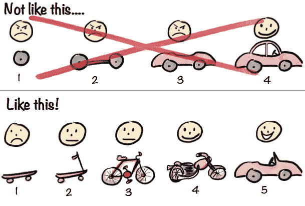

# React 入门:Angular 版

> 原文：<https://dev.to/sparkpost/getting-started-with-react-angular-edition>

在 SparkPost 这里，我们有一个[“单页 JavaScript 应用”](https://app.sparkpost.com/?_ga=2.237368064.1612284495.1494012498-302189911.1493655811)，它由大约 50，000 行 2015 年早期的 Angular 1.x 代码组成，分布在 400 多个文件中。不是小 app。正如你所期望的，在两年的时间里，我们已经非常熟悉 Angular 好的、坏的和丑陋的一面。Angular 2，已经在去年九月[作为“最终版”发布，看起来非常适合我们。但是这篇文章的标题已经泄露了这个秘密:我们很可能不会升级到 Angular 2。](https://blog.thoughtram.io/angular/2016/09/15/angular-2-final-is-out.html)

为什么不是 Angular 2？主要是因为迁移路径为考虑几乎任何其他东西提供了强有力的理由，也可能是因为 TypeScript，但老实说，这主要是因为尝试新事物很好。我们不是每隔几周或几个月就有一个新项目启动的机构，在那里我们可以测试我们最喜欢的命名巧妙的 JavaScript 库的最新 pre-alpha 版本。五万行代码变化很慢。但这时候“工具应用”出现了。

## 一个罕见的绿地项目

我们的团队被要求建立一套[电子邮件工具](https://tools.sparkpost.com/?src=Blog&pc=bl-dl-tools&utm_source=blog&utm_medium=social-media&utm_camp=tools&utm_content=rc-tools&_ga=2.30750399.1612284495.1494012498-302189911.1493655811)，这些工具不会存在于我们现有的应用程序中。这些“核心电子邮件工具”帮助开发人员进行深度电子邮件设置——我们已经为 [SparkPost 客户](https://pages.sparkpost.com/2016-Social-Bl-pricing.html?utm_source=blog&utm_medium=social-media&utm_campaign=dev&utm_content=lp-pricing&_ga=2.30750399.1612284495.1494012498-302189911.1493655811)处理了这种事情——所以我们希望他们在我们的登录之后拥有自己的空间。突然间，我们有了一个探索新事物的地方。

我们想出了一些重要的标准来衡量我们将用来构建这个新的应用程序:

*   它需要简单易学
*   它需要快速建造
*   它需要是我们可以公开建造的东西
*   它不需要有棱角
*   它需要的可能只是反应

作为一个团队，在仔细考虑了这些标准之后，我们做出了一个令人惊讶的决定，让 React 试一试。那时，我是我们团队的首席反应专家，因为我已经完成了关于这个主题的一门课程，所以我开始拼凑一些东西。

## 有些事情我们不小心做对了

我们已经设计并构建了应用程序的一小部分。很难低估一个设计好的、有风格的、被认可的工作原型的价值，哪怕只是你的应用程序的一小部分。本可以用来争论按钮位置和措辞的时间被用来解决如何让 React 应用上线的问题。

说到这里，我们用[创建了 React App](https://github.com/facebookincubator/create-react-app) 。想想“React 应用的 html 5 样板”，或者“React 应用的 Ember”CRA 为您提供了一个工作的 React 起点，包括所有的依赖项(实际上，它可能会下载所有的依赖项)和一个工作基线 Webpack 配置。同样，这让我们把注意力集中在我们实际构建的东西上。当你准备好了，CRA 让你“弹出”并控制整个设置。这太棒了，你应该使用它。

你还应该找一个能两者兼得的设计师。我说的两个意思是设计和理解反应。我知道这是一个非常不公平的建议，因为它似乎真的很难找到，但我们发现了这些神奇的独角兽之一，它们是无价的。(我刚才甚至查了“无价”这个词，以确认它的意思是真的非常有价值。)如果可以，优先为你的团队雇佣这种人。(谢谢你这么棒，[乔恩](https://twitter.com/jonambas)。)

我们还在早期决定仅使用 setState / local state 构建应用程序，即无 Flux、无 Redux 等。我们最终添加了 Redux——另一次的另一个主题——但从一个简单的 React 应用程序开始可以更容易地让新开发人员一次掌握许多事情。更不用说，等待 Flux 还能让你决定是否真的需要它。

根据我们的初次体验，我还会推荐一些其他的东西:

*   使用 [Jest](https://facebook.github.io/jest/) 进行测试。Jest 带有 Create React 应用程序，尽管在我们所有的其他项目中都是 100%的摩卡/Chai，但我们很难否认 Jest 有多棒。值得注意的是，令人惊叹的 Jest CLI 和[快照测试](https://facebook.github.io/jest/docs/snapshot-testing.html)对我们来说都是特别有用的补充。
*   使用开发工具。有 React 用的( [Chrome](https://chrome.google.com/webstore/detail/react-developer-tools/fmkadmapgofadopljbjfkapdkoienihi) 、 [Firefox](https://addons.mozilla.org/en-US/firefox/addon/react-devtools/) )还有专门给 Redux 用的如果用的话。它们是免费的，运行良好，非常有用。
*   找一群你信任的人，向他们请教，按他们说的做。我很幸运在我们当地的 meetup 群组( [CharmCityJs](http://charmcityjs.com/) )和纽约 JavaScript 社区(BoroJS)中有朋友，这两个社区都有活跃的 Slack 团队。能够问“人们用什么来代表 x？”帮了很大的忙，因为真的，你只需要选择一些东西。相信别人是一个很好的理由。

## 五万行代码变化缓慢

那么那个 5 万线角 app 呢？我们不会把它移植到 React 上，至少不会直接移植，它也不可能永远作为 Angular 1.x 应用程序存在。但是当我逐渐熟悉 React 时，我注意到一件有趣的事情:在某些方面，它与 Angular 没有太大的不同。这里有一个角度 1.5+分量:

```
const template = `<div>
  <h1>{{ "{{ banner.message " }}}}</h1>
  <button ng-click="banner.update()">Update message</button>
</div>`

class BannerCtrl {
  constructor() {
    this.message = 'Some default message'
  }

  update() {
    this.message = 'New message'
  }
}

export default angular.module('bannerComponent', [])
  .component('banner', {
    template,
    controller: BannerCtrl,
    controllerAs: 'banner'
  }) 
```

Enter fullscreen mode Exit fullscreen mode

如果您假设模板字符串是某个 JSX，并且它是从控制器的 render 方法返回的，那么您基本上就有了一个 React 组件(至少在结构上)。因此，我们的计划是专注于模式，而不是试图将 400 个文件的老派、大控制器角度代码拖进一个新的框架。特别是“小的、集中的组件”和“单向数据流”的模式。我将在后面关于我们使用 Redux 的冒险的帖子中更多地讨论第二部分，但是将我们巨大的控制器重构为小角度的组件有两个大优势:

1.  反应不是永远的。任何大型应用程序的重写/重构都需要一段时间，如果你没有注意到的话，JavaScript 生态系统移动得相当快。通过专注于重构我们现有的应用程序来使用更好的模式，我们让它准备好迁移到当时发生的最佳解决方案，当我们最终处于更好的状态来进行迁移时。

2.  迭代、增量开发是危险的。关于“敏捷开发”应该如何工作，我最喜欢的图片之一是 Henrik Kniberg 从 Spotify 演示中绘制的一幅图，解释了如何以富有成效的方式进行迭代。你可能以前见过:

[T2】](https://res.cloudinary.com/practicaldev/image/fetch/s---NlXbgn4--/c_limit%2Cf_auto%2Cfl_progressive%2Cq_auto%2Cw_880/http://blog.crisp.se/wp-content/uploads/2016/01/Making-sense-of-MVP-.jpg)

如果我们花了 6 到 9 个月或者更长的时间试图在 React 中重写应用程序，但没有成功，时间不够，或者工作被搁置，我们最终一无所获。但是对于重构优先的计划，我们最终得到的最糟糕的东西是一个更好、更易维护的 Angular 应用程序。换句话说，这是一个简单的决定。

## 棱角分明，反应过来，Kumbaya

不骗你，我们在 React/Redux 中构建我们的[新工具应用](https://github.com/sparkpost/tools-ui)时获得了很多乐趣。这是一个很棒的图书馆，有一个奇妙的生态系统和许多好的模式。不过说实话，我们的 Angular app 已经可以用了，这也没什么。如果你在维护一个大型的遗留应用，请记住:

*   寻找小的绿地项目，在那里你可以用新的工具建造一些东西。
*   关注模式，并找出如何将这些模式整合到您的遗留应用程序中，而不必重写全部内容。

正如我之前提到的，我们是在开放的环境下开发的，所以你可以随意查看代码和 T2 直播应用本身。如果你来自 Angular 应用，我写了一堆关于学习 React 的[笔记，可能对你也有帮助。如果你对这篇文章感兴趣，请经常回来看看，因为我们会继续写更多关于 Angular、React 和前端开发的冒险经历。如果您有任何问题，或者您想了解任何其他具体信息，请告诉我们！](https://github.com/jasonrhodes/how-to-react)

这个帖子最初是由 [SparkPost](https://www.sparkpost.com/blog/react-angular-edition/) 发布的。