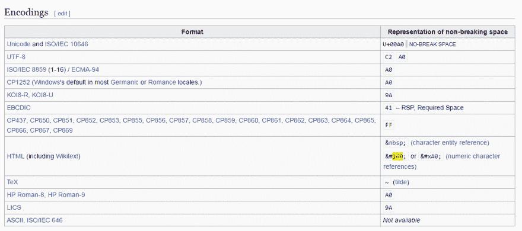
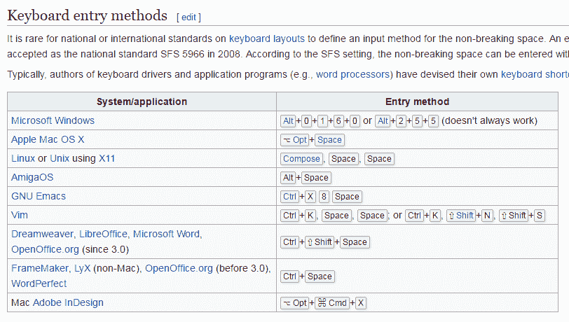

# 当空白变成了野兽

> 原文:[https://dev . to/atrandafir/when-the-white-space-been-a-beast](https://dev.to/atrandafir/when-the-white-space-became-a-beast)

*本文最初发布于 [HeavyDots 博客 _](http://heavydots.com/blog/when-the-white-space-became-a-beast)T3*

## 留白的传说

时不时地，在万维网上，有人会遇到“空白”或者对我们来说:“野兽”。

当我们遇到野兽时，它让我们疯狂，我们害怕，我们无法理解我们的眼睛所看到的，我们无法解释发生了什么，我们想知道是否有什么影响了我们的感知。一种超自然现象就在我们眼前，让我们不知所措。

*   [这是什么疯癫的空间人物？？？(谷歌浏览器)](http://stackoverflow.com/questions/26962323/what-is-this-insane-space-character-google-chrome)
*   [字符串中怪异的空格字符，那不是空格吗？](http://stackoverflow.com/questions/15565479/weird-space-character-in-string-thats-not-a-space)
*   [怪异的空白字符- utf8 PHP](http://stackoverflow.com/questions/7262687/weird-white-space-characters-utf8-php)
*   [字符串中有一个奇怪的空格字符](http://stackoverflow.com/questions/12733113/i-have-a-strange-space-character-in-a-string)

我们还吵了两次架！一次在网站上，一次甚至在 Excel 表格中！这种生物召唤的地方令人难以置信，它到达那里的方式更是一个谜！

## 勇往直前的人

有些人放弃了，跑了，躲了起来。或者只是接受它而不质疑它的存在。但其他人，勇敢的人，开始了穿越黑暗的旅程，直到他们知道真相才放弃。

这是一个经历过并且幸存下来的人(用颤抖的手)承认的:

> 对于将来像我这样从高层次一直到字符代码都要调试这个程序的人，我向你们致敬。
> 
> [克莱顿-2016 年 9 月 1 日 21:22-stackoverflow.com](http://stackoverflow.com/questions/26962323/what-is-this-insane-space-character-google-chrome/39281063#39281063)

我们也去过那里，我们带着真相回来，准备与你们分享。

## 生物长什么样，从哪里来

奇怪的空间实际上是 HTML 编码人员非常熟悉的`&nbsp;`实体([维基百科](https://en.wikipedia.org/wiki/Non-breaking_space))，但在这种情况下，它没有用 HTML 表示/编码。

所以基本上我们大多数人都知道这种生物，但我们不知道它可以以另一种形状和维度存在。

### 维基百科解释了野兽的不同表述:

[T2】](https://res.cloudinary.com/practicaldev/image/fetch/s--EA5nY8ju--/c_limit%2Cf_auto%2Cfl_progressive%2Cq_auto%2Cw_880/http://heavydots.com/uploads/blog-post/12-featured-wikipedia%2520nbsp%2520encodings.png)

### 还有生物是如何诞生和变异的:

[T2】](https://res.cloudinary.com/practicaldev/image/fetch/s--pH89XMek--/c_limit%2Cf_auto%2Cfl_progressive%2Cq_auto%2Cw_880/http://heavydots.com/uploads/blog-post/12-featured-wikipedia%2520nbsp%2520keyboard%2520entry%2520methods.png)

## 找到它并摆脱它的工具和技巧

对于更勇敢的人来说，我们有一些工具和技术可以帮助他们找到它，并在旅途中活着回来。

### 在网页代码中查找的 Web 工具:

这里有一个带有网络界面的工具，你可以输入一个 URL，它会搜索该页面的内容，以便找到野兽:

[http://tools.heavydots.com/nbsp-space-char-detect/](http://tools.heavydots.com/nbsp-space-char-detect/)

### 手动清理技术:

但是，如果你发现自己处于黑暗代码空间，无法使用网络，并且你必须非常接近野兽才能杀死它，这里有一种方法可以驱除你被妖魔化的代码:

只针对熟练使用 PHP 法术的人，运行一个`chr(194).chr(160)`的搜索，换成一个普通的空格。这将提取出它的恶魔，并将恢复其干净的白色空间的灵魂。

带上这个卷轴，里面有你面对野兽时需要的咒语:

```
// Define the white beast
$white_beast=chr(194).chr(160);

// Count how many of them are living in your text
$count=substr_count($string, $white_beast);
print_r($count);

// Replace it with a normal space
$string=str_replace($white_beast, ' ', $string); 
```

## 故事的结尾

所以亲爱的读者，如果你从未面对过野兽，请小心！

但是如果你也不得不面对它，请在评论区和我们分享你的故事！

我会试着在这里发布新的东西，同时也邀请你访问 [HeavyDots 博客](http://heavydots.com/blog/)