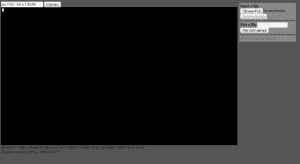

# ESP8266 上的 MicroPython web repl

> 原文：<https://dev.to/kenwalger/micropythons-webrepl-on-the-esp8266>

NodeMCU ESP8266 设备内置了 WiFi。这允许我们通过它自己的网络连接到设备来运行命令。我在[这篇文章](https://www.kenwalger.com/blog/iot/micropython-and-nodemcu-esp8266/)中讲述了如何通过串口连接到支持 MicroPython 的 [NodeMCU](https://www.amazon.com/gp/product/B01N0B48NI/ref=as_li_tl?ie=UTF8&tag=kenwalgersite-20&camp=1789&creative=9325&linkCode=as2&creativeASIN=B01N0B48NI&linkId=dc1e9f82e2beb42bca36616a22b8820d) 设备。现在我想看看如何利用 MicroPython 与 ESP8266 设备配对所允许的另一个访问特性，即 WebREPL。

WebREPL 是用于读取-评估-打印循环(REPL)的基于 web 的接口，它允许以与终端 REPL 相同的方式在 ESP8266 上运行命令。然而，由于它是通过无线网络连接完成的，因此它为访问提供了一些额外的自由。当然，让设备在网络上运行也会带来一些潜在的安全问题，但我们会在另一篇文章中讨论这些问题。

### 启用 WebREPL

首先，让我们假设 MicroPython 运行在一个 ESP8266 设备上，并且您有一个到该设备的串行连接。再一次，看看我的帖子[这里](https://www.kenwalger.com/blog/iot/micropython-and-nodemcu-esp8266/)为那走一遍。假设在撰写本文时，您已经用最新版本的 MicroPython(版本 1.8.7)刷新了 ESP8266，那么必须通过串行接口启用 WebREPL。这是从命令提示符执行的一行命令:

```
import webrepl_setup

```

输入该命令将产生一系列安装提示，询问您是否希望在引导时启用 WebREPL，为 WebREPL 设置密码，并确认重新引导设备以激活更改。

### 连接到网络

系统重启后，你可以通过 WiFi 连接到设备。这是这些设备的一个简洁的功能，如果主板没有连接到无线接入点，它会为我们创建一个。人们可以通过我们的电脑或其他无线设备连接到它。寻找一个名为 **MicroPython-** *的广告 WiFi 网络。**将是每台设备独有的一组字母和数字。***

 ***### 设置密码

选择设备的网络后，您将需要一个密码。接入点的网络密码是—**micropythoN**(注意最后一个字母的大写)。然后你应该连接到设备的网络，祝贺你！

现在，在许多情况下，人们可以简单地在浏览器中浏览设备的 IP 地址，并获得某种形式的网页，如我们的 WebREPL 界面。请记住，我们在这里处理的是一个内存有限的设备，因此没有实际的网页。相反，它提供了一个方便的 websocket 接口，可以与 WebREPL 客户端一起使用。您可以在下面下载:

[T2】](https://github.com/micropython/webrepl/archive/master.zip)

下载并解压后，你会想在 Chrome 或 Firefox(WebREPL 目前支持的浏览器)中打开`webrepl.html`,你会看到一个类似如下的屏幕:

[T2】](https://www.kenwalger.com/blog/wp-content/uploads/2017/05/webrepl-screenshot.png)

当您的计算机连接到 MicroPython 网络上的设备并使用默认 IP 地址和端口—**ws://192 . 168 . 4 . 1:8266**时，您可以选择 *Connect* 按钮来启动 WebREPL 会话。

您应该会看到一个输入密码的提示，这个密码是您之前在设备上启用 WebREPL 服务后设置的。登录设备后，您就可以像通过串行连接一样访问 REPL。

恭喜你！您刚刚使用 MicroPython 将 NodeMCU ESP8266 连接到无线网络。这个任务不算太可怕，对吧？

* * *

 *在 Twitter [@kenwalger](https://www.twitter.com/kenwalger) 上关注我，获取我在 MicroPython 和 IoT 上发布的最新消息，或者在我的[博客](https://www.kenwalger.com/blog)上查看原始帖子。让我知道你如何在你的物联网项目中使用 MicroPython。****