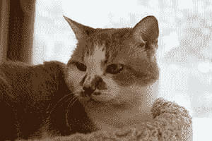
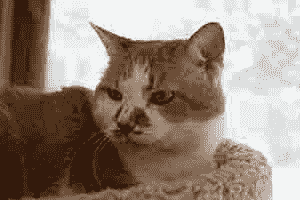

# 社交媒体降低了照片质量

> 原文：<https://dev.to/svijaykoushik/social-media-reduces-quality-of-photos-8jb>

# 数据压缩:社交媒体如何改变你的照片质量

在这个世界上，智能手机拥有双摄像头，可以精确地拍摄高质量的照片，如何即时分享这些图像？我们都知道图片的质量越高，它的文件就越大。那么，我们如何在一眨眼的时间内分享兆字节的数据呢？

像脸书、WhatsApp、Hike、Hangouts、Snapchat 这样的社交网络应用，或者任何你智能手机里的社交网络应用，都使用一种叫做数据压缩的技术。数据压缩是一种采用算法来减小文件大小的技术，方法是减少冗余，或者有选择地删除图像中我们肉眼看不到的某些部分，有时两者并用。

第一种技术通常称为无损压缩，它识别图像中的冗余部分，并删除冗余数据，保留必要的数据。例如，在一张穿着黑色衬衫的人的照片中，黑色衬衫有多余的黑色像素(组成数字图像的微小正方形点)。该算法检查衬衫由多少个黑色像素组成，假设它包含 2000 个像素，那么该算法会将衬衫的数据存储为 2000 个黑色像素，而不是 1，2，…..，2000 像素。通过这种方式，它减少了图片的大小，而没有质量损失。通过这种技术可以将压缩图像重建为其原始形式。

[T2】](https://res.cloudinary.com/practicaldev/image/fetch/s--gGyPi1Tj--/c_limit%2Cf_auto%2Cfl_progressive%2Cq_auto%2Cw_880/https://thepracticaldev.s3.amazonaws.com/i/p9jtomzfdsbxj1ij4s9c.jpg)

Image with low compression.

Image with high compression.

另一方面，被称为有损压缩的第二种技术有选择地去除图像的一部分，这种方式直到近距离观察时我们的眼睛才注意到。想象一个装满宝石糖果的容器。如果我的小弟弟从里面拿走了 5 颗糖果，我不会注意到任何变化，除非我数出盒子里的糖果数量。因此，类似地，该算法从图片中移除微小的细节，如我鼻子上的细毛，以减小尺寸。当高度压缩时，有时会出现明显的图像质量损失。这种可见的质量损失被认为是对减少数据流量的牺牲。使用有损压缩时，丢失的细节将永远丢失。与无损压缩不同，在有损压缩中不能重构原始图像。

JPEG 和 PNG 等常见格式的图像是令人惊讶的预压缩图像。他们使用有损压缩算法进行压缩。这些标准是为数据的移动性而实施的。正常情况下，高清图像需要 5 MB 到 10 MB，甚至更多，这取决于相机。共享时，这些图片会被压缩到原始大小的 5%左右。想象一下，每当你分享一张照片时，你需要从你有限的互联网包中花费多少数据，以及上传这些照片的漫长等待时间。以及脸书需要多少额外的土地来存放这些自拍照。

所以，下次你上传一张完美的自拍照到脸书或 Instagram 时，应该庆幸人们看不到你鼻子上的毛孔。

