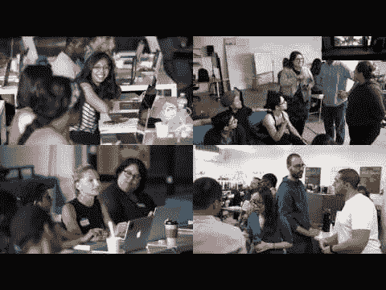

# 嗨，我是安娜·马

> 原文：<https://dev.to/anama118118/hi-im-ana-ma>

我已经编码一年了。

你可以在推特上找到我，我的名字是 [@anama118118](https://twitter.com/anama118118)

我住在纽约。

我主要用这些语言编程:Swift。

我目前正在了解更多关于推送通知的信息。

很高兴见到你。

[T2】](http://www.youtube.com/watch?feature=player_embedded&v=D08l0X4W-dU %0A)