# 整理排序算法背后的基础知识

> 原文:[https://dev . to/vaidehijoshi/sorting-out-the-basics-behind-sorting-algorithms](https://dev.to/vaidehijoshi/sorting-out-the-basics-behind-sorting-algorithms)

<figure> 

<figcaption>所有的排序算法，没有任何使人衰弱的恐惧！</figcaption>

</figure>

到目前为止，我们已经在本系列中介绍了一整套数据结构(完全是双关语),到目前为止，我真的很喜欢探索程序员和他们构建的软件依靠这些结构来帮助他们解决有趣问题的所有不同方式。但是今天的帖子很特别，因为我们终于要进入一些更科学的东西了(如果我们可以称之为科学的话)，这些东西构成了计算机科学的世界。

好吧，我不会给你太大的压力。让我们开门见山吧。我们将最终进入*算法*——万岁！在接下来的几周里，我将深入研究计算机科学中使用的一些最常见和被广泛引用的算法。

如果你没有计算机科学背景(或者你是编程新手)，深入研究算法的前景可能听起来很糟糕。或者可能完全是可怕的。但是不要害怕——我们会一起度过这个难关，作为算法专家从整个经历中走出来！所以让我们先从最基本的东西开始。即:究竟是什么算法？我们将会学到很多关于它们的知识，所以我们可能已经有了明确的定义，对吗？

好吧，事实证明，算法是一个带有坏名声的花哨名字。它们远没有听起来那么可怕。一个 ***算法*** 只是一个花哨的术语，用来描述一个程序应该做什么，以及应该如何做的一组指令。换句话说:它只不过是*你的代码*的手册。就是这样。(真的！)在软件世界中，一些被引用最多的算法通常是排序算法的子集，或者是为程序或系统如何组织一组数据提供一组指令的算法。

### 为什么要整理自己？

在我们进入算法可以对数据进行排序的不同方式之前，对我们来说重要的是，在计算机科学的背景下，准确地掌握排序是什么，以及它为什么如此重要。

在我们的日常生活中，我们都不得不处理排序不同项目的一些变化。例如，我最近搬家了，尽管我认为我把所有的东西都打包得很好，但还是有很多东西相当杂乱无章。我有一堆手稿形式的文件和文字，我匆忙地把它们扔进了搬家箱。瞧，当打开包装的时候，所有的东西都乱七八糟，所有的页面都杂乱无章，非常糟糕。在开箱的过程中，我不得不手动按页码将它们分类。如果你读了足够多的关于排序算法的书，你会注意到排序一副卡片、排序书籍或者排序一组数字都是排序算法实现的常见例子。

<figure>[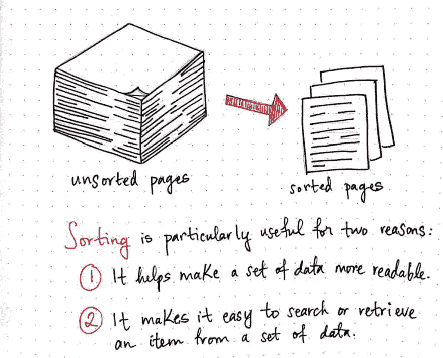](https://res.cloudinary.com/practicaldev/image/fetch/s--JlW6lZdR--/c_limit%2Cf_auto%2Cfl_progressive%2Cq_auto%2Cw_880/https://cdn-images-1.medium.com/max/1024/1%2AL60EX2jZXxZFkmGdQN13Dg.jpeg) 

<figcaption>排序特别有用有两个原因</figcaption>

</figure>

这些例子是我们的代码和应用程序中一直发生的事情的扩展！排序在计算机科学领域特别有用，原因有二:

1.  从严格的人类友好的角度来看，它使单个数据集更容易阅读。
2.  这使得实现搜索算法以便从整个数据集中查找或检索项目变得更加容易。

在我的例子中，在没有对我手稿中的所有页面进行分类的情况下，你可以想象试图在 200 页的混乱堆中找到一页是多么痛苦的经历。

所以，我想排序在实际的人类层面上是有意义的。但是为什么计算机会关心排序呢？他们做事很快，对吗？他们不需要东西像人一样易读。排序对他们有什么好处？

从计算机科学的角度来看，排序扮演着特别重要的角色，因为一台计算机、一个程序或一个应用程序需要搜索的数据集常常会非常庞大。就像，超越了大多数人真正能理解的，通过那种巨大的搜索！我们一会儿将回到这一点。

首先，让我们弄清楚当我们在计算机科学的背景下谈论排序时，我们*到底指的是什么。 ***排序*** 是将集合中一组相似的项目按某种属性进行组织。这里有两件重要的事情需要注意:*

<figure>[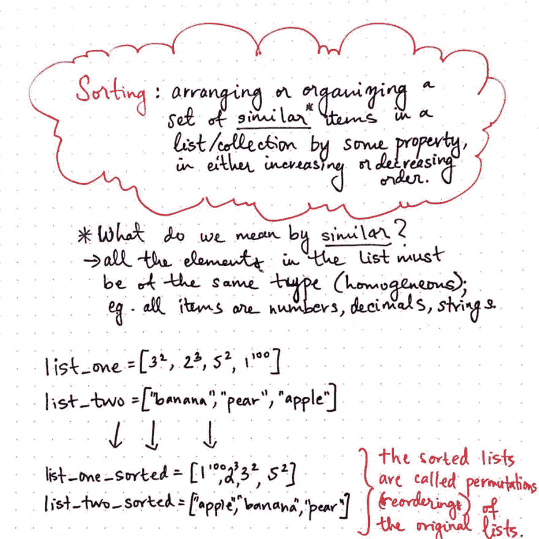](https://res.cloudinary.com/practicaldev/image/fetch/s--S3ZbPVEv--/c_limit%2Cf_auto%2Cfl_progressive%2Cq_auto%2Cw_880/https://cdn-images-1.medium.com/max/1024/1%2Ai0fopl3fml48X4aAxpqM4A.jpeg) 

<figcaption>排序列表是其原始列表</figcaption>

</figure>

的排列

*   我们可以根据任何一个属性对一组条目进行升序或降序排序，这个属性可以是任何东西。按大小、字典顺序、数字顺序、日期、时间——你说吧！
*   我们只能对项目是*同类*或者是相同类型的数据集进行排序。换句话说，我们不能既用单词又用数字对数据集进行排序，因为那个数据集没有一个我们实际上可以通过进行*排序的共享属性。*

在上面的例子中，我们已经排序了两个同类列表:list_one 和 list_two。所有的项目都是相似的类型，我们按升序排列。还值得一提的是，这些列表的排序版本(分别是 list_one_sorted 和 list_two_sorted)是它们原始的未排序列表的*排列或重新排序。*

 *好了，现在我们已经有了定义和规则，让我们来看看最重要的问题:计算机如何利用排序？排序的东西为什么好？类似于排序后的数据对人类来说可读性更强，排序后的数据对机器来说也更简单。

让我们来看看如果没有分类，生活会是什么样子。剧透警告:看起来相当糟糕。

<figure>[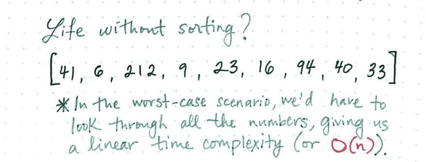](https://res.cloudinary.com/practicaldev/image/fetch/s--CgJXkSZd--/c_limit%2Cf_auto%2Cfl_progressive%2Cq_auto%2Cw_880/https://cdn-images-1.medium.com/max/1024/1%2AhHJbfVH5qGc8-An94bgjkg.jpeg) 

<figcaption>生活没有排序？</figcaption>

</figure>

在上面的例子中，我们有一个很小的未排序数字列表。想象一下，我们想找到数字 33，但不知道它在哪里。或者，在一个更可怕的场景中:想象我们想要找到一个甚至不在列表中的号码！在最糟糕的情况下，我们不得不仔细检查每一个数字，直到我们看到最后，才意识到这个数字甚至不在列表中！换句话说，这需要*线性*时间。使用我们的示例数据集，我们浏览所有数字所花费的时间将会非常少。

但是如果是 1 亿个数字呢？还是 10 亿？

好了，不要慌！别担心，我们不会试图对 1 亿个数字进行排序。让我们来看看在同一个数据集中找到一个数字排序后会是什么样子。

<figure>[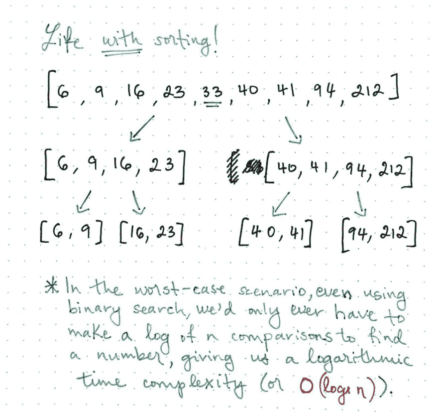](https://res.cloudinary.com/practicaldev/image/fetch/s--intURVH4--/c_limit%2Cf_auto%2Cfl_progressive%2Cq_auto%2Cw_880/https://cdn-images-1.medium.com/max/1024/1%2Ar0avJxNZlmM41SEdv2Q5Hw.jpeg) 

<figcaption>人生用——排序！</figcaption>

</figure>

如果上面的例子对你来说很熟悉，那是因为它是我们的老朋友，[二分搜索法](https://dev.to/vaidehijoshi/leaf-it-up-to-binary-trees)！在完全相同的示例数据集中找到一个数字(即使该数字甚至不存在于列表中)花费的时间不会超过*对数*时间。希望您记得，这都是因为二分搜索法是通过每次比较消除一半可能的搜索结果来实现的。

这正是我们的程序利用排序的方式！二分搜索法是在大型数据集中插入、删除或读取和检索信息的一种很好的方式。即使数据集有 1 亿个，只要对列表进行了排序，我们的代码也很容易进行搜索。

### 各种分类

既然我们都同意排序是一个概念，那么是时候分解常用的不同类型的排序算法了。

<figure> 

<figcaption>不同的分类方式一种排序算法</figcaption>

</figure>

对排序算法进行分类的方法有很多，但我们将只关注其中的六种:时间复杂度、空间复杂度(或内存使用)、稳定性、内部或外部、递归或非递归、比较排序或非比较排序。当程序员编写排序算法或选择实现哪一个时，这些分类最终成为他们的重要因素。

这一切都回到了我们在这个系列中已经熟悉的主题:不同的工具都有各自的优点和缺点。随着我们在接下来的几周里深入研究一些常见的算法，我们将使用这些分类来帮助我们确定任何给定的排序算法的优缺点，以及该算法何时可能有帮助(或者可能没有帮助！).

让我们更详细地看一下这些分类:

#### 1。时间复杂度

对算法进行分类的最简单的方法是通过*时间复杂度*，或者在给定不同输入大小的情况下，通过运行算法所需的相对时间。

<figure>[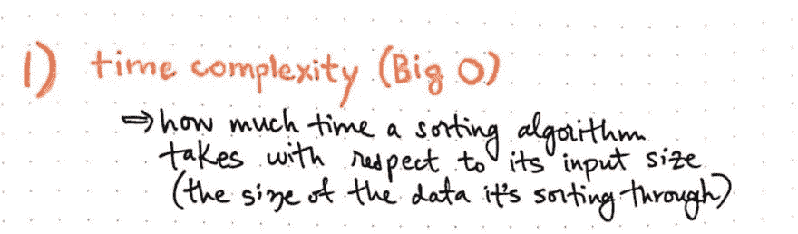](https://res.cloudinary.com/practicaldev/image/fetch/s--zMbHx9nN--/c_limit%2Cf_auto%2Cfl_progressive%2Cq_auto%2Cw_880/https://cdn-images-1.medium.com/max/1024/1%2ANdDjcpSIq4hkz8vyDFngAA.jpeg) 

<figcaption>时间复杂度</figcaption>

</figure>

因为我们已经非常熟悉时间复杂性的概念(或者，我们经常提到的，大 O T1)，这就是我们如何分解我们所有的算法，因为我们开始更详细地了解它们。

#### 2。空间复杂性/内存使用

不同的算法需要不同的空间量，这取决于它们的空间复杂度。在排序算法的上下文中，考虑空间复杂度的另一种方式是回答这个问题:*这个算法需要多少内存来运行？*

<figure>[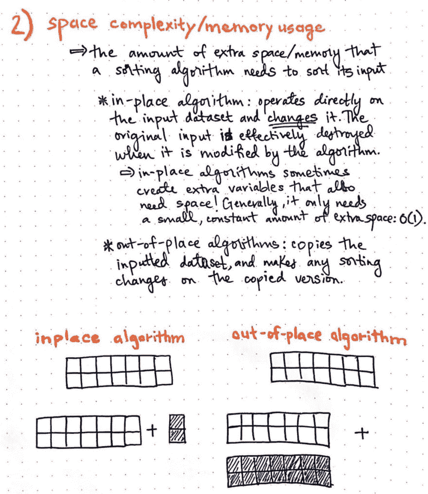](https://res.cloudinary.com/practicaldev/image/fetch/s--pDPfJahN--/c_limit%2Cf_auto%2Cfl_progressive%2Cq_auto%2Cw_880/https://cdn-images-1.medium.com/max/1024/1%2AeX6Ts3XN9myfT1IXewgc4A.jpeg) 

<figcaption>空间复杂度</figcaption>

</figure>

算法的空间复杂度有两种分类:*在位*或*非在位*。

***原地*** 算法是直接对输入数据进行操作的算法。这样做的危险在于，数据在转换过程中被完全转换，这意味着原始数据集实际上被破坏了！然而，它更节省空间，因为该算法只需要内存中的一点点额外空间——通常是一个恒定的空间量，或*O(1)*——如果没有足够的内存可用，这会很有帮助。

相比之下， ***错位*** 算法不直接在原始数据集上操作；而是制作一个新的副本，并对复制的数据执行排序。这可能更安全，但缺点是算法的内存使用随着输入大小的增加而增加。

#### 3。稳定性

通常，一个数据集会有多个具有相同“排序关键字”的元素；换句话说，一个列表中的多个条目可以被认为在排序方式上是相同的。

<figure>[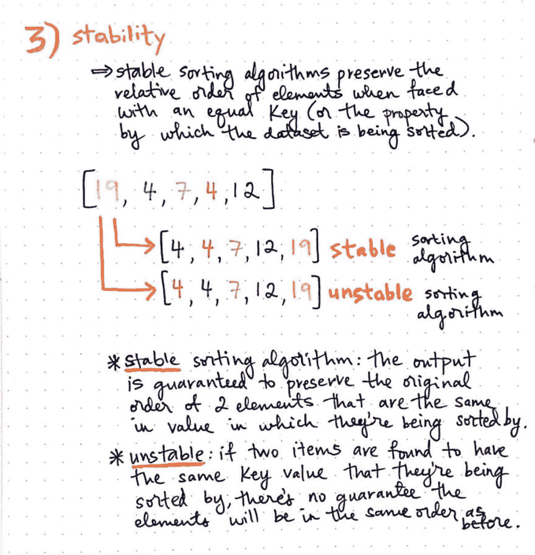](https://res.cloudinary.com/practicaldev/image/fetch/s--ZmwKMxdT--/c_limit%2Cf_auto%2Cfl_progressive%2Cq_auto%2Cw_880/https://cdn-images-1.medium.com/max/1024/1%2AlOOXCrfZft2vu_jbfQNuvw.jpeg) 

<figcaption>稳定</figcaption>

</figure>

在这里显示的例子中，有两个数字 4，一个是绿色的，另一个是红色的。

这个列表有两种排序方式，假设有两个元素可以“相等地”排序:绿色的 4 可以排在前面，就像它在原始列表中那样，或者红色的 4 可以排在前面。

这正是定义排序算法的 ***稳定性*** 的原因。

***稳定*** 算法是保持元素相对顺序的算法；如果键是相同的，我们可以保证元素在列表中的排序方式与排序前相同。另一方面， ***不稳定*** 算法无法保证，如果发现两个项目具有相同的排序关键字，它们的相对顺序将被保留。

#### 4。内部与外部

因为我们的机器可以很容易地对大型数据集进行排序，所以一些应用程序必须对巨大的数据集合进行排序是很常见的。在某些情况下，这实际上可能比机器的主存储器(或 *RAM* )所能保存的数据还要多。

<figure>[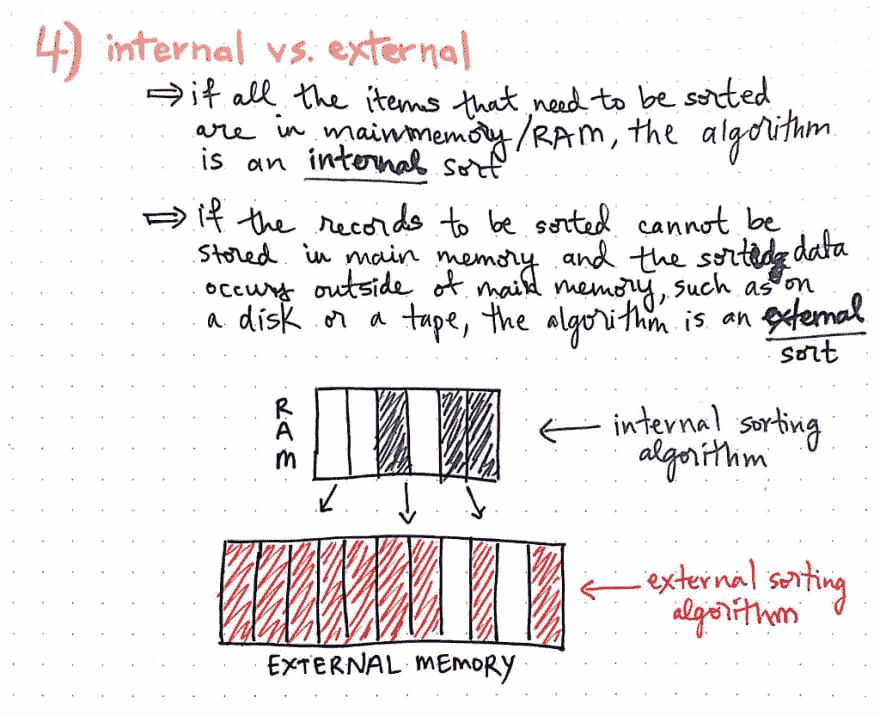](https://res.cloudinary.com/practicaldev/image/fetch/s--dYaD987N--/c_limit%2Cf_auto%2Cfl_progressive%2Cq_auto%2Cw_880/https://cdn-images-1.medium.com/max/1024/1%2ArUhxtHDRPntdHSZ7bYMBig.jpeg) 

<figcaption>内部 vs .外部</figcaption>

</figure>

算法在对记录进行排序时存储数据的方式是我们可以对排序算法进行分类的另一种方式。

如果所有需要排序的数据都可以保存在主存中，则该算法是一种 ***内部*** 排序算法。但是，如果记录必须存储在主存储器之外——换句话说，存储在外部存储器中，无论是磁盘还是磁带——该算法被称为 ***外部*** 排序算法。

#### 5。递归或非递归

一些算法通过分而治之的方式进行排序:也就是说，将一个大型数据集分割成较小的输入，然后对所有这些较小的输入递归调用排序函数。这就是所谓的 ***递归*** 排序算法。

<figure>[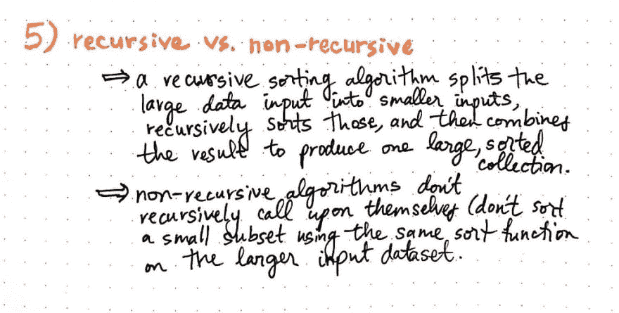](https://res.cloudinary.com/practicaldev/image/fetch/s--BqAuzyIP--/c_limit%2Cf_auto%2Cfl_progressive%2Cq_auto%2Cw_880/https://cdn-images-1.medium.com/max/1024/1%2Azlj1h6uHJ9uLlQtLbc4ZEw.jpeg) 

<figcaption>递归与非递归</figcaption>

</figure>

相比之下， ***非递归*** 排序算法是不实现递归的。也就是说，它们不会通过对更小的输入调用相同的函数来对更小的子集进行排序。

值得一提的是，大多数算法并不一定要递归实现*；它们可以迭代地编写和实现。但是一个排序算法是否是递归的最终是一个简单的方法来将一组算法从另一组中分类出来。*

 *#### 6。比较排序

最后，可以根据*如何对元素进行排序来对排序算法进行分类。*

<figure>[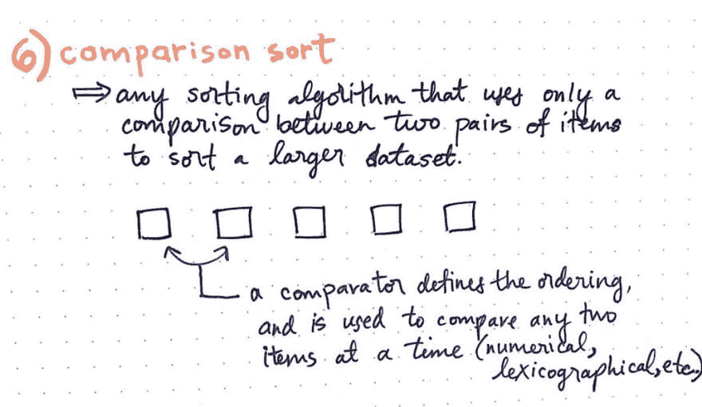](https://res.cloudinary.com/practicaldev/image/fetch/s--11LQhR-0--/c_limit%2Cf_auto%2Cfl_progressive%2Cq_auto%2Cw_880/https://cdn-images-1.medium.com/max/1024/1%2A0WiaRJ7mDfSP1h6lte6y3A.jpeg) 

<figcaption>比较排序</figcaption>

</figure>

在对较大数据集进行排序的过程中，任何一次比较两个项目或一个*对的排序算法都被称为* * _ 比较排序* **。这个算法子集使用某种类型的*比较器*(例如:> =或< =)来确定任何两个元素中的哪一个应该首先排序。

不使用任何类型的比较器进行排序的排序算法被称为 ***非比较排序*** 。

出于我们的目的，本系列中几乎所有的算法都将被归类为比较排序。然而，重要的是要记住，不是所有的排序算法都需要一个比较器来定义数据集的顺序和排序！

### 整理，整理，到处找！

好了，我们已经完成了分类列表。希望到现在为止，你可以看到排序算法在计算机科学中是一件大事。人们已经花费了职业生涯的很大一部分时间来研究和编写排序算法！这是有原因的。

<figure>[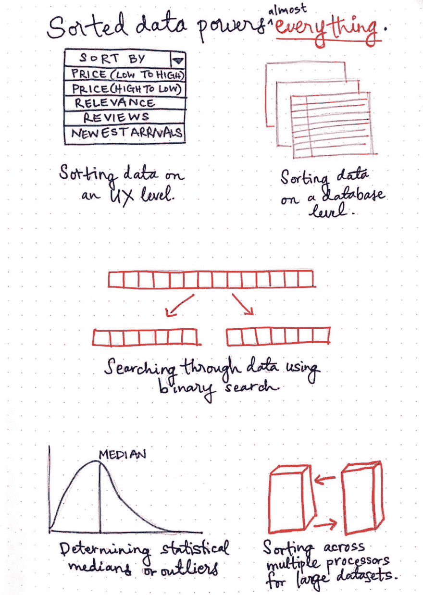](https://res.cloudinary.com/practicaldev/image/fetch/s--jkcnKOLb--/c_limit%2Cf_auto%2Cfl_progressive%2Cq_auto%2Cw_880/https://cdn-images-1.medium.com/max/1024/1%2ADwXB8nBkKHe-kvocaHSKZw.jpeg) 

<figcaption>【排序数据】权力(几乎)一切！</figcaption>

</figure>

排序后的数据几乎决定了一切。想想看:每当您与 web 或移动应用程序进行交互时，您都可以按某种属性对大量数据进行排序。数据库也可以使用一种叫做 Btrees 的东西对大量数据进行排序和搜索。他们整理了如此多的数据，以至于我们人类都无法理解！

我们已经知道了二分搜索法和它的使用频率，以及它的威力。你猜怎么着？排序的数据是一个先决条件！

但是在更广泛的层面上，排序算法也用于统计中，例如，为了确定数据集的中值，或者为了发现统计异常值！排序算法也用于您自己的单个机器上的负载平衡，并且在多个处理器上处理大量数据时特别有用。

在接下来的几周里，我们将开始看到更多关于排序算法对计算机科学有多重要的信息。有很多不同的排序算法，但我们将介绍一些最常见的算法:

<figure>[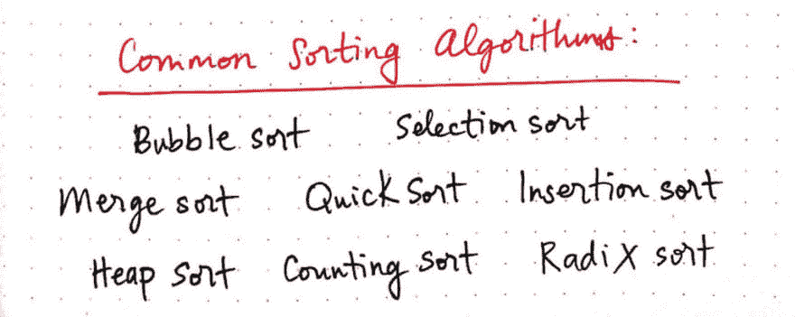](https://res.cloudinary.com/practicaldev/image/fetch/s--WkUkxhQu--/c_limit%2Cf_auto%2Cfl_progressive%2Cq_auto%2Cw_880/https://cdn-images-1.medium.com/max/1024/1%2AOWZF2CMe2KV1grxNwcdZ9Q.jpeg) 

<figcaption>我们将要学习的常用排序算法！</figcaption>

</figure>

下周，我们将尝试将这些排序算法实际应用于现实生活中的问题，并开始更深入地探索其中的一些排序。也许当我们深入研究这个算法的时候，你会改变自己生活中的排序方式。或者你可能再也不想听到排序的事情了。我大胆地说，这两种情况都有 50%的可能性发生。

### 资源

关于排序算法的论文和博士论文数不胜数:哪些是最好的，哪些是有效的，以及如何按照不同的类别对它们进行排序和分类。你可能会花上几年的时间去阅读和学习它们。或者，如果您正在寻找一个简单的起点，您也可以查看这些资源！

1.  [基于非比较的排序算法](http://www.cs.cmu.edu/~clo/www/CMU/DataStructures/Lessons/lesson8_3.htm)，Ananda Gunawardena 教授
2.  [数据结构——排序技术](https://www.tutorialspoint.com/data_structures_algorithms/sorting_algorithms.htm)，教程要点
3.  [排序算法](https://www.cs.cmu.edu/~adamchik/15-121/lectures/Sorting%20Algorithms/sorting.html)，维克多·亚当希克教授
4.  [排序算法——稳定性](http://homepages.math.uic.edu/~leon/cs-mcs401-s08/handouts/stability.pdf)，伊利诺伊大学芝加哥分校，数学、统计和计算机科学系
5.  [整理申请](http://algs4.cs.princeton.edu/25applications/)，罗伯特·塞奇威克教授&凯文·韦恩
6.  [排序算法简介](https://www.youtube.com/watch?v=pkkFqlG0Hds)，mycodeschool

* * *

*本帖最初发表于[medium.com](https://medium.com/basecs/sorting-out-the-basics-behind-sorting-algorithms-b0a032873add)T3】***