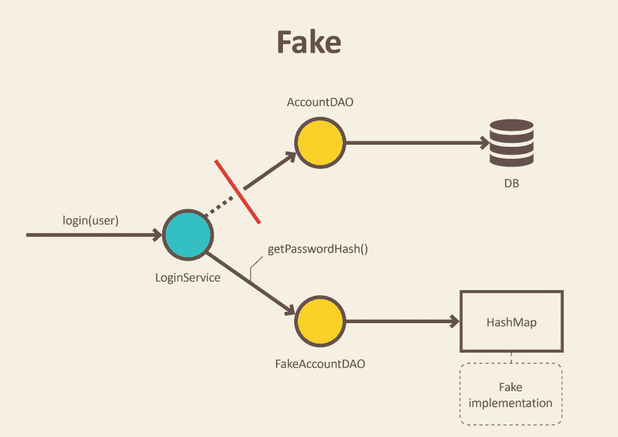
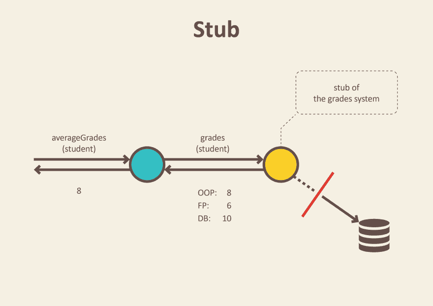
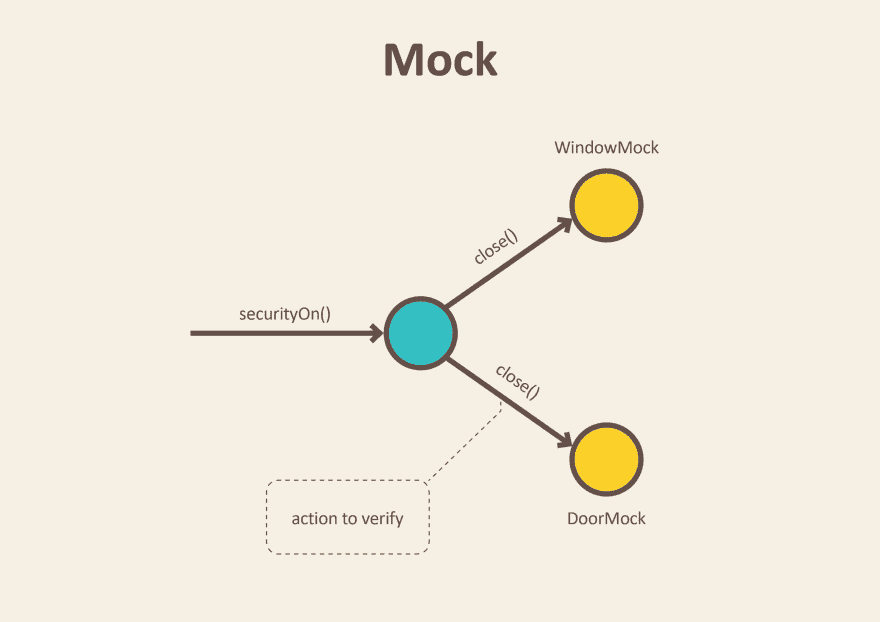

# 测试双打-假货，仿制品和存根。

> 原文:[https://dev.to/milipski/test-doubles-假货-仿制品-存根](https://dev.to/milipski/test-doubles---fakes-mocks-and-stubs)

这篇文章最初发布在[实用主义者的博客](http://pragmatists.com/blog)

在自动化测试中，通常使用看起来和行为上类似于产品的对象，但实际上是简化的。这降低了复杂性，允许独立于系统的其余部分来验证代码，有时甚至有必要执行自我验证测试。双精度测试是用于这些对象的通用术语。

尽管测试替身有很多种类型(杰拉德·梅萨罗什在这篇文章中介绍了五种类型)，人们倾向于用术语 Mock 来指代不同类型的测试替身。误解和混合测试 doubles 实现可能会影响测试设计，增加测试的脆弱性，阻碍我们实现无缝重构。

在本文中，我将描述测试 doubles 的三种实现变体:Fake、Stub 和 Mock，并举例说明何时使用它们。

# 假的

假货是具有工作实现的对象，但与生产实现不同。通常他们会采取一些捷径，并拥有简化版本的产品代码。

这种快捷方式的一个例子可以是数据访问对象或存储库的内存实现。这个假的实现不会使用数据库，而是使用一个简单的集合来存储数据。这允许我们在不启动数据库和执行耗时请求的情况下进行服务的集成测试。

[](https://res.cloudinary.com/practicaldev/image/fetch/s--KVtUzSi6--/c_limit%2Cf_auto%2Cfl_progressive%2Cq_auto%2Cw_880/https://thepracticaldev.s3.amazonaws.com/i/8iym8jnai3zno15i5uvi.png)T3】

```
@Profile("transient")
public class FakeAccountRepository implements AccountRepository {

   Map<User, Account> accounts = new HashMap<>();

   public FakeAccountRepository() {
       this.accounts.put(new User("john@bmail.com"), new UserAccount());
       this.accounts.put(new User("boby@bmail.com"), new AdminAccount());
   }

   String getPasswordHash(User user) {
       return accounts.get(user).getPasswordHash();
   }
} 
```

<svg width="20px" height="20px" viewBox="0 0 24 24" class="highlight-action crayons-icon highlight-action--fullscreen-on"><title>Enter fullscreen mode</title></svg> <svg width="20px" height="20px" viewBox="0 0 24 24" class="highlight-action crayons-icon highlight-action--fullscreen-off"><title>Exit fullscreen mode</title></svg>

除了测试之外，伪实现对于原型和尖峰也很方便。我们可以使用内存存储快速实现和运行我们的系统，推迟关于数据库设计的决策。另一个例子也可以是假的支付系统，它总是返回成功的支付。

# 存根

Stub 是一个对象，它保存预定义的数据，并在测试过程中使用它来应答调用。当我们不能或不想涉及会用真实数据回答或有不良副作用的对象时，就使用它。

例如，一个对象需要从数据库中获取一些数据来响应方法调用。我们引入了一个存根并定义了应该返回什么数据，而不是真正的对象。

[](https://res.cloudinary.com/practicaldev/image/fetch/s--teEfYNfN--/c_limit%2Cf_auto%2Cfl_progressive%2Cq_auto%2Cw_880/https://thepracticaldev.s3.amazonaws.com/i/2v592ht59ksiprwgzjzq.png)T3】

```
public class GradesService {

   private final Gradebook gradebook;

   public GradesService(Gradebook gradebook) {
       this.gradebook = gradebook;
   }

   Double averageGrades(Student student) {
       return average(gradebook.gradesFor(student));
   }
} 
```

<svg width="20px" height="20px" viewBox="0 0 24 24" class="highlight-action crayons-icon highlight-action--fullscreen-on"><title>Enter fullscreen mode</title></svg> <svg width="20px" height="20px" viewBox="0 0 24 24" class="highlight-action crayons-icon highlight-action--fullscreen-off"><title>Exit fullscreen mode</title></svg>

我们没有从成绩簿存储中调用数据库来获得真实的学生成绩，而是用将返回的成绩预先配置存根。我们定义了足够的数据来测试平均值计算算法。

```
public class GradesServiceTest {

   private Student student;
   private Gradebook gradebook;

   @Before
   public void setUp() throws Exception {
       gradebook = mock(Gradebook.class);
       student = new Student();
   }

   @Test
   public void calculates_grades_average_for_student() {
       when(gradebook.gradesFor(student)).thenReturn(grades(8, 6, 10)); //stubbing gradebook

       double averageGrades = new GradesService(gradebook).averageGrades(student);

       assertThat(averageGrades).isEqualTo(8.0);
   }
} 
```

<svg width="20px" height="20px" viewBox="0 0 24 24" class="highlight-action crayons-icon highlight-action--fullscreen-on"><title>Enter fullscreen mode</title></svg> <svg width="20px" height="20px" viewBox="0 0 24 24" class="highlight-action crayons-icon highlight-action--fullscreen-off"><title>Exit fullscreen mode</title></svg>

# 命令查询分离

返回一些结果并且不改变系统状态的方法被称为**查询**。返回学生平均成绩的方法`avarangeGrades`就是一个很好的例子:`Double getAverageGrades(Student student);`

它返回值并且没有副作用。正如我们在学生评分示例中看到的，为了测试这种类型的方法，我们使用存根。我们正在替换真正的功能，以提供方法执行其工作所需的值。然后，该方法返回的值可以用于断言。

还有另一类方法叫做**命令**。这是当一个方法执行一些改变系统状态的动作时，但是我们不期望从它那里得到任何返回值:`void sendReminderEmail(Student student);`

一个好的做法是将一个对象的方法分成这两个独立的类别。Bertrand Meyer 在他的书[“面向对象软件构造”](https://www.amazon.com/Object-Oriented-Software-Construction-Book-CD-ROM/dp/0136291554)中把这种实践命名为:命令查询分离。

对于测试查询类型的方法，我们应该更喜欢使用存根，因为我们可以验证方法的返回值。但是命令类型的方法呢，比如发送电子邮件的方法？当它们不返回任何值时，如何测试它们？答案是模拟——我们要介绍的最后一种测试假人。

# 嘲弄

模仿是登记他们收到的呼叫的对象。在测试断言中，我们可以在模拟上验证所有预期的动作都被执行了。

当我们不想调用生产代码或者没有简单的方法来验证预期的代码是否被执行时，我们使用模拟。没有返回值，也没有检查系统状态变化的简单方法。一个例子可以是调用电子邮件发送服务的功能。我们不想每次运行测试时都发送电子邮件。此外，在测试中验证是否发送了正确的电子邮件并不容易。我们唯一能做的就是验证在我们的测试中执行的功能的输出。在其他情况下，验证是否调用了电子邮件发送服务。

类似的情况出现在下面的例子中:

[](https://res.cloudinary.com/practicaldev/image/fetch/s--VOv4blDO--/c_limit%2Cf_auto%2Cfl_progressive%2Cq_auto%2Cw_880/https://thepracticaldev.s3.amazonaws.com/i/4axggbc9kiqrvl1fguju.png)T3】

```
public class SecurityCentral {

   private final Window window;
   private final Door door;

   public SecurityCentral(Window window, Door door) {
       this.window = window;
       this.door = door;
   }

   void securityOn() {
       window.close();
       door.close();
   }
} 
```

<svg width="20px" height="20px" viewBox="0 0 24 24" class="highlight-action crayons-icon highlight-action--fullscreen-on"><title>Enter fullscreen mode</title></svg> <svg width="20px" height="20px" viewBox="0 0 24 24" class="highlight-action crayons-icon highlight-action--fullscreen-off"><title>Exit fullscreen mode</title></svg>

我们不想关上真正的门来测试安全方法是否有效，对吗？相反，我们在测试代码中放置门和窗模拟对象。

```
public class SecurityCentralTest {

   Window windowMock = mock(Window.class);
   Door doorMock = mock(Door.class);

   @Test
   public void enabling_security_locks_windows_and_doors() {
       SecurityCentral securityCentral = new SecurityCentral(windowMock, doorMock);

       securityCentral.securityOn();

       verify(doorMock).close();
       verify(windowMock).close();
   }
} 
```

<svg width="20px" height="20px" viewBox="0 0 24 24" class="highlight-action crayons-icon highlight-action--fullscreen-on"><title>Enter fullscreen mode</title></svg> <svg width="20px" height="20px" viewBox="0 0 24 24" class="highlight-action crayons-icon highlight-action--fullscreen-off"><title>Exit fullscreen mode</title></svg>

在执行`securityOn`方法后，窗户和门的模拟记录了所有的交互作用。这让我们可以验证门窗对象是否被指示自行关闭。从`SecurityCental`的角度来看，这就是我们需要测试的全部内容。

你可能会问，如果我们使用 mock，我们如何判断门窗是否真的会关闭？答案是不能。但是我们不在乎。这不是`SecurityCentral`的责任。这是`Door`和`Window`单独的责任，当它们得到适当的信号时自动关闭。我们可以在不同的单元测试中独立测试它。

## 进一步阅读

[测试替身](https://martinfowler.com/bliki/TestDouble.html) -马丁福勒
[测试替身](http://xunitpatterns.com/Test%20Double.html) - xUnit 模式
[模拟不存根](https://martinfowler.com/articles/mocksArentStubs.html) -马丁福勒
[命令查询分离](https://martinfowler.com/bliki/CommandQuerySeparation.html) -马丁福勒

## [T1】你喜欢这篇文章](#you-liked-this-article)

你可以在[实用主义者的博客](http://pragmatists.com/blog)上找到更多关于 TDD 和测试的文章