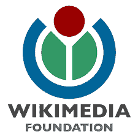

# 维基百科没有癌症

> 原文:[https://dev.to/andrewlucker/wikipedia-doesnt-have-cancer](https://dev.to/andrewlucker/wikipedia-doesnt-have-cancer)

它已经老到可以开始担心公交因素了。

Guy Macon 写了一篇非常有力的文章，认为维基媒体基金会正处于不可持续的招聘狂潮中。最终导致被迫出售给一家更大的公司。

在我的整个职业生涯中，我都在创业公司工作过，我可以理解一个老牌机构如何渴望稳定，并认为《18 个月的 t 台》仍然是疯狂的。这太疯狂了。增长金融是疯狂的。

然而，我真的不希望维基媒体除了成长之外还能做什么。如果脸书宣布破产，我一点也不在乎，但如果维基百科被卖掉，我真的会很难过。这在理论上应该让我和 op 站在同一个保守的一边。不同的是，我真的不在乎维基百科为我服务，我宁愿维基百科继续为 T2 服务。

我的(网络)一代成长在维基百科革命的尖端。今天，新一代正在成长，正处于启蒙时期的顶峰。当我开始通过邮件获得 AOL 磁盘，通过 beep-boop 调制解调器连接到互联网，玩 RedHat“抓住比尔·盖茨”游戏时，维基百科网站是通往其他世界的门户。如果你有足够的时间，维基百科就像一个“让你自己获得本科学位”的项目。很难描述教育的价值，WP 是现代自我导向学习的基石。

今天的(网络)一代是伴随着廉价的智能手机，而不是全键盘长大的。他们有语音助手，但没有编程 ide。他们有转账，但没有钱包。这是维基百科今天需要服务的一代人，这一代人包括数十亿人。对于那些不知道脸书和互联网区别的人来说，跨越文化、跨越地域，WP 是一扇窗户，透过它可以看到一种类似于传统西方教育的东西。这种识字率的提高可以重塑世界的状况，但前提是让我们走到这一步的机构做出重大承诺。

这不是终点，而是开始。

为了实现其在互联网上占主导地位的百科全书角色，维基媒体需要成长。尽管年代久远，维基媒体还是回到了创业模式，试图发现向原始世界提供百科全书的新方法。不认识到这一点，或者回避这个机会，将会使维基媒体处于落后的地位，而且总是有 b 计划。如果这家受人尊敬的机构想要保持在互联网中心附近的某个地方，那么它需要实现真正的业务增长，听起来确实如此。这是一件好事，尽管迄今为止它已经创造了许多良好的意愿，但仍有许多事情要做。我捐赠给最好的网络百科全书，不管它叫什么名字。

维基百科没有癌症，它有责任。

[T2】](https://res.cloudinary.com/practicaldev/image/fetch/s--r5XY8NvK--/c_limit%2Cf_auto%2Cfl_progressive%2Cq_auto%2Cw_880/https://cdn-images-1.medium.com/max/225/1%2A789sMhMj4nLLwh4sfujgEA.png)

* * *

*本帖最初发表于[medium.com](https://artplusmarketing.com/wikipedia-doesnt-have-cancer-68afe829702e)T3】*