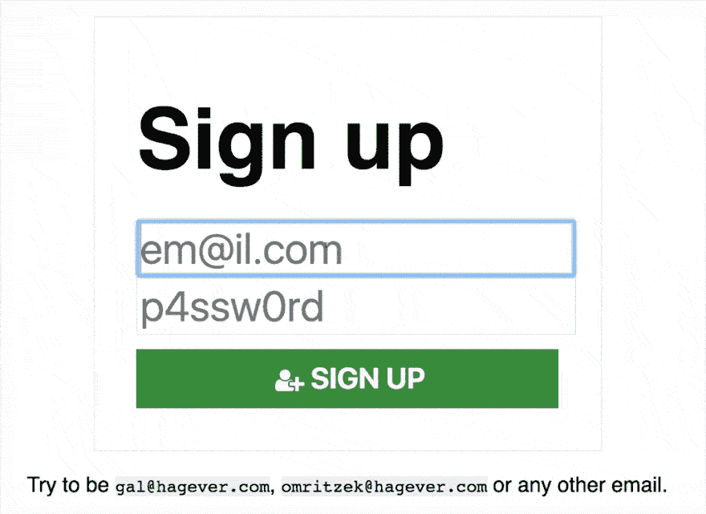

# “注册”和“登录”表单可以(也应该)是相同的

> 原文:[https://dev . to/schniz/sign-up-and-sign-in-forms-can-and-should-be-the-same](https://dev.to/schniz/sign-up-and-sign-in-forms-could-and-should-be-the-same)

#### 读完 [Omri Lachman 的文章](http://inspr.co/2017/05/03/login-vs-signup/)关于隐藏的“登录”按钮。突然，我明白了我对最近的网络应用程序的失望。我 DONT 知道如何使用他们，因为他们希望我一直注册。

我显然不是 UX 设计师，但我有一个想法:与其有两个表单:一个用于登录，一个用于注册——为什么我们不能在同一个表单上有两个？

想想吧。如果因为密码而无法登录，您可以尝试登录，但如果因为提供的电子邮件而失败，您可以重试？你为什么不能继续注册呢？

[我构建了一个简单的模型](https://signme.surge.sh) ( [源代码在 GitHub](https://github.com/Schniz/signbox) 上)来展示一个简单的注册/登录过程在实践中是如何工作的:一旦你提供了一个真实用户的电子邮件——它建议你需要登录。是的，它有一些安全漏洞，我们可能可以解决或真正关心。我们可以做到这一点，但不会自动完成:一旦我单击“继续”按钮，它将尝试登录，如果由于未知电子邮件而失败，我们将要求完成一些注册细节。

[T2】](https://res.cloudinary.com/practicaldev/image/fetch/s---Im_XEkA--/c_limit%2Cf_auto%2Cfl_progressive%2Cq_66%2Cw_880/https://cdn-images-1.medium.com/max/1024/1%2Af_VLGyD2fvGJ9gRcrOyo9g.gif)

<figcaption>You can try it online: [https://signme.surge.sh](https://signme.surge.sh)</figcaption>

我喜欢这个解决方案，因为:

1.  它非常容易实现(我猜大多数开发者会说这是一个笑话)
2.  更少的出错空间——我在适合我的凭据的地方登录！

尽管如此，我不是 UX 的设计师，所以我真的很想听听你们大家对这个图案的看法。谢谢！