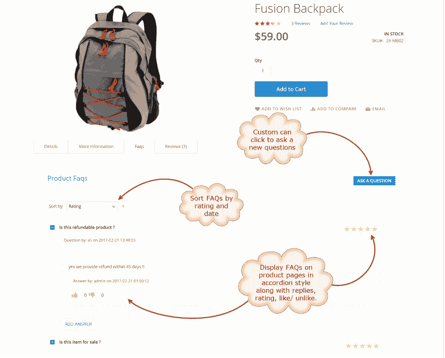

# 产品问题 Magento 2 扩展

> 原文：<https://dev.to/simonwalkerfme/product-questions-magento-2-extension-by-fme>

Magento 2 extension 允许您在单独的 FAQ 登录页面和产品页面上显示产品问题。让客户能够使用“提问”表单直接在产品页面上提问，以便在购买产品前立即获得他们需要的具体信息。允许访问者询问、喜欢/不喜欢、回答和评价所有现存的问题。所有的常见问题都以一种漂亮的手风琴风格恰当地展示出来。使用此产品问题 Magento 2 扩展，您可以导入/导出带有 CSV 文件的常见问题，并配置常见问题块，以便在网站的任何位置显示常见问题。

特点:

*   创建多个 Magento 2 常见问题主题/类别
*   FAQ 块在任何页面上显示问题
*   以手风琴样式显示常见问题
*   启用常见问题评分、喜欢/不喜欢功能
*   配置电子邮件通知
*   常见问题显示管理员过滤器

详情-[https://www . fmeextensions . com/FAQ-ask-product-questions-magento-2 . html](https://www.fmeextensions.com/faq-ask-product-questions-magento-2.html)

演示图像:

[T2】](https://res.cloudinary.com/practicaldev/image/fetch/s--oaA9T-9z--/c_limit%2Cf_auto%2Cfl_progressive%2Cq_auto%2Cw_880/https://www.fmeextensions.com/media/catalog/product/cache/1/thumbnail/9df78eab33525d08d6e5fb8d27136e95/1/_/1._magento_2_product_questions_2.png)

[T2】](https://res.cloudinary.com/practicaldev/image/fetch/s--UhvE93Fp--/c_limit%2Cf_auto%2Cfl_progressive%2Cq_auto%2Cw_880/https://www.fmeextensions.com/media/catalog/product/cache/1/thumbnail/9df78eab33525d08d6e5fb8d27136e95/4/_/4._magento_2_faq_extension_2_1.png)