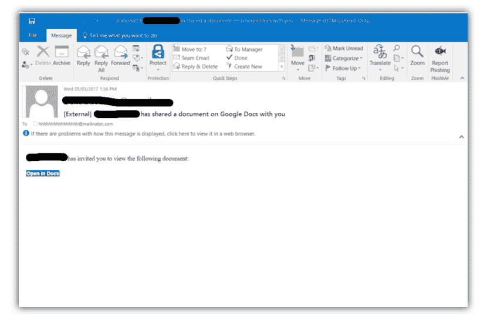

# 不要点击谷歌文档链接:谷歌文档费西合唱团概览

> 原文:[https://dev . to/antoinette0x 53/不要-click-the-Google-docs-link-overview-the-Google-docs-phish-tow-today](https://dev.to/antoinette0x53/dont-click-that-google-docs-link---an-overview-of-the-google-docs-phish-going-around-today)

就在美国中部时间今天下午 2 点之前，我收到了一个熟人的电子邮件，邀请我在谷歌文档上查看一份文档。我立刻起了疑心，因为地址的“收件人”字段是一个[邮件发送者](https://www.google.com/url?sa=t&rct=j&q=&esrc=s&source=web&cd=1&cad=rja&uact=8&ved=0ahUKEwjVtbXT0tTTAhVH6oMKHVQRAmAQFggmMAA&url=https%3A%2F%2Fmailinator.com%2F&usg=AFQjCNFpEVJAoJ2rRh9qRU3Mt7aDgmjYfw)地址，一个废弃的电子邮件地址。一号红旗。第二个危险信号是，我并不期待来自那个人的任何文档或电子邮件，这就是我所需要知道的，它可能是一个网络钓鱼。其他人就没这么幸运了。

> 应该注意的是，如果你在谷歌上搜索“Mailinator ”,你也会看到一堆关于网络钓鱼活动的推文。

这在安全领域已经是旧闻了，但在过去的两个小时左右，有人(还不知道是谁)一直在发送一封与我收到的邮件一模一样的钓鱼邮件。

[T2】](https://res.cloudinary.com/practicaldev/image/fetch/s--vq5OqLID--/c_limit%2Cf_auto%2Cfl_progressive%2Cq_auto%2Cw_880/https://thepracticaldev.s3.amazonaws.com/i/9t6s3gqo5en5gop57zm6.png)

如果您点击了该链接，您将被带到 Google 的帐户登录页面，通过 OAuth 进行身份验证。这个页面是合法的。然而，如果你仔细看，你实际上是在访问一个叫做谷歌文档的应用。让我们都停下来问问自己，“为什么谷歌文档需要我的许可才能访问任何东西？”。并没有。该应用程序是假的，托管在 Cloudflare 上。没过多久，Cloudflare 就关闭了该应用程序，谷歌也取消了访问权限，因此网络钓鱼现在实际上已经死亡，但您可能会有几个问题。

如果我已经允许访问了呢？嗯...该应用程序现在可以访问您的所有电子邮件。它还会将你收到的恶意邮件的副本发送给你发过邮件的所有人。你也许应该取消现在访问的朋友。[以下是如何](https://support.google.com/a/answer/2537800?hl=en#auth)
目前还不知道攻击者对邮箱中发现的信息做了什么。尽管谣言满天飞。

双重身份认证会有帮助吗？不，抱歉。2FA 不会参与此应用程序的访问，因为它是 OAuth 网络钓鱼。

还有谁受到了影响？我听说一批学校(K-12 和大学)和政府机构遭受重创。

如果你需要更多信息，这里有几篇文章供你阅读:
[新的谷歌文档钓鱼骗局，几乎无法察觉——Reddit](https://www.reddit.com/r/google/comments/692cr4/new_google_docs_phishing_scam_almost_undetectable/)
[突然出现的谷歌文档垃圾邮件？-Reddit](https://www.reddit.com/r/sysadmin/comments/692cno/sudden_google_docs_spam/)
[Twitter 上有人点击链接的 gif 图](https://twitter.com/zachlatta/status/859843151757955072)
[有人用大规模 Google Doc 钓鱼攻击攻击互联网-主板](https://motherboard.vice.com/en_us/article/massive-gmail-google-doc-phishing-email)

我不想听起来像是每个公司的每个人都必须参加的强制性网络钓鱼培训，但是，说真的，**在点击**之前要三思。我知道这封邮件看起来很有说服力，但是对你没想到会收到的邮件持怀疑态度是没有错的(即使你发邮件的人是你认识的人)。