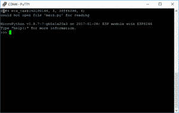

# MicroPython 和 NodeMCU ESP8266

> 原文：<https://dev.to/kenwalger/micropython-and-the-nodemcu-esp8266>

在[之前的一篇文章](https://www.kenwalger.com/blog/python/an-overview-of-micropython/)中，我简要介绍了 [MicroPython](http://www.micropython.org) 及其在物联网(IoT)领域的地位和作用。在这篇文章中，我将介绍如何让一个 [NodeMCU](http://nodemcu.com/index_en.html) ESP8266 设备闪速启动并运行 MicroPython。然后，我们将制作几乎是必不可少的物联网版“Hello World”...闪烁的 LED 灯。

有多种微控制器选项可用于使用 MicroPython，因此，您可能会问，为什么我决定使用 NodeMCU？首先，它们不贵。你可以在[易贝](https://www.ebay.com/p/?iid=191607499973&lpid=82&&&ul_noapp=true&chn=ps)上找到 NodeMCU ESP8266 开发板，价格不到 5.00 美元。当然，这是海外工厂生产的，但不到 10.00 美元，你就可以在[亚马逊](https://www.amazon.com/gp/product/B01N0B48NI/ref=as_li_tl?ie=UTF8&tag=kenwalgersite-20&camp=1789&creative=9325&linkCode=as2&creativeASIN=B01N0B48NI&linkId=dc1e9f82e2beb42bca36616a22b8820d)上买到。我特别喜欢这块板的第二个原因是，它内置了 LED 灯，所以我不需要拿出 LED 灯泡和电阻。另一个大优势是它支持 WiFi，并且使用 MicroPython，这意味着您可以使用开发板设置 web 界面，并且无需额外的硬件就可以轻松完成真正互联的项目。

综上所述，我将在本教程中使用一个基本的 [NodeMCU ESP8266](https://www.amazon.com/gp/product/B01N0B48NI/ref=as_li_tl?ie=UTF8&tag=kenwalgersite-20&camp=1789&creative=9325&linkCode=as2&creativeASIN=B01N0B48NI&linkId=dc1e9f82e2beb42bca36616a22b8820d) 设备。您可以随意使用具有相同芯片的不同物理设备，只需知道一些设置*可能*会根据物理设备配置而有所不同。该板有一个 USB 接口，当连接到 PC 时提供电源。

### 固件

我们显然需要获得一份 MicroPython 固件的副本。它以一种`.bin`文件格式出现，可以直接加载到 ESP8266 设备上，也可以从 MicroPython 网站[这里](http://micropython.org/download#esp8266)下载。对于本教程，我将使用固件的`esp8266-20170108-v1.8.7.bin`版本。你会想把它下载到你的电脑上，并记住它保存在哪里。

现在我们需要将固件部署到我们的设备上。如果你使用上面提到的主板，部署固件应该相对简单。如果您使用不同的 ESP8266 板，请与您的板的制造商联系，以获得正确的闪存技术。对于我们其余的人，我们将希望从 [esptool](https://github.com/espressif/esptool/) 开始，并使用它将固件转移到我们的设备上。该工具既可以直接从 GitHub 下载，也可以使用 pip 安装:

```
python -m pip install esptool

```

此版本的 esptool 支援 Python 版或更新版本。

#### 串行端口

一旦我们在系统上安装了它，并且通过 USB 端口连接了设备，我们就应该通过擦除设备的当前状态来清除设备，这是最佳做法。假设设备的端口名是`COM4`，我们可以用下面的命令来完成:

```
esptool.py --port COM4 erase_flash
```

只需用 COM4 代替您的特定设备正在使用的通信端口。它可能与非 Windows 机器上的`/dev/ttyUSB1`类似，您可以从终端端口使用命令`ls /dev/tty.*`来检测端口。此外，根据您的 ESP8266 设备，您可能需要安装 [USB 到 UART 桥 VCP 驱动程序](https://www.silabs.com/products/development-tools/software/usb-to-uart-bridge-vcp-drivers)——能够通过串行连接检测设备。设备刷新后(在我的机器上不到 10 秒)，我们使用以下命令将固件上传到设备:

```
esptool.py --port COM4 --baud 460800 write_flash --flash_size=detect 0 esp8266-20170108-v1.8.7.bin

```

固件的文件名应该与下载的固件相匹配。假设在刷新过程中没有出现任何错误，那么现在就有了一个运行 MicroPython 的 NodeMCU ESP8266 设备。很圆滑，是吧？

### 串行终端

我们现在可以使用串行终端工具连接到设备，比如 Windows 的 [PuTTY](http://www.putty.org/) ，Mac 的 screen 程序，或者 Linux 的 picocom。我将使用 PuTTY，因为我目前使用的是 Windows 10 机器。

我们将再次选择我们的串行端口，在我的例子中是 COM4，并将速度或波特率设置为 115200。然后，我们可以打开连接，应该会出现如下所示的 Python 读取-评估-打印-循环(REPL)界面提示:

[T2】](https://www.kenwalger.com/blog/wp-content/uploads/2017/05/REPL-prompt.png)

我们可以开始在设备上输入 Python 命令。让我们的设备执行物联网版本的“Hello World ”,并打开其中一个车载 LED 灯。这些灯通过通用输入/输出(GPIO)引脚控制，板上有两个。GPIO 2 控制板上的一个小型蓝色 LED。

在 REPL，我们希望能够开关电灯。这可以通过改变提供给 GPIO 引脚的状态(电荷)来实现，通常是通过将状态从低变到高再变回低来实现。

这是我在使用这种特殊的 LED 和 GPIO 设置和电路板时发现的一些情况。在这个板上，GPIO 2(和 16 个)上的 LED 连接在引脚和电源之间，所以当我们将引脚状态设置为低时，灯被激活，当设置为高时，灯被关闭。这个问题正在积极发展，固件更新可能已经解决了这个问题。然而，如果将一个外部 LED 灯连接到 GPIO 5 以及所需的电阻(约 300+欧姆)，我们会看到预期的灯在高电平状态下点亮，在低电平状态下熄灭。

### MicroPython 代码——试试看！

好了，撇开技术问题不谈，让我们看看打开 LED 灯所需的代码。首先，我们需要访问电路板的硬件。我们可以导入一个名为`machine`的包，它提供了必要的软件接口。然后，我们可以改变给定 GPIO 引脚的状态...

```
>>> import machine
>>> pin = machine.Pin(2, machine.Pin.OUT)
>>> pin.high() Â # light off
>>> pin.low() Â # light on
>>> pin.high() # light off again

```

我们做到了！我们用一个 NodeMCU 8266 器件，用 MicroPython 刷新它，通过串行端口访问它，用最少的代码打开和关闭板上的 LED 灯。

恭喜你首次涉足物联网和 Python！这款 5.00 美元的主板还可以做更多的事情，我想我会花一些时间尝试一下。我将在这里公布我在整个过程中的结果和发现。

* * *

*在 Twitter [@kenwalger](https://www.twitter.com/kenwalger) 上关注我，获取我发布的最新消息。*