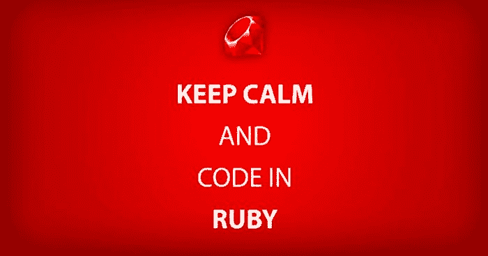

# Java x Ruby:初学者的不同之处

> 原文:[https://dev . to/felipebrigatto/Java-x-ruby-differences-for-初学者-eba](https://dev.to/felipebrigatto/java-x-ruby-differences-for-beginners-eba)

[T2】](https://res.cloudinary.com/practicaldev/image/fetch/s--tqBoqRUL--/c_limit%2Cf_auto%2Cfl_progressive%2Cq_auto%2Cw_880/https://cdn-images-1.medium.com/proxy/1%2AzVdJoDXQMbh91HasFKCuTg.jpeg)

我使用 Ruby on Rails 的第一次编程体验令人满意。显然，每种语言都有自己编写恶意代码的方式，所以我将分享我使用 Ruby 的第一步。

基本的区别是你不用初始化对象，我们可以用自己的结构来初始化。在 Java 中，有些东西不像，但却是一个开端:

示例:

```
// Java
int[] vector_ = new int[5];
int[] vector_pre_defined = {1,2,3,4,5};

// Ruby
vector = []
vector_pre_defined = [1,2,3,4,5] 
```

结构上看起来是一样的，但是在 Ruby 中我们可以很容易地增加:

```
vector << 1 # [1]
vector << [2,3] # [1,[2,3]] 
```

在 Java 中，我们需要创建一个 ArrayList 来做和 Ruby 几乎一样的事情:

```
ArrayList<Integer> vector = new ArrayLista<Integer>;
vector.add(1); 
```

有了它，我们就可以自由决定什么时候向数组中插入新元素。

现在来一个实际的例子:我们有一个关于电子商务订单的 JSON，其中有尚未填写的运输信息。我们需要根据以下规则填充它:

*   如果承运人为空，则添加 shipping_method(如果已填写),否则添加空字符串
*   如果填写了承运人和方法，请将它们串联起来添加。
*   否则，添加空白字符串。

不用想太多，在 Ruby 中我们有:

```
if not order.shipping_carrier
 values << order.shipping_method || ""
elsif order.shipping_carrier && order.shipping_method
 values << order.shipping_carrier + " - " + order.shipping_method
else
 values << ""
end 
```

在 Java 中:

```
if !order.getShippingCarrier() {
 if order.getShippingMethod() value = order.shipping_method;
 else value = “”;
} else if order.shipping_carrier && order.shipping_method {
 value = order.shipping_carrier + " - " + order.shipping_method;
} else
 value = "";
end 
```

使用顺序逻辑，这些代码很难阅读，而且没有利用两种语言的优势！

为了在 Ruby 中开始重构，有一个紧凑的数组函数，它返回没有空值的值，所以:

```
[order.shipping_method, order.shipping_carrier].compact
# [“Method”] # if shipping_carrier blank
# [“Carrier”] # if shipping_method blank
# [“Method”,”Carrier”] # if both are filled
# [] # if both are blank 
```

有了这个，我们保证我们对我们的小方法有一个结果信息。如果两个值都为空，则满足基本规则。

这样可以确保即使为 nula，也始终具有空数组。我们可以将其转换为空字符串。借助我们的新阵列，我们可以使用 join 连接它们的值。

还有一个函数可以使用:`join()`字母使用一个字符串来连接字符串。

最后，我们用一行满足所有条件:

```
values << [order.shipping_method, order.shipping_carrier].compact.join(" - ") 
```

那是我一年前用 Ruby 写的第一个代码，我是从 Java 开始的，那是一个范式的突破，因为写一个血统代码有很多方式，只有实践(和文化)才能把不好的代码变成好的。

*原载于 2017 年 5 月 2 日葡萄牙文*[*【medium.com】*](https://medium.com/skyhub-labs/java-x-ruby-diferen%C3%A7as-ao-programar-8fb675b2cde)*。*