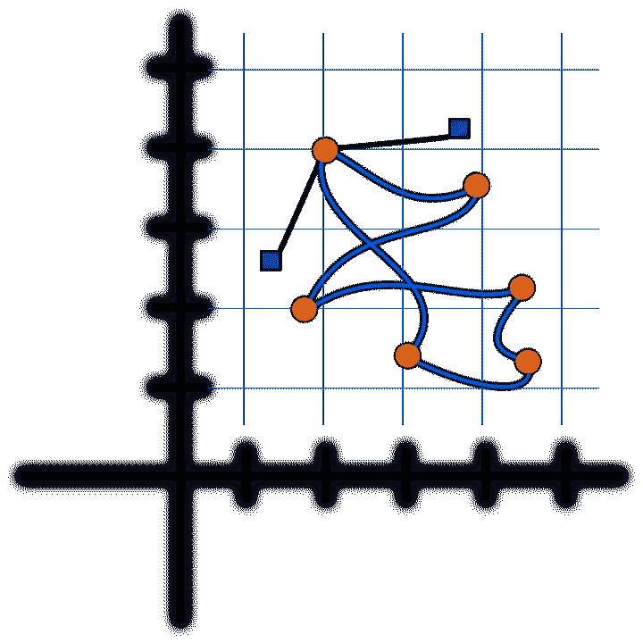

# 10x 程序员是一个神话

> 原文：<https://dev.to/andrewlucker/the-10x-programmer-is-a-myth>

但是 1/10 程序员是真实存在的。

一天只有 24 小时，这对每个人都一样。这是我在穷乡僻壤学习时对自己的想法。这就是我获得竞争性就业机会的原因。这就是我今天谋生的方式。

一天只有 24 个小时，但如何利用时间取决于你自己。大多数开发人员工作努力，有时投入很长时间。作为一个以 10 倍为目标的开发人员，仅仅比别人工作更努力、更长时间是没有什么好处的。这就是 1/10 developing 的用武之地:超频没什么好处，但效率或多或少是无限的。

在我的职业生涯中，只有少数几个人和我一起工作过，我称之为 10 倍。他们的一个共同特点不是他们打字更快，而是他们不会被卡住而浪费时间。即使在处理更困难的问题时，能够有效地诊断和处理问题也是 1/10 思维的标志。

所以下次当你听到有人谈论 10 倍编程时，试着把这个短语重新想成一个分数。一旦你得到了正确的代数，它开始变得更有意义，成为 1/10 倍的开发者成为可能。

[T2】](https://res.cloudinary.com/practicaldev/image/fetch/s--kLxf9b2u--/c_limit%2Cf_auto%2Cfl_progressive%2Cq_auto%2Cw_880/https://cdn-images-1.medium.com/max/720/1%2ACp9PKllVO_26qY8b3LlOuw.png)

* * *

*本帖最初发表于[medium.com](https://hackernoon.com/the-10x-programmer-is-a-myth-7f9074afc038)T3】*