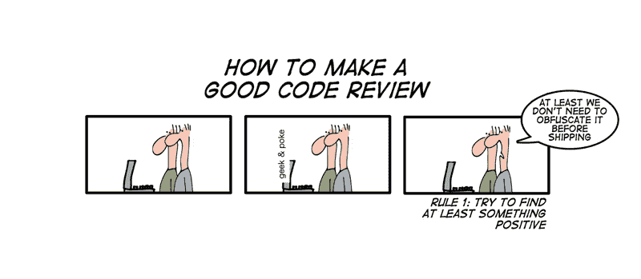
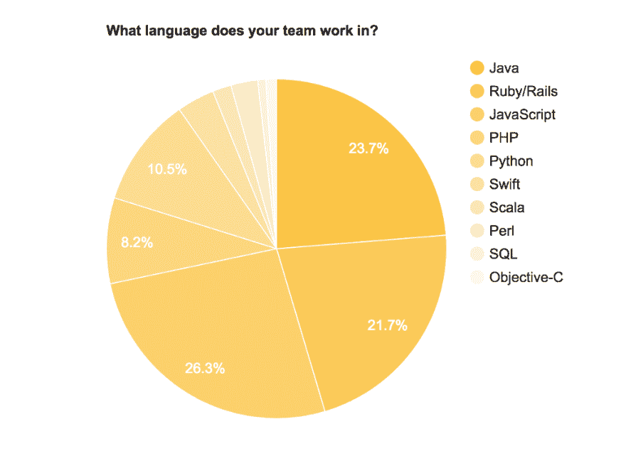
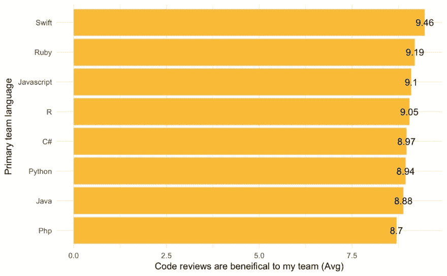
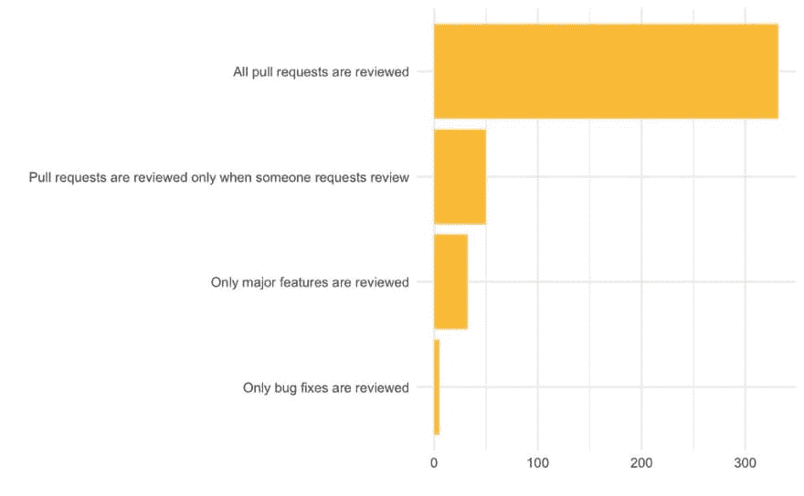
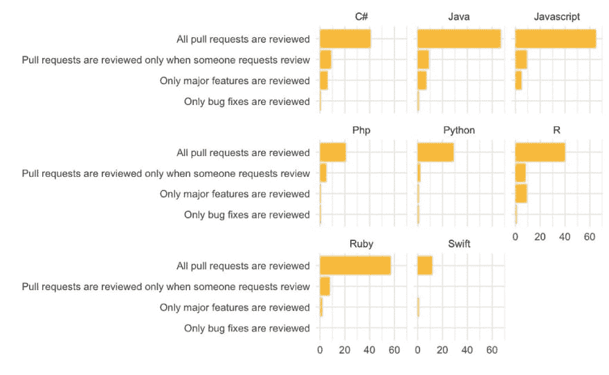
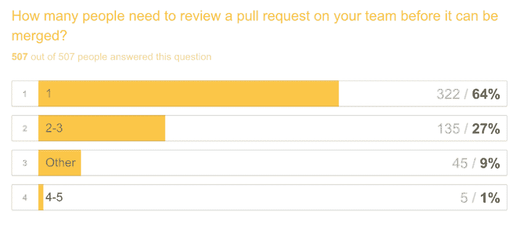

# 精心制作更好的代码评审

> 原文:[https://dev.to/vaidehijoshi/crafting-better-code-reviews](https://dev.to/vaidehijoshi/crafting-better-code-reviews)

*改编自 RailsConf 2017 上的一篇演讲。*

人类和技术之间的交集从来都不简单也不容易。当涉及到创造技术的人类时，这个事实尤其明显。作为一个碰巧也以写代码为生的人，我在代码评审过程中感受最深。

大多数开发人员倾向于认为他们的代码是一门手艺，并且——艺术家和大多数各种类型的创作者似乎都是如此——我们变得难以置信地依恋我们的代码。我们被告知要成为[无我的程序员](https://blog.codinghorror.com/the-ten-commandments-of-egoless-programming/)，不仅要评论我们自己的代码，还要评论我们办公桌上的每一行代码，因为它们正等待被合并到项目的代码库中。我们听说让我们的同行评审我们自己的代码和评审我们同事的代码都是非常好的事情——[我们都应该这样做](https://blog.codinghorror.com/code-reviews-just-do-it/)。我们中的很多人已经在做所有这些被强烈推荐的事情了。

但是我们上一次评估这些方法是什么时候？我们中有谁能确定我们的代码审查过程真的在*工作*？我们能确定他们正在扮演他们最初打算扮演的角色吗？

如果没有:我们如何努力使它们变得更好？

<figure> 

<figcaption>怪胎&戳，[http://geek-and-poke.com](http://geek-and-poke.com)</figcaption>

</figure>

### 为什么连*都要麻烦*复习？

在我们真正理解同行代码评审的*实际*好处之前，了解一下他们为什么会首先开始是有帮助的。关于代码评审最佳实践，已经有相当多的[研究](https://en.wikipedia.org/wiki/Code_review#References)，但是我认为史蒂夫·麦康奈尔在 [*代码完成*](https://www.amazon.com/Code-Complete-Practical-Handbook-Construction/dp/0735619670) 中的研究(最初发表于 1993 年)是一个很好的起点。

在他的书中，他描述了代码审查，以及它们应该发挥什么功能。他写道:

> 管理软件工程过程的一部分是在“最低价值”阶段捕捉问题——也就是说，在投资最少的时候，以及纠正问题花费最少的时候。为了实现这样的目标，开发人员使用“质量门”，即定期测试或审查，以确定某一阶段的产品质量是否足以支持下一阶段。

麦康奈尔对每个团队进行代码审查的案例中最强大的方面是他将它与他所谓的“建设中的集体所有权”联系起来的方式:所有代码都由一组贡献者拥有的想法，他们每个人都可以平等地访问、更改和修改集体所有的项目。

> 代码审查背后的最初意图是，它们将帮助我们在软件的创建中获得集体所有权。换句话说，通过控制产品质量，我们每个人都是开发过程中的利益相关者。

McConnell 继续强调了一些不同类型的代码审查过程，工程团队可以在他们的日常工作流程中采用这些过程。我强烈建议你拿起 *Code Complete* 的副本，学习更多关于这些技术的知识；然而，就我们的目的而言，一个摘要就足够了。代码审查有三种形式:

#### **1。检查**

检查是更长的代码审查，大约需要一个小时，包括一个主持人、代码作者和一个审查者。

当有效地使用时，检查通常可以捕获程序中大约 60%的缺陷(bug 或错误)。根据 McConnell 的研究，检查导致每 1000 行代码的缺陷比不太正式的审查实践*少 20-30%。*

#### **2。演练**

walkthough 是一个 30-60 分钟的工作会议，通常旨在为高级开发人员提供向新程序员解释概念的教学机会，同时也为初级工程师提供推翻旧方法的机会。

走查有时会非常有效，但它们远不如更正式的代码审查过程(如检查)有影响力。一次演练通常可以揭示程序中 20-40%的错误。

#### **3。简短代码评审**

顾名思义，简短评论要快得多；然而，它们仍然是非常深入的小变化的回顾，包括最容易出错的单行变化。

McConnell 的研究揭示了以下关于更短代码评审的内容:

> 一个引入了单行变更审查的组织发现其错误率从审查前的 55%下降到审查后的 2%。在 80 年代后期，一个电信组织在审查代码变更之前的正确率从 86%上升到 99.6%。

这些数据——至少是麦康奈尔收集的数据的*子集*——似乎表明每个软件团队都应该对这三种类型的代码评审进行*某种*组合。

然而，麦康奈尔的书是在 1993 年首次研究和写作的。从那时起，我们的行业发生了变化，可以说，我们的同行评审方法也发生了变化。但是我们今天的代码评审实现真的有效吗？我们如何将代码评审背后的理论融入到 T2 实践中呢？

为了找到这些问题的答案，我做了任何有决心(但有点不确定从哪里开始)的开发人员都会做的事情:我问了互联网！

> vaidehijoshi[@ vaidehijoshi](https://dev.to/vaidehijoshi)我正在收集关于代码评审的数据——好的，坏的，&丑陋的。
> 如果您有 5️⃣会议记录，请填写并回复！
> 👇👇👇
> [【vaidehi.typeform.com/to/tl7MX5】](https://t.co/0OyuJXWVY9)2017 年 2 月 25 日 21 点 09 分8761

嗯，好吧——我问推特。

### 开发者如何看待代码评审？

在我开始研究调查结果之前，先声明一下:*我不是数据科学家。*(我希望我是，因为我可能会更好地分析这个调查的所有回复，也许我甚至会在用 R！).最终，这意味着我的数据集在*许多*方面受到限制，首先是它是 Twitter 上的自选调查，其次是调查本身预设了基于分支/拉取请求的团队。

好了，现在我们已经解决了这个问题:*开发人员如何看待代码评审？*

#### 量化数据

我们将通过查看量化数据来尝试回答这个问题。

首先，这个问题的答案在很大程度上取决于你问的是哪些开发者。在我写这篇文章的时候，我已经收到了 500 多份对我的调查的回复。

回应的开发人员主要使用 Java、Ruby 或 JavaScript。下面是这些回答是如何根据开发人员以及他们和他们的团队使用的主要语言进行分类的。

[T2】](https://res.cloudinary.com/practicaldev/image/fetch/s--RG9i3wbQ--/c_limit%2Cf_auto%2Cfl_progressive%2Cq_auto%2Cw_880/https://cdn-images-1.medium.com/max/1024/1%2AhiGuGx5OvayL4dPu1tSC4w.png)

我问调查的每一个回答者，他们在多大程度上同意下面的陈述:*代码评审对我的团队*有益。

总的来说，Swift 开发人员发现代码审查对他们的团队最有利，在 1-10 分的范围内平均得分为 9.5，其中 1 分代表*完全不同意*，10 分代表*完全同意*。Ruby 开发者紧随其后，平均得分约为 9.2。

[T2】](https://res.cloudinary.com/practicaldev/image/fetch/s--Guxcenqk--/c_limit%2Cf_auto%2Cfl_progressive%2Cq_auto%2Cw_880/https://cdn-images-1.medium.com/max/1024/1%2A1zSl-fd9hygIBzxp52yHOQ.jpeg)

虽然大多数调查对象(大约 70%)表示，在合并之前，每个单一的拉请求都由团队中的某个人进行了审查，但并非所有团队都是如此。大约 50 名受访者(约占整个数据集的 10%)表示，只有在他们的团队*请求*审查时，才会对拉取请求进行同行审查。

[T2】](https://res.cloudinary.com/practicaldev/image/fetch/s--YXvFR9T7--/c_limit%2Cf_auto%2Cfl_progressive%2Cq_auto%2Cw_880/https://cdn-images-1.medium.com/max/1024/1%2AfVl3H0KGsauN1Bxs_jsN7A.jpeg)

数据似乎表明，这种分布在很大程度上跨越了语言和框架。就是否所有的拉请求都被审查，或者是否必须首先请求审查而言，似乎没有一种单一的语言具有压倒性的不同结果。换句话说，似乎不是语言或框架导致了更一致的代码评审文化，而更可能是团队本身。

[T2】](https://res.cloudinary.com/practicaldev/image/fetch/s--0-mM3P3g--/c_limit%2Cf_auto%2Cfl_progressive%2Cq_auto%2Cw_880/https://cdn-images-1.medium.com/max/1024/1%2AjFZ_2zCzHM78m_L_p0OK8A.jpeg)

最后，对于那些在团队中工作的开发人员来说，在将代码合并到共享代码库之前，大多数团队似乎只需要另外一个人来进行同行评审。

[T2】](https://res.cloudinary.com/practicaldev/image/fetch/s--WWUYf9PN--/c_limit%2Cf_auto%2Cfl_progressive%2Cq_auto%2Cw_880/https://cdn-images-1.medium.com/max/1024/1%2AKsuH1lurvkf5wpoXZ2queQ.png)

#### 定性数据

那么那些无法量化的东西呢？除了选择题，调查还允许受访者填写自己的答案。这就是结果实际上被证明是最*有启发性*的地方，更不用说是最有用的了。

匿名回复中反复出现了一些重要的主题。

> 最终，决定一次代码评审经历成败的因素取决于两件事:在评审过程中花费了多少精力，以及评审本身有多少实质内容。

如果没有足够的精力花在审查上，或者缺乏实质内容，那么代码审查是糟糕的(并且在审查者和被审查者的嘴里留下不好的味道)。另一方面，如果代码审查过程是彻底的，并且花时间以实质性的方式审查代码的各个方面，那么它会给审查者和被审查者留下更加积极的印象。

但是我们所说的*能量*和*物质*到底是什么意思呢？

#### 能量

确定代码评审背后的**能量的另一种方式是通过回答这个问题:*谁在做评审？* *他们在这上面花了多少时间？***

许多回答者正在进行代码审查，但是许多人似乎对谁在进行审查，以及他们在审查——或者等待审查时花费了多少时间不满意。

以下是对调查的部分匿名回复:

> 我们有一个开发人员，他只是盲目地竖起大拇指，很少留下评论。那个人试图玩弄“至少两次批准”的规则。这很容易判断，因为不到一分钟，他们就会突然批准 5-6 份采购申请。

–

> 我发现第二个或第三个审核者在看到一个批准后更有可能盖章。

–

> 有时，根据提交 PR 的人员，相同的代码会被不同地审查。

–

> 团队中的每个人都应该得到平等的评价。我觉得高级人员得不到反馈是很常见的，因为人们认为他们不会做错，但他们完全可以，而且可能需要反馈。低年级的人会被吹毛求疵…记住，人们的自尊可能会受到影响，他们会变得脆弱。

–

> 提交量太大，所以 PR 需要很长时间来审核。人们不会在本地检查分支机构以进行测试。

–

> 特别是长的 PR 需要更长的时间来审查，这是一个问题，因为它们对未来的分支/PR/合并有最大的影响。

–

当谈到*如何* *在代码审查上花费了(或没有花费)多少*精力时，最重要的几点可以归结为三点:

1.  没有人会对仅仅是一种形式&没有任何分量的代码审查过程感到满意。
2.  用你不熟悉或者没有上下文的代码来回顾一篇冗长的 PR 是不好玩的。
3.  犯错是人之常情，我们都是人。我们都应该被检讨，并且公平地检讨别人。

#### 物质

代码评审的**实质** **归结为一个问题的答案:*当一个人评审他们的代码时，他到底在说什么，做什么，或者让另一个人有什么感觉？***

与代码评审的实质相关的回答，在很大程度上，是基于人们在他们的评审中说了什么，以及他们是如何说的。

以下是调查中的一些匿名回复:

> 我接受任何表面上的公关反馈。如果把那个字符串换成符号会让你开心，那就这么做吧，继续前进。我不会试图为一个武断的决定辩护。这不像在 IDE 环境中工作，我的大脑很容易陷入“看到红色曲线，修复红色曲线”的思维模式。我不在乎它为什么不高兴，只要让它别对我吼就行了。

–

> 不要在评论中做大图或建筑评论。进行线下对话。太容易把人送进兔子洞，制造挫折。

–

> 我非常强烈地感觉到，当人们要求改变时，这是令人讨厌的，尤其是如果他们不花时间解释他们为什么这样做，或者给他们犯错的可能性留有余地。尤其是当人们在评论中重写你的代码，并告诉你要修改他们的版本时。

–

> 如果评论帖子越来越长，这表明应该进行口头对话(在评论帖子中报告一致意见)

–

> 人们需要更好地区分他们自己的风格偏好和产生功能差异的反馈。对于资历较浅的人来说，很难分辨出哪个是哪个。当多位前辈给出相互矛盾的反馈时(例如，给一条路线起什么名字，为什么)，也是令人沮丧的。

–

当涉及到代码评审的*实质*时，主要的主题可以总结如下:

1.  纯粹对语法吹毛求疵的评论会导致负面的体验。风格和语义不是一回事。(有趣的是，5%的受访者使用了*这个词来描述负面背景下的代码评审评论。)*
**   我们用来审查彼此代码的词语真的很重要。一个不友善的评论会打击一个人的自信心。*

 *### 我们如何做得更好？

尽管这些数据可能不是我们行业的代码评审文化的最完整、最全面、甚至最准确的代表，但有一件事似乎是公平的:我们都可以在我们的团队和更大的社区中重新审视我们的代码评审过程。

这份匿名调查反馈强调了审核流程对工程团队成员的巨大影响:

> 一次糟糕的代码审查差点让我离开公司。一次伟大的代码审查让我感觉更有能力处理未来的项目。

事实上，对正式的代码审查有一些感觉是非常有益的，并且在统计上非常强大；史蒂夫·麦康奈尔的研究和这个小调查似乎都支持这个事实。但是，仅仅实现代码审查文化，然后不再考虑它是不够的。事实上，一个团队的成员仅仅经历审查的行为的代码审查过程对整个团队来说是有害的和令人沮丧的。

> 相反，它是对我们集体代码评审文化的自省、反思和重新评估的行为，这将允许我们建立在我们可能有的任何一种正式的评审过程之上。

换句话说，这是问我们自己我们的代码审查是否有效，以及它们是否对整个团队以及组成团队的个人产生影响的行为。

#### 改进代码评审过程的简单方法

对于您的团队来说，有几种方法可以立即使代码评审过程变得更加轻松愉快。这里有一些东西可以帮助你开始:

*   实现 [linters](https://github.com/showcases/clean-code-linters) 或代码分析器(如果有的话),以消除对拉请求的语法注释的需要。
*   对每一个 pull 请求使用 [Github 模板](https://quickleft.com/blog/pull-request-templates-make-code-review-easier/),完成一个清单，让代码作者和评审者容易知道添加什么，检查什么。
*   添加截图和详细的解释，以帮助向可能不熟悉的队友提供背景信息
*   以小而简洁的提交和封装的拉请求为目标，这些请求的规模不是很大，因此更容易和更快地审查。
*   如果可能，将特定的审阅者分配给一个或多个 PR。确保评审的角色在每个级别的工程师中平均分配。

#### 越困难的事情——但最重要

一旦你摘下了一些唾手可得的果实，你也可以帮助实现一些更大的改变。如果你想改变你的代码审查文化，这些实际上是最重要的事情。

让我警告你:这可能是让他们如此艰难的原因。

*   在你的团队中培养同理心。实现这一目标的最大重担落在了资深的、更有经验的工程师肩上。与团队或行业中的新人建立共鸣。

> 萨拉梅[@萨拉梅](https://dev.to/sarahmei)如果你是学长&你所有的 PRs 只是得到“lgtm👍“，试着私下问人。有时候公关太过公开化。02:27AM-02 2017 年 5 月2385

*   ***在行动和言语上推动重视脆弱性的文化。*** 这意味着重新评估在拉式请求注释中使用的语言，识别何时审查会变成一个向下的螺旋，并确定何时将对话离线，而不是公开质疑代码的作者。

> 杰夫·卡西米尔@ J3[@ Sarah mei](https://twitter.com/sarahmei)通常问题被看做是让事情慢下来。我喜欢反过来说:“我会在这里暂停，直到我们……[twitter.com/i/web/status/8…](https://t.co/VbMwhXXYFw)2017 年 5 月 02 日上午 02:53111

*   ***有对话。*** 让你的团队坐下来，建立一个松散的渠道，创建一个匿名调查——无论哪一个最适合你的团队文化。进行让每个人都感到足够舒服的对话，以分享他们是否对当前的代码评审过程感到满意，以及他们希望团队以不同的方式做什么。

我把最重要的一个留到了最后，因为，老实说，如果你坚持和我一起读到这里，你一定很想改变现状。这真的是一件非常好的事情！不过，最终，与你的团队进行对话是实现这种改变的最重要的第一步。

这份调查反馈比我更好地总结了原因:

> 理论上我喜欢代码审查。实际上，他们的能力取决于负责以正确的方式指导他们的团队。

#### 资源

如果您想查看更多精选的匿名调查反馈，您可以查看本项目附带的网站:

### [更好的代码评论](http://bettercode.reviews)

#### 鸣谢

首先，我非常感谢花时间和精力回答我的调查的数百名开发人员。

非常感谢 [Kasra Rahjerdi](https://medium.com/@jc4p) ，他帮助我分析了对我的调查的回应，并制作了这个项目中的许多图表。

感谢 [Jeff Atwood](https://blog.codinghorror.com/code-reviews-just-do-it/) ，感谢他关于同行评审的文章，感谢 Karl Wiegers，感谢他在 [*中使同行评审*](http://www.processimpact.com/articles/humanizing_reviews.html) 人性化的工作，感谢 Steve McConnell，感谢他在 [*Code Complete*](https://www.amazon.com/Code-Complete-Practical-Handbook-Construction/dp/0735619670) 中对代码评审过程的广泛研究。我希望你能考虑通过阅读他们的作品或购买他们的书籍来支持这些作者。

*本帖最初发表于[medium.com](https://medium.com/@vaidehijoshi/crafting-better-code-reviews-1a5fc00a9312)T3】**