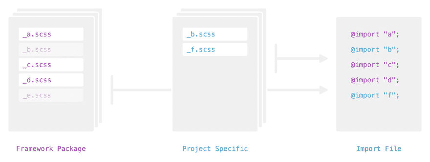

# 用纱线和吞咽重复使用设计系统

> 原文:[https://dev . to/SEB nitu/reuse-design-systems-with-yarn-and-gulp](https://dev.to/sebnitu/reusing-design-systems-with-yarn-and-gulp)

在我多年从事设计系统的工作中，我对前端开发有了不同的看法。我不再将项目视为他们自己封闭的生态系统，而是我在我的领域内成长的结果。我的希望是，每完成一个项目，我都会带着一套完善的技能离开，我可以继续下一个项目。但是当我回去维护一个我已经“超越”的项目时会发生什么呢？很多时候，花时间去更新一个孤立的设计系统是不值得的。

在理想的世界中，我们应该能够让我们的项目与我们一起成长。即使这不是完全现实的，我认为开发一个允许我们尽可能容易地跨多个项目传播我们的设计系统的过程是有价值的。因此，为了实现这个目标，我已经开始使用 Sass 框架包作为我的项目继承其设计系统的地方。这使我能够专注于项目特定的风格，同时也给了我一个钩子，在我作为一个开发人员成长的过程中，在广泛的项目中管理这些系统。它是这样工作的:

[T2】](https://res.cloudinary.com/practicaldev/image/fetch/s--90f6P7bl--/c_limit%2Cf_auto%2Cfl_progressive%2Cq_auto%2Cw_880/https://thepracticaldev.s3.amazonaws.com/i/2z7do35ephxq4ezy7ztk.jpg)

这里需要注意的重要一点是，在项目特定风格中明确定义的任何东西都是对我们基本设计系统的一种替代。这允许我们更新我们的基础系统，而不用担心丢失我们特定项目所需的任何定制。

我将通过我使用 [BaseWeb](http://getbaseweb.com/) 、 [Yarn](https://yarnpkg.com/en/) 和 [Gulp](http://gulpjs.com/) 来完成这个任务。BaseWeb 是我个人的前端开发框架，但是这个工作流程可以和 [Bootstrap](http://getbootstrap.com/) 、 [Foundation](http://foundation.zurb.com/) 甚至个人框架等任何框架一起使用。只要项目发布在 [NPM](https://www.npmjs.com/) 上，就可以使用这种方法。

让我们使用 Yarn 安装我们的框架。如果你正在使用你自己的个人框架，只需将它发布到 NPM，并用你项目的包名替换任何对 BaseWeb 的引用:

```
$ yarn add baseweb --dev 
```

接下来，我们将创建特定于项目的 SCSS 目录(`scss/`)和一个用于存储最终 CSS 输出的目录(`css/`):

```
$ mkdir scss css 
```

这部分是 BaseWeb 特有的；我们会从包里复制一些文件。我们只需要三个:`baseweb.scss`包含所有的导入声明，然后是`_overrides.scss`和`_custom.scss`部分——前者是我们覆盖变量的地方，后者是我们项目特定风格的起始文件。这两个文件都位于`custom`目录中，所以我们将复制整个文件。为了简单起见，让我们用 BaseWeb 包的 SCSS 的路径快速定义一个环境变量。

```
$ bw=node_modules/baseweb/src/scss/
$ cp -i $bw'baseweb.scss' scss
$ cp -R $bw'custom' scss 
```

*注意，这里唯一真正的需求是一个文件来存储我们的`@import`声明。关于 BaseWeb 如何覆盖变量映射的更多信息，[查看这里的文档](http://getbaseweb.com/docs/custom/)。*

我们可以从`baseweb.scss`中注释掉或删除我们特定项目不需要的任何导入。BaseWeb 中唯一需要的导入是设置和核心文件，但是这些在编译时实际上不输出任何样式。它们只是提供在其他元素或块组件中使用的变量和混合。

接下来，我们需要将一些构建脚本放在一起，将我们的 SCSS 编译成生产就绪的 CSS。让我们添加`gulp`和`gulp-sass`作为开发依赖项，并创建`gulpfile.js`来编写我们的任务:

```
$ yarn add gulp gulp-sass --dev
$ touch gulpfile.js 
```

接下来，让我们用您最喜欢的文本编辑器打开`gulpfile.js`，在我的例子中是 [Atom](https://atom.io/) 。我们将定义一些变量，并开始处理 SCSS 的 CSS 任务。

```
var
  // Modules
  gulp = require('gulp'),
  sass = require('gulp-sass'),

  // Directories
  dir = {
    src: 'scss/',
    dest: 'css/',
    // This part is important. We're saving the path to our framework package.
    bw: 'node_modules/baseweb/src/scss/'
  }
;

gulp.task('css', function() {
  // Our CSS task goes here...
}); 
```

值得注意的一点是，我们存储了框架包的路径——接下来我们将以一种非常酷的方式使用它。因此，让我们把我们的 css 任务放在一起。

```
gulp.task('css', function() {
  return gulp.src(dir.src + 'baseweb.scss')
    .pipe(sass({
      outputStyle: 'compressed',
      includePaths: [
        dir.src, // 1\. Check our project specific files
        dir.bw   // 2\. Check our framework package
      ]
    })
    .on('error', sass.logError))
    .pipe(gulp.dest(dir.dest));
}); 
```

真正神奇的事情发生在我们传递给`gulp-sass`的选项中，它接受与 [node-sass](https://github.com/sass/node-sass) 相同的参数。特别是`includePaths`，这里我们包括两条路径；我们的项目特定目录和框架包。它会在这两个位置搜索一个我们用`@import`调用的文件。如果在我们的项目特定路径中找不到文件，Sass 将在框架包中查找该文件。让我们试一试:

```
$ gulp css 
```

我们刚刚将我们的 SCSS 编译成一个生产就绪的 CSS 文件:`css/baseweb.css`。尽管我们的大部分导入并不在项目本身中，但是它们是通过我们的框架包继承的。现在，我们可以在我们的项目特定的风格上工作，而不用担心我们的基础设计系统过时或与自定义编辑相背离。因为这些是分开的，所以可以通过运行以下命令来利用 BaseWeb 的最新更新:

```
$ yarn upgrade baseweb 
```

就是这样！关于设计系统的进一步阅读，我强烈推荐 Brad Frost 的书《T2 原子设计》。如果你对这个方法有任何建议或提示，请告诉我！我也很想知道你是如何维护你的项目和你想出的解决方案的。您可以在这个库中找到这个例子[的源代码。](https://github.com/sebnitu/reusing-design-systems)