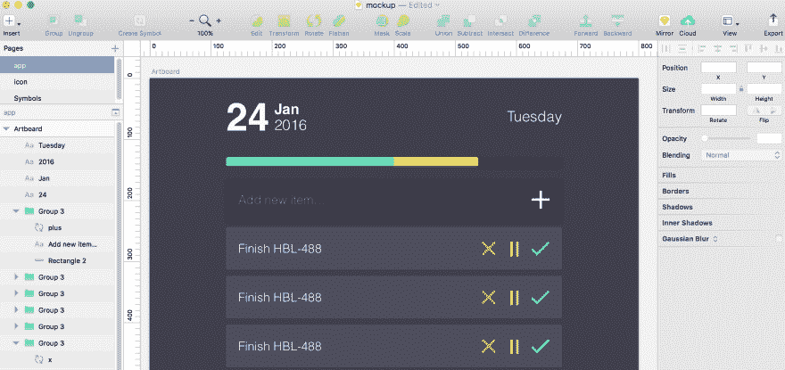

# 构建时间表:基于时间表的待办事项列表

> 原文:[https://dev . to/cassidoo/building-todometer-a meter-based-to-do-list](https://dev.to/cassidoo/building-todometer-a-meter-based-to-do-list)

经过一系列断断续续的开发，我终于完成了一个多年来一直想做的副业项目。

[T2】](https://res.cloudinary.com/practicaldev/image/fetch/s--XmmyK9ya--/c_limit%2Cf_auto%2Cfl_progressive%2Cq_auto%2Cw_880/https://thepracticaldev.s3.amazonaws.com/i/c4eco6kv8hfqflpko9wc.png)

总的来说，我喜欢完成事情。如果我在玩一个电话游戏，每个关卡给你 X 颗星，我会确保我得到每一颗星。如果我在使用测试驱动开发的项目中工作，我不会高兴，直到每一个测试都通过了，并且我看到了令人敬畏的绿色“所有测试都通过了”。我想要一份能给我同样满足感的待办事项清单。

于是，todometer 诞生了！这是一个基于米的待办事项列表。当您完成任务时，您会填充一个进度条。如果你正在推迟一项任务，它仍然会填充进度条，只是颜色不同。都是关于正面强化的。；)

建立一个流量计是一个漫长的过程。我现在开始和停止开发至少有 2 年了。最后，我受够了，开始认真对待这件事。

在构建任何东西之前，我勾画了我想要的应用程序的样子。在我的笔记本上有了一个大致的想法后，我打开了 Sketch(我还在学习，但是嘿，练习！)并不停地修改配色方案、大小和字体，直到我得到我想要的。

[T2】](https://res.cloudinary.com/practicaldev/image/fetch/s--j2XXeWqZ--/c_limit%2Cf_auto%2Cfl_progressive%2Cq_auto%2Cw_880/https://thepracticaldev.s3.amazonaws.com/i/dgngbkhwzsnt1iqsg4ir.png)

是的，没错，这是我在一月份设计的。这是一次长途旅行。

总之。我想指出的一点是，我通常不会先设计东西(我只是即兴发挥)，但从现在开始我肯定会。在编写 CSS 代码时，有规则可循非常有帮助。

我知道我想让它成为一个桌面应用，我经常使用的主要语言是 JavaScript。所以，对我来说最明显的选择是电子。由于它的在线演示项目，设置起来非常容易。

我最喜欢的框架是 React，所以我开始构建。我对日期信息使用了 [Moment.js](https://momentjs.com/) ，对进度条使用了 [react-progressbar.js](https://github.com/kimmobrunfeldt/react-progressbar.js) (由于库的工作方式，这涉及到大量令人讨厌的数学运算，但为了我自己的健康，我不打算深入研究)，对条目列表和每个条目只使用了常规的 react 组件。我用更少的东西做了造型，主要是嵌套和变量。

在完成这项工作并在 React 中获得大部分功能后，我意识到如果我能在一天结束时让应用程序“重置”(将暂停的项目移动到未完成列表，并重置进度条)，应用程序将工作得最好。但是，因为日期和列表组件是不相关的，所以我需要做出一个决定:我是应该调整应用程序的结构，使状态位于父组件中，并且所有更改都通过 props 传递，还是应该将 Redux 添加到应用程序中，以便拥有一个我可以跟踪的全球商店？

我选择了 Redux。主要是因为我不认识 Redux。

你猜怎么着？Redux 很难。但是，在我的 redux-pro 朋友丹·帕克(Dan Park)的帮助下，我能够将我的思想围绕在动作和减速器的神话概念上。该应用程序完全重构(说真的，如果你去跟踪提交历史，你会看到一些疯狂的事情)，老实说，它工作得更好。添加 Redux 也使得用本地存储保存应用程序状态变得非常容易(实际上只使用了两个函数，非常漂亮)。我想要的“重置”功能是一个简单的调用，应用程序在新的日期重置。太完美了。除了:app 没有自动做。我必须手动刷新它才能工作。

新日期的自动重置很难。我不知道如何让日期跟踪器在 React 中“活”起来。我可以设置一个定时器到午夜，但是它会在`componentWillMount`或者`componentDidMount`或者 Redux 的某个地方吗？这时候我突然灵光一现:我要让电子设备在桌面级跟踪它，并在午夜刷新身体！

成功了。

我哭了。

不是开玩笑。

无论如何，在调整了电子细节以使应用程序在关闭时保持打开，并有了合适的安装元数据后，是时候发布了。

我创建了一个快速的“营销”网站，今天，我打个比喻把它发布到了风中。

现在，我指望你了。看看吧！提出问题！启动回购！给我意见！或者不是，我不是你妈妈！

## 【https://cassidoo.github.io/todometer】T2

<3