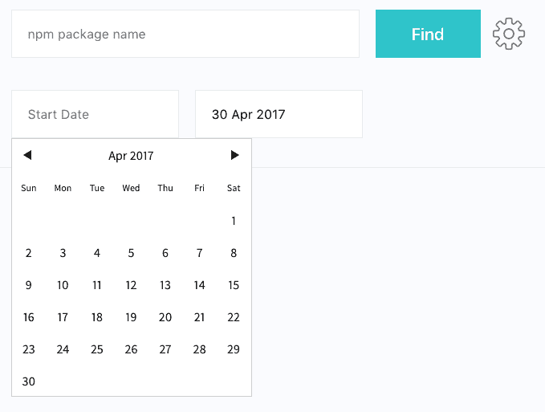
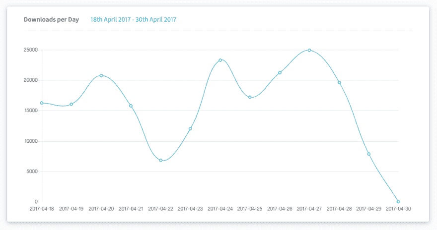
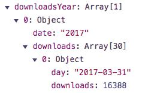
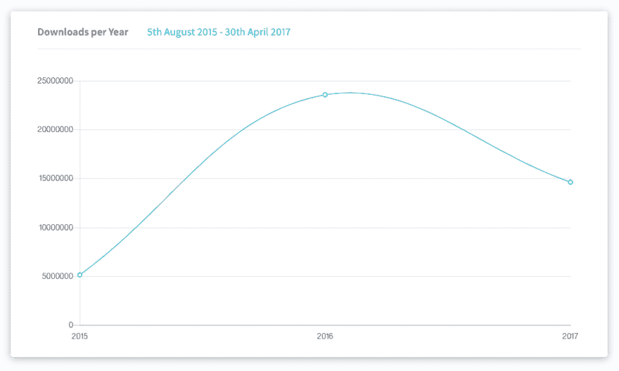

# 让我们用 Vue、Chart.js 和 API Part II 构建一个 Web 应用程序

> 原文:[https://dev . to/aperture less/let-build-a-web-app-with-vue-chart js-and-an-API-part-ii](https://dev.to/apertureless/lets-build-a-web-app-with-vue-chartjs-and-an-api-part-ii)

如果你错过了第一部分，你可以在这里找到它。首先哇！感谢所有的反馈和 twitter 消息！ðÿ':我从未想到会有这么多的观众。但是够了。让我们开始工作吧，ðÿ'。

## 灵魂快速启动

所以，我们正在建造 npm-stats.org。使用 [Vue.js](https://vuejs.org/) 、 [vue-chartjs](http://vue-chartjs.org/#/) 和 [npm](npmjs.org) API 构建的一个小型 web 应用程序，用于获取软件包的下载统计数据并基于这些数据生成图表。

### 到目前为止我们做了什么

简单回顾一下我们在第 1 部分中构建的内容:

*   用`vue-init`创建 vue.js 应用程序
*   安装依赖项并设置`vue-router`
*   用`vue-chartjs`创建折线图组件
*   对 npm 进行 API 调用，并呈现上个月的每日下载统计数据

这已经很多了。最后我们运行了我们的应用程序。然而，总有改进的空间！

### 我们今天要做的事情:

*   添加设置以更改开始和结束周期
*   ðÿ"†集成了一个外部日期选择器组件
*   ðÿ"ˆ改变了我们的数据，增加了一个年度统计图
*   ðÿ“重构我们的方法，稍微干燥一下，这样我们就可以很容易地添加更多的图表

## 设置

现在我们的默认周期被设置为`last-month`，但是如果我们可以设置 startPeriod 和 endPeriod，那就太棒了。这样我们可以检查一整年或更长时间的统计数据。

为此，我们需要添加两个额外的输入字段和数据模型。但是为了更好的用户体验，我们将引入一个外部的日期选择器组件。我们不必重新发明轮子，对吗？ðÿ'“ðÿ”,为了正确安排我们的日期，我们还将引入 moment.js

[T2】](https://res.cloudinary.com/practicaldev/image/fetch/s--EGNat1in--/c_limit%2Cf_auto%2Cfl_progressive%2Cq_auto%2Cw_880/https://i.imgur.com/CHvQS2W.png)

**ðÿ"†安装依赖关系**

`yarn add vuejs-datepicker moment`

Todos 为我们的 **Start.vue** :

*   导入日期选择器
*   为开始和结束期间添加两个 datepicker 字段
*   添加两个数据模型

```
// Start.vue

<template>

...

<datepicker placeholder="Start Date" v-model="periodStart" name="start-date"></datepicker> <datepicker placeholder="Start Date" v-model="periodStart" name="start-date"></datepicker> 
...

</template> 
<script>
  import axios from 'axios'
  import Datepicker from 'vuejs-datepicker'
  import LineChart from '@/components/LineChart'

  export default {
    components: {
      LineChart,
      Datepicker
    },
    data () {
      return {
        package: null,
        packageName: '',
        loaded: false,
        downloads: [],
        labels: [],
        showError: false,
        errorMessage: 'Please enter a package name',
        periodStart: '',
        periodEnd: new Date()
      }
    },

    .....
}

</script> 
```

我们还删除了旧的设置为`last-month`的`period`数据模型。因为周期现在将由`periodStart`和`periodEnd`组成。我们还将`periodEnd`设置为当前日期。因为大多数时候你只会改变开始日期。

我们需要这样的格式:`2017-04-18:2017-04-30`。然而，如果我们现在选择一个日期，我们会得到这样的结果:`2017-04-17T22:00:00.000Z`。一个带有时间属性的`Date()`，这是我们不需要的。这是`moment.js`的一份美差。

### 计算周期

在这种情况下，我们有[计算属性](https://vuejs.org/v2/guide/computed.html)，这是一种愉快的工作。为了让事情更清楚，我们将创建三个属性。格式化的开始日期、格式化的结束日期和合成周期。

```
computed: {
  _endDate () {
    return moment(this.periodEnd).format('YYYY-MM-DD')
  },
  _startDate () {
    return moment(this.periodStart).format('YYYY-MM-DD')
  },
  period () {
    return this.periodStart ? `${this._startDate}:${this._endDate}` : 'last-month'
  }
}, 
```

如果没有设置开始日期，我们希望保持获取上个月数据的默认行为，因此我们将条件添加到`period`属性中。

就是这样！我们不需要改变我们的请求，因为我们只是替换了我们在请求中使用的`period`的内容。你可以在这个[特性分支](https://github.com/apertureless/npm-stats/tree/feature/date_settings_%234)里查看 github 上的代码

## ðÿ"ˆ更多图表

嗯，有每日统计数据的图表很棒。但是我们可以产生更多！我们有所有需要的数据。我们不会转换和分组我们的数据，所以我们可以将它传递到另一个年度统计折线图。我们将重构一些代码。

### 所有这些数据

[T2】](https://res.cloudinary.com/practicaldev/image/fetch/s--5ODiDU5R--/c_limit%2Cf_auto%2Cfl_progressive%2Cq_auto%2Cw_880/https://i.imgur.com/ADk7OoJ.jpg)

因此，我们从 npm api 获得的数据如下所示:

```
data:  [  {day:  "2017-04-18",  downloads:  16280},  {day:  "2017-04-19",  downloads:  14280},  {day:  "2017-04-20",  downloads:  17280}  ] 
```

但是要将它传递给我们的图表，我们需要两个数组，一个是标签(日)，另一个是数据(下载)。对于每日统计，这很容易。因为我们可以简单地使用`map()`来获取数据和标签。然而，现在我们需要做更多的工作。

1.  将我们的`day`键格式化为年份。
2.  对于标签，去掉重复的部分，这样我们就只有唯一的年份了
3.  将同一年的所有下载量相加。

但是首先，现在是重构一些代码的好时机。我们看到第一步是将日期格式化为一年。之后，如果我们想要月度统计数据，我们需要将其格式化为月度格式，以此类推。所以现在是引入一个助手方法并从 **Start.vue** 文件中提取逻辑的好时机。

所以我们创建了`src/utils/dateFormatter.js`，它将帮助我们格式化我们的日期。

```
 import moment from 'moment'

  export const dateToYear = date => moment(date).format('YYYY')
  export const dateToMonth = date => moment(date).format('MMM YYYY')
  export const dateToWeek = date => moment(date).format('GGGG-[W]WW')
  export const dateToDay = date => moment(date).format('YYYY-MM-DD')
  export const dateBeautify = date => moment(date).format('Do MMMM YYYY') 
```

在我们的 **Start.vue** 中，我们现在可以移除`moment` import 并导入我们的助手模块，并用它们替换 moment 语句。(在我们的`_startPeriod`和`_endPeriod`。我们添加了一个新的计算属性，它将替换图表容器中的`period`。

```
 import { dateToYear, dateToDay, dateBeautify } from '../utils/dateFormatter'

  computed: {
    _endDate () {
      return dateToDay(this.periodEnd)
    },
    _startDate () {
       return dateToDay(this.periodStart)
    },
    period () {
      return this.periodStart ? 
             `${this._startDate}:${this._endDate}` : 
             'last-month'
    },
    formattedPeriod () {
      return this.periodStart ? 
      `${dateBeautify(this._startDate)} - ${dateBeautify(this._endDate)}` : 
      'last-month'
    }
  }, 
```

[T2】](https://res.cloudinary.com/practicaldev/image/fetch/s--n12CuyAw--/c_limit%2Cf_auto%2Cfl_progressive%2Cq_auto%2Cw_880/https://i.imgur.com/F4uXvmD.png)

### 时间变换

现在我们创建三个新的数据模型`rawData`，它们将保存我们从 api 调用中获得的下载数据，`downloadsYear: []`和`labelsYear: []`。我们创建了一个叫做`formatYear()`的新方法。

在我们的 axios 请求承诺中，我们将数据下载分配给`rawData`并调用`formatYear()`。

```
 axios.get(`https://api.npmjs.org/downloads/range/${this.period}/${this.package}`)
    .then(response => {
      this.rawData = response.data.downloads // 🆕
      this.downloads = response.data.downloads.map(entry => entry.downloads)
      this.labels = response.data.downloads.map(entry => entry.day)
      this.packageName = response.data.package
      this.formatYear() // 🆕
      this.setURL()
      this.loaded = true

    }) 
```

现在我们将创建两个额外的助手方法。因为我们希望将来有不同的数据转换。比如每周统计和每月统计。为了保持组件的整洁，我们将它们提取到一个单独的文件中。

所以我们创建了我们的`src/utils/downloadFormatter.js`,它将包含两个方法:

1.  removeDuplicate (a，b) {..}
2.  getDownloadsPerYear(data) {...}

在我们的 **Start.vue** 中，我们导入了这两个模块，现在我们可以在我们的`formatYear()`方法中使用它们。

```
formatYear () {
  this.labelsYear = this.rawData
    .map(entry => dateToYear(entry.day))
    .reduce(removeDuplicate, [])
  this.downloadsYear = getDownloadsPerYear(this.rawData)
}, 
```

现在有点棘手了。通常我会写下我的方法，然后再清理。不过，我希望你能跟我到这里。

首先我们需要得到年份，对吗？因此，我们再次使用`map()`来获取`day`键，就像我们在请求每日统计数据时所做的那样。但是现在我们用我们的`dateToYear()`助手来格式化它。所以现在我们的数据看起来像这样:

```
data:  [  {day:  "2017",  downloads:  16280},  {day:  "2017",  downloads:  14280},  {day:  "2017",  downloads:  17280}  ] 
```

现在我们将使用`reduce()`删除重复的年份。因为我们的标签数组只有唯一的年份。因为我们可能不止一次使用它，我们把它提取到我们的`downloadFormatter.js`

在我们的 **downloadFormatter.js** 中，我们现在完成了 removeDuplicate 函数。

```
 export function removeDuplicate (a, b) {
    if (a.indexOf(b) < 0) {
      a.push(b)
    }
    return a
  } 
```

现在我们的`this.labelYear`数组将只包含唯一的年份。是时候对我们的数据进行分组和转换了。为此，我们将再次使用`map()`和`reduce()`和`filter()`。

`rawData`看起来是这样的:

```
data:  [  {day:  "2017-04-18",  downloads:  16280},  {day:  "2017-04-19",  downloads:  14280},  {day:  "2017-04-20",  downloads:  17280}  ] 
```

所以首先我们需要再次找到唯一的日期。我们用`reduce()`做这个，然后我们把一个`map()`链接到它，返回一个带有日期和该日期内的下载的对象。这就是为什么我们在那里使用`filter()`和我们的`dateToYear()`助手。

然而，我们的数据现在看起来像这样:

[T2】](https://res.cloudinary.com/practicaldev/image/fetch/s--_2oLu3b9--/c_limit%2Cf_auto%2Cfl_progressive%2Cq_auto%2Cw_880/https://i.imgur.com/DOeXKI0.png)

但是因为我们现在不需要日期，所以我们`map`它只用于下载，然后使用`reduce()`来总结它。现在我们的对象将包含今年所有下载的总和。然而，它是嵌套的，我们仍然有日期键。

[T2】](https://res.cloudinary.com/practicaldev/image/fetch/s--ouPTPypx--/c_limit%2Cf_auto%2Cfl_progressive%2Cq_auto%2Cw_880/https://i.imgur.com/dHuLcS9.png)

但是最后一个`map()`会解决这个问题。

```
 export const getDownloadsPerYear = (data) => {
    // Find unique dates
    return data.reduce((date, current) => {
      if (date.indexOf(dateToYear(current.day)) < 0) {
        date.push(dateToYear(current.day))
      }
      return date
    }, [])
      .map((date) => {
        return {
          date: date,
          downloads: data.filter(el => dateToYear(el.day) === date)
            .map(el => el.downloads)
            .reduce((total, download) => total + download)
        }
      })
      .map(element => element.downloads)
  } 
```

### 图表时间

现在我们已经完成了转换，可以复制第一个图表的模板并传入`downloadsYear`道具。

[T2】](https://res.cloudinary.com/practicaldev/image/fetch/s--8XJxQPCJ--/c_limit%2Cf_auto%2Cfl_progressive%2Cq_auto%2Cw_880/https://i.imgur.com/vdvwvoA.png)

您可以在这个[特征分支](https://github.com/apertureless/npm-stats/tree/feature/yearly_chart)检查到目前为止的源代码

## ðÿ《重构与更多图表》

现在我们已经完成了数据转换器，添加新图表非常容易。比如每周统计和每月统计。我们可以复制我们的`getDownloadsPerYear()`方法，并将我们的`dateToYear()`助手改为`dateToMonth()`。但是，这不是很干。因为我们最终会有很多方法做着几乎相同的事情。

因此，让我们将我们特定的`getDownloadsPerYear()`方法重构为一个更通用的方法。唯一会改变它的是我们的 dateFormatter 助手。所以我们应该把它作为一个论点，你可以传递给我们的方法。

1.  将我们的方法重命名为更一般的名称，如`groupData`
2.  添加第二个参数，这将是我们的帮助函数
3.  ？？？
4.  利润！

```
export const groupData = (data, dateFormatter) => {
  return data.reduce((date, current) => {
    if (date.indexOf(dateFormatter(current.day)) < 0) {
      date.push(dateFormatter(current.day))
    }
    return date
  }, [])
    .map((date) => {
      return {
        date: date,
        downloads: data.filter(el => dateFormatter(el.day) === date)
          .map(el => el.downloads)
          .reduce((total, download) => total + download)
      }
    })
    .map(element => element.downloads)
} 
```

在我们的 **Start.vue** 中，我们现在需要传递我们的助手函数。

```
this.downloadsYear = groupData(this.rawData, dateToYear) 
```

现在我们也可以对我们的月数据和周数据这样做，只需交换掉`dateToYear`

您可以在这个[特性分支](https://github.com/apertureless/npm-stats/tree/feature/monthly_chart)中找到到目前为止的源代码，还添加了一些内容，比如加载指示器，以及如果 datepicker 值发生更改，将重新获取数据，我在这里没有介绍这些内容。

> 我希望你喜欢它并且学到一些东西。请随时给我反馈！你可以在 twitter 和 T2 github 上关注我