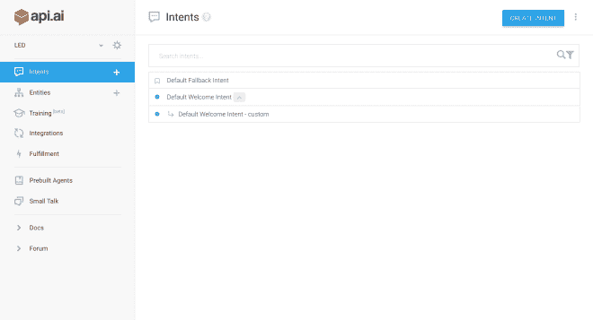
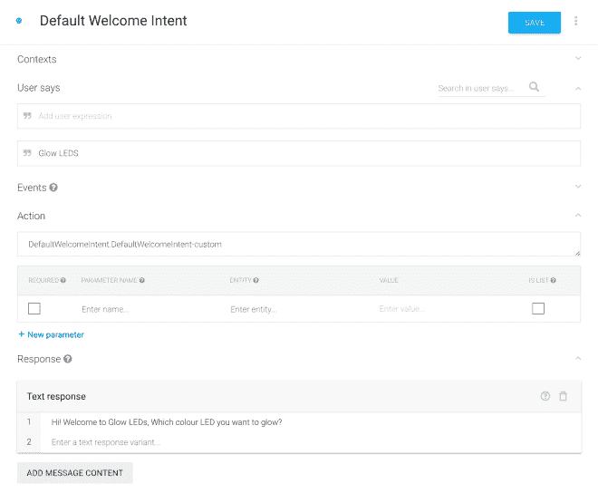
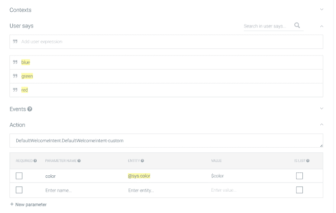
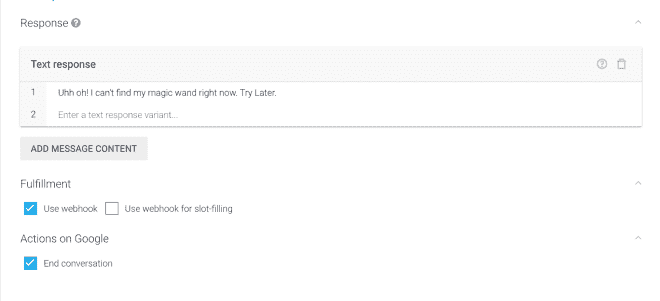
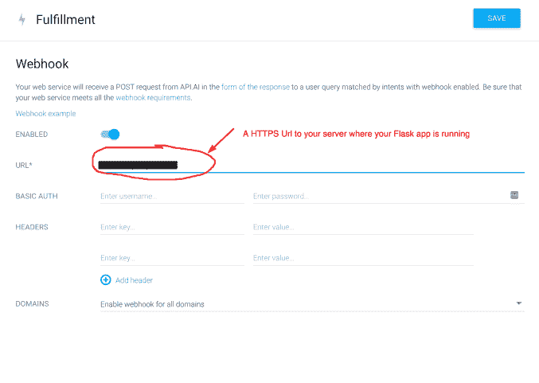
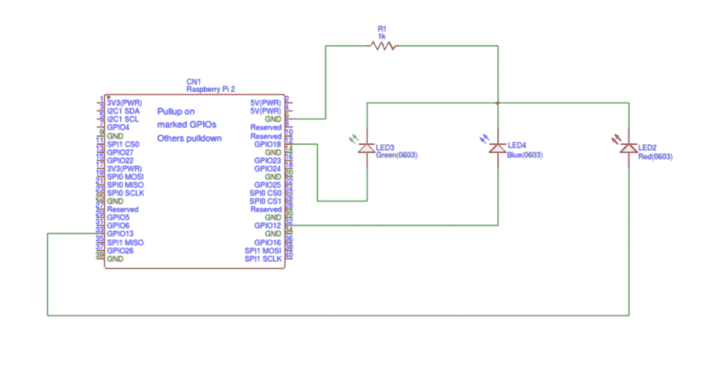

# 谷歌主页发光二极管

> 原文:[https://dev.to/_no_rules_/glow-leds-with-google-home-9mh](https://dev.to/_no_rules_/glow-leds-with-google-home-9mh)

最近我尝试用 Google Home 做实验，尝试语音控制 led。总体来说，整个事情可以分成两部分，

1.  发出 web POST 请求以获取结果的自定义命令。
2.  一个简单的 Flask 应用程序，可以接收带有参数的 post 请求，并根据 POST 请求数据点亮一些 led。

对于第一部分，由于[Google Actions API](https://developers.google.com/actions/develop/conversation)，定制命令成为可能。我用的是 [API。AI](https://api.ai/) 因为他们有很好的文档。我不会详细解释 [Api.ai](https://api.ai) 中的表单字段，他们在文档和解释部分做得很好，我只分享我的配置截图供你快速参考和理解。在 Api.ai 中，对话被分解成**个意图。**我在申请中使用了一个意向(默认欢迎意向)和一个跟进意向(默认欢迎意向–定制)。

[T2】](https://res.cloudinary.com/practicaldev/image/fetch/s--p_ALCi02--/c_limit%2Cf_auto%2Cfl_progressive%2Cq_auto%2Cw_880/https://subhoworld.files.wordpress.com/2017/04/top-intents.png%3Fw%3D660)

这是我的第一个意图，当自定义命令**“发光二极管”**被激活时，基本上是问候用户并询问 LED 的颜色。

[T2】](https://res.cloudinary.com/practicaldev/image/fetch/s--yBGd17Tm--/c_limit%2Cf_auto%2Cfl_progressive%2Cq_auto%2Cw_880/https://subhoworld.files.wordpress.com/2017/04/intent1.png%3Fw%3D660)

正如您可以看到的,**用户说**是定义我的命令的东西，您可以添加多个想要激活命令的语句。当您创建跟进意图时，会设置**动作**和**上下文**。文本响应是你的 Google Home 将使用的响应部分。

接下来是 Followup Intent，它基本上将用户响应作为输入上下文(当您创建 followup intent 时会自动处理)，并查找所需的参数，尝试处理请求。

[T2】](https://res.cloudinary.com/practicaldev/image/fetch/s--F9yzUlna--/c_limit%2Cf_auto%2Cfl_progressive%2Cq_auto%2Cw_880/https://subhoworld.files.wordpress.com/2017/04/user_interaction.png%3Fw%3D660)

这里预期的**用户说**将是一种颜色(红色、蓝色、绿色)是我允许的。在 Api.ai 中，您可以使用它们的 ML 来处理语音，并找到您需要的参数和值。我需要颜色，因此使用了 **@sys.color.** 它们是其他实体，如@sys.address 或@sys.flight 等。如果这些实体不符合您的目的，那么您可能希望使用普通的方法，在 web-api 端处理语音。后续部分的意图有点不同，我们在这里通过 web-hook 实现用户请求。这里的**响应**是 web 请求失败时的后备响应，从 web-hook 响应体接收成功响应。

[T2】](https://res.cloudinary.com/practicaldev/image/fetch/s--vRGgUM6m--/c_limit%2Cf_auto%2Cfl_progressive%2Cq_auto%2Cw_880/https://subhoworld.files.wordpress.com/2017/04/home-response.png%3Fw%3D660)

在您将 webhook 添加到**履行**部分之前，履行选项不会被激活。第一部分到此为止。你也可以使用[谷歌网络模拟器](https://developers.google.com/actions/tools/web-simulator)在旅途中测试你的应用程序。

[T2】](https://res.cloudinary.com/practicaldev/image/fetch/s--0-Bp11fe--/c_limit%2Cf_auto%2Cfl_progressive%2Cq_auto%2Cw_880/https://subhoworld.files.wordpress.com/2017/04/webhook.png%3Fw%3D677%26h%3D482)

在第二部分中，我使用了一个树莓 Pi，3 个 led(红色，蓝色，绿色)，一个 1K 欧姆电阻一些电线，一个试验板(可选)和一个 T-cobbler 板(可选)。现在，我们将编写一个 flask 应用程序，它将接受 post 请求并打开所需的 GPIO 引脚高/低输出。

您可以从 Api.ai 文档中查看您需要的请求和响应结构。接下来，该应用程序接收来自 api.ai webhook 的调用，并根据 **resolvedQuery 触发目标 LED。写上面的代码是为了让我也可以用 get 请求进行本地测试。我使用 pagekite.net 的[来隧道化并向外界公开我的 flask 应用程序。以下是连接的电路图。](http://pagekite.net)**

[T2】](https://res.cloudinary.com/practicaldev/image/fetch/s--W_jaA_KM--/c_limit%2Cf_auto%2Cfl_progressive%2Cq_auto%2Cw_880/https://subhoworld.files.wordpress.com/2017/04/circuit.png%3Fw%3D1027%26h%3D553)

以下是结果，

更多内容如下:

1.  [https://ars technica . com/gadgets/2016/12/Google-assistant-API-launches-today-so-we-tested-some-custom-voice-commands/](https://arstechnica.com/gadgets/2016/12/google-assistant-api-launches-today-so-we-tested-some-custom-voice-commands/)
2.  [https://docs.api.ai/docs/actions-on-google-integration](https://docs.api.ai/docs/actions-on-google-integration)
3.  [https://developers.google.com/actions/develop/conversation](https://developers.google.com/actions/develop/conversation)
4.  [https://developers . Google . com/actions/develop/API ai/tutorials/getting-started](https://developers.google.com/actions/develop/apiai/tutorials/getting-started)
5.  [https://developers.google.com/actions/samples/](https://developers.google.com/actions/samples/)
6.  [https://docs.api.ai/docs/webhook](https://docs.api.ai/docs/webhook)
7.  [https://docs.api.ai/docs/concept-intents#user-says](https://docs.api.ai/docs/concept-intents#user-says)

 