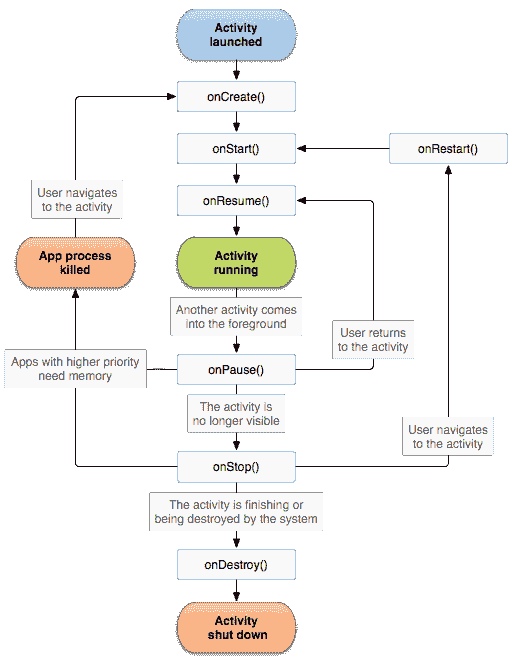

# 我在初级 Android 开发人员中寻找什么

> 原文:[https://dev.to/ditn/what-i-look-for-in-a-junior-android-dev](https://dev.to/ditn/what-i-look-for-in-a-junior-android-dev)

大约一周前，有人在 [/r/androiddev](https://www.reddit.com/r/androiddev/) 上问了这个问题[“每个初级 Android 开发者应该知道的事情是什么？”](https://www.reddit.com/r/androiddev/comments/66obt0/what_are_the_thing_that_every_junior_android/)。作为我这样的人，我在工作的时候浏览了 subreddit(显然是在[编译](https://xkcd.com/303/)的时候),并在早期得到了一个人们似乎非常喜欢的答案。所以这只是我在阐述我的观点。

# 技能组

如果你想以大三学生的身份加入，我希望你知道一些事情。当然，没有一个是特别深入的(不是以一种高人一等的方式)，但是为了让我看到你对这个领域感兴趣并且尽可能多的学习，我希望至少看到以下领域的一些低级知识:

## 活动生命周期

是安卓。这是无法逃避的。这些事件对于开发一个当你因为在床上浏览而意外旋转屏幕时不会崩溃的应用程序来说绝对是至关重要的。

乍一看，这张图并不友好:

[T2】](https://res.cloudinary.com/practicaldev/image/fetch/s--dWnBPLQv--/c_limit%2Cf_auto%2Cfl_progressive%2Cq_auto%2Cw_880/https://cdn-images-1.medium.com/max/800/1%2ACGGROXWhl8dTko1GdDeFsA.png)

但实际上，我不指望一个大三学生能把整件事都背下来。只要你意识到`onCreate`、`onPause`、`onResume`和`onDestroy`，什么导致了它们以及它们的含义，那么你就有了一个好的开始。如果你有点不确定，看看[官方文件](https://developer.android.com/guide/components/activities/activity-lifecycle.html)。如果您给出一个生命周期如何导致内存泄漏的例子，我会印象深刻。

## 安卓组件

任何应用程序的构建模块。只有 4 个主要组成部分:[活动](https://developer.android.com/guide/components/activities/index.html)、[服务](https://developer.android.com/guide/components/services.html)、[内容提供商](https://developer.android.com/guide/topics/providers/content-providers.html)和[广播接收器](https://developer.android.com/guide/components/broadcasts.html)，每一个都在创建一个 Android 应用程序中扮演着重要的角色。你不需要在一个应用程序中包含所有的内容(例如，在我的职业生涯中，我从未需要编写一个内容提供者)，但是我仍然 100%希望看到候选人能够大致解释每个内容提供者的作用，以及他们可能会使用它们做什么。

[T2】](https://res.cloudinary.com/practicaldev/image/fetch/s--RQL4Ag4J--/c_limit%2Cf_auto%2Cfl_progressive%2Cq_auto%2Cw_880/https://cdn-images-1.medium.com/max/800/1%2Aqnf9ecWmWjEv5jhy2qgf1Q.png)

## 暂留选项

在 Android 上保存数据有很多选择，每种都有自己的优缺点和使用案例。Android 开发者网站上有一个[有用的指南](https://developer.android.com/guide/topics/data/data-storage.html)，它解释了如何使用每种类型，我想看看你是否能回忆起它们，以及大致上你可能使用每种类型做什么。

## 联网

这是一个大问题，需要知道的东西太多了，但是对于一个想获得初级职位的人来说，我认为只有几件事是必不可少的。基本的 REST 知识是必须的，如果你不能从一个 Android 应用程序发出简单的 GET 或 POST 请求，那么你会想回去拼凑一些基本的应用程序。几乎所有我能想到的应用程序都会发出 REST 请求，这一点非常重要。如果你想学习绝对的基础知识，Android 的[凌空](https://developer.android.com/training/volley/simple.html)课程是一个很好的起点，但在理想世界中，你会知道这是一种非常过时的做事方式。

因此，如果你使用了诸如翻新之类的替代方法，那么你会处于一个很好的位置。在 Android 上进行联网还有其他一些可能的方式，但现在几乎所有的方式都很小众——[翻新](https://square.github.io/retrofit/)非常简单，与 [OkHttp](https://github.com/square/okhttp) 的功能和灵活性完美结合，并由 Square 的非凡团队定期更新伟大的功能。

除此之外，一些电子监管的知识也很重要。Gson、Jackson、Moshi 或类似公司的经验是一个很好的迹象，因为 2017 年没有人应该手动从 JSON 中提取值。

## Android Studio 技能

自从几年前推出第一个 alpha 版本以来，Android Studio 已经走过了漫长的道路，回到了每个人都使用 Eclipse 的黑暗时代。即使作为一名大三学生，我也希望看到一些你非常了解这个程序的迹象——手动导航到处都是不好的迹象，而且非常低效，所以我喜欢看到人们经常使用快捷方式。事实上，我最喜欢的面试问题之一是问候选人最喜欢的捷径，因为有太多的捷径，我经常会学到一些新东西。

澄清一下，我并不期望你成为忍者。但是对你的工具有一个合理的了解表明了你对这门手艺的兴趣。了解这些中的几个[会让你的工作效率大大提高，并让结对编程变得不那么痛苦。
如果你还在使用 IntelliJ，那也很好，如果你在使用 Eclipse……嗯，我想我更好奇为什么会这样。](https://gautam.io/work/android_studio_shortcuts/)

## 去吧

另一个重要的。令人惊讶的是，现在有人不使用 VCS 系统工作，这对我来说是一个很大的危险信号。如果你现在没有使用 git，你应该使用，虽然学习曲线有点陡，但回报是巨大的。诚然，如果你独自工作到这一步，你可能很难看到好处——直到你意识到你在重构中犯了一个可怕的错误，并希望恢复到应用程序工作时的状态。本指南是一本严肃的指南，将带你开始，老实说，你不需要更多。

即使你只是在 GUI 中使用 git，比如优秀的 [SourceTree](https://www.sourcetreeapp.com/) ，我也没意见。

当然，还有一些其他的 VCS 系统，知道其中任何一个都很好——但是 git 是目前使用最广泛的。

## 设计图案

这一条可能不太重要，我确信许多人使用了一些更常见的模式，却没有意识到它们被归类为“设计模式”。但是如果你知道诸如构建器、单件和工厂方法之类的基础知识，以及你可能在哪里使用它们(或者你甚至可以在 Android SDK 中找到一个例子)，那就太好了。

如果你碰巧拥有或甚至刚刚知道四人帮或有效的 Java，为你加分。说到这个:

## 奖励积分

*   你曾经编写过单元测试，或者理解为什么在 Android 上编写单元测试会如此困难
*   你至少拥有一本经典的开发书籍
*   你已经涉猎了其他语言，尤其是科特林
*   你在游戏商店发布了一些东西

# 其他东西

当然，在申请初级开发人员职位的人身上，我还希望看到其他一些特质，这些特质大部分可以归入“软技能”一栏。在我看来，大三学生的角色主要是尽可能快地学习更多的东西，以便对产品做出有意义的贡献。总的来说，低年级学生最初由高年级学生分配简单的工作，这将逐渐使他们越来越深入到堆栈中，并在此过程中建立开发人员的信心和技能。

因此，要成为一名优秀的大三学生，我认为拥有良好的自学技能是至关重要的，在某种程度上，你可以用我称之为外围知识来证明这一点。您可能不知道如何使用它，但是您知道 RxJava 现在非常热门，而且它已经在您的待办事项列表中有一段时间了。很多博客都在谈论科特林，所以上面也有。你已经听说过那个可怕的世界，在那里我们不得不保持与姜饼的兼容性。你大概知道下一个版本的 Android 会带来什么。诸如此类的事情。

任何表明你已经阅读了一点的东西都是一个很好的标志，即使你只知道一些库/技术/常见问题/特性。
为此，我希望你已经注册了优秀的 [Android Weekly](http://androidweekly.net/) ，浏览了 [/r/androiddev](https://www.reddit.com/r/androiddev/) ，或许还能说出几个业内最有影响力的人，并关注他们的博客、媒体、 [Twitter 账户](https://techbeacon.com/40-leading-android-developers-follow-twitter)等。也许你也听[支离破碎的](http://fragmentedpodcast.com/)。

[T2】](https://res.cloudinary.com/practicaldev/image/fetch/s--UoMk2CO2--/c_limit%2Cf_auto%2Cfl_progressive%2Cq_auto%2Cw_880/https://cdn-images-1.medium.com/max/600/1%2AnG2imNZUOxLAieB89zBhvg.png)

最终，我最想看到的是对这个平台的热情。我已经摆弄 Android 6 年了，开发了 4 年，当我看到 Android 团队的更新时，我仍然很兴奋。直到 Android O 正式发布的几个月后，我才开始期待它的预览版，我立即将(相当不稳定的)alpha 版闪存到我的设备上，因为我必须玩一玩，看看有什么新东西。

当新设备发布时，我喜欢检查它们，我争先恐后地从 APKMirror 获取最新的更新，这些年来，我已经刷新了无数的自定义 rom，并修补了一些设备。我总是在 I/O 播放的时候看，总有一天我会去山景城朝圣。我有几件安卓 t 恤，这对于一个成年男性来说很可笑。如果你能理解这些的话；你是我喜欢的开发人员。

Android 是历史上应用最迅速的技术，我很高兴能参与其中。如果这让你感到兴奋，并且你可以勾选我在这里列出的大部分选项，那么我愿意和你一起工作，我期待着尽可能多地教你关于我热爱的平台的知识。