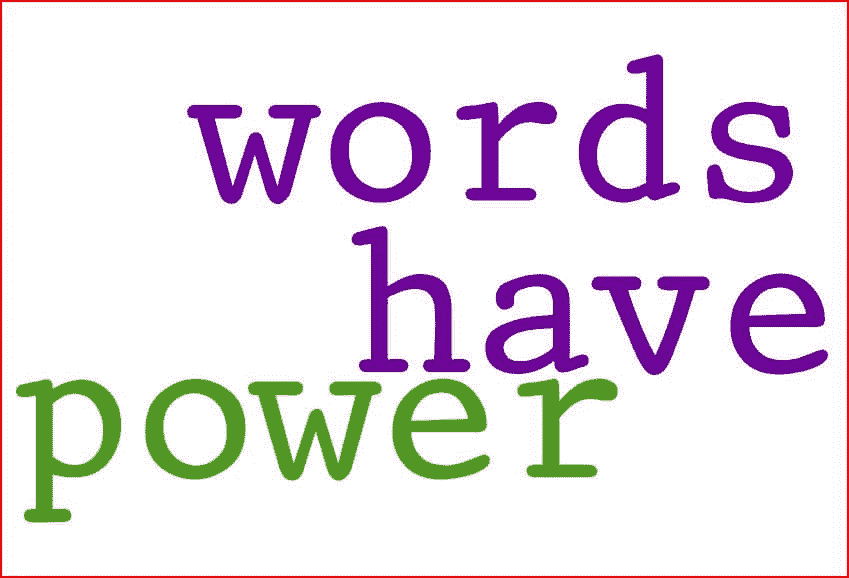
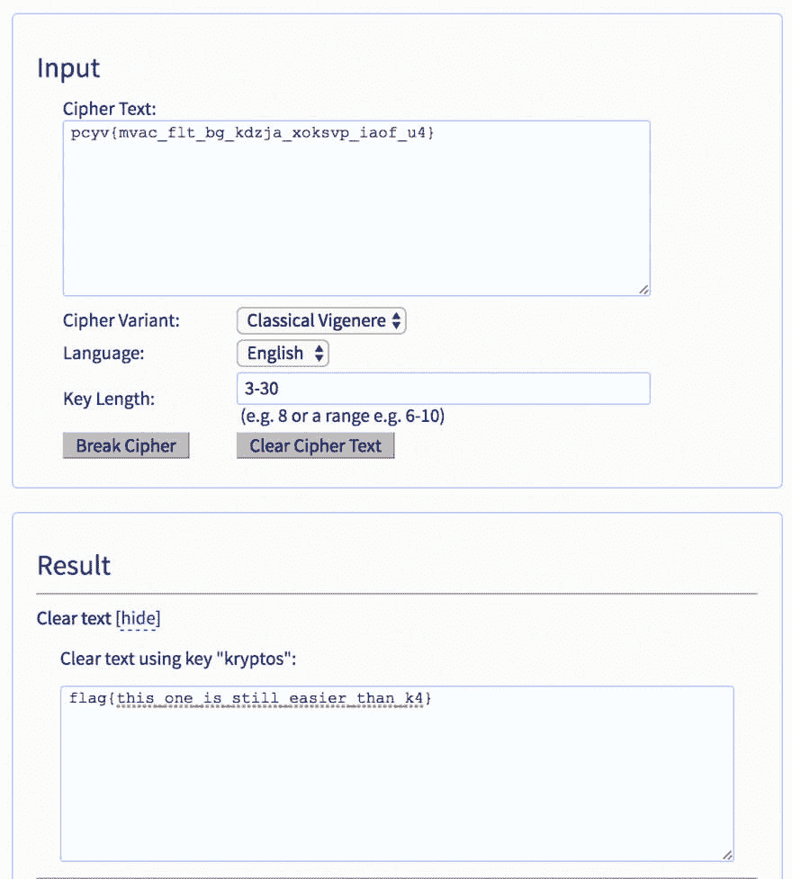
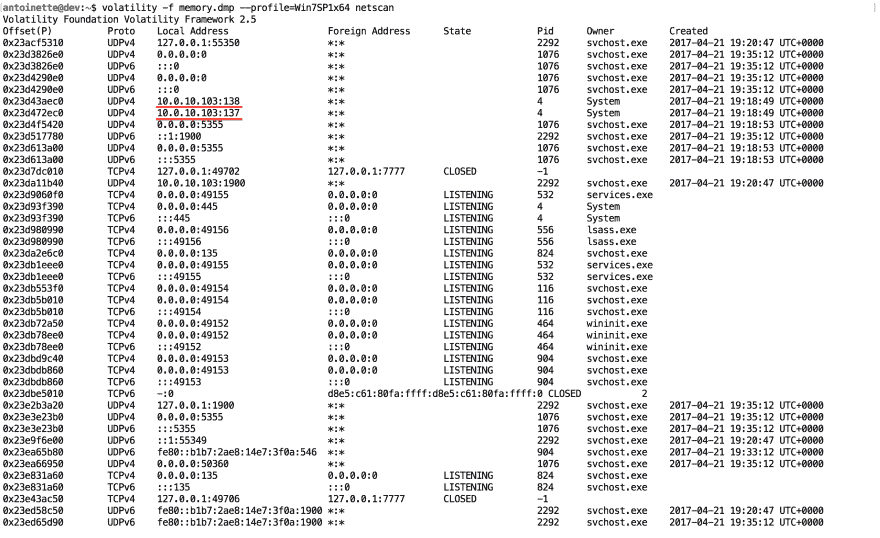
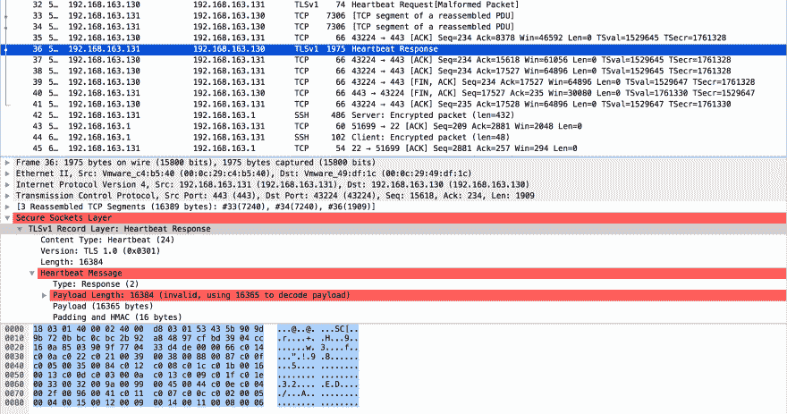

# 夺旗:这是一个黑客游戏...我是说安全专家

> 原文:[https://dev . to/Antoinette 0x 53/capture-the-flag-a-game-for-hacki-mean-security-professionals](https://dev.to/antoinette0x53/capture-the-flag-its-a-game-for-hacki-mean-security-professionals)

# 我的第一次大姑娘夺旗比赛

上周末，我参加了在得梅因举行的一个规模较小的安全会议，并作为安全专业人员参加了我的第一次夺旗比赛。在你开始考虑大型户外空地和体力消耗之前，捕捉旗帜比赛是安全进攻专业人员的游戏，也就是大多数人所说的黑客(红队)和安全防御专业人员(蓝队)以及所有处于中间的人。在 CTF 中，玩家在他们的电脑上互相竞争来解决挑战。

有不同类型的 CTF 竞赛，游戏板的 jeopardy 风格和玩家积极攻击和防御网络基础设施的攻击-防御(红队 vs 蓝队)风格。我将在这里集中讨论 CTF 的危险风格。

通常情况下，jeopardy 风格的 CTF 分为多个类别(这些类别因谁在主持而异，但有一些常数，如加密和数据包分析)，每个类别都有一组用户需要解决的挑战，以便找到标志。该标志通常是一串文本，用户随后将其输入游戏板以获得分数。一个挑战值的分越多，解决的难度就越大(大概)。

> ### "After 7.5 hours, a plate of French fries, two slices of pizza and two slices of aspirin, I turned off my computer and finally got 3,250 points and the sixth place."

衣阿华州 CTF 会议由我们在得梅因地区的网络和信息安全专业人士的本地用户组 [SecDSM](https://secdsm.org/) 促成。CTF 有 6 个类别:无线电波、加密、网络取证、Pwned、主机取证，以及让我们得到物理(~~开锁~~锁匠)。从上午 10 点开始，我和大约。其他 20 个人有 8 个小时完成 CTF。

7.5 个小时，一盘薯条，两片披萨，两片阿司匹林，之后我关闭了电脑，最终获得了 3250 分和第六名。我选择了非常贴近我的技能集，并没有真正扩展到我不具备先验知识的类别。我最终解决了所有 7 项网络取证挑战，8 项主机取证挑战中的 2 项，以及 6 项加密挑战中的 3 项。对于其中的许多挑战，我要么是第一个解决它们的人，要么是前三名。对我的第一个大女儿 CTF 来说还不错。

> ### "The real fun of CTF is the feeling when you find a flag using real exploits and tactics, and it really works (you have hacked something)."

这是一个很好的初学者比赛，它帮助我感觉到我真正属于我的领域。有时，尤其是在技术职业中，很容易患上冒名顶替综合症。这个 CTF 消除了我对自己技能的任何怀疑。我知道我还有很多东西要学，但我也知道我并不只是在做“在你成功之前假装成功”的事情。这也是锻炼我的大脑和扩展我的安全知识的一种非常有趣的方式。尽管我非常接近我所知道的，但在解决我以前不知道或不知道如何做的挑战时，我学到了很多新东西。一些开发人员为了学习新东西而兼职开发应用程序，但是安全专业人员通过黑客攻击和竞争来获取新技能。

CTF 的真正乐趣是当你使用真正的战功和战术找到一面旗帜并且它真的起作用时的那种感觉(你已经黑了一些东西)。CTF 是你合法黑东西的机会(因为未经授权的黑是非常非法的，如果你被抓住，很可能会进监狱)。

# 让我们来看看来自爱荷华州州长 CTF 的一些挑战

## 加密类别

更有趣的加密挑战之一是隐写术挑战。隐写术是将秘密消息隐藏在另一个文件(如图像)中。这是夺旗比赛中常见的挑战。有许多在线工具可以检测隐藏在图像文件中的消息，也有工具可以提取这些消息。

### 隐写术挑战

[T2】](https://res.cloudinary.com/practicaldev/image/fetch/s--PO2jgH1c--/c_limit%2Cf_auto%2Cfl_progressive%2Cq_auto%2Cw_880/https://thepracticaldev.s3.amazonaws.com/i/r0en4dffgin4xceldyjx.jpg)

那张照片看起来很普通，对吗？但是如果我们看一下命令行...

```
$ file Words-Have-Power.jpg 
Words-Have-Power.jpg: JPEG image data, JFIF standard 1.01, resolution (DPI), density 96x96, segment length 16, progressive, precision 8, 849x578, frames 3 
```

<svg width="20px" height="20px" viewBox="0 0 24 24" class="highlight-action crayons-icon highlight-action--fullscreen-on"><title>Enter fullscreen mode</title></svg> <svg width="20px" height="20px" viewBox="0 0 24 24" class="highlight-action crayons-icon highlight-action--fullscreen-off"><title>Exit fullscreen mode</title></svg>

没什么特别的..让我们试试 hexdump

```
$ hexdump -C Words-Have-Power.jpg 
```

<svg width="20px" height="20px" viewBox="0 0 24 24" class="highlight-action crayons-icon highlight-action--fullscreen-on"><title>Enter fullscreen mode</title></svg> <svg width="20px" height="20px" viewBox="0 0 24 24" class="highlight-action crayons-icon highlight-action--fullscreen-off"><title>Exit fullscreen mode</title></svg>

这返回了一堆输出，我不会粘贴在这里，但这里有相关的位:

```
0000a580  00 00 00 1e 00 00 00 08  00 00 00 66 6c 61 67 2e  |...........flag.|
0000a590  74 78 74 7d fa c9 4c 8f  fb d4 5e 8d 43 86 1f 63  |txt}..L...^.C..c|
0000a5a0  f9 f5 dd 12 d0 9d c7 e1  1d 50 5b 26 a5 32 7e ad  |.........P[&.2~.|
0000a5b0  94 04 3e a1 27 3b d4 e5  7f a4 f6 45 43 50 4b 01  |..>.';.....ECPK.|
0000a5c0  02 3f 03 14 03 01 00 00  00 bc 0c 94 4a 21 ff 41  |.?..........J!.A|
0000a5d0  1a 2a 00 00 00 1e 00 00  00 08 00 24 00 00 00 00  |.*.........$....|
0000a5e0  00 00 00 20 80 a4 81 00  00 00 00 66 6c 61 67 2e  |... .......flag.|
0000a5f0  74 78 74 0a 00 20 00 00  00 00 00 01 00 18 00 80  |txt.. ..........|
0000a600  63 53 a4 a0 b9 d2 01 80  70 f5 17 a1 b9 d2 01 80  |cS......p.......|
0000a610  63 53 a4 a0 b9 d2 01 50  4b 05 06 00 00 00 00 01  |cS.....PK.......|
0000a620  00 01 00 5a 00 00 00 50  00 00 00 00 00           |...Z...P.....| 
```

<svg width="20px" height="20px" viewBox="0 0 24 24" class="highlight-action crayons-icon highlight-action--fullscreen-on"><title>Enter fullscreen mode</title></svg> <svg width="20px" height="20px" viewBox="0 0 24 24" class="highlight-action crayons-icon highlight-action--fullscreen-off"><title>Exit fullscreen mode</title></svg>

现在我们知道标志在一个文本文件中，从最后一行我们可以看出 jpg 中隐藏了一个 zip 文件。

如果我们试图拉开拉链..

```
$ unzip Words-Have-Power.jpg
Archive:  Words-Have-Power.jpg
warning [Words-Have-Power.jpg]:  42349 extra bytes at beginning or within zipfile
  (attempting to process anyway)
[Words-Have-Power.jpg] flag.txt password: 
```

<svg width="20px" height="20px" viewBox="0 0 24 24" class="highlight-action crayons-icon highlight-action--fullscreen-on"><title>Enter fullscreen mode</title></svg> <svg width="20px" height="20px" viewBox="0 0 24 24" class="highlight-action crayons-icon highlight-action--fullscreen-off"><title>Exit fullscreen mode</title></svg>

现在我们有一个输入密码的提示。如果我们尝试“wordshavepower”(图片中的单词)...

```
$ unzip Words-Have-Power.jpg
Archive:  Words-Have-Power.jpg
warning [Words-Have-Power.jpg]:  42349 extra bytes at beginning or within zipfile
  (attempting to process anyway)
[Words-Have-Power.jpg] flag.txt password: 
 extracting: flag.txt 
```

<svg width="20px" height="20px" viewBox="0 0 24 24" class="highlight-action crayons-icon highlight-action--fullscreen-on"><title>Enter fullscreen mode</title></svg> <svg width="20px" height="20px" viewBox="0 0 24 24" class="highlight-action crayons-icon highlight-action--fullscreen-off"><title>Exit fullscreen mode</title></svg>

厉害！让我们看看文件是怎么写的

```
$ cat flag.txt 
flag{not_stego_not_even_once} 
```

<svg width="20px" height="20px" viewBox="0 0 24 24" class="highlight-action crayons-icon highlight-action--fullscreen-on"><title>Enter fullscreen mode</title></svg> <svg width="20px" height="20px" viewBox="0 0 24 24" class="highlight-action crayons-icon highlight-action--fullscreen-off"><title>Exit fullscreen mode</title></svg>

### 密码挑战

另一个挑战是要解码的密码挑战:
`pcyv{mvac_flt_bg_kdzja_xoksvp_iaof_u4}`

乍一看，我以为这可能是一个[凯撒密码](https://en.wikipedia.org/wiki/Caesar_cipher)但没有骰子。下一个最流行的密码叫做[维格纳密码](https://en.wikipedia.org/wiki/Vigen%C3%A8re_cipher)。稍后用谷歌快速搜索... [](https://res.cloudinary.com/practicaldev/image/fetch/s--SA9JfyQR--/c_limit%2Cf_auto%2Cfl_progressive%2Cq_auto%2Cw_880/https://thepracticaldev.s3.amazonaws.com/i/dn7uy4p7oxt23yp7xday.png)

这一类别中的其他挑战需要从二进制、Base64、Base32 或 Base16 转换为 ascii，或者解密使用 AES 加密的文件(我没有完成这一项)。

## 主机取证类别

这些挑战要求玩家下载一个 MS 主机转储，并对其进行分析，以找出运行的恶意软件的名称以及 C2(命令和控制)IP 地址和端口。

这个特殊的类别是我最接近尝试我的知识领域之外的东西。我从未在 Windows 机器上做过取证工作，但谷歌是所有人的朋友。我发现我可以使用一个名为 Volatility 的命令行工具来分析转储并找到标志。

下载文件后，我运行了`file`命令来更好地了解我在看什么，因为如果你试图简单地`cat`文件，你会得到一堆胡言乱语。

```
$ file memory.dmp
memory.dmp: MS Windows 64bit crash dump, full dump, 2097152 pages 
```

<svg width="20px" height="20px" viewBox="0 0 24 24" class="highlight-action crayons-icon highlight-action--fullscreen-on"><title>Enter fullscreen mode</title></svg> <svg width="20px" height="20px" viewBox="0 0 24 24" class="highlight-action crayons-icon highlight-action--fullscreen-off"><title>Exit fullscreen mode</title></svg>

我从来没有看过崩溃转储，但快速的谷歌搜索让我找到了 [Volatility](https://github.com/volatilityfoundation/volatility) 和我需要启动并运行的命令。(我还发现另一个 CTF 的[写了一篇](https://www.mogozobo.com/?p=3091)类似的挑战)

我从查看转储中的网络连接开始。如果没有别的，我知道我可能会发现 C2 僵尸网络的联系。
[T3】](https://res.cloudinary.com/practicaldev/image/fetch/s--u_Qhpfp9--/c_limit%2Cf_auto%2Cfl_progressive%2Cq_auto%2Cw_880/https://thepracticaldev.s3.amazonaws.com/i/17gkxznu4eq8fyltsj8c.png)

我注意到服务器被赋予了一个奇怪的外部 IP 地址，该地址有多个出站连接。我过滤了那个 IP 地址，并寻找到一个非标准端口的连接(在这种情况下，不是端口 80 或 433，因为这些是 web 端口，通常不会用于控制僵尸网络)。

```
$ volatility -f memory.dmp --profile=Win7SP1x64 netscan | grep 10.0.10.103
Volatility Foundation Volatility Framework 2.5
0x23d43aec0        UDPv4    10.0.10.103:138                *:*                                   4        System         2017-04-21 19:18:49 UTC+0000
0x23d472ec0        UDPv4    10.0.10.103:137                *:*                                   4        System         2017-04-21 19:18:49 UTC+0000
0x23da11b40        UDPv4    10.0.10.103:1900               *:*                                   2292     svchost.exe    2017-04-21 19:20:47 UTC+0000
0x23f434690        UDPv4    10.0.10.103:68                 *:*                                   904      svchost.exe    2017-04-21 19:35:12 UTC+0000
0x23f21f880        TCPv4    10.0.10.103:49662              174.127.99.252:4576  CLOSED           -1                      
0x23f471010        TCPv4    10.0.10.103:49682              98.139.199.205:443   CLOSED           -1                      
0x23fdbe3b0        TCPv4    10.0.10.103:139                0.0.0.0:0            LISTENING        4        System         
0x23f91c010        TCPv4    10.0.10.103:49665              165.254.114.16:80    CLOSED           -1                      
0x23faa0cd0        TCPv4    10.0.10.103:49698              63.250.200.63:443    CLOSED           -1 
```

<svg width="20px" height="20px" viewBox="0 0 24 24" class="highlight-action crayons-icon highlight-action--fullscreen-on"><title>Enter fullscreen mode</title></svg> <svg width="20px" height="20px" viewBox="0 0 24 24" class="highlight-action crayons-icon highlight-action--fullscreen-off"><title>Exit fullscreen mode</title></svg>

唯一的选择是`174.127.99.252:4576`,结果证明那是正确的旗帜。

下一个挑战是找出感染系统的确切恶意软件。我使用`strings`在垃圾中搜索并过滤了 C2 的 IP 地址，因为我知道该 IP 地址肯定与恶意软件有关联。

```
$ strings -d memory.dmp | grep '174.127.99.252' | more -5
{"NETWORK":[{"PORT":4576,"DNS":"174.127.99.252"}],"INSTALL":true,"MODULE_PATH":"Ns/k/Erc.R","PLUGIN_FOLDER":"fDNTvmjCywD","JRE_FOLDER":"KRBDYF","JAR_FOLDER":"
HfItRcGAvMp","JAR_EXTENSION":"JFKuuO","ENCRYPT_KEY":"mZWoFgfReBJIoLFLZKsOOIaqn","DELAY_INSTALL":2,"NICKNAME":"User","VMWARE":true,"PLUGIN_EXTENSION":"TvEXt","
WEBSITE_PROJECT":"https://jrat.io","JAR_NAME":"kpjCTotwwxd","SECURITY":[{"REG":[{"VALUE":"\"SaveZoneInformation\"=dword:00000001\r\n","KEY":"[HKEY_CURRENT_USE
R\\Software\\Microsoft\\Windows\\CurrentVersion\\Policies\\Attachments]"},{"VALUE":"\"LowRiskFileTypes\"=\".avi;.bat;.com;.cmd;.exe;.htm;.html;.lnk;.mpg;.mpeg
;.mov;.mp3;.msi;.m3u;.rar;.reg;.txt;.vbs;.wav;.zip;.jar;\"\r\n","KEY":"[HKEY_CURRENT_USER\\Software\\Microsoft\\Windows\\CurrentVersion\\Policies\\Association 
```

<svg width="20px" height="20px" viewBox="0 0 24 24" class="highlight-action crayons-icon highlight-action--fullscreen-on"><title>Enter fullscreen mode</title></svg> <svg width="20px" height="20px" viewBox="0 0 24 24" class="highlight-action crayons-icon highlight-action--fullscreen-off"><title>Exit fullscreen mode</title></svg>

在所有这些中，我发现这个恶意软件叫做`jrat.io`，它也是一个标志。

当天晚些时候，我开始研究这个类别。我希望我有更多的时间去尝试其他的挑战，因为我认为我可以解决它们。对于主机取证类别而言，上述两项挑战最有价值。

## 网络取证类别

这一类是我感觉最自在的地方。数据包分析是我日常工作的主要部分。这一类别的挑战有三大主题:网络钓鱼、勒索软件和心脏出血。为了完成这一类别的挑战，所有玩家需要的是 [Wireshark](https://www.wireshark.org/) 以及数据包分析和网络知识。

我会经历心脏出血的挑战。我们不得不下载一个 pcap 文件，它的唯一描述是“损坏”。

### 心脏出血挑战

查看 Wireshark 中的 pcap，我知道这将是一个心脏出血攻击，因为心跳请求和响应。我查看了心脏出血的工作原理，并能猜出从哪里开始观察。([查看我找到的图形解释](https://xkcd.com/1354/))

[T2】](https://res.cloudinary.com/practicaldev/image/fetch/s--gdYTD4-M--/c_limit%2Cf_auto%2Cfl_progressive%2Cq_auto%2Cw_880/https://thepracticaldev.s3.amazonaws.com/i/c0em51s56pl01fue5akg.png)

如果您浏览 heartbleed 响应并将有效载荷复制为您最终找到的文本...

```
SC[r+H9
w3f
"!985
    32ED/A I
42

#ge: en-US,en;q=0.5
Accept-Encoding: gzip, deflate, br
Connection: keep-alive
Upgrade-Insecure-Requests: 1
Content-Length: 28
Pragma: no-cache
Cache-Control: no-cache

bsides={heartbleed_for_life}kYV<V4 
```

<svg width="20px" height="20px" viewBox="0 0 24 24" class="highlight-action crayons-icon highlight-action--fullscreen-on"><title>Enter fullscreen mode</title></svg> <svg width="20px" height="20px" viewBox="0 0 24 24" class="highlight-action crayons-icon highlight-action--fullscreen-off"><title>Exit fullscreen mode</title></svg>

而`bsides={heartbleed_for_life}`是旗帜。

# 试试看

如果你已经走了这么远，而且我没有把你丢在微软的垃圾站里，也许你应该试试“夺旗大赛”。有很多专门为帮助人们学习而设计的初学者 CTF。对于开发人员来说，也有很多专门针对 web 漏洞的 CTF。作为一名开发人员，知道如何在外部威胁到来之前利用自己的应用程序是非常宝贵的。如果你感兴趣，但还不想参加比赛，可以看看这些网站:

*   调情
*   黑客网站
*   [与](http://captf.com/practice-ctf/)一起练习的网站列表
*   [为信息安全协会举办的黑客 CTF 竞赛或挑战做准备的工具和资源](http://resources.infosecinstitute.com/tools-of-trade-and-resources-to-prepare-in-a-hacker-ctf-competition-or-challenge/#gref)

对我使用的命令行实用程序感兴趣吗？

*   [猫](http://www.linfo.org/cat.html)
*   [文件](https://linux.die.net/man/1/file)
*   [grep](http://linuxcommand.org/man_pages/grep1.html)
*   [hexdump](http://linuxcommand.org/man_pages/hexdump1.html)
*   [更](http://man7.org/linux/man-pages/man1/more.1.html)
*   [琴弦](https://linux.die.net/man/1/strings)
*   [拉开拉链](https://linux.die.net/man/1/unzip)
*   [波动性](https://github.com/volatilityfoundation/volatility)

我在 Ubuntu 16.04 数字海洋水滴上完成了大部分挑战。

对学习如何开发 web 应用程序特别感兴趣？我建议试试 [WebGoat](https://www.owasp.org/index.php/Category:OWASP_WebGoat_Project) 。我用它向一群学生演示了 SQL 注入攻击，它非常容易设置和使用。

同样，你不需要知道太多就能参加夺旗比赛。你只需要一种恼人的、不可抗拒的欲望来继续尝试。比赛的目的是学习，所以不要害怕直接跳进去。如果你最终做了 CTF，让我知道进展如何。如果你已经完成了 CTF，你学到了什么？