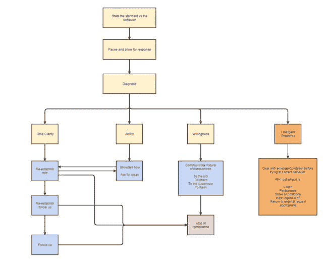

# 问题行为纠正流程图

> 原文：<https://dev.to/monknomo/problem-behavior-correction-flowchart>

几个月前，我参加了[海岸警卫队高级领导原则和技能课程](https://www.uscg.mil/leadership/courses/all_slps.asp)，该课程将[领导力挑战](http://www.leadershipchallenge.com/home.aspx)与一些海岸警卫队的具体内容结合在一起。我非常喜欢这堂课——老师们([查理·科洛](http://mediaeducationlab.com/about/charlie-coiro)和 Cdr 斯科特·琼斯)都很出色。

他们提供的一个资源是海岸警卫队用来解决员工问题行为的技术。这对我来说是一个启示，因为虽然我对如何鼓励有问题的人有一些模糊的认识，但我缺乏一种结构化的干预方式。

海岸警卫队使用的技术提供了一个我喜欢的结构，因为它将问题行为与员工本身分开。培训师说，问题很少是故意的，通常是由于误解或能力不足造成的。

这与我的经验相吻合——本质上，与我一起工作的每个人都是致力于同一个目标的专业人士，问题的出现不是因为愿意，而是因为困惑。

[T2】](http://i.imgur.com/AiRZMuw.png)

这张图表旨在指导领导者如何应对他们所负责的某个问题。领导者应该通过陈述标准和行为来纠正问题行为，倾听然后诊断为什么会有问题行为。根据问题行为的潜在原因，建议采用不同的方法。

这种方法的目的是强调大多数问题行为是误解、环境或训练不足的结果，而不是任何敌意。它进一步强调不要在问题行为停止的点之外应用流程图。它将行为与员工区分开来。

他们在培训中举的例子是一个长期迟到的员工。

## 示例对话框

**主管** : *我看到你今天九点半就来了。我们 9 点开门，我们希望员工到时候已经到了。*

### 角色清晰示例

员工 : *我以为我们的核心工作时间是 10:00 到 2:00，如果我在这段时间里一直工作，我的起止时间就无关紧要了？*

主管 : *这是一些办公室的一个选项，但我们这里还没有开始这个项目。我们工作中的客户服务部分要求我们在 9 点准时接电话。*

-或者-

**主管** : *你说得对，我错了*

### 能力举例

员工 : *我知道，但是我很难起床。我试过闹钟，灯光定时器，但我不知道该怎么办。*

**主管**:*-在这里头脑风暴醒来的方法-*

主管 : *尝试一些按时起床的新方法。9 点钟到这里很重要，所以让我们一个月后再来看看事情进展如何*

### 意愿示例

员工 : *我进去的时候就进去了。你知道我一直都很努力。*

**主管**:*-当争论传到员工耳中时停止-*

主管 : *我知道你工作很努力，我也很感激，但是你工作的一部分就是提供客户服务。如果我们的顾客 9 点就来了，而你不在这里帮助他们，这会让他们陷入困境。你的同事必须为你打掩护，仅仅为了你的方便而加倍他们的职责对他们来说是不公平的。我在这个部门的客户服务表现上得到了评价，我喜欢说我们不仅达到了我们所有的指导方针，尽我们所能提供帮助，而且超越了它们。如果这种情况继续下去，我们将不得不把你放在一个绩效改进计划中，这是一只脚出了门。*

### 突发问题举例

**员工**:*——泪流满面——我的车老是抛锚，我没钱修车，因为我女儿得了癌症，化疗花掉了我所有的额外收入*

**主管**:*-同理心--人性--帮助--*

如果你喜欢这个，请访问我的博客。

[每月收到一封电子邮件，其中包含来自网络的优秀技术和技术领导文章](http://www.gunnargissel.com/pages/email-signup-1.html)

*感谢 [Bruno Kussler Marques](https://flic.kr/p/Uzp9E) 提供的标题图片(这是一个庞蒂克的裁判，对于那些好奇的人)*