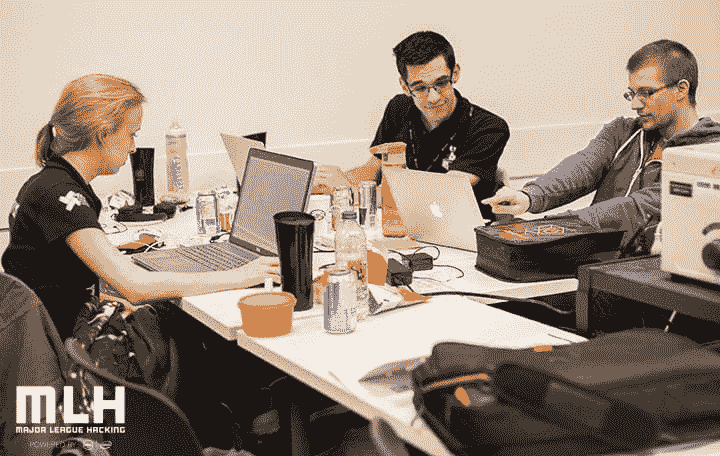
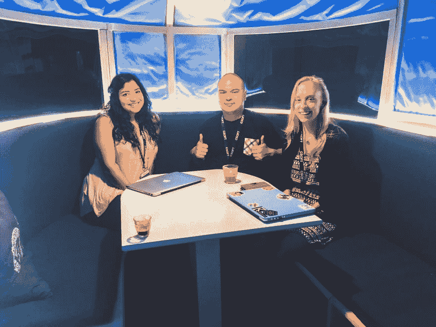

# 赢得下一次黑客马拉松的 10 个技巧

> 原文：<https://dev.to/girlknowstech/10-tips-to-win-your-next-hackathon>

大家好！

2016 年，我参加了我的第一次黑客马拉松。当我搬到蒙特利尔时，我发现了一个美丽的科技社区，那里每个月都有活动。你可能想知道什么是黑客马拉松？嗯，这是一个通常持续一两天的活动，在活动期间召集程序员一起工作并交付一个完整的项目。如果可以用软件或硬件。和黑你的电脑没关系。

我从所有这些黑客马拉松中学到了很多。对我和我的团队来说，slacathonmtl 尤其是一个更大的挑战。在这里，我学到了在黑客马拉松之前和期间需要做的最多的事情，这样它对所有团队成员来说都是一个成功的事件。如果你想知道所有的细节，我会让你读这篇文章。

## 赢得黑客马拉松的秘诀

### 事前事件

**1。提前准备好你的 Trello 或者 PowerPoint**
有时候，你可以在活动开始前准备一些东西，当然，不用写任何代码！在可能的情况下，组织每项任务并将其分配给团队成员。要做到这一点，可以使用 Trello 这样的软件。我已经参加了一个有营销方面的黑客马拉松:准备一个 PowerPoint 模板那天可能会非常有用！这一步是可选的。但是这会给你一个很好的领先优势。到时候，你会节省很多时间。此外，如果你提前计划，每个人都可以做一点研究，以便知道或了解如何完成他们必须完成的任务(见下一点！)

**2。提前弄清楚你将使用什么技术**
如果你做到这一步，它可以再次为你节省许多小时的试错时间！这能让你成功，并在完成申请的过程中更进一步。通常，在黑客马拉松中，我们选择我们还没有完全掌握或者根本没有掌握的技术。这是完美的，因为这是一个学习新事物的绝佳机会，但是如果你几天前就开始学习编程语言的基础知识就更好了。

**3。安装你的工作环境**
最近，我在 nodejs 中编写代码，在事件中我意识到我的 NPM 配置错误。为了能够正确地安装我的项目的依赖项，我损失了至少两个小时来运行 NPM...不要犯同样的错误！

**4。集思广益，找到一个想法**
在我上次的黑客马拉松中，应用了这个技巧的团队名列前茅。在决定性的一天到来之前找到一个革命性的想法也许是这个列表中最重要的建议。在我的黑客马拉松中，我花了很多时间寻找一个想法。另一方面，在某些活动中，赞助商会出席，并可以提出挑战并赢得奖品。你可能会改变主意，不参加这种类型的比赛，但至少你总是有一个替代的想法。

**5。带上你生存 24 小时所需的一切**
当我去参加一个活动时，我会带上所有的东西:枕头、毯子、一瓶水、装咖啡的保温瓶以及一些零食。尽管我从不睡觉，但我总是很高兴带了这些东西，因为我在晚上很舒服。此外，有时也有淋浴。然后你可以带一条毛巾和其他必需品。我也总是带几件 t 恤，因为当你 24 小时不睡觉编码的时候，这很好。此外，活动实际上持续时间远远超过 24 小时，因为在编码时间之后，有时需要长达 8 个小时，直到法官的陈述，闭幕式和宣布获胜者。我的朋友金写了一份参加黑客马拉松需要带什么的[的完整清单，你绝对应该去看看！](https://medium.com/hackconcordia/hackathon-checklist-525cc675a83f)

[T2】](https://res.cloudinary.com/practicaldev/image/fetch/s--uDtasC46--/c_limit%2Cf_auto%2Cfl_progressive%2Cq_auto%2Cw_880/https://thepracticaldev.s3.amazonaws.com/i/muaav0p9gt2ziz3k9cmo.jpg)

### 在黑客马拉松期间

**6。设定小而可实现的目标**
目标太高是非常危险的，你可能最终得到一个毫无功能的应用程序。设定非常小的目标。更容易的是瞄准一个小的功能产品，然后努力增加更多的功能。在一个事件的开始，尤其是在头脑风暴期间，想法可能会变得非常复杂。然而，一旦头脑风暴结束，重要的是要记住你只有 24 小时。现实一点！你也要意识到，随着时间的推移，你会越来越累。通常需要 10 分钟的小错误，当你花了 12 个小时编码时，可能需要 1 个小时。

7 .**。参加很多会议**
了解团队成员的进展是非常重要的。你可以依靠吃饭时间来进行这些会面，如果需要的话，时间还可以多一点。对于上午 9 点左右开始的黑客马拉松来说，合适的会议时间应该是:中午 12 点，下午 2 点，下午 6 点，午夜，凌晨 3 点，早上 6 点，早上 8 点。当问题出现时，这使得重新评估应用程序的任务和目标成为可能。您将能够根据剩余的时间来决定剩余的任务，因为总是需要提供一个功能应用程序。此外，在每次会议上，列出在下次会议前应该完成的任务。这是实现和交付成品的秘诀。

**8。使用 GitHub 对你的代码进行版本控制**
这对于一些人来说似乎是显而易见的，但是我仍然看到人们能够在没有 git 的情况下进行黑客马拉松！如果你累了，在你的代码中犯了一个错误，git 会让你更容易回去修复它。请记住，你不能做太多的提交！在我上一次的黑客马拉松中，我们花了 6 个小时没有做任何提交。这是一个很大的错误，我们最终后悔了，因为错误的提交操作，我们完成了一个充满 bug 的应用程序！；)

**9。休息一下&享受网络研讨会**
参加黑客马拉松的一大优势是有机会学习新技术和结识新朋友。要做到这一点，休息一下，和身边的团队聊聊，参加组织的工作坊，是非常重要的！你应该花些时间去和活动的赞助商谈谈。你将同时获得一些奖品和人脉。

10。保持团队的正能量
所有团队成员时刻保持好心情是很重要的。活动结束大家都会非常非常累。这是参加黑客马拉松的乐趣之一。另一方面，我们必须尊重这种疲劳，不要与我们的朋友发生无谓的争执。如果情绪高涨，一个集体拥抱会解决你所有的问题(我是凭经验说话)！

[T2】](https://res.cloudinary.com/practicaldev/image/fetch/s--CcGKTQwy--/c_limit%2Cf_auto%2Cfl_progressive%2Cq_auto%2Cw_880/https://thepracticaldev.s3.amazonaws.com/i/1skrqvcsbhuzy6f13xzx.jpg)

就是这样！

你觉得我遗漏了什么吗？写在评论区吧！

*本帖最初发布于[girlknowstech.com](https://girlknowstech.com/10-tips-win-hackathon/)T3】*