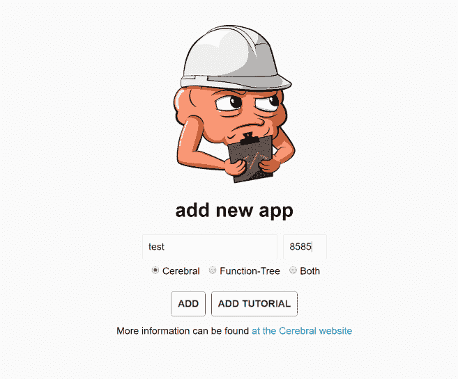
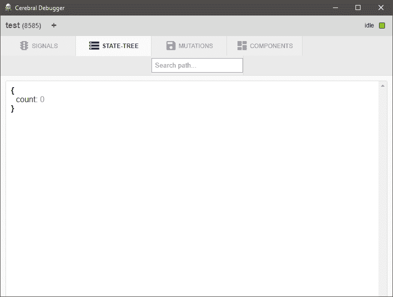
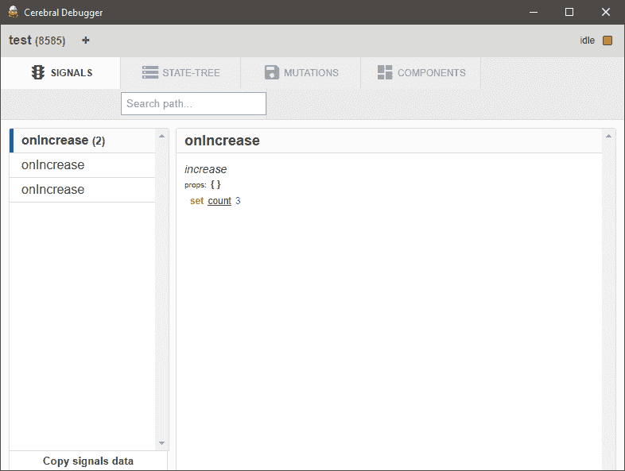

# CerebralJS 第 2 部分-调试器

> 原文:[https://dev.to/reflog/cerebraljs-part-2 调试器](https://dev.to/reflog/cerebraljs-part-2---debugger)

在[之前的帖子](https://dev.to/reflog/cerebraljs)中，我们已经看到了如何使用 brain 创建一个简单的计数器应用程序。

现在让我们开始介绍一些有趣的东西。

第一次启动- **调试器**

就像你在 Redux 中有 Devtools 一样，你在 brain 中也有类似的工具。

它是由主大脑包提供的，为了使用它，你需要将以下代码添加到你的控制器中:

```
 import {Controller} from 'cerebral'
import Devtools from 'cerebral/devtools'

const controller = Controller({
  // You do not want to run the devtools in production as it
  // requires a bit of processing and memory to send data from
  // your application
  devtools: (
    process.env.NODE_ENV === 'production' ?
      null
    :
      Devtools({
        // If running standalone debugger. Some environments
        // might require 127.0.0.1 or computer IP address
        remoteDebugger: 'localhost:8585',

        // By default the devtools tries to reconnect
        // to debugger when it can not be reached, but
        // you can turn it off
        reconnect: true
      })
  )
})

export default controller 
```

<svg width="20px" height="20px" viewBox="0 0 24 24" class="highlight-action crayons-icon highlight-action--fullscreen-on"><title>Enter fullscreen mode</title></svg> <svg width="20px" height="20px" viewBox="0 0 24 24" class="highlight-action crayons-icon highlight-action--fullscreen-off"><title>Exit fullscreen mode</title></svg>

这里是代码的[链接](https://www.webpackbin.com/bins/-KiUIAeQ1xKfkh0B9H6o)

然后，转到[调试器下载页面](http://cerebraljs.com/docs/get_started/debugger.html)并下载您的操作系统的 UI，运行它并选择端口 8585。

[T2】](https://res.cloudinary.com/practicaldev/image/fetch/s--UUeJdEYB--/c_limit%2Cf_auto%2Cfl_progressive%2Cq_auto%2Cw_880/http://blog.reflog.me/uploads/2017/04/24/dbg-1.png)

刷新应用程序后，它将通过 WebSockets 连接到调试器，并在每次状态改变和每个被触发的信号时保持更新。

让我们看看它是如何发生的。选择“状态树”选项卡:

[T2】](https://res.cloudinary.com/practicaldev/image/fetch/s--tf5qn60O--/c_limit%2Cf_auto%2Cfl_progressive%2Cq_auto%2Cw_880/http://blog.reflog.me/uploads/2017/04/24/dbg2-1.png)

因为我们的状态只有“count”变量，而且它的初始值是零——这里没有什么奇怪的。

现在，让我们试着单击几次组件中的加号按钮，然后转到“SIGNALS”选项卡，看看会发生什么:

[T2】](https://res.cloudinary.com/practicaldev/image/fetch/s--SbsFQEE4--/c_limit%2Cf_auto%2Cfl_progressive%2Cq_auto%2Cw_880/http://blog.reflog.me/uploads/2017/04/24/dbg3-1.png)

这真是太酷了！我们有一个所有事件的时间表，每个事件显示状态是如何被修改的，调用了什么操作符，触发了什么信号。

我们还可以访问“组件”选项卡，查看哪些组件是作为这些状态修改的结果而重新呈现的:

[T2】](https://res.cloudinary.com/practicaldev/image/fetch/s--6dI4cUjZ--/c_limit%2Cf_auto%2Cfl_progressive%2Cq_auto%2Cw_880/http://blog.reflog.me/uploads/2017/04/24/dbg4-1.png)

它还显示了渲染时间，这在您开始优化应用程序时非常有用。

暂时就这样了。在下一篇文章中，我将讨论另一个核心的大脑概念:链和操作符。

感谢阅读！