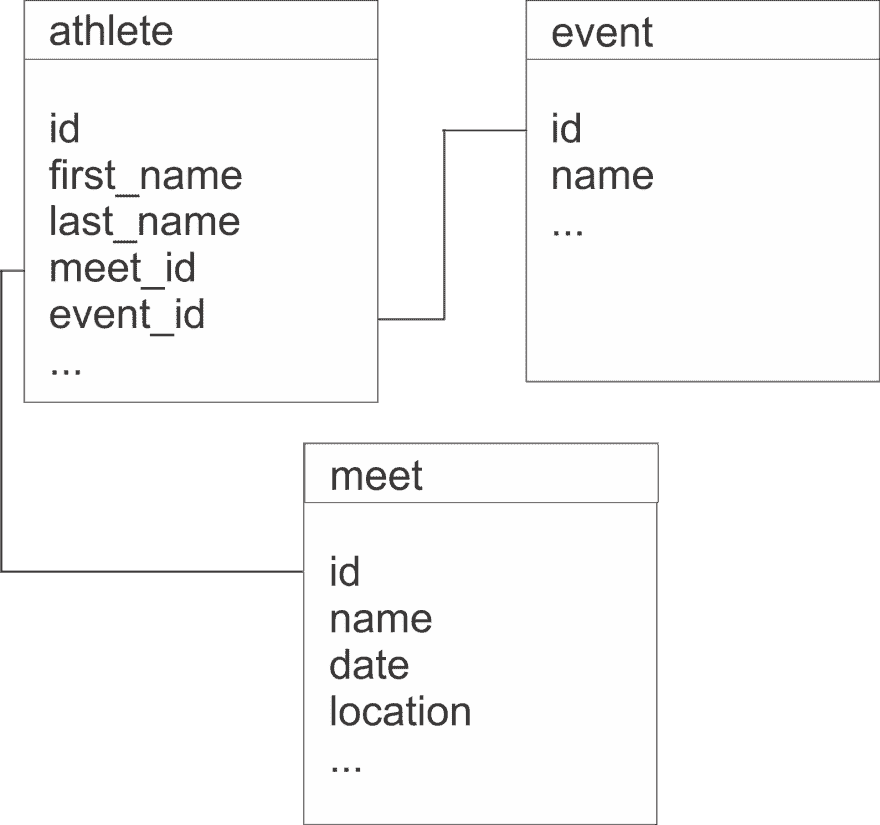
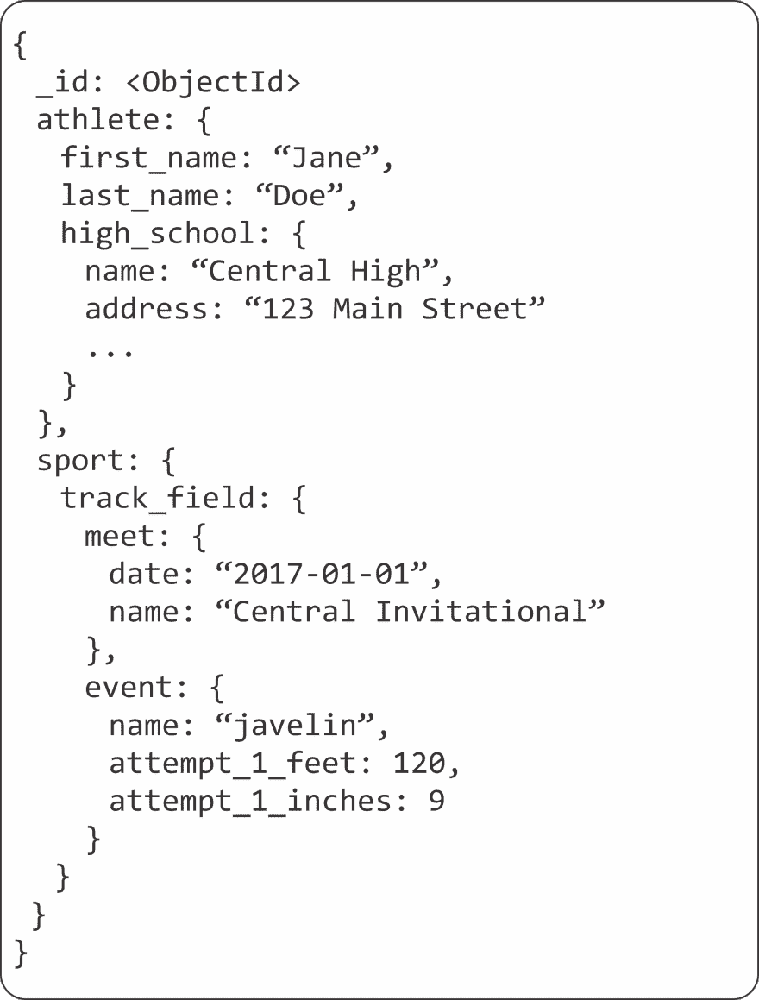
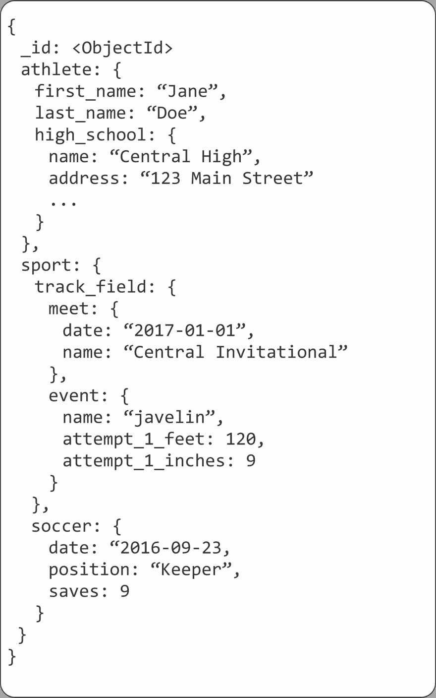

# 用文档建模您的数据

> 原文:[https://dev.to/kenwalger/modeling-your-data-with-documents](https://dev.to/kenwalger/modeling-your-data-with-documents)

我今天写这篇文章的时候，正在等待我的大女儿开始她的高中田径比赛。我看着这些才华横溢的运动员努力让自己的身体超越我个人所能理解的一切，在阵雨和狂风之间，有比赛记录，有心碎。由于这些都是高中生运动员，我的思绪游离于他们的未来之外。他们的运动能力能让他们在大学水平上竞争吗，或者高中会是他们跑步、跳跃和投掷经验的辉煌时期吗？是大学体育奖学金吗？嗯....我女儿标枪技能的招募网站会很有趣。

虽然为她建立一个网站可能会包括静态的成绩数据，但我的数据极客一面想知道如何在数据库中建模田径参赛数据。对于那些已经使用数据有一段时间的人来说，我们开始考虑我们需要的表。显然，对于我们这里的示例，我们需要一个*运动员*表，可能是一个*事件*表，其中列出了可能的事件，另一个是 *meet* 名称，这里仅举几个例子。我们甚至还没有进入数据规范化，对吗？我们应该有一个 *high_school* 表来维护这些信息，一个 *weather* 表来跟踪降雨和风的值，等等。下面是我们的数据库在关系数据库管理系统(RDBMS)世界中可能的样子。

[T2】](https://res.cloudinary.com/practicaldev/image/fetch/s--TMm64kTl--/c_limit%2Cf_auto%2Cfl_progressive%2Cq_auto%2Cw_880/https://thepracticaldev.s3.amazonaws.com/i/vnb29w9agxwo00kv58rb.png)

我们需要所有这些表能够在我们的应用程序中提取数据，以查看无名氏在特定的会议上参加了哪个项目，并将其与所有其他表结合，以便能够生成一些有用的信息供大学体育招生人员查看。从表中的每一行获取相对较小比例的数据似乎需要大量的连接(计算时间)。例如，在 *high_school* 表中，我们可能不需要在学生的网站上显示学校的地址和电话号码，但是如果教练想要联系学校，能够提供该信息的链接就更好了。然而，我们仍然需要进行连接来获取信息。对于我们这些有一些使用 [RDBMS](https://docs.mongodb.com/manual/reference/glossary/#term-rdbms) 技术经验的人来说，这个例子并不太复杂，产生数据和特定连接语句所需的 SQL 也并不可怕，但是我们仍然需要一些计算能力来执行连接和检索数据。

如果有另一种方法来模拟我们的数据呢？如果我们可以用一种更具体的方式来模拟我们的数据，并适合我们向潜在的招聘人员展示运动员技能的需要，会怎么样？此外，如果我们可以做到这一点，从数据库中获取数据，而不需要连接操作，并且仍然可以一次获得应用程序所需的所有数据，那会怎么样呢？听起来很神奇，是吗？嗯，这正是我们可以使用 NoSQL 和文档模型的地方。让我们看看如何在 [MongoDB](https://www.mongodb.com) 中模拟我们运动员的数据。

首先，在文档模型中，我们可以考虑我们的应用程序需要的信息，如运动员姓名、事件、该事件完成的时间/距离、事件发生的时间和地点、运动员来自哪所高中等。

因此，我们的[文档](https://docs.mongodb.com/manual/reference/glossary/#term-document)可以被设计成保存我们的应用程序需要的所有数据。我们可以让我们的文档看起来像这样:

[T2】](https://res.cloudinary.com/practicaldev/image/fetch/s--BKsz4t-W--/c_limit%2Cf_auto%2Cfl_progressive%2Cq_auto%2Cw_880/https://thepracticaldev.s3.amazonaws.com/i/7sip8pb7yu6gc76rje6z.png)

对于这种格式，有些东西似乎也很熟悉。它是用 [JSON](https://docs.mongodb.com/manual/reference/glossary/#term-json) 建模的，至少对我来说，这是一种更友好的表格格式。也让我们快速发展。当我们的学生决定在秋季和冬季进行另一项运动时会发生什么？在我们的 RDMS 模型中，这将涉及更多的表和连接。在我们文档模型中，我们可以简单地向文档中添加另一个我们想要跟踪的运动名称、事件和统计数据。

[T2】](https://res.cloudinary.com/practicaldev/image/fetch/s--4B4PIqF6--/c_limit%2Cf_auto%2Cfl_progressive%2Cq_auto%2Cw_880/https://thepracticaldev.s3.amazonaws.com/i/pze9tjcw1e3vixxsxc81.png)

我们的文档模型的另一个伟大的特性是我们不需要关心空值。如果一个运动员不参加跳远，就没有理由保持它的价值。如果他们在某次运动会上突然参加了跳远比赛，我们也可以记录这些数据。类似地，如果 Jane 和 Kendra 参与不同的运动，他们的模式看起来和不同的信息完全没问题。这是[灵活模式](https://docs.mongodb.com/manual/core/data-modeling-introduction/)的概念，非常强大。

使用文档模型变得越来越流行有几个原因。其中一些是:

*   许多应用程序生成的大量数据加上不断变化的数据类型。
*   快速开发时间和敏捷开发实践通常需要产品的快速迭代。文档数据模型中灵活的模式很容易做到这一点。
*   从单一设备到单一受众访问数据的时代已经一去不复返了。在当今世界中，数据需要始终在线且可全球访问，这就要求数据存储能够相应地扩展并提供特定于应用程序的数据。

出于所有这些原因，以及开发的容易性和速度，文档数据模型不应该在您的下一个项目中打折扣。其实我可能只是把这样的模式用在女儿的招聘网站上。在田径运动会上度过漫长的一天后，她以 92 英尺 6 英寸的成绩掷出了她有史以来第二好的标枪。也许我没有进入 NCAA 分部，但也许某个地方的大学会注意到她，因为她有一个文档模型支持的 web 应用程序。

*在 Twitter [@kenwalger](https://www.twitter.com/kenwalger) 上关注我，获取我发布的最新消息，或者在[我的博客](https://www.kenwalger.com/blog)上查看原始帖子。*