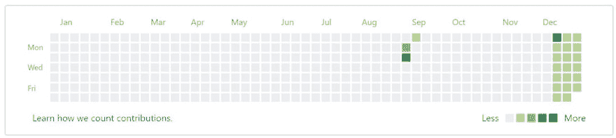
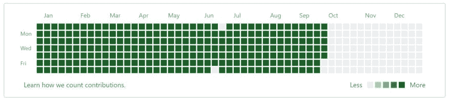
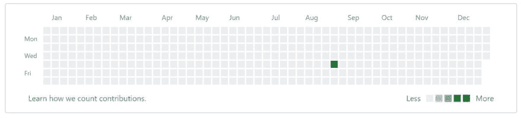
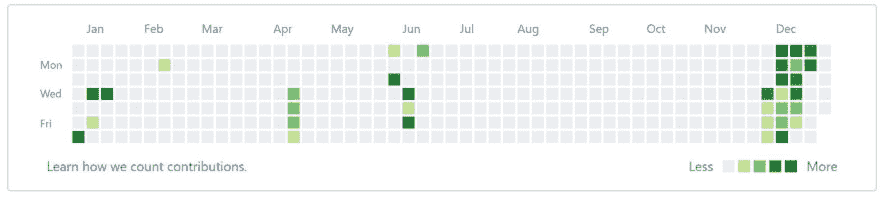
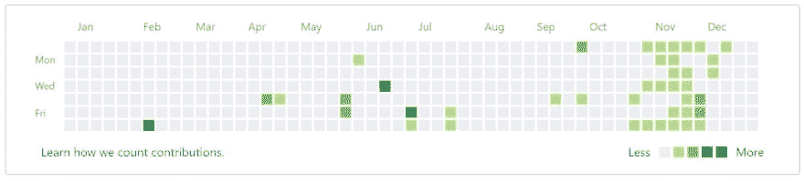

# GitHub 历史

> 原文:[https://dev.to/funkysi1701/github-history-1com](https://dev.to/funkysi1701/github-history-1com)

我在 2010 年 8 月创建了我的 GitHub 账户，让我们看看我用它做了什么。

[T2】](https://res.cloudinary.com/practicaldev/image/fetch/s--p0w9CzxJ--/c_limit%2Cf_auto%2Cfl_progressive%2Cq_auto%2Cw_880/https://storageaccountblog9f5d.blob.core.windows.net/blazor/wp-content/uploads/2017/04/git10.jpg%3Fresize%3D768%252C173%26ssl%3D1)

2010 年，我开始提交我创建的一个旧 php 网站的代码。然后在 12 月，我提交了一些其他的 php 站点。

[T2】](https://res.cloudinary.com/practicaldev/image/fetch/s--6Lm6XwCO--/c_limit%2Cf_auto%2Cfl_progressive%2Cq_auto%2Cw_880/https://storageaccountblog9f5d.blob.core.windows.net/blazor/wp-content/uploads/2017/04/git11.jpg%3Fresize%3D768%252C171%26ssl%3D1)

在 2010 年 12 月 12 日到 2011 年 9 月 29 日之间，我一定创建了一些自动化流程，这就是为什么每天都有提交。从差异来看，它似乎与跟踪网站访问者有关。我想当时我还没听说过。gitignore 文件！

[T2】](https://res.cloudinary.com/practicaldev/image/fetch/s--sk4IetBn--/c_limit%2Cf_auto%2Cfl_progressive%2Cq_auto%2Cw_880/https://storageaccountblog9f5d.blob.core.windows.net/blazor/wp-content/uploads/2017/04/git14.jpg%3Fresize%3D768%252C174%26ssl%3D1)

直到 2014 年，我开始编译代码样本集，这是我想展示的一些代码，我从 2015 年开始添加到这里，所以我真的应该回到这里，因为从那时起我的技能有了一些发展。

[T2】](https://res.cloudinary.com/practicaldev/image/fetch/s--SPUdxxeG--/c_limit%2Cf_auto%2Cfl_progressive%2Cq_auto%2Cw_880/https://storageaccountblog9f5d.blob.core.windows.net/blazor/wp-content/uploads/2017/04/git15.jpg%3Fresize%3D768%252C173%26ssl%3D1)

在 2015 年，我真正开始把自己当成一名开发人员，我为 Raspberry Pi 添加了存储库，以及我的一些 C#想法。这一年结束时，我参加了《代码的降临》

[T2】](https://res.cloudinary.com/practicaldev/image/fetch/s--wsS883Hu--/c_limit%2Cf_auto%2Cfl_progressive%2Cq_auto%2Cw_880/https://storageaccountblog9f5d.blob.core.windows.net/blazor/wp-content/uploads/2017/04/git16.jpg%3Fresize%3D768%252C173%26ssl%3D1)

我去年做了什么？嗯，我开始去 York Code Dojo，这意味着从他们的代码示例中获得许多分叉，也是我的第一个 pull 请求。我也看了很多其他的库，试图找到一个好的开源项目，但是仍然没有找到一个适合我的。最后，我以一点代码的出现结束了 2016 年。

不知道这篇博文有多吸引人，但是看到不同的提交历史很有意思。