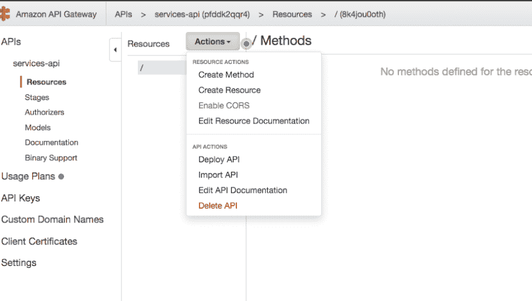
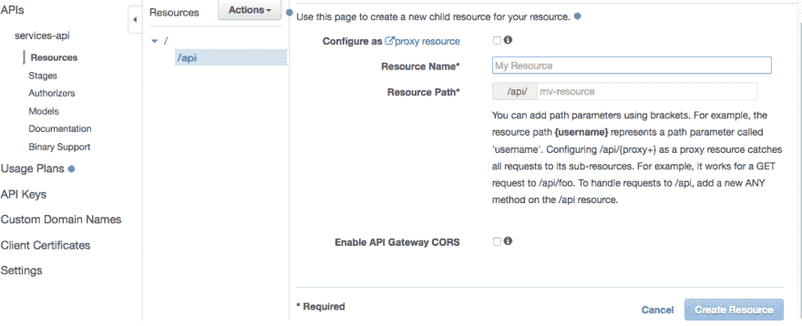
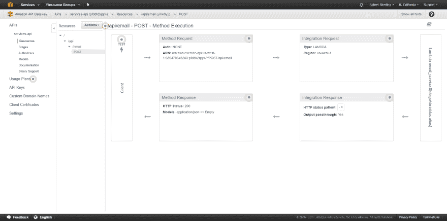

# AWS Cloud 的无服务器后端:API 网关和您

> 原文:[https://dev . to/rob 117/server less-backends-with-AWS-cloud-API-gateway-and-you](https://dev.to/rob117/serverless-backends-with-aws-cloud-api-gateway-and-you)

这是 AWS 无服务器架构系列的一部分。在这里和我的博客 [J-bytes](http://robsherling.com/jbytes/index.php/2017/01/08/serverless-backends-with-aws-cloud-intro/) 上都可以找到原始的博文系列。

# 同步网关

关于 api 网关，您应该知道两件事。

如果您不够细致的话，集成响应操作与正则表达式结合起来会是一场可怕的噩梦。它没有任何类型的内置版本控制。
我们将使用它来管理我们的 lambdas。系好安全带。

每次成功部署和测试一个阶段之后(稍后将详细介绍)，我假设您明智地将该阶段导出为一个 swagger/yaml 文件，并将其保存在本地机器的版本控制中。版本控制，每次都是。它不会使你的文件免于被随意删除，但是它可以使重建更快。

我们将创建一个指向 lambda 函数多个版本的网关(我们上次创建的 staging 和 production 别名版本)。这将需要使用 AWS CLI 和 stage 变量。

打开 API 网关选项卡。点击**开始**。

点击页面顶部的**新 API** 单选按钮。
这个 api 将处理我们网站的所有调用(电子邮件、twitter 等)，所以让我们称它为我们网站想要使用的东西。我将把我的服务叫做**服务-api** (不过你可以把它叫做任何东西)。

点击**创建 API。**

点击我们新创建的**服务-api** 。单击资源按钮。你的屏幕应该是这样的。

[T2】](https://res.cloudinary.com/practicaldev/image/fetch/s--3KzFaYDK--/c_limit%2Cf_auto%2Cfl_progressive%2Cq_auto%2Cw_880/http://robsherling.com/jbytes/wp-content/uploads/2017/01/Screen-Shot-2017-01-09-at-16.40.31.png)

点击**创建资源**并在资源路径中键入 **api** 。然后点击蓝色的**创建资源**按钮。

选择我们新创建的 api 资源，创建另一个资源。您的屏幕应该是这样的(注意，默认的资源路径选择是由/api/自动进行的。这个好)。

[T2】](https://res.cloudinary.com/practicaldev/image/fetch/s--IS0pibbK--/c_limit%2Cf_auto%2Cfl_progressive%2Cq_auto%2Cw_880/http://robsherling.com/jbytes/wp-content/uploads/2017/01/Screen-Shot-2017-01-09-at-16.43.28.png)

对于资源名，写 **email** 。创建资源。

选择新创建的电子邮件资源，然后点击**创建方法**并从下拉列表中选择 POST。

[T2】](https://res.cloudinary.com/practicaldev/image/fetch/s--bZ4tRpO9--/c_limit%2Cf_auto%2Cfl_progressive%2Cq_auto%2Cw_880/http://robsherling.com/jbytes/wp-content/uploads/2017/01/Screen-Shot-2017-01-09-at-16.45.25.png)

单击复选标记进行确认。对于集成类型，选择 lambda 函数。不要勾选复选框，选择 lambda 所在的地区。对于 lambda 函数名，键入`email_service:${stageVariables.alias}`并单击 save。不要惊慌。

你看到的是 AWS 说你必须手动批准某些 API 网关和 Lambda 连接。不幸的是，因为我们希望 staging API 转到 staging 别名的 lambda，而 production api 转到 production lambdas，所以我们需要将 lambda 别名保存在 staging 级别的变量中，并使用它来动态调用适当的 lambda。如果这听起来很混乱，那是因为它是。当你看到它的时候，它会变得更加清晰。因为这可以用于让任何阶段调用任何 lambda，所以我们必须手动批准允许从我们的阶段调用哪些别名。让我们现在做那件事。

如果您还没有安装 AWS CLI 工具，请安装(在您的机器上谷歌一下，非常简单)。完成这些操作(并配置它们)后，将深灰色框中的恐慌文本复制到您的终端中，但暂时不要按 enter 键。将显示`email_service:${stageVariables.lambdaAlias}`的部分更改为`email_service:staging`,然后按回车键。您应该会看到一些以单词**语句**开头的输出。再次粘贴相同的代码/点击进入之前的输入，现在将其改为`email_service:production`。再次按回车键。再次观察以**语句**开始的响应。

现在我们已经完成了 lambda 的基本连接，在测试之前，我们需要配置一些东西。

回到 AWS 面板，在你点击**ok**确认你做了手动确认后，点击 email 下的 **post** 部分。您应该会看到这个屏幕:

~ 

点击右上角的**整合请求**。点击**正文映射模板**下拉菜单，然后在没有定义模板(推荐)时，将**请求正文通过**选项更改为**。**

点击蓝色 **+** 添加映射类型。
我假设您的网站存储在 S3 的静态文件中，并配置为以这种方式提供内容，所以我们需要 application/x-www-form-urlencoded。如果您希望在这里使用 JSON，您可以在这里使用 application/json，但是您可能也不想返回 301 重定向，因为它可能是 AJAX，需要适当地编辑您的代码。

添加**应用程序/x-www-form-urlencoded** 并点击检查。稍微向下滚动，你会看到一个下拉框，显示**生成模板**。将其设置为**方法请求通过**并点击保存。

回到上面截图中的屏幕(方法执行面板)，点击**方法响应。**
点击**添加响应**，输入 **301** 。单击复选标记。然后单击 301 旁边的下拉箭头。点击**添加标题**，键入**位置**。单击复选标记。

再次返回方法执行面板，点击**集成响应**。删除已有的响应，然后点击**添加整合响应**。

对于 lambda 错误正则表达式，写`^Email.MovedPermanently.*` [(来源)](https://aws.amazon.com/jp/blogs/compute/redirection-in-a-serverless-api-with-aws-lambda-and-amazon-api-gateway/)。根据您想要捕获的内容，您可以编写许多其他的正则表达式。在英语中，这种方法是 AWS 官方推荐的，也是我唯一能找到的，但是如果你不想有多种类型的重定向/错误。*作为正则表达式工作正常[(来源)](http://qiita.com/takyam/items/1789b4bea02f608e7a05)。
对于方法响应状态，选择我们之前制作的 301。
保存，然后展开我们新创建的集成响应的下拉列表。在 Header Mappings 下，其中显示 Response header 的值为 Location，在 value 框**中写入 integration . Response . body . error type**。单击复选框，然后单击蓝色的保存按钮。

返回到方法执行面板，将 HTTP 状态模式的集成响应内部的下拉列表更改为我们刚刚创建的 regex(您可能需要刷新页面)。

单击操作下拉列表:

[T2】](https://res.cloudinary.com/practicaldev/image/fetch/s--o27PSfx2--/c_limit%2Cf_auto%2Cfl_progressive%2Cq_auto%2Cw_880/http://robsherling.com/jbytes/wp-content/uploads/2017/01/actions-deploy-api.png)

点击**部署 API** 。在弹出窗口中，在部署阶段下，我们将选择**【新阶段】**。对于舞台名称，键入**舞台**。对于描述，无论你喜欢什么。点击部署。

现在，您将看到暂存阶段。点击**阶段变量**选项卡。点击**添加阶段变量。**对于名称，键入**别名**。对于 Value，键入 **staging** 。单击复选标记。

这就是我们的`email_service:${stagingVariables.alias}`开始发挥作用的地方。这就是我们告诉 staging API 调用 email_service:staging alias 的方式。

单击左侧的资源，然后单击操作，再单击部署 API。再次单击 new stage，并将名称设置为 production。转到阶段变量，单击添加阶段变量，并使用**别名**和**生产**作为键和值。注意:无论何时重新部署，都不必重置阶段变量。

这应该结束了我们的设置，所以让我们把它备份到一个 yaml 文件。我们实际上也可以选择将其备份为 JSON，但是(我不骗你)因为我们没有选择 application/json 作为映射类型，所以如果我们试图从该文件恢复，就会破坏 API。没有警告，没有错误，只是中断。如果这不是你的经历，请让我知道；如果只是我的错误，我不想唱衰 API 网关。

转到 export 选项卡，单击 Export as Swagger+API Gateway Extensions，复制 yaml 并将其粘贴到版本控制中。如果需要，您可以通过单击“资源”->“操作”->“导入 API”来恢复。

我们现在有了 api 网关设置。让我们来测试一下:启动邮差。

如果您想查看您需要发布的 URL，只需单击左侧的阶段，然后单击您感兴趣的阶段。在下拉列表中，单击/api/email 下绿色 POST 方法。调用 URL 旁边的链接是您需要发布的内容。在 Postman 中，将您的 body 设置为 x-www-form-urlencoded，然后为您的 key 编写 **email** ，该值是您想要确认的任何测试电子邮件。

发送，你应该会得到一个光荣的重定向。如果在重定向中没有看到网站回拨的 html，请注意以下几点:

缺少身份验证令牌的响应-> URL 键入错误或 https 错误(应该还没有 https 错误，因此在此阶段几乎总是 URL)
内部服务器错误，但 lambda 正常工作(您有日志和电子邮件)- > API 集成响应头的正则表达式或位置映射有拼写错误。
内部服务器出错，没有邮件- >？？？如果你有这个，但是你对我们上一章构建的 lambda 的测试工作正常，那就真的，真的出错了，你可能需要重做这一章的很多内容。
API 网关连接部分到此结束！如果你发一个帖子到 staging vs production，它应该调用不同的 lambdas！

接下来，我们将设置一些很酷的 twitter 内容来实时发布 tweet，并关注一些 twitter 帐户。