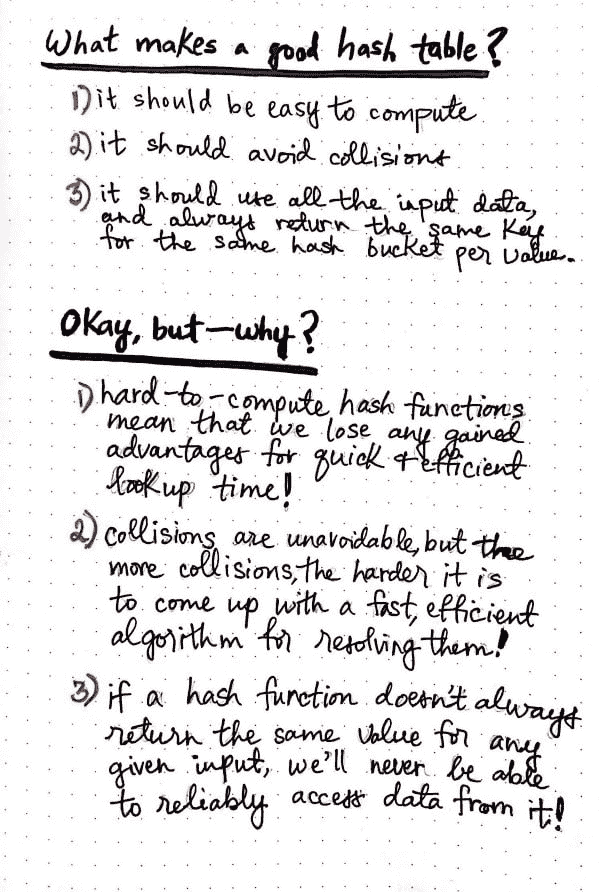
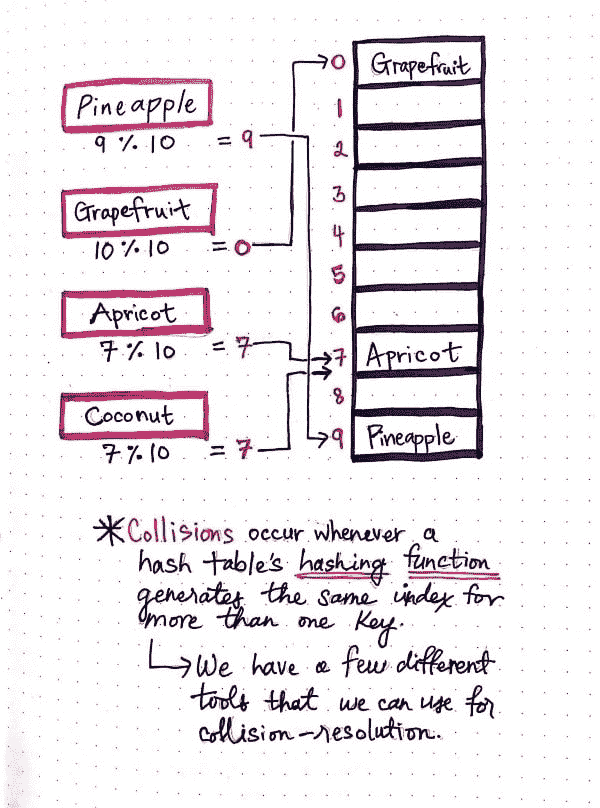
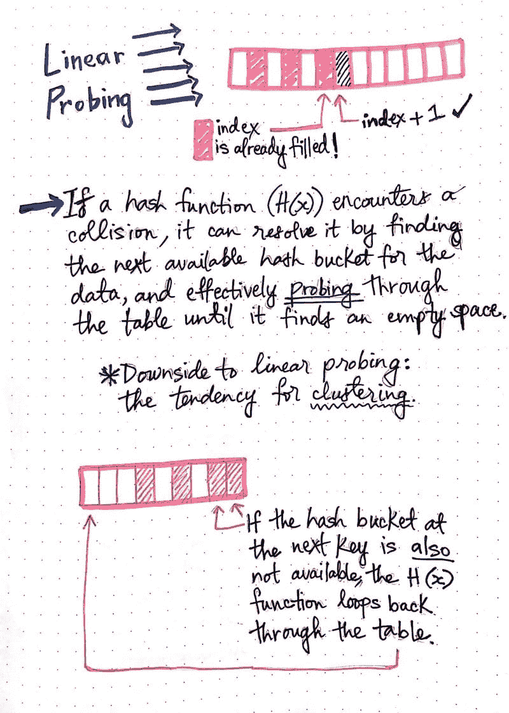
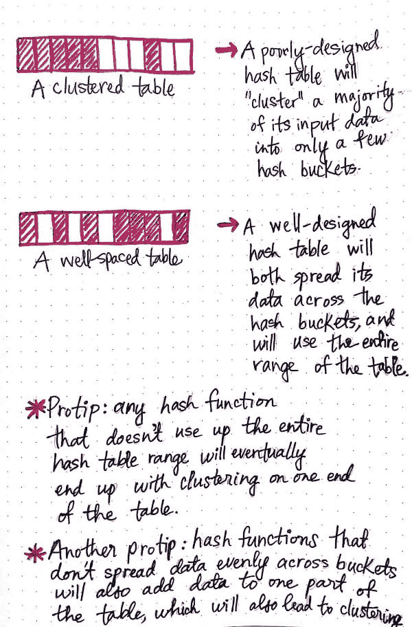
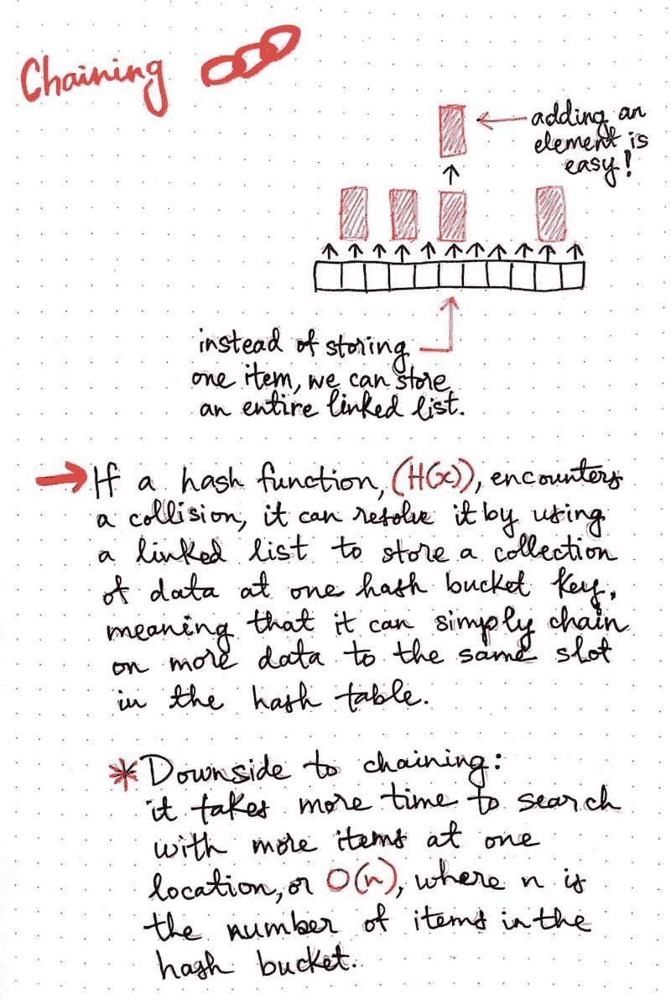
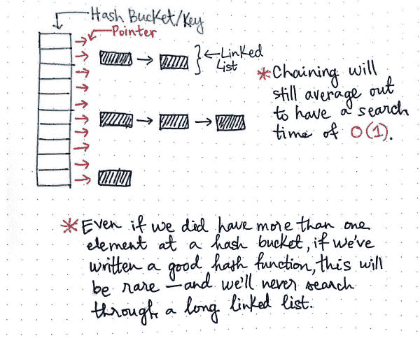
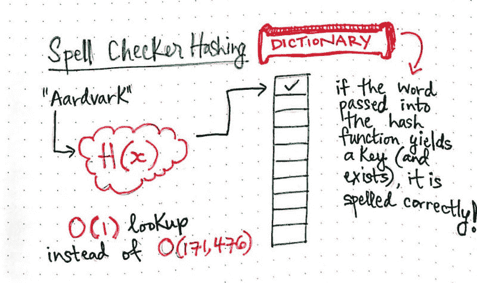

# 散列出散列函数

> 原文：<https://dev.to/vaidehijoshi/hashing-out-hash-functions>

在过去的几个月里，我注意到我在计算机科学领域学到的每一个新概念都有一个特点:任何事物都有它的缺点。

事实上，我猜想这实际上是软件的一个普遍特征，老实说，是任何创造性的技术工艺的特征。无论我们是编写一点点代码，还是构建一个大型复杂的系统，我们总是有许多工具可供选择。当然，诀窍在于知道哪种工具最适合这项工作。为了真正擅长选择正确工具的决策过程，我们必须知道它的优点和缺点，以便做出公正的评估。

我们最近发现的哈希表是快速存储和检索特定数据的非常好的选择。它们并不总是*工作的最佳工具——例如，它们不太适合查找有序数据——但有时，它们可以让我们的生活变得轻松许多。我们已经知道哈希表由两部分组成:一个存储我们正在哈希的所有数据的数组，以及决定所有数据去向的哈希函数。然而，哈希表本质上确实有一些自己的问题，哈希表的有用性直接依赖于它的*哈希函数*。散列函数可能有点复杂，特别是如果你不知道不同类型的函数。*

 *那么，让我们了解更多关于散列函数的知识，它们是如何工作的，以及它们的优缺点。希望这能帮助我们了解他们到底什么时候能帮到我们！

### 哈希表，哈希表，你有什么好？

决定某件事是否能解决你的问题的最好方法是首先了解这件事做得好的地方。换句话说，为了让我们决定什么时候需要哈希表(当然，什么时候不需要)，我们需要看看是什么让*成为一个好的哈希表，然后用它来帮助我们决定我们是否在正确的轨道上。*

所以，我们必须回答一个问题:什么是好的哈希表？幸运的是，这个问题的答案很简单。

<figure>

[T2】](https://res.cloudinary.com/practicaldev/image/fetch/s--G1wVOSqr--/c_limit%2Cf_auto%2Cfl_progressive%2Cq_auto%2Cw_880/https://cdn-images-1.medium.com/max/600/1%2AcpsLHIk1d7sPBeupxNxJ0w.jpeg)

<figcaption>What makes a good hash table?</figcaption>

</figure>

> 最终，哈希表解决存储和以后搜索所有数据问题的可用性取决于哈希表的哈希函数有多好。

让我们进一步分析这个陈述。一个好的哈希表必须总是:

1.  有一个易于计算的散列函数
2.  有一个避免冲突的散列函数
3.  拥有一个散列函数，当给定一个值时，每次都返回相同的键，并且能够用完所有的输入数据

所以，我们可以从表面上接受这些……但是我认为最好问一下*为什么。*

嗯，哈希表应该有一个易于计算的函数，因为太难计算的东西会占用太多的时间和空间！一个昂贵的函数破坏了寻找高效数据结构的目的，所以这实际上是有意义的。散列函数应该能够处理所有的数据，并在输入时存储所有的数据，因为如果它不能…那么，这也将违背数据结构能够非常快速地存储大量数据的目的！如果哈希函数不是每次都返回相同的键呢？嗯，那将非常糟糕，因为在我们存储数据后，我们将永远无法检索它，因为我们永远无法确定东西在哪里！

好，那就只剩下碰撞了。你可能[还记得上周](https://dev.to/vaidehijoshi/taking-hash-tables-off-the-shelf)发生的 ***冲突*** 发生在两个元素应该被插入到一个数组的相同位置的时候。

在下面的例子中，hash 函数相当简单:它获取单词中的字符数，对它们求和，然后用字符总数除以哈希表的大小(10)。使用模操作符，它使用该除法的余数来为我们试图存储的项目找到正确的哈希桶。请注意，我们与最后两个条目发生了冲突，因为我们不能将它们存储在同一个地方！

<figure>

[T2】](https://res.cloudinary.com/practicaldev/image/fetch/s--yqPfunBP--/c_limit%2Cf_auto%2Cfl_progressive%2Cq_auto%2Cw_880/https://cdn-images-1.medium.com/max/600/1%2A6JxHzstjhS6HgD8aOOn3EQ.jpeg)

<figcaption>Collisions occur whenever a hash function generates the same key for two elements</figcaption>

</figure>

几乎所有的散列函数都会在某个时候遇到冲突。唯一不是这种情况的情况是对于一个 ***完美散列函数*** ，其中每一个输入值都映射到一个唯一的散列桶，并且没有两个值在散列中的同一个关键字处结束。但是完美的哈希函数是很少的，因为在我们写一个哈希函数之前，我们通常不知道我们的数据集会有多大！

TL；这里的博士是我们必须了解如何处理碰撞，因为它们几乎肯定会发生。这可能是理解散列函数最重要的事情，因为它们都需要考虑冲突。

### 碰撞解决战术

在散列函数中有几种处理冲突的方法，重要的是要记住没有一种方法是可以使用的“正确策略”。这完全取决于您的数据集、哈希表的大小以及您知道以后要对该表执行什么操作。

让我们来看看哈希函数中最常见的两种冲突解决策略。

#### 线性探测

在散列函数中处理冲突的一种方法是寻找附近的下一个空散列桶！如果这听起来很简单…嗯，那是因为它很简单！别担心，一会儿我会让它变得更复杂一点。

这里的想法是，如果发生冲突，并且确定两个元素位于哈希表中的同一个位置，哈希函数可以简单地转到上一个空桶的*，并在那里添加元素。这是一种**的重复**，这种技术被称为**线性探测**。*

> 线性探测的有趣之处在于，如果下一个哈希桶也被一个元素填充，哈希函数将继续探测哈希表，直到找到一个空桶，如果需要的话循环返回。

这意味着，如果我们在哈希表的末尾，并且没有桶是空的，那么函数将会返回到表的开头，有效地*探测*整个表，直到它为元素找到一个可用的桶！

<figure>

[T2】](https://res.cloudinary.com/practicaldev/image/fetch/s--O1Sf4K8v--/c_limit%2Cf_auto%2Cfl_progressive%2Cq_auto%2Cw_880/https://cdn-images-1.medium.com/max/800/1%2AoSmnhBHdBZofMyWPkqj6Qw.jpeg)

<figcaption>Linear probing</figcaption>

</figure>

然而，线性探测也有不好的一面。(我说我要把事情复杂化了，不是吗？！).这种特定技术的问题是，简单地移动到下一个可用的哈希桶并在“下一个空闲空间”插入一个元素的行为会导致所谓的**集群化**。

我们还没有讨论什么是集群，所以让我们先弄清楚它！

> 考虑集群最简单的方法是评估所有数据在哈希表中的位置。

<figure>

[T2】](https://res.cloudinary.com/practicaldev/image/fetch/s--RoQcksWL--/c_limit%2Cf_auto%2Cfl_progressive%2Cq_auto%2Cw_880/https://cdn-images-1.medium.com/max/600/1%2AcdlJFJntvBh565BHlsFJDA.jpeg)

<figcaption>Clustered vs. well-balanced tables</figcaption>

</figure>

如果我们所有的数据都被塞进哈希表的一个区域，我们可以说我们的数据在一个区域*聚集*，或者所有的数据都聚集在一个地方。

另一方面，如果我们的数据分布在表中，跨越许多不同的哈希桶，并且跨越表的整个范围，我们可以说我们的哈希表是**良好间隔的**。

聚集对哈希表是有害的。事实上，如果一个表是聚集的，那就意味着它的设计很差。通常，这表明我们的哈希函数有内部问题。一般来说，哈希函数中有两个问题会导致集群:要么我们的哈希函数没有用完整个哈希表范围，要么它没有在哈希表的哈希桶中均匀地分布数据。这两件事都会导致集群，事实证明，使用线性探测作为冲突解决技术有时会导致这两件事同时发生，从而导致集群表。

当然，这也取决于我们的数据集。如果我们有许多元素都在一个散列桶中结束，并且我们使用线性探测来解决冲突问题，那么开始填充的那个桶周围的所有桶将开始被填充，非常快，并且我们将最终得到一个聚集的表！然而，如果我们已经设计了一个好的散列函数，并且我们的表足够大以容纳我们的数据集，那么线性探测可能是处理冲突的一个很好的解决方案。

#### 链接

在散列函数中实现冲突解决的第二种形式涉及到改变散列函数本身的结构！但是不要强调——我们已经熟悉了我们将要谈论的内容，所以我们会非常专业。

如果我们可以在一个散列桶中存储多个东西，而不是处理线性探测的缺点和解决聚集的问题，那就太好了。通过**链接**的过程，这正是我们所能做的！

为了实现链接，哈希表必须重新构造，以便多个元素可以存储在一个键中。希望你已经想到了我们在这里可以使用的东西:一个方便的漂亮的[链表](https://dev.to/vaidehijoshi/whats-a-linked-list-anyway)！

> 我们可以将多个元素链接在一起，使表中的每个键都有一个引用链表的指针，而不是在每个哈希桶中存储一个条目。

这使得添加单个元素变得容易——即使存在冲突(这甚至不再是一个问题)！我们只需要将它添加到链表的前面，在适当的哈希桶处。

<figure>

[T2】](https://res.cloudinary.com/practicaldev/image/fetch/s--S6vZSlcJ--/c_limit%2Cf_auto%2Cfl_progressive%2Cq_auto%2Cw_880/https://cdn-images-1.medium.com/max/800/1%2ATLAuHLEVXq8hr6NVyLg4Ng.jpeg)

<figcaption>Chaining</figcaption>

</figure>

你准备好面对一点复杂的情况了吗？事实证明，连锁也有不好的一面。你可能已经看到了:搜索一个链表需要很长时间。事实上，它花费的时间正好与元素的数量一样多——或者换句话说，它花费了 *O(n)* 时间。

同样，链接是否是解决冲突的好方法都取决于我们的散列函数。如果我们的哈希函数接受单词，但是将所有 50%的单词放在一个哈希桶中，我们还没有真正解决我们的问题，因为现在有一个很长的链表，我们必须搜索，我们不再有快速的哈希访问时间！

<figure>

[T2】](https://res.cloudinary.com/practicaldev/image/fetch/s--Sq2B15JX--/c_limit%2Cf_auto%2Cfl_progressive%2Cq_auto%2Cw_880/https://cdn-images-1.medium.com/max/600/1%2AuPGg9TfcshqKLidAPSrirw.jpeg)

<figcaption>Chaining still averages out to a constant search time</figcaption>

</figure>

然而，如果我们的散列函数在散列表中很好地分布了元素，那么我们就没事了。事实上，如果我们的哈希函数在哈希表中均匀地分布冲突，这意味着我们永远不会得到一个比其他任何东西都大的长链表。相反，在任何有冲突的散列桶中，我们应该有大致相同大小的链表。

最棒的是，有了一个好的散列函数，链接仍然平均有一个搜索时间 *O(1)* ，或常数查找时间。

与线性探测相比，链接是一种完全不同的方法，有它自己的优点和缺点。然而，有一个事实在这两种方法中都成立:如果我们的散列函数很好，那么这两种方法都是强大的技术。但如果不是，好吧，在这两种情况下，我们都必须处理某种后果。

每种工具都有其优点和缺点，在冲突解决方面也是如此！

### 权力全在功能

一个好的散列函数实际上是一个哈希表的强大实现。我喜欢 Ananda Gunawardena 教授在他关于哈希的介绍性讲座中解释这一点的方式:

> 我们如何挑选一个好的哈希函数？我们如何处理碰撞？>在 O(1)时间内存储和检索数据的问题归结为回答上述问题。选择一个“好的”哈希函数是成功实现哈希表的关键。我们所说的“好”是指函数必须*易于计算*并且*尽可能避免碰撞*。如果函数很难计算，那么我们就失去了在 O(1)中查找的优势。即使我们选择了一个非常好的散列函数，我们仍然不得不处理“一些”冲突。

如果我们能够记住我们之前讨论过的这两条规则，并且 Gunawarden 教授在这里再次强调了这两条规则，那么就很容易决定哈希表是否是这项工作的正确工具。

有时，当处理需要立即检索的排序数据或数据块时，哈希表可能不是一个好的选择。然而，有了一个好的散列函数，它们可以被证明是非常强大的。正如我们在上周的例子中看到的，散列表在现实世界中无处不在。

事实证明，它们甚至在你的电脑里——惊喜吧！Unix 和 Linux 操作系统使用内部哈希表来存储环境变量`PATH`引用的所有目录的内容。如果你曾经使用过某个版本的`rehash`命令，那么当你运行那个命令时*真正做的*是重新计算和**重新散列**系统的内部哈希表！

许多低级编程语言已经有了现成的散列表实现。例如，Java 的[有它自己的](https://www.tutorialspoint.com/java/java_hashtable_class.htm) `HashTable`类，Java 程序员用它来解决许多复杂的问题。

我最喜欢的实现哈希表结构来解决计算机科学问题的例子是拼写检查。还记得那些曾经很讨厌的红色小波浪线吗(但是很有帮助！)在 MicrosoftWord 中，回到当年？我们可以很容易地用哈希表实现它。

首先，我们必须将字典中的所有单词传递给一个散列函数。在那之后，任何时候有人打完一个单词，我们就可以把这个单词传递给我们的哈希函数。如果函数返回一个 hash 桶键，这意味着这个单词存在于哈希表中，所以我们知道它拼写正确。如果没有键被返回，我们就会知道这个单词在字典中不存在，要么不是一个单词，要么拼写错误。

但最棒的是。在单词字典中检查一个单词会花费一定的时间——不管字典有多大！为了好玩，[我查了一下目前*牛津英语词典*中有多少个单词](https://en.oxforddictionaries.com/explore/how-many-words-are-there-in-the-english-language):结果是，在第二版中，有 171，476 个单词。谢天谢地，终于有了 *O(1)* 的搜索时间！

<figure>

[T2】](https://res.cloudinary.com/practicaldev/image/fetch/s--aT9tyzwW--/c_limit%2Cf_auto%2Cfl_progressive%2Cq_auto%2Cw_880/https://cdn-images-1.medium.com/max/800/1%2AXNw77m2omACVFVcVz0B4HQ.jpeg)

<figcaption>Using a hash table to implement a spell checker</figcaption>

</figure>

既然您已经了解了哈希表和优秀的哈希函数，那么您就完全有能力解决可能摆在您面前的任何棘手的哈希问题。快乐哈希！

### 资源

哈希函数已经被深入研究过了，你可以深入了解它们是如何工作的。如果你和我一样对它们着迷，那么你会喜欢下面的资源！

1.  [哈希函数](http://mathworld.wolfram.com/HashFunction.html)，Wolfram Mathworld
2.  [字典和哈希表](http://web.engr.oregonstate.edu/~sinisa/courses/OSU/CS261/CS261_Textbook/Chapter12.pdf)，西尼萨·图多洛维奇教授
3.  [线性探测哈希表](http://www.cs.rmit.edu.au/online/blackboard/chapter/05/documents/contribute/chapter/05/linear-probing.html)，RMIT 大学计算机科学系
4.  [用算法和数据结构解决问题:散列法](http://interactivepython.org/runestone/static/pythonds/SortSearch/Hashing.html)，交互式 Python
5.  [哈希表](http://algs4.cs.princeton.edu/34hash/)，罗伯特·塞奇威克教授&凯文·韦恩
6.  [哈希介绍](https://www.cs.cmu.edu/~guna/15-123S11/Lectures/Lecture17.pdf)，阿南达·古纳瓦德纳教授

*本帖最初发表于[medium.com](https://medium.com/basecs/hashing-out-hash-functions-ea5dd8beb4dd)T3】**