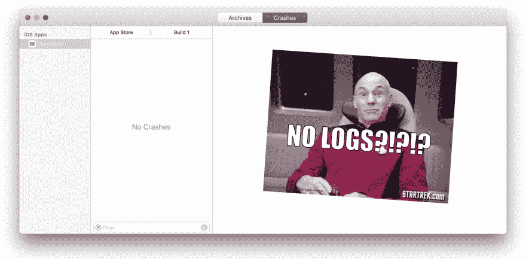
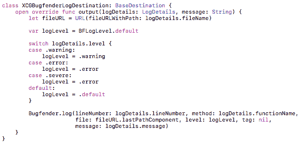
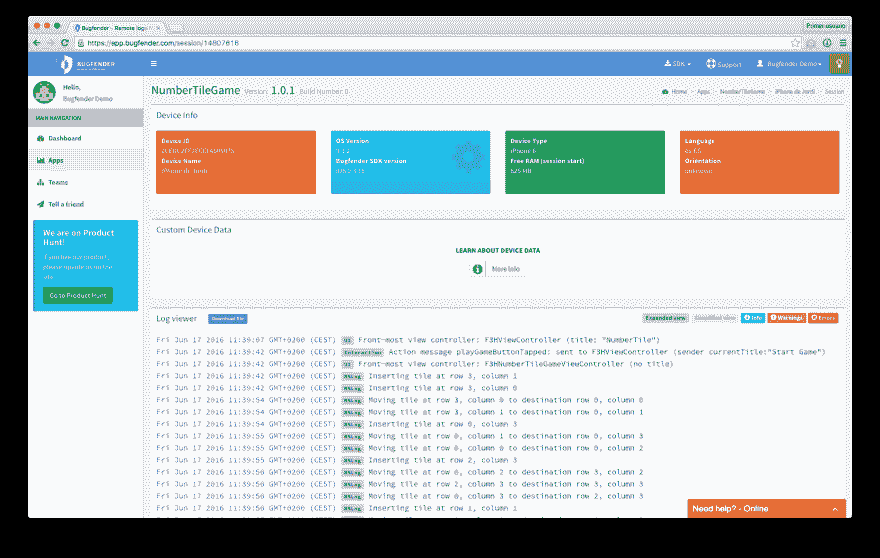

# Bugfender 是如何救了我

> 原文:[https://dev.to/bugfenderapp/how-bugfender-saved-me](https://dev.to/bugfenderapp/how-bugfender-saved-me)

[T2】](https://res.cloudinary.com/practicaldev/image/fetch/s--deUIhJtZ--/c_limit%2Cf_auto%2Cfl_progressive%2Cq_auto%2Cw_880/https://bugfender.com/wp-content/uploads/2017/04/how-bugfender-saved-me.jpg)

这是卡尔·麦克米伦的一篇客座博文，他是拉昆的创始人，也是 Bugfender 的快乐用户。

解释这一点会引起一点尴尬，因为我承认当我开始 iOS 开发时我是多么的无知。我们一会儿就会谈到这一点。首先是背景。

当我开始测试我的第一个 iOS 应用程序时，在某个时候我推了一个更新，导致一些之前登录应用程序的用户不再登录。注意，我说的是“部分用户”。不全是。最糟糕的一种虫子。

当然，我一直在测试这款应用，包括擦拭设备以测试首次运行体验。我强迫我的同事测试这个应用程序。我们中没有人见过这种行为，我也不能故意重现这个错误。

现在，这个应用程序需要一个互联网连接，并在启动时连接到它的后端(并保持连接)。因此，到目前为止，我一直在后端服务器日志的帮助下进行调试，运行良好。但是这只虫子当然是不同的。我真正需要知道的是在应用程序连接到后端之前发生了什么。

所以这里我不得不承认我的无知。到目前为止，我甚至还没有考虑过如何为我的应用程序从终端用户那里收集日志。我在 iTunes connect 中看到过关于崩溃报告的内容，我想应该有查看日志的方法。

所以我打开了 iTunes connect，四处搜索如何从用户设备上运行的应用程序中获取日志。没什么。然后我看到你用 Xcode 查看崩溃日志。所以我查了 Xcode，找到了崩溃组织者，什么都没有。为斯威夫特欢呼-没有崩溃！但是也没有日志。

[T2】](https://res.cloudinary.com/practicaldev/image/fetch/s--3dlnl6-f--/c_limit%2Cf_auto%2Cfl_progressive%2Cq_auto%2Cw_880/https://bugfender.com/wp-content/uploads/2017/04/hbsm-no-logs.png)

## 恐慌开始袭来

我不得不承认，在这一点上我有点惊慌失措。这不是很多，但这不仅仅是为了让一篇博文更有趣而夸张。我想象着必须让用户以某种方式手动收集日志。他们必须使用 Xcode 吗！？！？

你看，日志记录是我调试和管理系统的主要方式。自从我作为 Unix 系统管理员的第一份工作以来，我就一直盯着日志，那时我正在为 Y2K bugs 做准备。我是一个死硬的“通过记录东西来调试”的人，只有在必要的时候才打开一个真正的调试器。所以我必须有某种方法从最终用户那里获取日志。

此时我想起了 Google 的存在，找到了 Bugfender。

## 启动并运行挡泥板

一旦我找到 Bugfender，它很快就开始运行。我已经在使用 CocoaPods 了，所以获得 SDK 只是一个“pod 安装”的过程。我还使用 XCGLogger 自动将更多的信息添加到日志中。将两者连接在一起并不需要太多代码:

[T2】](https://res.cloudinary.com/practicaldev/image/fetch/s--RRF-gYtn--/c_limit%2Cf_auto%2Cfl_progressive%2Cq_auto%2Cw_880/https://bugfender.com/wp-content/uploads/2017/04/hbsm-logs.png)

就这样，我得到了我需要的东西——来自用户设备的日志。

## 查找实际 Bug

我的调试方法——很难说是唯一的——是验证我所知道的肯定是真的。通常“必须为真”的事情中有一件实际上并不是，这使得 bug 很明显。这只是一种检验假设的方式。

所以我用我的应用程序来验证:

a)我存储在 iOS 钥匙串中的登录令牌不知何故丢失了，或者是
b)登录令牌无效，或者是
c)我不知何故没有找到将登录令牌发送到服务器的代码路径，尽管我有令牌(我知道应用程序没有从后端服务器日志发送令牌，并且盯着代码看了足够长的时间，以使自己相信如果我们有令牌，我们就会发送它)

我完成了构建并发布了新的测试版。

在查看了报告该问题的测试版测试人员的日志后，很明显令牌存在于钥匙串中并且是有效的，但是应用程序没有发送令牌。我把这种可能性包括在内只是为了更全面——我没想到实际上会是这样。但确实如此。

所以我回去盯着代码，但对问题出在哪里有一些把握。这就是这种方法的美妙之处:一旦你验证了“不可能”是真的，就更容易仔细地查看代码来发现问题。

很快这个 bug 就出现了。这款针对家庭的应用有两种模式:父母和孩子。在儿童模式下，我们在设备上做一些额外的配置。将确定令牌是否将被发送的分支说“我有登录令牌吗，并且这个设备被配置了吗”。第二部分——检查设备是否已配置——隐藏在一个函数调用后面，我认为这个函数调用会短路并在父设备上返回 true。

然后我突然想到。对于我自己、我的同事，甚至是我在擦拭手机上测试的情况，我们会先在儿童模式下测试应用程序，然后作为家长运行它。因此，在所有这些设备上，额外的子配置是存在的，即使它没有在父模式中使用，这意味着表达式为真，并且登录令牌被发送。看着这个函数调用，很明显我总是在检查配置，即使是在父设备上，它也不应该出现。

[T2】](https://res.cloudinary.com/practicaldev/image/fetch/s--x1H6Wh3b--/c_limit%2Cf_auto%2Cfl_progressive%2Cq_auto%2Cw_880/https://bugfender.com/wp-content/uploads/2017/04/hbsm-facepalm.png)

绝对是那些一旦你看到就不可能看不到的错误之一。一个快速的 bug 修复和测试版发布证实了这为测试版测试人员解决了问题。

## 用挡泥板卡住

一旦这个最初的错误被修复，我保持 Bugfender 打开，甚至增加了一些额外的日志记录。我通常是一个“防御性日志记录者”，这意味着我做一些额外的日志记录来帮助跟踪未来的 bug，而不必推动新的构建。从那以后，我多次用它来寻找解决问题的方法。Bugfender 救了我的更多例子:

后台刷新——后台刷新的好处是——至少从用户的角度来看 iOS 运行后台刷新的方式不会耗尽我的电池。但是从开发人员的角度来看，弄清楚后台刷新任务何时以及为什么(或者为什么不)运行可能是一场噩梦。Bugfender 日志绝对有帮助。

应用程序控制的 VPN-当您需要时，能够使用由您的应用程序配置的 VPN 进行流量隧道传输是非常棒的。但是没有什么比完全搞乱设备的网络更难调试的了。Bugfender 让我可以准确地验证设备上设置了什么配置，还记得我之前提到的那些孩子吗？尝试找出他们是如何故意破坏他们父母强迫他们使用的应用程序的。

我还使用 Bugfender 来了解我的应用程序被使用的频率以及在什么设备/操作系统版本上。当我真的需要挖掘这种数据时，我有其他工具，但 Bugfender 让我对正在发生的事情有一个很好的总体感觉，当我查看日志时，数据就在那里非常有帮助。

[T2】](https://res.cloudinary.com/practicaldev/image/fetch/s--RtrW-7pR--/c_limit%2Cf_auto%2Cfl_progressive%2Cq_auto%2Cw_880/https://bugfender.com/wp-content/uploads/2017/04/hbsm-dashboard.png)

我已经将这个应用程序投入生产，我无法想象没有 Bugfender 支持它。

这是一篇来自 Karl MacMillan 的客座博文，他是拉昆的创始人，也是 Bugfender 的快乐用户。