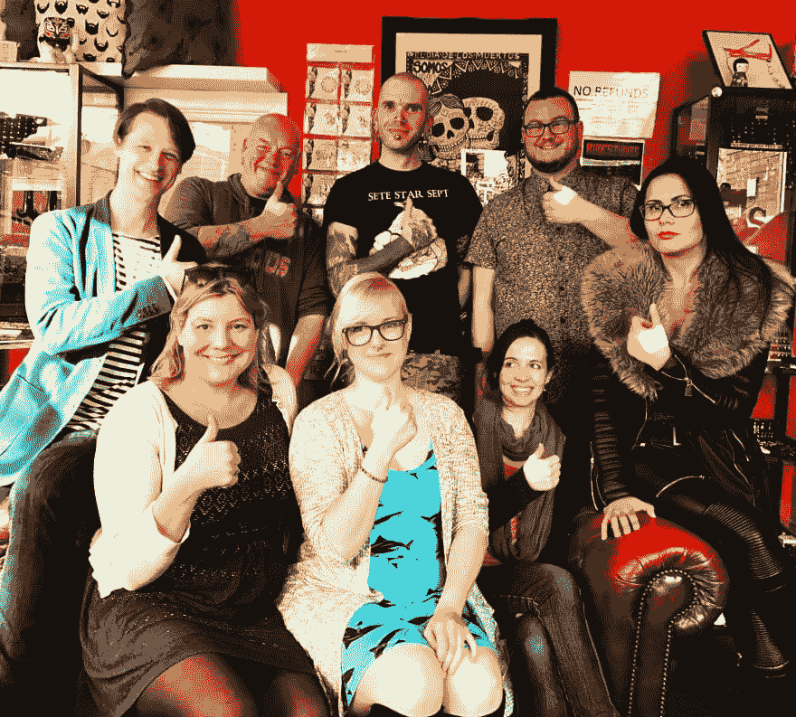
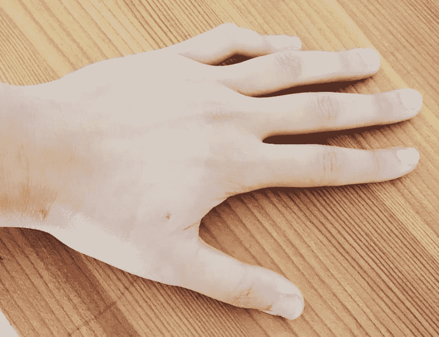

# 黑自己

> 原文:[https://dev.to/grappleshark/hack-yourself](https://dev.to/grappleshark/hack-yourself)

2017 年 4 月 22 日是我的仿生生日。17:15 左右我选择了自我升级。一个 [NFC 标签](http://dngr.us/xNT)被植入我的手蹼。这是我从少年时代就开始等待的一天，看着壳里的原鬼，做着与机器世界融合的白日梦。

如果你认为一个人还不可能选择从技术上改造自己，让我向你保证“超越”的曙光已经开始分裂我们的进化地平线。

人们可能会质疑这种程序的道德性，但我相信知识传播的重要性。这项技术就在那里，掌握在我不完全信任的人和组织手中。我没有害怕它，而是选择理解它，学习如何破解它。希望我是众多拥有知识和技能的人中的一员，能够抵御任何不道德的行为。人类既是技术出错的原因，也是技术出错的解药。

考虑到这一点，我和其他五个人被利兹国际节邀请接受植入手术，作为他们在 T2 举办的生物黑客、赛博朋克黑客文化活动的一部分。在 TEDx 发言人和人体黑客[汉尼斯·SJ blad](https://www.hannessjoblad.se/)的观察下，我们升级了。

[T2】](https://res.cloudinary.com/practicaldev/image/fetch/s--qWDN4k-9--/c_limit%2Cf_auto%2Cfl_progressive%2Cq_auto%2Cw_880/http://grappleshark.github.io/biohack2.jpg)

这个标签是由[危险的东西](http://dangerousthings.com/)制作的，由一个可爱的身体穿刺专业人员植入我的手里(他决定成为我们中的一员)。使用无菌注射器的过程就像被深深咬了几秒钟，然后就完成了。我能感觉到一个微小的异物嵌进了我的手里。

几分钟后，我开始黑自己。

我采取的第一步是用[危险的 NFC 应用](https://t.co/VI90FQ06lE)保护我的 NFC 标签免受恶意攻击。作为一名拥有 17 年经验的 IT 专业人员，我非常重视技术安全。

使用一个[标签写入器](https://play.google.com/store/apps/details?id=com.nxp.nfc.tagwriter&hl=en_GB)我发现用我的手机处理数据非常容易。我可以想象，如果它与那些有越轨倾向的人接触，它可能会很容易被密封，我将无法处理其中存储的数据。

距离我升级还不到 24 小时，但我已经能够使用我的新组件来:

*   调出我的 twitter 账户
*   播放一首我最喜欢的歌曲
*   叫我优步带我回家

我计划用我的新功能享受这一旅程，并期待着写下我未来的改进。但我会永远记得我用最新升级版储存在身体里的第一点数据。当我还是个小女孩的时候，这些话对我说。当我探索正在构建的革命性网络景观时，这些话语指引着我。

### *我思故我和。*

我思故我在。

这些话我将永远铭记在心。

[T2】](https://res.cloudinary.com/practicaldev/image/fetch/s--8kMKFJ8w--/c_limit%2Cf_auto%2Cfl_progressive%2Cq_auto%2Cw_880/http://grappleshark.github.io/bionic.jpg)