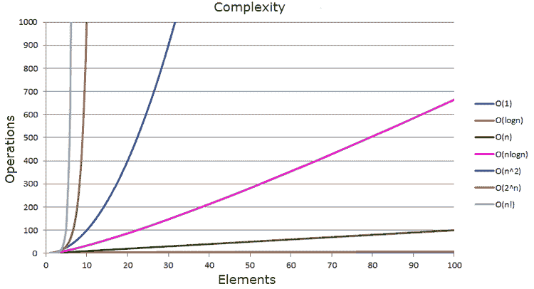

# 学习 O(n)复杂度的大 O 记数法

> 原文:[https://dev . to/lankydandev/learning-big-o-notation-with-o-n-complexity-4ljm](https://dev.to/lankydandev/learning-big-o-notation-with-o-n-complexity-4ljm)

大 O 记数法是我在大学里学到的东西之一，但我从未真正理解它的概念。我所知道的足以回答非常基本的问题，但仅此而已。从那以后没有任何变化，因为自从我开始工作以来，我没有用过它，也没有听我的任何同事提起过它。所以我想我应该花些时间回顾一下，写这篇文章总结大 O 符号的基础知识，并附上一些代码示例来帮助解释它。

那么什么是大 O 符号呢？简单来说:

*   它是算法复杂性的相对表示。
*   描述算法如何执行和扩展。
*   描述了函数增长率的上限，可以认为是最坏情况下的情形。

现在快速看一下语法。

> O(n <sup>2</sup>

*n* 是函数作为输入接收的元素数量。所以这个例子是说对于 *n* 输入，它的复杂度等于 *n <sup>2</sup>* 。

常用符号的比较。

| n | 常数 O(1) | 对数 O(log n) | 线性 O(n) | 线性对数 O(n log n) | 二次 O(n <sup>2</sup> | 立方 O(n <sup>3</sup> |
| --- | --- | --- | --- | --- | --- | --- |
| one | one | one | one | one | one | one |
| Two | one | one | Two | one | four | eight |
| four | one | Two | four | eight | Sixteen | Sixty-four |
| eight | one | three | eight | Twenty-four | Sixty-four | Five hundred and twelve |
| Sixteen | one | four | Sixteen | Sixty-four | Two hundred and fifty-six | Four thousand and ninety-six |
| One thousand and twenty-four | one | Ten | One thousand and twenty-four | Ten thousand two hundred and forty | One million forty-eight thousand five hundred and seventy-six | One billion seventy-three million seven hundred and forty-one thousand eight hundred and twenty-four |

从这个表中可以看出，随着函数复杂度的增加，完成一个函数所需的计算量或时间会显著增加。因此，我们希望将这种增长保持在尽可能低的水平，因为随着输入的增加，如果函数不能很好地扩展，可能会出现性能问题。

[T2】](/static/e400c3e7ffa7767eda4f91a01fbc568b/a32c3/complexity-graph.png)

一些代码示例应该有助于澄清复杂性如何影响性能。下面的代码是用 Java 编写的，但显然也可以用其他语言编写。

**O(1)**

```
public boolean isFirstNumberEqualToOne(List<Integer> numbers) {
  return numbers.get(0) == 1;
} 
```

O(1)表示一个函数，无论输入大小如何，它总是采用相同的取值。

**O(n)**

```
public boolean containsNumber(List<Integer> numbers, int comparisonNumber) {
  for(Integer number : numbers) {
    if(number == comparisonNumber) {
      return true;
    }
  }
  return false;
} 
```

O(n)表示一个函数的复杂度，它与输入的数量成正比地线性增加。这是一个很好的例子，说明了大 O 符号如何描述最差情况，因为函数可以在读取第一个元素后返回*真*，或者在读取所有 *n* 元素后返回*假*。

**O(n <sup>2</sup> )**

```
public static boolean containsDuplicates(List<String> input) {
  for (int outer = 0; outer < input.size(); outer++) {
    for (int inner = 0; inner < input.size(); inner++) {
      if (outer != inner && input.get(outer).equals(input.get(inner))) {
        return true;
      }
    }
  }
  return false;
} 
```

O(n <sup>2</sup> 表示一个函数，其复杂度与输入大小的平方成正比。通过输入添加更多的嵌套迭代将增加复杂性，这可能用总共 3 次迭代来表示 O(n <sup>3</sup> ，用总共 4 次迭代来表示 O(n <sup>4</sup> )。

**O(2 <sup>n</sup> )**

```
public int fibonacci(int number) {
  if (number <= 1) {
    return number;
  } else {
    return fibonacci(number - 1) + fibonacci(number - 2);
  }
} 
```

O(2 <sup>n</sup> )表示一个函数，对于输入中的每个元素，其性能都加倍。这个例子是斐波那契数列的递归计算。该函数属于 O(2 <sup>n</sup> )，因为该函数对每个输入数字递归调用自己两次，直到该数字小于或等于 1。

**O(对数 n)**

```
public boolean containsNumber(List<Integer> numbers, int comparisonNumber) {
  int low = 0;
  int high = numbers.size() - 1;
  while (low <= high) {
    int middle = low + (high - low) / 2;
    if (comparisonNumber < numbers.get(middle)) {
      high = middle - 1;
    } else if (comparisonNumber > numbers.get(middle)) {
      low = middle + 1;
    } else {
      return true;
    }
  }
  return false;
} 
```

O(log n)表示一个函数，其复杂度随着输入大小的增加而以对数方式增加。这使得 O(log n)函数的伸缩性非常好，因此处理较大的输入不太可能导致性能问题。上面的例子使用二分搜索法来检查输入列表是否包含某个数字。简单地说，它在每次迭代中将列表一分为二，直到找到数字或读取到最后一个元素。如果你注意到这个方法具有与 O(n)例子相同的功能，尽管实现是完全不同的并且更难理解。但是，在输入较大的情况下，性能会好得多(如表中所示)。

这种实现的缺点是二分搜索法依赖于已经处于正确顺序的元素。如果在遍历元素之前需要对元素进行排序，那么这会增加一点性能开销。

关于大 O 符号还有很多内容要介绍，但是希望你现在已经对大 O 符号的含义以及它如何转化为你写的代码有了一个基本的概念。