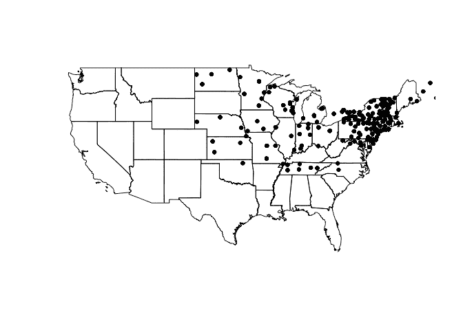
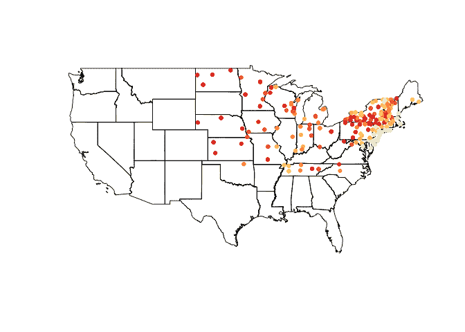
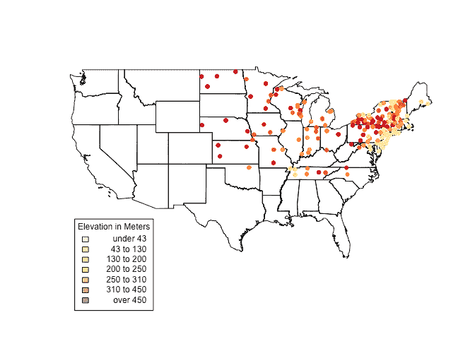
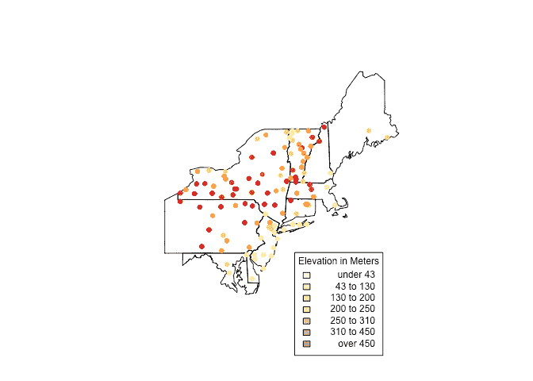

# 使用 R 作为地理信息系统

> 原文：<https://dev.to/realest8agent/using-r-as-a-gis>

*最初发表于:[realdataweb.wordpress.com](https://realdataweb.wordpress.com/)T3】*

在房地产领域，空间数据是游戏的名字。其他领域的无数程序都利用了这种数据的力量，这种力量正变得日益普遍。

在这篇文章中，我将介绍几个简单但功能强大的工具，让你开始在 r 中使用地理信息

```
##First, some libraries##  #install.packages('GISTools', dependencies = T)  library(GISTools) 
```

Enter fullscreen mode Exit fullscreen mode

`GISTools`提供一种易于使用的方法来创建着色方案和着色贴图。你们中的一些人可能听说过`sp`包，它为组合增加了许多空间类。也有用于分析和使事物看起来漂亮的功能。

让我们开始吧:获取`vulgaris`数据集，其中包含丁香观察站和美国各州的位置信息。该代码绘制了状态和`vulgaris`点。

```
data("vulgaris")  #load data  par  =  (mar  =  c(2,0,0,0))  #set margins of plot area  plot(us_states)  plot(vulgaris,  add  =  T,  pch  =  20) 
```

Enter fullscreen mode Exit fullscreen mode

[T2】](https://res.cloudinary.com/practicaldev/image/fetch/s--KU5f7dZl--/c_limit%2Cf_auto%2Cfl_progressive%2Cq_auto%2Cw_880/https://thepracticaldev.s3.amazonaws.com/i/23vc4dmomjg5xns25ygk.png)

这里需要注意的一点是这些对象的结构。`us_states`是一个 SpatialPolygonsDataFrame，在其属性中存储用于绘制形状的信息(如 shapefile)。`vulgaris`相反，它是一个 SpatialPointsDataFrame，其中包含用于绘制单个点的数据。很像`data.frame`和`$`，这些对象包含可以通过`@`访问的信息。

```
kable(head(vulgaris@data)) 
```

Enter fullscreen mode Exit fullscreen mode

|  | 车站 | 年 | 类型 | 叶子 | 花 | Station.Name | 状态。远见（天意） | 拉脱维亚的货币单位 | 长的 | 标高（elevation） |
| --- | --- | --- | --- | --- | --- | --- | --- | --- | --- | --- |
| Three thousand six hundred and ninety-five | Sixty-one thousand six hundred and eighty-nine | One thousand nine hundred and sixty-five | 寻常的 | One hundred and fourteen | One hundred and thirty-six | 考文垂 | 计算机化 X 线体层照相术 | Forty-one point eight | -72.35 | One hundred and forty-six |
| Three thousand six hundred and ninety-six | Sixty-one thousand six hundred and eighty-nine | One thousand nine hundred and sixty-six | 寻常的 | One hundred and twenty-two | One hundred and forty-six | 考文垂 | 计算机化 X 线体层照相术 | Forty-one point eight | -72.35 | One hundred and forty-six |
| Three thousand six hundred and ninety-seven | Sixty-one thousand six hundred and eighty-nine | One thousand nine hundred and sixty-seven | 寻常的 | One hundred and four | One hundred and fifty-six | 考文垂 | 计算机化 X 线体层照相术 | Forty-one point eight | -72.35 | One hundred and forty-six |
| Three thousand six hundred and ninety-eight | Sixty-one thousand six hundred and eighty-nine | One thousand nine hundred and sixty-eight | 寻常的 | Ninety-seven | One hundred and thirty-four | 考文垂 | 计算机化 X 线体层照相术 | Forty-one point eight | -72.35 | One hundred and forty-six |
| Three thousand six hundred and ninety-nine | Sixty-one thousand six hundred and eighty-nine | One thousand nine hundred and sixty-nine | 寻常的 | One hundred and fourteen | One hundred and thirty-eight | 考文垂 | 计算机化 X 线体层照相术 | Forty-one point eight | -72.35 | One hundred and forty-six |
| Three thousand seven hundred | Sixty-one thousand six hundred and eighty-nine | One thousand nine hundred and seventy | 寻常的 | One hundred and eleven | One hundred and thirty-five | 考文垂 | 计算机化 X 线体层照相术 | Forty-one point eight | -72.35 | One hundred and forty-six |

让我们来看看一些使用这些数据的函数。

```
newVulgaris  <-  gIntersection(us_states,  vulgaris,  byid  =  T)  kable(head(data.frame(newVulgaris))) 
```

Enter fullscreen mode Exit fullscreen mode

|  | x | y |
| --- | --- | --- |
| 3 4896 | -67.65 | Forty-four point six five |
| 3 4897 | -67.65 | Forty-four point six five |
| 3 4898 | -67.65 | Forty-four point six five |
| 3 4899 | -67.65 | Forty-four point six five |
| 3 4900 | -67.65 | Forty-four point six five |
| 3 4901 | -67.65 | Forty-four point six five |

`gIntersection`，你可能已经从名字中猜到了，返回两个空间对象的交集。在这种情况下，我们从`vulgaris`得到了在`us_states`内的点。然而，剩余的`vulgaris`数据已经从结果对象中剥离。我们必须经历几道难关才能把信息拿回来。

```
newVulgaris  <-  data.frame(newVulgaris)  tmp  <-  rownames(newVulgaris)  tmp  <-  strsplit(tmp,  " ")  tmp  <-  (sapply(tmp,  "[[",  2))  tmp  <-  as.numeric(tmp)  vdf  <-  data.frame(vulgaris)  newVulgaris  <-  subset(vdf,  row.names(vdf)  %in%  tmp) 
```

Enter fullscreen mode Exit fullscreen mode

|  | 车站 | 年 | 类型 | 叶子 | 花 | Station.Name | 状态。远见（天意） | 拉脱维亚的货币单位 | 长的 | 标高（elevation） | 龙. 1 | 纬度 1 | 可选择的 |
| --- | --- | --- | --- | --- | --- | --- | --- | --- | --- | --- | --- | --- | --- |
| Three thousand six hundred and ninety-five | Sixty-one thousand six hundred and eighty-nine | One thousand nine hundred and sixty-five | 寻常的 | One hundred and fourteen | One hundred and thirty-six | 考文垂 | 计算机化 X 线体层照相术 | Forty-one point eight | -72.35 | One hundred and forty-six | -72.35 | Forty-one point eight | 真实的 |
| Three thousand six hundred and ninety-six | Sixty-one thousand six hundred and eighty-nine | One thousand nine hundred and sixty-six | 寻常的 | One hundred and twenty-two | One hundred and forty-six | 考文垂 | 计算机化 X 线体层照相术 | Forty-one point eight | -72.35 | One hundred and forty-six | -72.35 | Forty-one point eight | 真实的 |
| Three thousand six hundred and ninety-seven | Sixty-one thousand six hundred and eighty-nine | One thousand nine hundred and sixty-seven | 寻常的 | One hundred and four | One hundred and fifty-six | 考文垂 | 计算机化 X 线体层照相术 | Forty-one point eight | -72.35 | One hundred and forty-six | -72.35 | Forty-one point eight | 真实的 |
| Three thousand six hundred and ninety-eight | Sixty-one thousand six hundred and eighty-nine | One thousand nine hundred and sixty-eight | 寻常的 | Ninety-seven | One hundred and thirty-four | 考文垂 | 计算机化 X 线体层照相术 | Forty-one point eight | -72.35 | One hundred and forty-six | -72.35 | Forty-one point eight | 真实的 |
| Three thousand six hundred and ninety-nine | Sixty-one thousand six hundred and eighty-nine | One thousand nine hundred and sixty-nine | 寻常的 | One hundred and fourteen | One hundred and thirty-eight | 考文垂 | 计算机化 X 线体层照相术 | Forty-one point eight | -72.35 | One hundred and forty-six | -72.35 | Forty-one point eight | 真实的 |
| Three thousand seven hundred | Sixty-one thousand six hundred and eighty-nine | One thousand nine hundred and seventy | 寻常的 | One hundred and eleven | One hundred and thirty-five | 考文垂 | 计算机化 X 线体层照相术 | Forty-one point eight | -72.35 | One hundred and forty-six | -72.35 | Forty-one point eight | 真实的 |

眼熟吗？现在我们已经得到了一个数据帧，其中保留了裁剪后的`vulgaris`值和原始数据。

```
vulgarisSpatial  <-  SpatialPointsDataFrame(data.frame(newVulgaris$Long,  newVulgaris$Lat),  newVulgaris,  proj4string  =  CRS(proj4string(vulgaris)),  bbox  =  vulgaris@bbox) 
```

Enter fullscreen mode Exit fullscreen mode

在将剪切的数据帧存储为 SpatialPointsDataFrame 后，我们可以再次使用它——在这种情况下，我们为`vulgaris`点添加了一个阴影方案。

```
shades  <-  auto.shading(vulgarisSpatial@data$Elev,  n  =  7,  cols  =  brewer.pal(7,  'YlOrRd'))  #Check cutter arg for more ways to create breaks.  shades$cols  <-  add.alpha(shades$cols,  .5)  plot(us_states)  choropleth(vulgarisSpatial,  vulgarisSpatial$Elev,shading  =  shades,  add  =  T,  pch  =  20) 
```

Enter fullscreen mode Exit fullscreen mode

[T2】](https://res.cloudinary.com/practicaldev/image/fetch/s--yOlvOXE1--/c_limit%2Cf_auto%2Cfl_progressive%2Cq_auto%2Cw_880/https://thepracticaldev.s3.amazonaws.com/i/l6hm6mnpkdlc1yo04nzd.png)

颜色很好看，但是有什么意义呢？我们来补充一个传说。

```
us_states@bbox  #Get us_states bounding box coordinates. 
```

Enter fullscreen mode Exit fullscreen mode

```
##           min       max
## r1 -124.73142 -66.96985
## r2   24.95597  49.37173 
```

Enter fullscreen mode Exit fullscreen mode

```
plot(us_states)  choropleth(vulgarisSpatial,  vulgarisSpatial$Elev,shading  =  shades,  add  =  T,  pch  =  20)  par(xpd=TRUE)  #Allow plotting outside of plot area.  choro.legend(-124,  30,  shades,  cex  =  .75,  title  =  "Elevation in Meters")  # Plot legend in bottom left.  Takes standard legend() params. 
```

Enter fullscreen mode Exit fullscreen mode

[T2】](https://res.cloudinary.com/practicaldev/image/fetch/s--9YQIVi9R--/c_limit%2Cf_auto%2Cfl_progressive%2Cq_auto%2Cw_880/https://thepracticaldev.s3.amazonaws.com/i/1g2o2k4xei3rwkxjnpfc.png)

看起来东北部各州发生了很多事情。为了仔细观察，创建另一个剪辑(如上)并绘制它。使用下面的结构，我们可以创建一个选择向量。我已经隐藏了完整的代码，因为它是重复的(检查 [GitHub](https://github.com/kiefersmith/WordpressMD) 的完整代码)。)

```
index  <-  us_states$STATE_NAME  ==  "Pennsylvania"  '...' 
```

Enter fullscreen mode Exit fullscreen mode

```
plot(us_states[index,])  choropleth(vulgarisNE,  vulgarisNE$Elev,shading  =  shades,  add  =  T,  pch  =  20)  par(xpd  =  T)  choro.legend(-73,  39.75,  shades,  cex  =  .75,  title  =  "Elevation in Meters") 
```

Enter fullscreen mode Exit fullscreen mode

[T2】](https://res.cloudinary.com/practicaldev/image/fetch/s--rSI72-kK--/c_limit%2Cf_auto%2Cfl_progressive%2Cq_auto%2Cw_880/https://thepracticaldev.s3.amazonaws.com/i/fdaheorcg0jr8zq0oepb.png)

希望这是对空间数据的有用介绍(或复习)。我总是在写这些帖子的过程中学到很多东西。如果您有任何想法或建议，请留下评论或随时[联系我](//mailto:kieferisgreat@gmail.com)！

开心贴图，

基弗