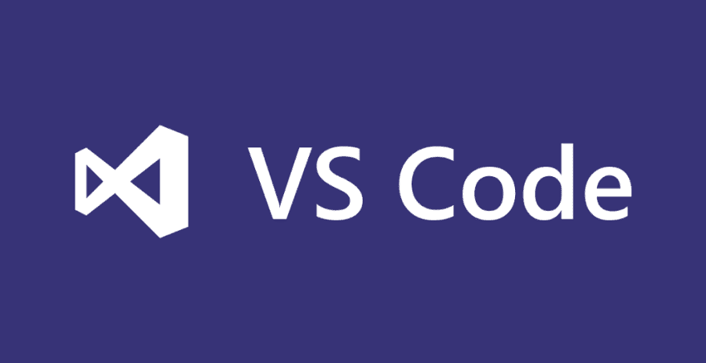
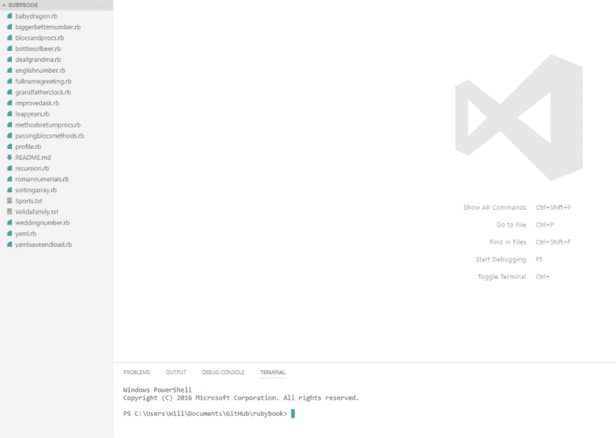
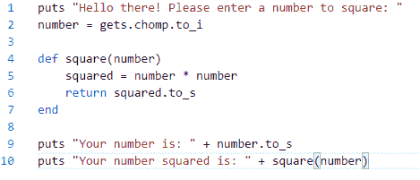
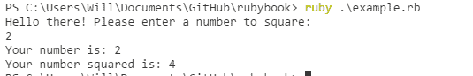
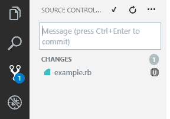
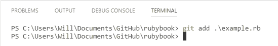
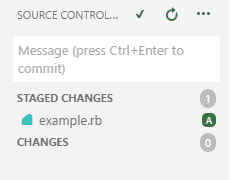
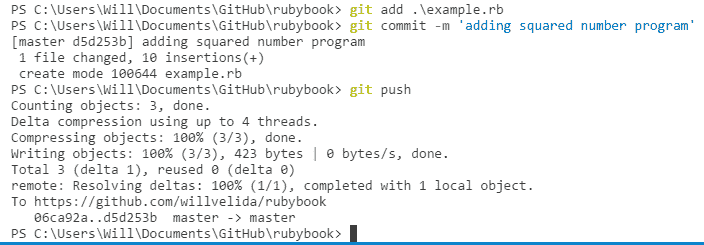

# 使用 Visual Studio 代码进行 Ruby 开发

> 原文:[https://dev . to/will velida/using-visual-studio-code-for-ruby-development-5o 2](https://dev.to/willvelida/using-visual-studio-code-for-ruby-development-5o2)

自从我有了一台 Windows 机器，我就一直使用 Visual Studio 代码来完成我所有的 Ruby 工作。我听说过在 Windows 上进行 Ruby 开发是一项艰巨的任务，但我想在花大价钱买 Mac 电脑之前，我至少要试一试。

[T2】](https://res.cloudinary.com/practicaldev/image/fetch/s--Mj71mywS--/c_limit%2Cf_auto%2Cfl_progressive%2Cq_66%2Cw_880/https://cdn-images-1.medium.com/max/480/0%2AwifgjE1hU5b7dNv3.gif)

在 Windows 上安装 Ruby 非常简单。快速下载并确保我可以在命令行上使用它来运行简单的 Ruby 程序。然后，我想得到一个可以帮助我开发 Ruby 的文本编辑器。

**关于 Visual Studio 代码**

[T2】](https://res.cloudinary.com/practicaldev/image/fetch/s--GazWlNKP--/c_limit%2Cf_auto%2Cfl_progressive%2Cq_auto%2Cw_880/https://cdn-images-1.medium.com/max/1024/0%2ATu2sJCmh_CaSOD17.png)

我从各种不同的地方听说过 Visual Studio 代码，加上我曾经在微软工作过，所以我习惯了他们的工具。此外，与 Visual Studio 代码(32MB)相比，Atom 之类的替代产品相当大(300MB)。

Code 是一个文本编辑器，允许你为 Windows、Mac 和 Linux 开发应用程序。它托管在 GitHub 上，也支持扩展(后面我会讲一些 Ruby 特有的)。

**集成命令行和 Git**

对我来说，最重要的是拥有一个集成命令行的文本编辑器。我不介意不得不一直切换标签，我只是希望事情变得简单和懒惰。

[T2】](https://res.cloudinary.com/practicaldev/image/fetch/s--TpRj2JJB--/c_limit%2Cf_auto%2Cfl_progressive%2Cq_66%2Cw_880/https://cdn-images-1.medium.com/max/360/0%2A5MMest-PhnvCrUJK.gif)

集成终端在你工作的任何项目的根目录下打开(懒惰？检查！).您还可以在编辑器中打开多个终端(简单？检查！).

代码还内置了 Git 支持，这意味着您可以跟踪项目中的变更，并将它们全部提交到一个空间中。代码具有的许多 Git 特性使生活变得更简单，比如查看版本差异和查看您的存储库的状态。

【Ruby 的扩展

代码有一个广泛的扩展库(看我在那里做了什么？….我也没觉得好笑)。我目前正在使用 Ruby 的两个扩展。第一个叫做…..[红宝石](https://github.com/rubyide/vscode-ruby)(没什么意思)。这个扩展提供了语言和调试支持，比如格式化、Ruby 的 intellisense 和 Rails 的调试。

我使用的第二个是 Ruby 语言着色。我喜欢看起来漂亮的东西。

**工作流程示例**

因此，让我们来测试一下，看看使用 Visual Studio 代码进行 Ruby 开发有多简单。我假设你有 Git，Ruby，Code 等等。安装，所以我不会浪费时间解释这一切。

我已经用代码建立了一个项目，并用 git 初始化了它。正如您在屏幕截图中看到的，代码已经在终端中准备好了项目根:

[T2】](https://res.cloudinary.com/practicaldev/image/fetch/s--M-tJHMvt--/c_limit%2Cf_auto%2Cfl_progressive%2Cq_auto%2Cw_880/https://cdn-images-1.medium.com/max/1024/0%2AF-BAJAsiP27wIOv7.png)

我们可以通过点击项目名称下的新建文件图标来创建一个新文件。我创建了一个名为 example.rb 的文件，并编写了以下代码:

[T2】](https://res.cloudinary.com/practicaldev/image/fetch/s--GkYZJnPk--/c_limit%2Cf_auto%2Cfl_progressive%2Cq_auto%2Cw_880/https://cdn-images-1.medium.com/max/469/0%2AUPxlnvG8Q2PEUIIw.png)

足够简单的代码。我们要求用户输入一个要平方的数字，将其作为参数传递给我们的 square 方法，然后将新平方的数字返回给用户。

让我们运行它！我们可以在编辑器中使用集成的终端，而不是在单独的终端中这样做，如下所示:

[T2】](https://res.cloudinary.com/practicaldev/image/fetch/s---h1z257j--/c_limit%2Cf_auto%2Cfl_progressive%2Cq_auto%2Cw_880/https://cdn-images-1.medium.com/max/542/0%2A_HaJKEMwWl3F8GMV.png)

我们得到以下输出，全部显示在编辑器中:

[T2】](https://res.cloudinary.com/practicaldev/image/fetch/s--HtKvl_Vq--/c_limit%2Cf_auto%2Cfl_progressive%2Cq_auto%2Cw_880/https://cdn-images-1.medium.com/max/535/0%2AQTSVT3kPVUUGU2sO.png)

简单明了。我们可以运行我们的程序，甚至不需要离开编辑器！现在，如果你看一下编辑器的左侧，你会注意到 Git 徽标旁边有一个“1”。让我们仔细看看它:

[T2】](https://res.cloudinary.com/practicaldev/image/fetch/s--OqiNnuz6--/c_limit%2Cf_auto%2Cfl_progressive%2Cq_auto%2Cw_880/https://cdn-images-1.medium.com/max/288/0%2A2SCUgc1fX7AK5oAt.png)

如我们所见，该文件是未暂存的。我们有两个选择，我们可以使用 UI 存放和提交文件，或者我们可以在命令行中正确地完成这一操作。让我们通过命令行正确地完成这些工作:

[T2】](https://res.cloudinary.com/practicaldev/image/fetch/s--eQIiPg4T--/c_limit%2Cf_auto%2Cfl_progressive%2Cq_auto%2Cw_880/https://cdn-images-1.medium.com/max/549/0%2A0LVO0SNOiTtEJckn.png)

现在看看源代码控制面板，我们可以看到我们的文件已经被登台:

[T2】](https://res.cloudinary.com/practicaldev/image/fetch/s--9jzQjxSI--/c_limit%2Cf_auto%2Cfl_progressive%2Cq_auto%2Cw_880/https://cdn-images-1.medium.com/max/236/0%2A7phhe-eXSg_enKN_.png)

让我们继续提交:

[T2】](https://res.cloudinary.com/practicaldev/image/fetch/s--g_7WW-yw--/c_limit%2Cf_auto%2Cfl_progressive%2Cq_auto%2Cw_880/https://cdn-images-1.medium.com/max/704/0%2A6311VVIi6W3qJtU8.png)

全部完成！

所以我们创建了一个新程序，测试并运行它，然后把它推送到 Git，而不用离开文本编辑器本身！所有血腥的惊人的东西！

**未来**

希望这篇博客文章已经向您展示了当涉及到简单的开发任务时，甚至是在处理非微软技术时，代码是如何使生活变得更加容易的。可能值得一提的是，我还没有尝试过任何过于雄心勃勃的代码，比如 Rails 项目。当我尝试的时候，我会让你知道我的进展。