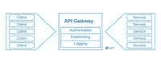
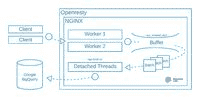
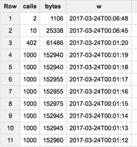

# 使用 Openresty 和 Google BigQuery 记录微服务使用情况

> 原文:[https://dev . to/jpoehnelt/microservice-usage-logging-with-open resty-and-Google-big query-1ic 9](https://dev.to/jpoehnelt/microservice-usage-logging-with-openresty-and-google-bigquery-1ic9)

在笛卡尔实验室，我们一直在使用微服务架构来构建我们的平台。如果你不熟悉微服务，它们是一组独立的服务，通常通过 HTTP 或 GRPC 进行通信。查看马丁·福勒 2014 年的[文章](https://martinfowler.com/articles/microservices.html)了解更多信息。

[T2】](https://justin.poehnelt.cimg/microservices-1EOecTj8ug-600.jpeg)

笛卡尔实验室的微服务

## 记录发送的字节

我们的日志记录，特别是使用日志记录的关键要求是捕获发送给用户的字节数，因为我们提供了对我们整个卫星图像语料库的 API 访问。这与我们的成本(如外出)最为匹配，可以让我们了解为客户提供的潜在价值。

NGINX 和来自上游服务的分块响应的问题是，从 NGINX 获取`$bytes_sent`只能发生在日志记录阶段。或者，`body_filter_by_lua*`可以用来跟踪每个块中的字节，但是由于增加了复杂性，这肯定是第二个选择。

首先要尝试的是下面的方法，但没有成功:

```
log_by_lua_block {
    local payload = {
        bytes = tonumber(ngx.var.bytes_sent),
        status = tonumber(ngx.var.status),
        timestamp = ngx.now() 
        ... -- more values
    }
    -- post payload to favorite backend for timeseries analysis
} 
```

<svg width="20px" height="20px" viewBox="0 0 24 24" class="highlight-action crayons-icon highlight-action--fullscreen-on"><title>Enter fullscreen mode</title></svg> <svg width="20px" height="20px" viewBox="0 0 24 24" class="highlight-action crayons-icon highlight-action--fullscreen-off"><title>Exit fullscreen mode</title></svg>

以上有两个问题。关键问题是，非阻塞 IO 的 Lua cosocket 在日志记录阶段不可用。第二，我们想批量生产。

## 使用分离的线程

我们实现的解决方案包括在每个 NGINX worker 上使用一个分离的线程和一个共享的线程安全缓冲区。

[T2】](https://justin.poehnelt.cimg/architecture-diagram-VMzP_YOA0Y-600.jpeg)

开放式建筑

NGINX Lua 块如下所示。

```
lua_shared_dict usage_logging 10m;

init_worker_by_lua_block {
    local Logging = require "descarteslabs.logging"
    l = Logging.new()
    l:watch(ngx.shared.usage_logging)
}

location = /test {
    proxy_pass service;
    log_by_lua_block {
        local payload = {
            bytes = tonumber(ngx.var.bytes_sent),
            status = tonumber(ngx.var.status),
            timestamp = ngx.now() 
            ... -- more values
        }
        local Logging = require "descarteslabs.logging"
        l = Logging.save(ngx.shared.usage_logging, payload)
    }    
} 
```

<svg width="20px" height="20px" viewBox="0 0 24 24" class="highlight-action crayons-icon highlight-action--fullscreen-on"><title>Enter fullscreen mode</title></svg> <svg width="20px" height="20px" viewBox="0 0 24 24" class="highlight-action crayons-icon highlight-action--fullscreen-off"><title>Exit fullscreen mode</title></svg>

## 检查缓冲区

[ngx.timer.at](http://ngx.timer.at/) 机制使得监视这个缓冲区变得很简单。唯一的技巧是每个工人都将监视缓冲区，所以应该增加一些随机性。

```
local check_function
check_function = function(premature)
    if not premature then
        while true do
            local requests = self:get(size)
            pcall(_M.save, self, rows)

            if #rows < size then
                break
            end
        end

        local ok, err = ngx.timer.at(delay(), check_function)
        if not ok then
            log(ERR, "failed to create timer: ", err)
            return
        end
    end
end 
```

<svg width="20px" height="20px" viewBox="0 0 24 24" class="highlight-action crayons-icon highlight-action--fullscreen-on"><title>Enter fullscreen mode</title></svg> <svg width="20px" height="20px" viewBox="0 0 24 24" class="highlight-action crayons-icon highlight-action--fullscreen-off"><title>Exit fullscreen mode</title></svg>

## 使用 BigQuery

作为 Google 云平台的主要客户，我们为许多 Google 云 API 提供了定制的 Lua 客户端，比如云存储、BigQuery 和 Stackdriver。对于这个特殊的用例，我们正在试用 BigQuery。我们的查询看起来像这样:

```
SELECT 
  COUNT(*) as calls,
  SUM(bytes) as bytes, 
  DATETIME_TRUNC(DATETIME(timestamp), `second` ) as w
FROM `project.dataset.table`
WHERE
  status=200 
GROUP BY
  w
ORDER BY 
  w desc
LIMIT 100 
```

<svg width="20px" height="20px" viewBox="0 0 24 24" class="highlight-action crayons-icon highlight-action--fullscreen-on"><title>Enter fullscreen mode</title></svg> <svg width="20px" height="20px" viewBox="0 0 24 24" class="highlight-action crayons-icon highlight-action--fullscreen-off"><title>Exit fullscreen mode</title></svg>

它输出这个表:

[T2】](https://justin.poehnelt.cimg/bigquery-table-output-w47vX3NkvB-400.jpeg)

使用贝吉塔进行负载测试的 Google BigQuery 结果

至此，添加一些字段作为分组依据(比如客户或服务)并提供不同窗口和粒度的计费就变得很简单了。