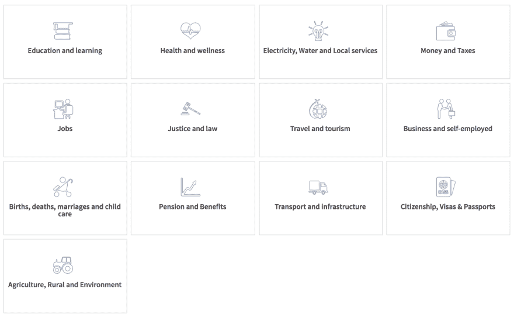
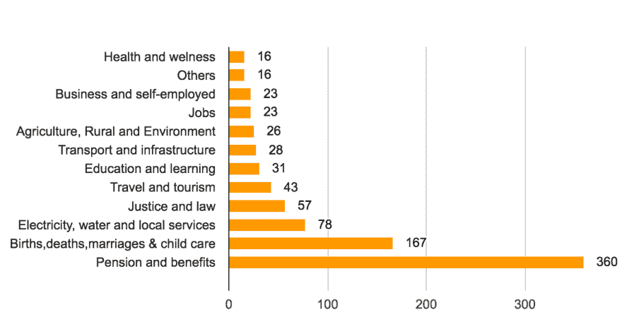

# 在政府服务网站上采用《HTTPS 议定书》

> 原文:[https://dev . to/konarkmodi/adoption-of-https-protocol-on-government-service 网站](https://dev.to/konarkmodi/adoption-of-https-protocol-on-government-servicewebsites)

上周，新闻自由基金会宣布了“确保新闻安全”项目，该项目跟踪新闻网站对 HTTPS 教的采用情况。
受此启发，我们决定对[印度政府数字服务](https://services.india.gov.in/)进行分析，并跟踪他们对 HTTPS 的采用情况。
数字印度是由印度[政府](https://en.wikipedia.org/wiki/Government_of_India)发起的一项运动，旨在通过改善在线基础设施和增加互联网连接，或通过使国家在技术领域数字化，确保政府服务以电子方式提供给公民。
由[总理](https://en.wikipedia.org/wiki/Prime_Minister_of_India) [纳伦德拉·莫迪](https://en.wikipedia.org/wiki/Prime_Minister_of_India)于 2015 年 7 月 1 日发起，该倡议跨越三个核心部分:
创建数字基础设施
数字化提供服务
[数字扫盲](https://en.wikipedia.org/wiki/Digital_literacy)

到目前为止，数字印度计划在其网站上列出了总共 1995 项[服务](https://services.india.gov.in/category/listing?ln=en)，分类如下:

[T6】](https://res.cloudinary.com/practicaldev/image/fetch/s--CwSz2GOJ--/c_limit%2Cf_auto%2Cfl_progressive%2Cq_auto%2Cw_880/https://cdn-images-1.medium.com/max/1600/1%2ABTMikNH-OgX5ENwtKPJkoA.png)

虽然一些服务在政策更新等方面更加以信息为中心，但也有一些网站每天都在处理用户信息，例如:、、收入和税收服务、公民身份和签证、等。

从服务列表中，我们分析了 874 个采用 HTTPS 协议的有效域。我们的发现是:

#### 答:31%的人有有效的 HTTPS

#### b . HTTPS 只有 7.4%违约

#### c .小于 1.5%启用了 

#### d .

[T2】](https://res.cloudinary.com/practicaldev/image/fetch/s--SNcWdLO5--/c_limit%2Cf_auto%2Cfl_progressive%2Cq_auto%2Cw_880/https://cdn-images-1.medium.com/max/1600/1%2AW3P-IpdP5nch4hPOMDrpbA.png)

## 这是什么意思？

虽然这是政府通过数字化引入透明度和问责制的第一步，但接下来的步骤应该是实现用户信息的隐私和安全以及数据保护。积极采用安全措施肯定会降低在友好或不友好环境中出现的数据盗窃/黑客攻击或其他网络威胁的脆弱性。实现数据保护和隐私的首要也是最简单的一步是采用 HTTPS 协议。

## 关于 HTTPS 的开场白或者说它为什么重要？

HTTPS 连接很容易被大多数互联网用户的新手识别，因为它显示在你的网络浏览器的地址栏中的锁图标(在 HTTPS“S”表示“安全”)。

它表示您和您正在阅读的网站之间的连接是加密的，因此，监视您的互联网连接的人——无论是试图通过公共 WiFi 窃听您的罪犯还是有权访问原始互联网流量的政府——都无法看到您正在传输的信息。

常规 HTTP 连接意味着此类攻击者可能会看到您正在阅读的搜索词或文章，窥探您的用户名和密码，或者欺骗网站来窃取您的个人信息。未加密的 HTTP 流量也更容易被过滤和阻止，允许专制政府对文章、主题、特定记者或出口进行选择性审查。

*   保护用户的敏感信息。
*   保护您网站的完整性。
*   这是网络的未来。
*   [转投 HTTPS 的 10 大理由](https://securethe.news/why/)

## HSTS 的崛起

HSTS(HTTP 严格传输安全)是一个相对较新的标准，旨在增强 HTTPS 连接的强度。

当一个 web 服务器实现并启用 HSTS 时，所有连接到它的浏览器将被强制严格地通过 HTTPS 来这样做。这意味着，除了浏览器第一次与 web 服务器建立联系之外，浏览器在被重定向到 HTTPS 之前，不会存在最初通过 HTTP 连接的可利用漏洞。

在 HSTS 建立网站的主要好处如下:

..*防御类似 sslstrip 的攻击。到 somewebsite.com 的初始导航自动升级到 HTTPS

..*对认证问题零容忍。不允许用户“点击通过诸如自签名证书之类的任何东西。

如果你有一个网站范围的 SSL 实现，作为一个额外的安全层，网站所有者也可以申请 [HSTS 预加载](https://hstspreload.org/)。关于为什么 HSTS 预加载对处理敏感用户数据的网站特别重要的详细解释可以在[这里](https://www.troyhunt.com/understanding-http-strict-transport/)找到。

## 默认情况下部署 HTTPS 的资源和提示

帮助您了解 HTTPS 以及如何着手部署它的推荐资源列表:

*   [联邦政府收养 HTTPS](https://pulse.cio.gov/)
*   如何正确部署 HTTPS
*   Mozilla——[安全/指南/网络安全](https://wiki.mozilla.org/Security/Guidelines/Web_Security)
*   Ivan Ristic 的[防弹 SSL 和 TLS](https://www.feistyduck.com/books/bulletproof-ssl-and-tls/)
*   Google 开发者博客——[在您的服务器上启用 HTTPS](https://developers.google.com/web/fundamentals/security/encrypt-in-transit/enable-https)

## 后续步骤和待办事项

*   这篇博文无疑是第一步。
*   我们目前正在努力使其成为一个正式的项目，以自动化来验证 HTTPS 的采用。
*   把所有的 codebase +数据开放，放到 Github 上。
*   根据网站提供的服务，创建一个更全面的列表。
*   将政府服务扩展到其他国家。
*   将规则集贡献给 [HTTPS Everywhere 扩展](https://www.eff.org/https-everywhere)。

## 团队

[Bibhas](https://twitter.com/bibhasdn) , [Pallavi](https://twitter.com/Pi_Modi) , [Konark](https://twitter.com/konarkmodi)